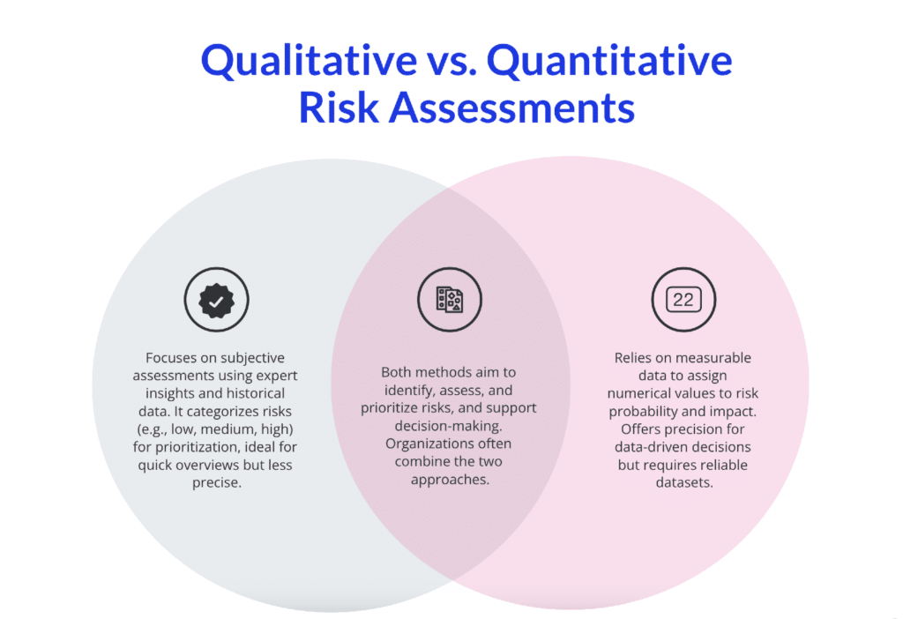

## Table of Contents

## What is risk assessment and why is it important?

Risk assessment is a process where you look at what could go wrong and how bad it could be. It helps people and organizations figure out what dangers they might face and what they can do to make things safer. You do this by thinking about all the things that could happen, how likely they are to happen, and what you can do to stop them or make them less harmful.

It's important because it helps keep people safe and can save money and time. By knowing the risks, you can take steps to avoid them or be ready if they happen. This can stop accidents, protect people, and keep businesses running smoothly. Without risk assessment, you might not see dangers coming and could be caught off guard, which could lead to harm or big problems.

## What is the difference between qualitative and quantitative risk assessment methods?

Qualitative risk assessment is about understanding risks by describing them in words. It's like telling a story about what could go wrong, without using numbers. People use words like "high," "medium," or "low" to talk about how likely a risk is and how bad it could be. This method is good when you don't have a lot of numbers or when you want to get a quick idea of the risks. It's easier to do and doesn't need special tools, but it can be a bit fuzzy because it's based on opinions and guesses.

Quantitative risk assessment, on the other hand, uses numbers and math to figure out risks. It's like doing a math problem to find out exactly how likely something bad is to happen and how much damage it could do. This method needs data and can use fancy tools like computer models to make predictions. It's more exact and can help you make detailed plans to manage risks, but it takes more time and you need to have good information to start with.

Both methods are useful, but they're used in different situations. Qualitative is great for a quick overview or when you're just starting to think about risks. Quantitative is better when you need to be very sure about the numbers and want to make detailed plans. Sometimes, people use both together to get the best of both worlds.

## Can you provide examples of qualitative risk assessment methods?

One example of a qualitative risk assessment method is the Risk Matrix. This is like a chart where you put risks into boxes based on how likely they are to happen and how bad they could be. You might see words like "unlikely" or "catastrophic" in the boxes. It helps you see which risks you need to worry about the most, even if you don't have exact numbers. It's easy to understand and use, so it's good for teams who need to talk about risks and decide what to do about them.

Another example is the Delphi Technique. This method is like asking a group of experts for their opinions on risks without them talking to each other directly. You send them questions, they answer, and then you share everyone's answers without saying who said what. You might do this a few times until everyone's ideas start to match up. It's useful when you want to get a lot of different views on a risk but don't want the experts to be influenced by each other.

A third example is the Checklist Analysis. This is when you use a list of things that could go wrong to see if any of them apply to your situation. You go through the list and check off any risks that you think might happen. It's simple and can be quick, especially if you already have a good list to start with. It's helpful for making sure you don't forget about any common risks, even if you're not sure how likely they are or how bad they could be.

## Can you provide examples of quantitative risk assessment methods?

One example of a quantitative risk assessment method is Fault Tree Analysis. This is like drawing a tree where the top part is a bad thing that could happen, like a machine breaking down. The branches of the tree show all the different things that could go wrong to make that bad thing happen. By putting numbers on how likely each smaller thing is to happen, you can figure out how likely the big bad thing is to happen. It's like doing math to see how all the little problems add up to a big problem.

Another example is Monte Carlo Simulation. This method is like playing a game over and over to see what might happen. You use a computer to pretend that different things happen and see what the results are. For example, if you're worried about how long a project might take, you could run the simulation many times with different times for each part of the project. The computer keeps track of all the results and tells you how likely it is that the project will finish on time. It's a way to see all the different ways things could go and how likely each way is.

A third example is the Failure Mode and Effects Analysis (FMEA). This is when you list all the ways something could fail and then put numbers on how often it might happen, how bad it would be, and how easy it is to find out if it's happening. You multiply these numbers together to get a score for each failure. The higher the score, the more you need to worry about that failure. It helps you focus on fixing the things that are most likely to go wrong and could cause the most trouble.

## How do you choose between qualitative and quantitative methods for a specific project?

Choosing between qualitative and quantitative methods for a project depends on what you need to know and what resources you have. If you're at the start of a project and just want a quick idea of what could go wrong, a qualitative method like a risk matrix or checklist analysis might be best. These methods are easy to use and don't need a lot of data or special tools. They're good for getting everyone on the same page about the risks and figuring out which ones to look at more closely. If you don't have a lot of time or if you're working with a team that isn't used to dealing with numbers, qualitative methods can be a good choice.

On the other hand, if you need to be very sure about the numbers and want to make detailed plans, a quantitative method like fault tree analysis or Monte Carlo simulation might be better. These methods use math and data to give you exact answers about how likely risks are and how bad they could be. They're useful when you have good data to start with and when you need to make decisions that could have big effects, like how much to spend on safety measures or how to plan a big project. But they take more time and need people who know how to use the tools and understand the math. Sometimes, it's a good idea to start with a qualitative method to get a general idea and then use a quantitative method to look more closely at the most important risks.

## What are the advantages of using qualitative risk assessment?

Qualitative risk assessment is easy to use and doesn't need a lot of numbers or special tools. You can do it quickly and it's good for getting everyone on the same page about what could go wrong. It's like telling a story about the risks, using words like "high," "medium," or "low" to talk about how likely they are and how bad they could be. This makes it easy for people who aren't used to working with numbers to understand and talk about the risks.

It's also helpful at the start of a project when you just want to get a quick idea of what to worry about. You can use simple tools like a risk matrix or a checklist to see which risks are the biggest without spending a lot of time or money. This way, you can focus on the most important risks and decide if you need to look at them more closely later on.

## What are the advantages of using quantitative risk assessment?

Quantitative risk assessment gives you exact numbers about how likely something bad is to happen and how much damage it could do. It's like doing math to figure out the risks, so you can make detailed plans to manage them. This method is good when you need to be sure about the numbers, like when you're deciding how much to spend on safety or planning a big project. You can use tools like fault tree analysis or Monte Carlo simulation to help you make these decisions.

Even though it takes more time and you need good data to start with, the numbers you get from quantitative risk assessment can help you save money and keep things safer in the long run. By knowing exactly what could go wrong and how bad it could be, you can take the right steps to stop it from happening or make it less harmful. This can stop accidents and protect people, which is really important.

## What are the limitations of qualitative risk assessment?

Qualitative risk assessment can be a bit fuzzy because it's based on opinions and guesses instead of hard numbers. When you use words like "high," "medium," or "low" to talk about how likely a risk is and how bad it could be, different people might have different ideas about what those words mean. This can make it hard to agree on which risks are the biggest and what to do about them. It's also not as good for making detailed plans because you don't have exact numbers to work with.

Another problem with qualitative risk assessment is that it might not catch all the risks. Because it's quick and easy, you might not look at every little thing that could go wrong. If you don't have a lot of experience or if you miss something important, you could end up not seeing a big risk coming. This can be a problem if you need to be very sure about what could happen and what to do about it.

## What are the limitations of quantitative risk assessment?

Quantitative risk assessment needs a lot of data and special tools to work well. If you don't have good numbers to start with, your answers might not be right. It's like trying to do math with the wrong numbers. This can be a problem if you're working on something new or if it's hard to get the information you need. Also, it takes more time and needs people who know how to use the tools and understand the math, so it might not be the best choice if you're in a hurry or don't have a lot of experts on your team.

Even though quantitative risk assessment gives you exact numbers, it can be hard to explain those numbers to everyone. Sometimes, the results can be confusing, especially if people aren't used to working with numbers. If you don't explain it well, people might not understand what the numbers mean or what they should do about the risks. This can make it hard to get everyone on the same page and make good plans to manage the risks.

## How can qualitative and quantitative methods be combined for more effective risk assessment?

You can make risk assessment better by using both qualitative and quantitative methods together. Start with a qualitative method like a risk matrix to get a quick idea of what could go wrong. This helps you see which risks are the biggest and talk about them with your team. Once you know which risks to focus on, you can use a quantitative method like fault tree analysis or Monte Carlo simulation to look at those risks more closely. This way, you get the best of both worlds: a quick overview and exact numbers to help you make detailed plans.

By combining these methods, you can make sure you don't miss any important risks and have good numbers to work with. The qualitative part helps you catch risks that might be hard to put numbers on, while the quantitative part gives you the exact information you need to make smart decisions. This can help you keep things safer and save money by knowing exactly what to do about the risks.

## What advanced tools or software are available for quantitative risk assessment?

There are many advanced tools and software that can help with quantitative risk assessment. One popular tool is @RISK, which is an add-on for Microsoft Excel. It uses Monte Carlo simulation to help you see how likely different things are to happen and how bad they could be. Another tool is Palisade's DecisionTools Suite, which has a bunch of different tools like @RISK, PrecisionTree for decision analysis, and TopRank for what-if analysis. These tools can help you look at risks in different ways and make better plans.

Another software you might use is SAP's Risk Management, which is part of their bigger ERP system. This tool helps big companies manage risks by keeping track of them and figuring out how bad they could be. It uses numbers and data to help you make decisions. There's also Primavera Risk Analysis, which is good for big projects. It helps you see how likely it is that your project will finish on time and stay within budget. These tools make it easier to do quantitative risk assessment because they do a lot of the math for you and help you understand the numbers.

## How do regulatory requirements influence the choice between qualitative and quantitative risk assessment methods?

Regulatory requirements can push you towards using either qualitative or quantitative risk assessment methods, depending on what the rules say. Some regulations might ask for a detailed report with exact numbers, which means you'd need to use a quantitative method. This is because regulators want to make sure you're doing everything you can to keep things safe and they need hard numbers to check that. For example, if you're in a high-risk industry like nuclear power or pharmaceuticals, the rules might say you have to use quantitative methods to show how you're managing risks.

On the other hand, some regulations might be okay with a simpler approach that doesn't need a lot of numbers. In these cases, a qualitative method might be enough. This is good for smaller businesses or projects where you don't have a lot of data or time. The key is to look at what the regulations say and choose the method that fits best. Sometimes, you might even need to use both qualitative and quantitative methods to meet all the rules and keep things safe.

## What is Understanding Risk Assessment?

Risk assessment is a systematic and structured process that encompasses the identification, evaluation, and prioritization of potential risks that could adversely affect investments, projects, or businesses. This process is critical for making informed decisions, allowing investors to mitigate potential losses and capitalize on gains effectively.

The core of risk assessment involves analyzing the probability of adverse events and assessing their potential impacts on assets. Investors and decision-makers utilize this analysis to refine their strategies and manage uncertainty. For instance, in financial markets, assets can be influenced by numerous factors ranging from economic indicators to geopolitical events. By evaluating these risks, investors can adjust their portfolios to optimize returns while minimizing exposure to undesirable outcomes.

Effective risk assessment typically follows a series of methodological steps:

1. **Risk Identification**: The initial stage involves recognizing possible sources of risk, which can include market fluctuations, regulatory changes, or operational failures. The goal is to have a comprehensive list of all potential risks.

2. **Risk Analysis**: This step involves determining the likelihood and impact of each identified risk. Techniques such as probability distributions and sensitivity analyses are often employed. For example, if a specific asset has a historical volatility of $\sigma$, one might model the probability distribution of its returns using statistical techniques to forecast future performance.
$$
   \text{Expected Loss} = \text{Probability of Event} \times \text{Potential Impact}

$$

3. **Risk Evaluation**: Here, risks are compared against predefined criteria or benchmarks to determine their significance. This could involve weighing the risks against the potential returns and the organization's risk tolerance levels.

4. **Risk Prioritization**: Based on the analysis, risks are prioritized to focus on addressing the most significant threats first. This prioritization assists in allocating resources efficiently for risk mitigation.

Through these steps, an effective risk assessment process will empower investors with the necessary tools to preempt risks and implement strategies designed to minimize financial exposure and enhance profitability. As a dynamic process, risk assessment must be revisited regularly to adapt to new information and changing market conditions. This approach ensures agility and resilience in the inherently volatile environment of financial investments.

## What are Quantitative Risk Assessment Methods?

Quantitative risk assessment involves employing mathematical and statistical techniques to analyze and measure risk in financial investments and operations. This approach helps in making informed decisions by providing precise numerical values that represent potential risks, thus offering a more objective comparison of different investment opportunities.

One widely used method is Monte Carlo simulation, a computational algorithm that relies on repeated random sampling to obtain numerical results. It is particularly beneficial for evaluating the impact of risk and uncertainty in predictive models. In [algorithmic trading](/wiki/algorithmic-trading), Monte Carlo simulations can simulate a wide range of possible scenarios to understand potential outcomes and their probabilities. For example, a Monte Carlo simulation can model the future price movements of a stock by using geometric Brownian motion:

$$
S_{t+1} = S_t \times e^{(\mu - \frac{\sigma^2}{2}) \Delta t + \sigma \epsilon \sqrt{\Delta t}}
$$

where $S_t$ is the stock price at time $t$, $\mu$ is the expected return, $\sigma$ is the volatility, $\Delta t$ is the time increment, and $\epsilon$ is a randomly drawn standard normal variable.

Another pivotal tool is Value at Risk (VaR), which quantifies the maximum potential loss of a portfolio over a given time frame, for a specified confidence interval. For instance, a daily VaR of $1 million at a 95% confidence interval means there is only a 5% chance that losses will exceed $1 million in a single day. VaR is represented formally as:

$$
VaR_{\alpha}(X) = -\inf \{ x \in \mathbb{R} : P(X \leq x) > \alpha \}
$$

where $\alpha$ is the confidence level, and $X$ is the return distribution of the investment.

Closely related to VaR is Conditional Value at Risk (CVaR), also known as Expected Shortfall. CVaR considers the average losses that occur beyond the VaR threshold, providing a more comprehensive risk assessment by considering tail risk. It is defined mathematically as:

$$
CVaR_{\alpha}(X) = E[X \mid X \leq VaR_{\alpha}(X)]
$$

These quantitative methods are essential for evaluating the risk-return profiles of investments. By translating potential risks into calculable numbers, they enable traders and investors to make more data-driven, objective decisions regarding asset allocations and trading strategies. This statistical foundation supports the optimization of portfolios to align with desired risk levels and expected returns in algorithmic trading frameworks.

## References & Further Reading

[1]: Marcos López de Prado. ["Advances in Financial Machine Learning"](https://www.amazon.com/Advances-Financial-Machine-Learning-Marcos/dp/1119482089). John Wiley & Sons, 2018.

[2]: David Aronson. ["Evidence-Based Technical Analysis: Applying the Scientific Method and Statistical Inference to Trading Signals"](https://www.amazon.com/Evidence-Based-Technical-Analysis-Scientific-Statistical/dp/0470008741). John Wiley & Sons, 2007.

[3]: Stefan Jansen. ["Machine Learning for Algorithmic Trading - Second Edition"](https://github.com/stefan-jansen/machine-learning-for-trading). Packt Publishing, 2020.

[4]: Ernest P. Chan. ["Quantitative Trading: How to Build Your Own Algorithmic Trading Business"](https://www.amazon.com/Quantitative-Trading-Build-Algorithmic-Business/dp/0470284889). John Wiley & Sons, 2008.

[5]: Emanuel Derman. ["Models.Behaving.Badly: Why Confusing Illusion with Reality Can Lead to Disaster, on Wall Street and in Life"](https://www.amazon.com/Models-Behaving-Badly-Confusing-Illusion-Reality-Disaster/dp/1439164991). John Wiley & Sons, 2011.