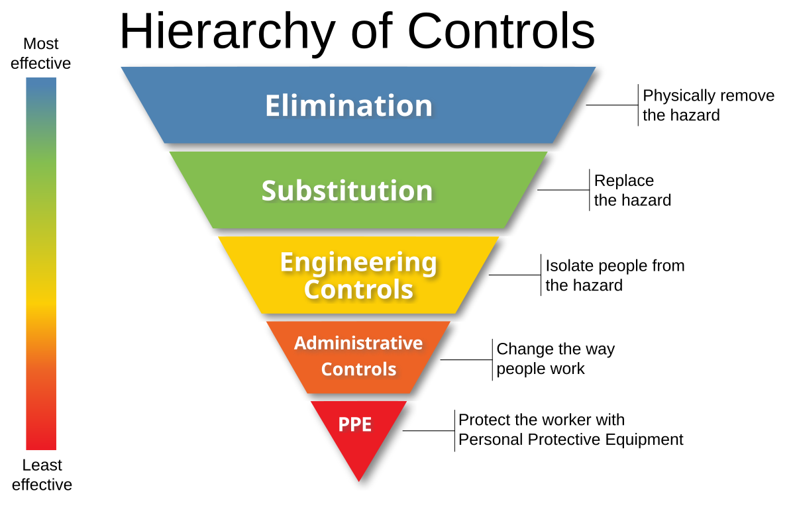

## Table of Contents

## What is a risk assessment?

A risk assessment is a process where you look at what could cause harm to people in a certain situation, and then decide how to keep them safe. It's like checking a playground for broken equipment or sharp edges before kids play there. You think about what could go wrong, how likely it is to happen, and what you can do to stop it from happening or to make it less harmful if it does happen.

In a business, a risk assessment might involve looking at the workplace to see if there are any dangers, like slippery floors or heavy lifting. Then, you figure out ways to fix these problems, maybe by putting up signs or using machines to lift heavy things. The goal is to make the workplace safer for everyone by understanding and managing the risks.

## Why is risk assessment important in project management?

Risk assessment is really important in project management because it helps you spot problems before they happen. When you're working on a project, things can go wrong, like running out of money, missing deadlines, or having team members get sick. By doing a risk assessment, you can think about what might go wrong and how likely it is to happen. This way, you can plan ahead and try to stop these problems from messing up your project.

It also helps you be ready if something bad does happen. If you've thought about risks ahead of time, you can have a plan ready to fix things quickly. This can save time and money, and keep your project on track. Plus, knowing about risks makes everyone on the team feel more confident because they know you're prepared for whatever might come up.

## What are the basic steps involved in conducting a risk assessment?

The first step in conducting a risk assessment is to identify the hazards. This means looking around and thinking about what could harm people or the project. You might find hazards like slippery floors, heavy lifting, or not enough money. Once you know what the hazards are, the next step is to figure out who might be harmed and how. This could be your team members, customers, or anyone else involved in the project.

After identifying the hazards and who might be harmed, you need to evaluate the risks. This means thinking about how likely it is that something bad will happen and how serious it could be. You can use a simple scale to rate the risks, like low, medium, or high. Once you know which risks are the biggest problems, you can decide what to do about them. This is called risk control. You might decide to get rid of the risk completely, make it less likely to happen, or have a plan ready in case it does happen.

The last step is to record your findings and share them with your team. Write down what hazards you found, who might be harmed, how serious the risks are, and what you're going to do about them. It's important to tell everyone on your team about the risks and the plan to keep them safe. You should also check your risk assessment regularly to make sure it's still working and update it if things change.

## How does the risk pyramid help in visualizing risks?

The risk pyramid is a helpful way to see and understand risks in a project or a workplace. It looks like a triangle split into different levels, with the biggest risks at the top and the smaller ones at the bottom. The top of the pyramid shows the risks that could cause the most harm or damage, like serious accidents or big financial losses. As you move down the pyramid, the risks get smaller and less likely to happen, but there are more of them. This helps you see which risks you should focus on first.

Using the risk pyramid makes it easier to talk about risks with your team. When everyone can see the pyramid, they understand which risks are the most important to deal with. It also helps you plan what to do about each level of risk. You can start at the top and work your way down, making sure the biggest risks are under control before you move on to the smaller ones. This way, you can keep your project or workplace safe and successful.

## What are the different levels of the risk pyramid?

The risk pyramid has different levels, starting from the top with the most serious risks. At the top, you have catastrophic risks. These are the big ones that could cause a lot of harm or damage, like a major accident or losing a lot of money. The next level down is major risks. These are still pretty serious but not as bad as the ones at the top. They might cause big problems but not as much as the catastrophic risks.

As you move further down the pyramid, the risks get smaller but there are more of them. The next level is moderate risks. These are problems that could happen but they won't cause as much harm as the ones above. Below that, you have minor risks. These are small problems that might happen often but they don't cause much harm. At the very bottom of the pyramid, you have negligible risks. These are tiny problems that don't really matter much. The risk pyramid helps you see which risks to focus on first, starting with the ones at the top.

## Can you explain how to categorize risks within the risk pyramid?

To categorize risks within the risk pyramid, you start by looking at how bad the risk could be if it happens. At the top of the pyramid, you put the catastrophic risks. These are the worst ones that could cause a lot of harm or damage, like a big accident or losing a lot of money. Below that, you have major risks. These are still serious but not as bad as the catastrophic ones. They might cause big problems but not as much harm. You keep going down the pyramid, putting risks in order from the worst to the least bad.

As you move down the pyramid, the risks get smaller but there are more of them. The next level down is moderate risks. These are problems that could happen but they won't cause as much harm as the ones above. Below that, you have minor risks. These are small problems that might happen often but they don't cause much harm. At the very bottom of the pyramid, you have negligible risks. These are tiny problems that don't really matter much. By putting risks in the pyramid like this, you can see which ones to focus on first, starting with the ones at the top.

## How do you prioritize risks using the risk pyramid?

To prioritize risks using the risk pyramid, you start by looking at the risks at the top of the pyramid. These are the catastrophic risks, the ones that could cause the most harm or damage. They are the most important to deal with because they could cause big problems. You should focus on these risks first and make plans to stop them from happening or to make them less harmful if they do happen.

As you move down the pyramid, the risks get smaller but there are more of them. The next level is major risks, which are still pretty serious but not as bad as the catastrophic ones. After that come moderate risks, which are less harmful but still need attention. Then there are minor risks, which are small problems that happen often but don't cause much harm. At the bottom of the pyramid are negligible risks, which are tiny and don't matter much. By working your way down the pyramid, you can make sure you're dealing with the most important risks first and then moving on to the smaller ones.

## What tools and techniques are used in conjunction with the risk pyramid for effective risk assessment?

When using the risk pyramid for risk assessment, other tools and techniques can help make it even better. One tool is a risk matrix, which is like a chart that shows how likely a risk is to happen and how bad it could be. You can use this to put risks in the right place on the pyramid. Another tool is a risk register, which is a list where you write down all the risks, how likely they are, how bad they could be, and what you're going to do about them. This helps you keep track of everything and make sure you don't miss any important risks.

Another technique is brainstorming with your team. When everyone gets together to talk about what could go wrong, you can find risks that you might not have thought of on your own. It's also good to use data and past experiences to help you understand risks better. Looking at what happened in other projects or in the past can help you see what risks are most likely and how to deal with them. By using these tools and techniques along with the risk pyramid, you can make your risk assessment more complete and effective.

## How can the risk pyramid be adapted for different industries or projects?

The risk pyramid can be changed to fit different industries or projects by thinking about what kinds of risks are most important in that specific situation. For example, in construction, the top of the pyramid might be filled with risks like falling from high places or getting hurt by heavy machinery. In a software project, the top might be about risks like data breaches or big delays in the project timeline. By understanding the unique risks of each industry or project, you can put the right risks at the top of the pyramid and make sure you're focusing on the most important ones.

To make the risk pyramid work well for different situations, you can also change how you measure the risks. In some industries, the harm from a risk might be measured in money, while in others it might be about safety or time. You can use different scales or ways of rating risks to fit what matters most in that industry or project. By doing this, the risk pyramid becomes a useful tool no matter what kind of work you're doing, helping you see and manage risks in a way that makes sense for your specific situation.

## What are some common challenges faced when implementing the risk pyramid in risk assessment?

One common challenge when using the risk pyramid for risk assessment is getting everyone to agree on where to put the risks. Different people might see the same risk in different ways. For example, one person might think a risk is really bad and should go at the top of the pyramid, while someone else might think it's not that big of a deal and should go lower down. This can make it hard to decide which risks to focus on first and can lead to arguments or confusion.

Another challenge is keeping the risk pyramid up to date. Things can change quickly in a project or a workplace, and new risks can pop up while old ones might not be a problem anymore. It takes time and effort to keep checking and changing the pyramid to make sure it still shows the right risks. If you don't keep it updated, you might miss important new risks or waste time worrying about risks that aren't a problem anymore.

## How does the integration of data analytics enhance the use of the risk pyramid in risk management?

Using data analytics can make the risk pyramid a lot better for managing risks. When you look at data from past projects or from what's happening right now, you can see patterns and learn what kinds of risks are most likely to happen. This helps you put the right risks at the top of the pyramid. Data analytics can also help you see how bad a risk could be by looking at numbers and facts. This makes it easier to decide where each risk should go on the pyramid and helps you focus on the most important ones first.

Another way data analytics helps is by keeping the risk pyramid up to date. When you have new data coming in all the time, you can see if things are changing and if new risks are showing up. This means you can quickly move risks around on the pyramid to make sure it always shows what's most important right now. By using data analytics, you can make smarter decisions about how to manage risks and keep your project or workplace safe and successful.

## What are advanced strategies for mitigating risks identified through the risk pyramid?

One advanced strategy for mitigating risks identified through the risk pyramid is to use predictive analytics. This means using data to guess what might happen in the future. By looking at patterns and trends from past projects, you can see which risks are most likely to happen and how bad they could be. With this information, you can plan ahead and take steps to stop these risks from causing problems. For example, if data shows that there's a high chance of a delay in your project, you can add more time to your schedule or have backup plans ready to keep things on track.

Another strategy is to use scenario planning. This means thinking about different things that could happen and planning what to do in each situation. You can use the risk pyramid to see which risks are the biggest problems and then make detailed plans for how to handle them if they happen. For example, if a big risk at the top of the pyramid is a data breach, you can create a plan that includes steps like training your team on security, setting up better firewalls, and having a quick response plan if a breach does happen. By preparing for different scenarios, you can be ready for whatever might come up and keep your project safe.

A third strategy is to involve your whole team in risk management. When everyone knows about the risks and understands the risk pyramid, they can help spot problems and come up with ideas to fix them. You can have regular meetings where your team talks about the risks on the pyramid and shares any new risks they've noticed. This way, everyone feels responsible for managing risks, and you can use their different ideas and experiences to find the best ways to keep your project safe. By working together, you can make sure you're always on top of the risks and ready to handle them.

## References & Further Reading

[1]: Bergstra, J., Bardenet, R., Bengio, Y., & Kégl, B. (2011). ["Algorithms for Hyper-Parameter Optimization."](https://papers.nips.cc/paper/4443-algorithms-for-hyper-parameter-optimization) Advances in Neural Information Processing Systems 24.

[2]: ["Advances in Financial Machine Learning"](https://www.amazon.com/Advances-Financial-Machine-Learning-Marcos/dp/1119482089) by Marcos Lopez de Prado

[3]: ["Evidence-Based Technical Analysis: Applying the Scientific Method and Statistical Inference to Trading Signals"](https://www.amazon.com/Evidence-Based-Technical-Analysis-Scientific-Statistical/dp/0470008741) by David Aronson

[4]: ["Machine Learning for Algorithmic Trading"](https://github.com/stefan-jansen/machine-learning-for-trading) by Stefan Jansen

[5]: ["Quantitative Trading: How to Build Your Own Algorithmic Trading Business"](https://www.amazon.com/Quantitative-Trading-Build-Algorithmic-Business/dp/1119800064) by Ernest P. Chan