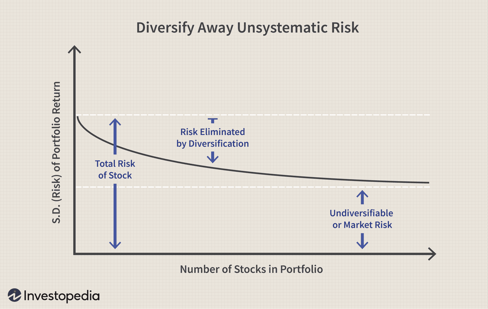

Investment risk is a vital component of financial decision-making, influencing the strategies that investors employ to build robust portfolios. At the core of investment strategy lies the necessity to balance anticipated returns with the risks involved. This balancing act is essential because investment outcomes are inherently uncertain, and understanding these uncertainties helps investors make informed choices.

Modern Portfolio Theory (MPT), introduced by Harry Markowitz in 1952, provides a comprehensive framework for addressing investment risk. MPT emphasizes diversification as a means to optimize investment portfolios. By combining assets with varying degrees of risk and return, investors can potentially achieve the highest possible return for a given level of risk, aligning portfolios along what is known as the "efficient frontier." The theory proposes that the risk of a portfolio is measured by the standard deviation of its returns, guiding investors towards making decisions that account for both the volatility and performance of assets.



Central to this decision-making process is the concept of risk aversion, which refers to an investor's general reluctance to take on risk. Risk aversion greatly influences investor behavior and portfolio construction. Investors characterized as risk averse are typically more inclined to select investments that offer lower potential returns in exchange for reduced uncertainty.

The advent of algorithmic trading has added further complexity to investment landscapes. Algorithmic trading refers to the utilization of complex algorithms to automate trade execution. It is characterized by high speed and high frequency, enabled by advancements in computational power. Through the use of sophisticated statistical models and quantitative analysis, algorithmic trading helps in real-time market analysis and risk management. However, it also introduces its own set of risks, including technological failures and liquidity concerns.

In this article, we will examine how these concepts interconnect and assess their implications for today's investors. By understanding investment risk, employing Modern Portfolio Theory, considering risk aversion, and cautiously integrating algorithmic trading, investors can craft portfolios that are not only resilient but also aligned with their individual financial objectives.

## Table of Contents

## Understanding Investment Risk

Investment risk embodies the uncertainty inherent in achieving anticipated returns from an investment. This uncertainty arises from various factors that can affect the performance of investments, leading to potential deviations from expected outcomes.

**Types of Investment Risks**

1. **Market Risk**: This is the risk of losses in investments due to fluctuations in market prices. Market risk can be caused by macroeconomic factors, such as changes in interest rates, inflation, or political instability. A common measure of market risk is beta ($\beta$), which quantifies the sensitivity of an investment's returns to movements in the overall market.

2. **Credit Risk**: Credit risk is the risk of loss arising from a borrower's failure to meet financial obligations. For investors, this typically involves the risk that a bond issuer will default on payments. Credit ratings provided by agencies like Standard & Poor's and Moody's offer assessments of an issuer's creditworthiness.

3. **Liquidity Risk**: This refers to the risk of being unable to quickly buy or sell an investment without causing a significant impact on its price. Less liquid assets may require a discount to sell rapidly, potentially leading to substantial losses.

4. **Operational Risk**: Operational risk involves losses due to inadequate or failed internal processes, people, systems, or external events. This type of risk is often less quantifiable but can be mitigated through effective internal controls and management oversight.

**Risk Management and Decision Making**

Effective risk management is essential in mitigating potential losses while aiming for profitable returns. Investors employ various strategies to assess and manage these risks, making informed decisions about their portfolios. This often involves diversifying investments to spread risk and utilizing risk assessment tools to evaluate the potential impact of different risk factors.

One method of quantifying investment risk is through the use of statistical measures, such as standard deviation ($\sigma$), which indicates the variability of investment returns. Sharpe ratio, given by:

$$
\text{Sharpe Ratio} = \frac{R_p - R_f}{\sigma_p}
$$

where $R_p$ is the portfolio return, $R_f$ is the risk-free rate, and $\sigma_p$ is the standard deviation of the portfolio, is a common measure used to assess risk-adjusted returns.

By comprehensively understanding and measuring investment risks, investors can strategically construct portfolios to align with their risk tolerance and financial objectives, enhancing the potential for achieving desired returns while managing exposure to loss.

## Modern Portfolio Theory and Risk

Modern Portfolio Theory (MPT), introduced by Harry Markowitz, is a pivotal concept that underscores the importance of diversification in investment portfolios to minimize risk while maximizing potential returns. The theory postulates that investors can achieve a portfolio that offers the highest expected return for a defined level of risk, or conversely, the lowest risk for a given level of expected return. This is central to understanding the risk-return trade-off that lies at the heart of investment decisions.

At the core of MPT is the quantification of risk using the standard deviation of investment returns. Standard deviation measures the [dispersion](/wiki/dispersion-trading) of returns from the expected value, thus allowing investors to understand the [volatility](/wiki/volatility-trading-strategies) associated with a particular investment or portfolio. In mathematical terms, for a portfolio with $n$ assets, the portfolio's risk is represented as follows:

$$
\sigma_p = \sqrt{\sum_{i=1}^{n} \sum_{j=1}^{n} w_i w_j \sigma_i \sigma_j \rho_{ij}}
$$

Where:
- $\sigma_p$ is the standard deviation of the portfolio.
- $w_i$ and $w_j$ are the weights of assets $i$ and $j$ in the portfolio.
- $\sigma_i$ and $\sigma_j$ are the standard deviations of assets $i$ and $j$.
- $\rho_{ij}$ is the correlation coefficient between the returns of assets $i$ and $j$.

The relationship between these measures allows for the construction of an "efficient frontier." This is a graphical representation comprising portfolios that offer the most return for a given risk level. Portfolios that lie below the efficient frontier are considered suboptimal, as either higher returns could be achieved with the same risk or the same returns could be achieved with less risk. The efficient frontier effectively maps the set of optimal portfolios that an investor with a given risk tolerance might consider.

MPT operates under the assumption that investors are inherently risk-averse. This means they prefer to minimize volatility for any given expected return, prioritizing stable and predictable returns over potentially higher but erratic gains. This risk aversion influences the selection of assets and the subsequent allocation within a portfolio to ensure that the chosen mix aligns with the investor's risk tolerance and financial goals.

In summary, Modern Portfolio Theory provides a systematic methodology for balancing risk and return in a portfolio through diversification. By quantifying risk with standard deviation and seeking portfolios on the efficient frontier, MPT enables investors to make more informed decisions in alignment with their risk preferences.

## The Role of Risk Aversion

Risk aversion is a fundamental concept in investment strategy, reflecting an investor's reluctance to engage with uncertainty in their expected returns. This behavioral trait significantly influences investment choices and portfolio construction. Investors with a high degree of risk aversion often gravitate towards safer investments, such as government bonds or blue-chip stocks, accepting potentially lower returns to maintain a reduced risk profile. The trade-off is straightforward: they prioritize the preservation of capital over potentially higher gains associated with riskier investments.

Understanding one's level of risk aversion is pivotal in constructing an investment portfolio that aligns with individual financial objectives. A precise assessment of risk tolerance enables investors to tailor their asset allocation, balancing between equities, fixed income, and other asset classes, to suit their comfort with risk exposure. Thus, it aids in developing a diversified portfolio that not only addresses the investor's return aspirations but also mitigates undue anxiety over market volatility.

Modern Portfolio Theory (MPT) leverages the concept of risk aversion to optimize portfolio allocations. The theory assumes investors are generally risk-averse, favoring portfolios with minimized volatility for a given expected return. The utility function $U$ for an investor can be expressed mathematically as:

$$
U = E(R) - \frac{1}{2} A \sigma^2
$$

where:
- $E(R)$ is the expected return of the portfolio,
- $A$ represents the investor's level of risk aversion,
- $\sigma^2$ is the variance of the portfolio’s returns (a measure of risk).

The parameter $A$ reflects the investor's risk aversion coefficient, with higher values indicating greater aversion to risk. By deploying this framework, MPT aids in guiding the strategic allocation of assets within a portfolio, steering investments toward those that align with the investor's risk preferences. Consequently, this results in a portfolio situated on the efficient frontier, where the potential returns are optimized for the investor’s accepted risk level.

In summary, understanding and accounting for risk aversion is instrumental in financial planning and investment management. Through strategic asset allocation informed by risk aversion profiles, investors can cultivate resilient portfolios tailored to meet their long-term financial objectives while adhering to their risk tolerance.

## Algorithmic Trading and Risk Management

Algorithmic trading is a method of executing orders using automated, pre-programmed trading instructions, which account for variables such as price, timing, and [volume](/wiki/volume-trading-strategy). This approach leverages statistical models and quantitative analysis to enhance trading strategies, allowing for high-speed and high-frequency trade executions that can optimize investment portfolios.

One of the primary advantages of [algorithmic trading](/wiki/algorithmic-trading) is risk management, achieved through diversification and real-time market analysis. Algorithms can quickly respond to market changes, adjusting positions to maintain a balanced portfolio. This sensitivity to market fluctuations helps not only in capturing favorable opportunities but also in mitigating potential losses.

Despite its advantages, algorithmic trading introduces specific risks. System failures, often due to technical glitches or programming errors, can result in significant financial losses. Moreover, [liquidity](/wiki/liquidity-risk-premium) issues may arise, particularly during volatile market conditions or when executing large volumes of trades, potentially leading to unfavorable price movements.

To minimize these risks, robust risk management frameworks and fail-safes need to be integrated into algorithmic trading systems. For instance, implementing circuit breakers or trade thresholds can prevent excessive losses during unexpected market conditions. Properly calibrated algorithms can also enhance portfolio resilience by optimizing trade execution and maintaining liquidity.

Here is a basic Python example illustrating how algorithms might be used to execute trades based on moving averages:

```python
import pandas as pd

# Assume df is a DataFrame containing 'Close' prices of a stock
df['Short_MA'] = df['Close'].rolling(window=50).mean()
df['Long_MA'] = df['Close'].rolling(window=200).mean()

# Generate trading signals (1: buy, -1: sell)
df['Signal'] = 0
df['Signal'][50:] = np.where(df['Short_MA'][50:] > df['Long_MA'][50:], 1, -1)

# Example execution
for i in range(1, len(df)):
    if df['Signal'][i] == 1:
        # Execute buy order
        execute_trade(order_type='buy', quantity=100)
    elif df['Signal'][i] == -1:
        # Execute sell order
        execute_trade(order_type='sell', quantity=100)

# Function to execute trades
def execute_trade(order_type, quantity):
    # Placeholder function to simulate trade execution
    print(f"Executing {order_type} order for {quantity} shares")
```

In this example, the algorithm generates buy and sell signals based on the crossover of short- and long-term moving averages. While this strategy is relatively simple, more sophisticated algorithms can incorporate advanced statistical models and AI techniques to further enhance decision-making.

Algorithmic trading, when integrated prudently, can considerably improve risk-adjusted returns by providing rapid responses to market dynamics while maintaining a disciplined trading approach.

## Integrating MPT with Algorithmic Trading

Modern Portfolio Theory (MPT) and algorithmic trading collectively offer a powerful approach to portfolio management, leveraging their respective strengths to optimize investment strategies. MPT, which focuses on diversification and optimizing returns for a given level of risk, can be significantly enhanced by the computational power and speed of algorithmic trading.

**Data-Driven Optimization**

Algorithmic trading can process vast datasets quickly, a task beyond the manual capabilities of human traders. This computational efficiency allows for the dynamic analysis and identification of optimal portfolio allocations. Algorithms can swiftly recalibrate portfolios by analyzing factors such as asset correlations, volatility, and market trends. For instance, algorithms can implement the mean-variance optimization model from MPT to determine the weight of assets in a portfolio, aiming to achieve the highest expected return for a given level of risk.

```python
import numpy as np
from scipy.optimize import minimize

# Example code for a simple mean-variance optimization

# Assume expected returns and covariance matrix are known for the assets
expected_returns = np.array([0.10, 0.12, 0.15])
cov_matrix = np.array([[0.005, -0.010, 0.004],
                       [-0.010, 0.040, -0.002],
                       [0.004, -0.002, 0.023]])

# Function to calculate portfolio variance
def portfolio_variance(weights, cov_matrix):
    return np.dot(weights.T, np.dot(cov_matrix, weights))

# Function to calculate negative Sharpe Ratio
def negative_sharpe_ratio(weights, expected_returns, cov_matrix, risk_free_rate=0.03):
    portfolio_return = np.dot(weights, expected_returns)
    portfolio_volatility = np.sqrt(portfolio_variance(weights, cov_matrix))
    sharpe_ratio = (portfolio_return - risk_free_rate) / portfolio_volatility
    return -sharpe_ratio

# Constraints and bounds
constraints = {'type': 'eq', 'fun': lambda x: np.sum(x) - 1}
bounds = tuple((0, 1) for _ in range(len(expected_returns)))

# Optimizing portfolio weights
result = minimize(negative_sharpe_ratio, len(expected_returns)*[1./len(expected_returns)],
                  args=(expected_returns, cov_matrix), method='SLSQP',
                  bounds=bounds, constraints=constraints)

optimal_weights = result.x
```

**Dynamic Adaptation**

Beyond static optimization, algorithms support continuous portfolio adjustments in response to evolving market conditions. By assessing real-time data, these systems can update risk assessments and alter asset allocations accordingly. This adaptability is crucial in volatile markets, where static models might lag in responsiveness.

**Monitoring and Alignment**

Despite their advantages, automated systems necessitate diligent oversight to ensure they align with investors' risk preferences and objectives. A poorly monitored system can drift from them, exposing portfolios to unintended risks. Parameters within algorithms must be periodically reviewed and adjusted to reflect changes in market dynamics and investor circumstances.

**Enhanced Risk-Adjusted Returns**

The integration of MPT principles into algorithmic trading platforms aims to achieve superior risk-adjusted returns. By maximizing the Sharpe Ratio or using other metrics to balance risk and reward, investors can potentially increase profitability while managing downside risks. The combination of strategic diversification and real-time data processing paves the way for a more resilient investment strategy that harnesses the strengths of both MPT and algorithmic trading systems.

## Conclusion

Investment risk is a multi-faceted challenge for investors, necessitating strategic planning and execution to build resilient portfolios. Modern Portfolio Theory (MPT) provides a solid foundation for understanding and managing this risk. By advocating for diversification, MPT helps investors optimize returns while reducing the impact of volatility on a portfolio. The theory's focus on the 'efficient frontier' enables investors to select portfolios that offer the best possible return for a given level of risk, tailored to individual risk aversion levels.

Algorithmic trading complements MPT by offering advanced tools for portfolio optimization. By leveraging large data sets and complex algorithms, investors can automate trading strategies to enhance decision-making and improve risk management. This approach allows for continuous adaptation to market conditions, enhancing the ability to achieve risk-adjusted returns.

However, algorithmic trading introduces its own set of challenges and risks, such as system failures and liquidity issues. Therefore, it is crucial for investors to understand their risk tolerance and integrate technology judiciously. By balancing the insights from MPT with the capabilities of algorithmic trading, investors can make informed decisions that align with their financial goals, ultimately building portfolios that are both robust and adaptive to changing market environments.

## References & Further Reading

[1]: Markowitz, H. (1952). ["Portfolio Selection."](https://onlinelibrary.wiley.com/doi/abs/10.1111/j.1540-6261.1952.tb01525.x) The Journal of Finance, 7(1), 77-91.

[2]: Jensen, M.C. (1968). ["The Performance of Mutual Funds in the Period 1945-1964."](https://onlinelibrary.wiley.com/doi/full/10.1111/j.1540-6261.1968.tb00815.x) Journal of Finance, 23(2), 389-416.

[3]: Fabozzi, F.J., & Markowitz, H. (2011). ["The Theory and Practice of Investment Management."](https://onlinelibrary.wiley.com/doi/book/10.1002/9781118267028) John Wiley & Sons.

[4]: Sharpe, W.F. (1964). ["Capital Asset Prices: A Theory of Market Equilibrium under Conditions of Risk."](https://onlinelibrary.wiley.com/doi/full/10.1111/j.1540-6261.1964.tb02865.x) Journal of Finance, 19(3), 425-442.

[5]: Chan, E. (2009). ["Quantitative Trading: How to Build Your Own Algorithmic Trading Business."](https://github.com/ftvision/quant_trading_echan_book) Wiley Trading.

[6]: Lopez de Prado, M. (2018). ["Advances in Financial Machine Learning."](https://www.amazon.com/Advances-Financial-Machine-Learning-Marcos/dp/1119482089) Wiley.

[7]: Jorion, P. (2003). ["Financial Risk Manager Handbook."](https://books.google.com/books/about/Financial_Risk_Manager_Handbook.html?id=gi9jujL8UW4C) John Wiley & Sons.