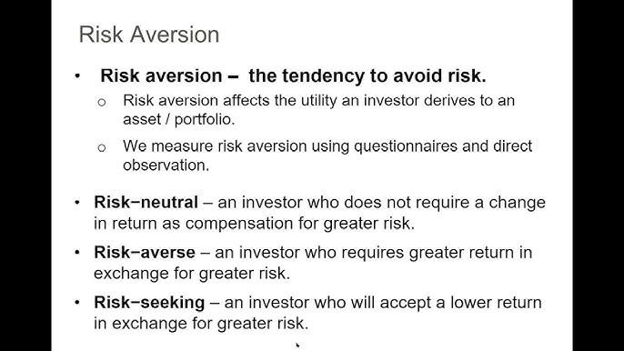

## Table of Contents

## What is risk aversion in the context of finance?

Risk aversion in finance means how much a person or investor dislikes risk. Imagine you have two choices: one is safe but gives you less money, and the other is risky but could give you more money. A risk-averse person will choose the safe option because they don't want to lose money, even if it means they might miss out on a bigger reward.

In the world of investing, risk aversion affects how people choose to put their money into different things like stocks, bonds, or savings accounts. If someone is very risk-averse, they will likely put their money in safer places, like a savings account or government bonds, where the chance of losing money is low. On the other hand, someone who is less risk-averse might be willing to invest in stocks, which can go up and down a lot but also offer the chance for bigger gains.

## How does Modern Portfolio Theory define risk?

Modern Portfolio Theory (MPT) defines risk as the chance that an investment won't give you the return you expect. It measures this risk by something called standard deviation, which shows how much the return on an investment can swing up or down. If an investment has a high standard deviation, it means it's more risky because its returns can change a lot.

MPT looks at how different investments move together, or their correlation. By mixing different investments in a portfolio, MPT tries to lower the overall risk. The idea is that when one investment goes down, another might go up, balancing things out. This way, MPT helps investors find a good balance between risk and reward.

## What are the basic principles of Modern Portfolio Theory?

Modern Portfolio Theory, or MPT, is all about how to mix different investments to lower risk while still getting good returns. The main idea is that by spreading your money across different types of investments, like stocks and bonds, you can reduce the chance that your whole portfolio loses value at the same time. This is called diversification. MPT says that instead of just looking at how much risk each investment has on its own, you should think about how they work together. If one investment goes down, another might go up, which can help balance things out.

Another key part of MPT is the efficient frontier. This is a line on a graph that shows the best possible mix of risk and reward you can get from a portfolio. Any portfolio that falls on this line gives you the highest return for the level of risk you're willing to take. MPT helps investors find the right spot on this line based on how much risk they are comfortable with. By using these ideas, MPT helps people build portfolios that match their goals and how much risk they can handle.

## How is risk aversion measured in Modern Portfolio Theory?

In Modern Portfolio Theory, risk aversion is measured by looking at how much extra return an investor wants to take on more risk. This is called the risk premium. If someone is very risk-averse, they will want a big risk premium to put their money in risky investments. On the other hand, someone who is less risk-averse might be okay with a smaller risk premium because they are more comfortable with risk.

To figure out someone's risk aversion, MPT uses a tool called the utility function. This function helps show how happy or unhappy an investor is with different levels of risk and return. By using this function, MPT can find the best mix of investments for each person based on how much risk they are willing to take. This way, the theory helps people make choices that match their comfort with risk.

## What role does the utility function play in measuring risk aversion?

The utility function in Modern Portfolio Theory helps figure out how much someone dislikes risk. It's like a math tool that shows how happy or unhappy a person is with different levels of risk and return. When someone is very risk-averse, their utility function will show that they need a lot more return to be okay with taking on more risk. On the other hand, if someone is less risk-averse, their utility function will show they are okay with less return for the same amount of risk.

By using the utility function, Modern Portfolio Theory can find the best mix of investments for each person. It looks at how much risk someone is willing to take and then suggests a portfolio that matches their comfort level. This way, the theory helps people make choices that fit their feelings about risk, making sure they are as happy as possible with their investments.

## Can you explain the concept of the risk aversion coefficient?

The risk aversion coefficient is a number that shows how much someone dislikes risk. It's a way to measure how much extra return a person needs to be okay with taking on more risk. If someone has a high risk aversion coefficient, it means they really don't like risk and need a lot more return to feel comfortable with it. On the other hand, if someone has a low risk aversion coefficient, they are more okay with risk and don't need as much extra return to take it on.

This coefficient is used in the utility function, which is a tool that helps figure out how happy or unhappy someone is with different levels of risk and return. By knowing someone's risk aversion coefficient, you can find the best mix of investments for them. For example, if someone has a high risk aversion coefficient, you might suggest they put their money in safer investments like bonds. If someone has a low risk aversion coefficient, you might suggest they invest in riskier things like stocks. This way, their investments match how they feel about risk.

## How does the Capital Asset Pricing Model (CAPM) relate to risk aversion?

The Capital Asset Pricing Model, or CAPM, is a tool that helps figure out how much return an investment should give you based on how risky it is. It uses something called the risk-free rate, which is the return you get from very safe investments like government bonds, and the market risk premium, which is the extra return you get for taking on more risk by investing in the stock market. The key part of CAPM is the beta, which measures how much an investment moves with the market. If an investment has a high beta, it means it's more sensitive to market changes and is riskier. CAPM helps investors understand how much extra return they should expect for taking on this risk, which ties into how much they dislike risk, or their risk aversion.

If someone is very risk-averse, they will want a big reward, or a high risk premium, to put their money in risky investments. CAPM helps them see if the expected return from an investment is enough to make up for the risk. For example, if an investment has a high beta, a risk-averse person might need a much higher return to feel okay about investing in it. On the other hand, someone who is less risk-averse might be fine with a smaller risk premium because they are more comfortable with risk. So, CAPM uses the idea of risk aversion to help people make smart choices about where to put their money, based on how much risk they are willing to take.

## What are some common methods to quantify an investor's risk aversion?

One common way to figure out how much an investor dislikes risk is by using a survey or questionnaire. These tools ask questions about how the investor feels about different levels of risk and reward. For example, they might ask if the investor would rather have a sure $100 or a 50% chance of getting $200. By looking at the answers, experts can give the investor a risk aversion score. This score helps show how much extra return the investor needs to be okay with taking on more risk.

Another method is to use a mathematical model, like the utility function we talked about before. This function uses numbers to show how happy or unhappy an investor is with different levels of risk and return. By knowing the investor's risk aversion coefficient, which is a number that shows how much they dislike risk, the model can suggest the best mix of investments for them. If someone has a high risk aversion coefficient, they might need a lot more return to feel comfortable with riskier investments. This way, the model helps match the investor's feelings about risk with the right investments.

## How do different levels of risk aversion affect portfolio construction?

Different levels of risk aversion play a big role in how people build their investment portfolios. If someone is very risk-averse, they will want to put their money in safer places like savings accounts or government bonds. These investments don't change much in value, so there's less chance of losing money. A risk-averse person might not get big returns, but they feel more comfortable because their money is safer. On the other hand, someone who is less risk-averse might be okay with putting their money in riskier things like stocks. They know the value can go up and down a lot, but they are willing to take that chance because they want the chance to make more money.

Building a portfolio that matches someone's risk aversion means finding the right balance between risk and reward. For example, if someone is very risk-averse, their portfolio might have a lot of bonds and very few stocks. This keeps the risk low. But if someone is less risk-averse, their portfolio might have more stocks and fewer bonds. This gives them a chance for bigger returns, but it also means more risk. By understanding how much someone dislikes risk, financial advisors can help them build a portfolio that fits their comfort level and helps them reach their investment goals.

## What are the limitations of traditional risk aversion measures in Modern Portfolio Theory?

Traditional risk aversion measures in Modern Portfolio Theory have some problems. One big issue is that they often use math formulas and surveys that assume people always make choices the same way. But in real life, people's feelings about risk can change a lot depending on things like their mood, the news, or even what happened to their investments recently. So, these measures might not always show how someone really feels about risk at any given time.

Another problem is that traditional measures focus a lot on how much money someone could lose or gain, but they don't always think about other things that matter to people, like how safe they feel or how much they care about the environment. For example, someone might choose a less risky investment not just because of the money, but because it's in a company they trust or one that's good for the planet. So, these measures can miss important parts of why people make the choices they do about their investments.

## How have recent advancements in behavioral finance impacted the measurement of risk aversion?

Recent advancements in behavioral finance have changed how we think about measuring risk aversion. Behavioral finance looks at how people's feelings and behaviors affect their choices about money. It shows that people don't always make choices based just on math and numbers. For example, someone might feel scared about losing money and make a choice based on that fear, even if the numbers say it's a good idea. Because of this, new ways to measure risk aversion now try to think about these feelings and behaviors. They use things like brain scans or special surveys to see how emotions and past experiences affect how much risk someone is willing to take.

These new methods help us understand risk aversion better. They show that people's comfort with risk can change a lot, depending on things like their mood or what's happening in the world. For example, if the stock market is going down, people might feel more scared and want to take less risk. These new tools help advisors and investors build portfolios that fit not just the numbers, but also how people really feel about risk. By understanding these emotions, we can make better choices about where to put our money.

## What are some advanced statistical models used for measuring risk aversion in modern financial analysis?

Advanced statistical models for measuring risk aversion in modern financial analysis include things like the Prospect Theory model and the Stochastic Dominance model. Prospect Theory, developed by Daniel Kahneman and Amos Tversky, looks at how people feel about gains and losses differently. It shows that people feel the pain of losing money more than the joy of gaining the same amount. This model helps us understand why people might choose safer investments even when riskier ones could give them more money. By using Prospect Theory, we can measure risk aversion by looking at how much someone needs to gain to feel okay about taking a risk.

Another model is Stochastic Dominance, which helps us see if one investment is better than another for someone based on how much risk they are willing to take. This model doesn't just look at the average return and risk, but it also looks at all the possible outcomes and how likely they are to happen. By using Stochastic Dominance, we can figure out if an investment fits someone's level of risk aversion better than another one. These models give us a deeper understanding of how people make choices about risk and help build portfolios that match their feelings about risk more closely.

## What is Understanding Investment Risk?

Investment risk embodies the uncertainty inherent in achieving anticipated returns from an investment. This uncertainty arises from various factors that can affect the performance of investments, leading to potential deviations from expected outcomes.

**Types of Investment Risks**

1. **Market Risk**: This is the risk of losses in investments due to fluctuations in market prices. Market risk can be caused by macroeconomic factors, such as changes in interest rates, inflation, or political instability. A common measure of market risk is beta ($\beta$), which quantifies the sensitivity of an investment's returns to movements in the overall market.

2. **Credit Risk**: Credit risk is the risk of loss arising from a borrower's failure to meet financial obligations. For investors, this typically involves the risk that a bond issuer will default on payments. Credit ratings provided by agencies like Standard & Poor's and Moody's offer assessments of an issuer's creditworthiness.

3. **Liquidity Risk**: This refers to the risk of being unable to quickly buy or sell an investment without causing a significant impact on its price. Less liquid assets may require a discount to sell rapidly, potentially leading to substantial losses.

4. **Operational Risk**: Operational risk involves losses due to inadequate or failed internal processes, people, systems, or external events. This type of risk is often less quantifiable but can be mitigated through effective internal controls and management oversight.

**Risk Management and Decision Making**

Effective risk management is essential in mitigating potential losses while aiming for profitable returns. Investors employ various strategies to assess and manage these risks, making informed decisions about their portfolios. This often involves diversifying investments to spread risk and utilizing risk assessment tools to evaluate the potential impact of different risk factors.

One method of quantifying investment risk is through the use of statistical measures, such as standard deviation ($\sigma$), which indicates the variability of investment returns. Sharpe ratio, given by:

$$
\text{Sharpe Ratio} = \frac{R_p - R_f}{\sigma_p}
$$

where $R_p$ is the portfolio return, $R_f$ is the risk-free rate, and $\sigma_p$ is the standard deviation of the portfolio, is a common measure used to assess risk-adjusted returns.

By comprehensively understanding and measuring investment risks, investors can strategically construct portfolios to align with their risk tolerance and financial objectives, enhancing the potential for achieving desired returns while managing exposure to loss.

## What is Modern Portfolio Theory and how does it relate to risk?

Modern Portfolio Theory (MPT), introduced by Harry Markowitz, is a pivotal concept that underscores the importance of diversification in investment portfolios to minimize risk while maximizing potential returns. The theory postulates that investors can achieve a portfolio that offers the highest expected return for a defined level of risk, or conversely, the lowest risk for a given level of expected return. This is central to understanding the risk-return trade-off that lies at the heart of investment decisions.

At the core of MPT is the quantification of risk using the standard deviation of investment returns. Standard deviation measures the [dispersion](/wiki/dispersion-trading) of returns from the expected value, thus allowing investors to understand the [volatility](/wiki/volatility-trading-strategies) associated with a particular investment or portfolio. In mathematical terms, for a portfolio with $n$ assets, the portfolio's risk is represented as follows:

$$
\sigma_p = \sqrt{\sum_{i=1}^{n} \sum_{j=1}^{n} w_i w_j \sigma_i \sigma_j \rho_{ij}}
$$

Where:
- $\sigma_p$ is the standard deviation of the portfolio.
- $w_i$ and $w_j$ are the weights of assets $i$ and $j$ in the portfolio.
- $\sigma_i$ and $\sigma_j$ are the standard deviations of assets $i$ and $j$.
- $\rho_{ij}$ is the correlation coefficient between the returns of assets $i$ and $j$.

The relationship between these measures allows for the construction of an "efficient frontier." This is a graphical representation comprising portfolios that offer the most return for a given risk level. Portfolios that lie below the efficient frontier are considered suboptimal, as either higher returns could be achieved with the same risk or the same returns could be achieved with less risk. The efficient frontier effectively maps the set of optimal portfolios that an investor with a given risk tolerance might consider.

MPT operates under the assumption that investors are inherently risk-averse. This means they prefer to minimize volatility for any given expected return, prioritizing stable and predictable returns over potentially higher but erratic gains. This risk aversion influences the selection of assets and the subsequent allocation within a portfolio to ensure that the chosen mix aligns with the investor's risk tolerance and financial goals.

In summary, Modern Portfolio Theory provides a systematic methodology for balancing risk and return in a portfolio through diversification. By quantifying risk with standard deviation and seeking portfolios on the efficient frontier, MPT enables investors to make more informed decisions in alignment with their risk preferences.

## What is the Role of Risk Aversion?

Risk aversion is a fundamental concept in investment strategy, reflecting an investor's reluctance to engage with uncertainty in their expected returns. This behavioral trait significantly influences investment choices and portfolio construction. Investors with a high degree of risk aversion often gravitate towards safer investments, such as government bonds or blue-chip stocks, accepting potentially lower returns to maintain a reduced risk profile. The trade-off is straightforward: they prioritize the preservation of capital over potentially higher gains associated with riskier investments.

Understanding one's level of risk aversion is pivotal in constructing an investment portfolio that aligns with individual financial objectives. A precise assessment of risk tolerance enables investors to tailor their asset allocation, balancing between equities, fixed income, and other asset classes, to suit their comfort with risk exposure. Thus, it aids in developing a diversified portfolio that not only addresses the investor's return aspirations but also mitigates undue anxiety over market volatility.

Modern Portfolio Theory (MPT) leverages the concept of risk aversion to optimize portfolio allocations. The theory assumes investors are generally risk-averse, favoring portfolios with minimized volatility for a given expected return. The utility function $U$ for an investor can be expressed mathematically as:

$$
U = E(R) - \frac{1}{2} A \sigma^2
$$

where:
- $E(R)$ is the expected return of the portfolio,
- $A$ represents the investor's level of risk aversion,
- $\sigma^2$ is the variance of the portfolio’s returns (a measure of risk).

The parameter $A$ reflects the investor's risk aversion coefficient, with higher values indicating greater aversion to risk. By deploying this framework, MPT aids in guiding the strategic allocation of assets within a portfolio, steering investments toward those that align with the investor's risk preferences. Consequently, this results in a portfolio situated on the efficient frontier, where the potential returns are optimized for the investor’s accepted risk level.

In summary, understanding and accounting for risk aversion is instrumental in financial planning and investment management. Through strategic asset allocation informed by risk aversion profiles, investors can cultivate resilient portfolios tailored to meet their long-term financial objectives while adhering to their risk tolerance.

## References & Further Reading

[1]: Markowitz, H. (1952). ["Portfolio Selection."](https://onlinelibrary.wiley.com/doi/abs/10.1111/j.1540-6261.1952.tb01525.x) The Journal of Finance, 7(1), 77-91.

[2]: Jensen, M.C. (1968). ["The Performance of Mutual Funds in the Period 1945-1964."](https://onlinelibrary.wiley.com/doi/full/10.1111/j.1540-6261.1968.tb00815.x) Journal of Finance, 23(2), 389-416.

[3]: Fabozzi, F.J., & Markowitz, H. (2011). ["The Theory and Practice of Investment Management."](https://onlinelibrary.wiley.com/doi/book/10.1002/9781118267028) John Wiley & Sons.

[4]: Sharpe, W.F. (1964). ["Capital Asset Prices: A Theory of Market Equilibrium under Conditions of Risk."](https://onlinelibrary.wiley.com/doi/full/10.1111/j.1540-6261.1964.tb02865.x) Journal of Finance, 19(3), 425-442.

[5]: Chan, E. (2009). ["Quantitative Trading: How to Build Your Own Algorithmic Trading Business."](https://github.com/ftvision/quant_trading_echan_book) Wiley Trading.

[6]: Lopez de Prado, M. (2018). ["Advances in Financial Machine Learning."](https://www.amazon.com/Advances-Financial-Machine-Learning-Marcos/dp/1119482089) Wiley.

[7]: Jorion, P. (2003). ["Financial Risk Manager Handbook."](https://books.google.com/books/about/Financial_Risk_Manager_Handbook.html?id=gi9jujL8UW4C) John Wiley & Sons.