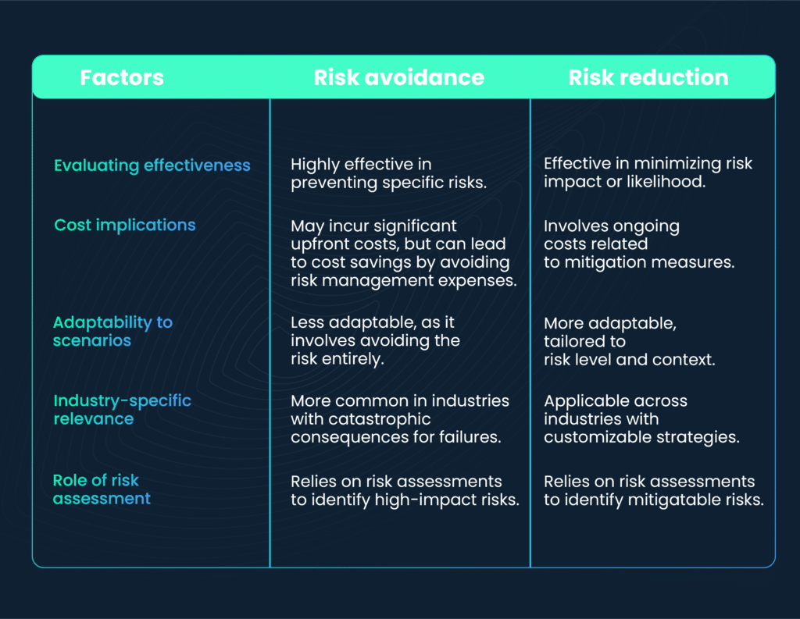

In today's rapidly evolving financial landscape, algorithmic trading, commonly known as algo trading, has emerged as a fundamental tool for traders aiming to enhance the efficiency of their strategies and optimize returns. Characterized by the use of complex algorithms and high-speed data processing, algo trading allows market participants to execute trades at speeds and frequencies that are impossible to achieve manually. Despite these advantages, the accelerated pace and complexity introduced by algorithmic systems necessitate a stringent focus on risk management, risk reduction, and risk avoidance to ensure a secure trading environment.

Effective risk management is not merely an adjunct to trading strategies; it is essential for containing and managing potential losses. With the high-speed executions and complex strategies involved in algo trading, a robust framework for risk management is crucial. Maintaining this framework requires the use of advanced technology and data analytics to predict, monitor, and manage potential risks efficiently. Tools such as backtesting and stress testing are indispensable in developing and refining resilient trading algorithms. These practices enable traders to assess how their strategies might perform under various market conditions before actual deployment.



Risk reduction techniques in algo trading are aimed at minimizing the adverse impacts that might arise from trading decisions. Strategies such as diversification, position sizing, and hedging are indispensable for minimizing exposure to potential losses and are intricately woven into algorithmic systems. Algorithms can be programmed to adapt to changing market dynamics, automatically adjusting trades to mitigate risks as they are identified.

Moreover, risk avoidance strategies focus on sidestepping potential losses before they materialize. This involves developing algorithms that can identify and steer clear of high-risk markets or instruments characterized by volatility or unclear trends. By leveraging data-driven insights to identify and avoid high-risk trading environments and assets, traders can effectively mitigate their risk exposure.

The integration of cutting-edge technology plays a pivotal role in enhancing risk management, reduction, and avoidance in algo trading. Technologies such as artificial intelligence, machine learning, blockchain, and cloud computing are revolutionizing the way risks are anticipated, quantified, and managed. These technological advancements offer unprecedented opportunities for traders to predict and respond to risks with increased precision.

Understanding and effectively applying these concepts, methodologies, and tools is crucial for both novice and experienced traders aiming for sustainable success in algo trading. By maintaining an informed and proactive approach to risk, traders can significantly enhance the safety and profitability of their trading activities, securing a competitive edge in the volatile financial markets.

## Table of Contents

## Understanding Risk Management in Algo Trading

Risk management is vital in [algorithmic trading](/wiki/algorithmic-trading), serving as a safeguard to prevent significant financial losses while optimizing the potential for gains within the parameters of high-speed execution and complex strategies. The increasing reliance on algo trading in financial markets demands structured methodologies to effectively manage associated risks.

A crucial element of risk management in algo trading involves using advanced technology and data analytics. This integration enables the prediction and management of potential risks by leveraging historical and real-time data. Predictive analytics and [machine learning](/wiki/machine-learning) models can assess various risk factors, providing insights that inform trading decisions. For instance, machine learning algorithms can predict market trends and price movements, allowing traders to anticipate and mitigate potential adverse effects before they materialize.

Backtesting and stress testing are essential practices in developing resilient trading algorithms. Backtesting involves simulating a trading algorithm using historical market data to evaluate its performance and reliability under different conditions. It helps identify potential flaws and optimize the algorithm's parameters for real-world application. Stress testing, on the other hand, assesses how trading strategies perform under extreme market scenarios, such as financial crises or sudden market spikes, ensuring that algorithms can withstand volatile conditions.

To further bolster risk management efforts in algorithmic trading, the integration of stop-loss orders and other protective measures is imperative. A stop-loss order is an automated instruction to sell a security when its price falls to a predetermined level, minimizing potential losses in unexpected market downturns. For example, in Python, a basic implementation might involve setting a threshold price for a stop-loss order, as illustrated below:

```python
def execute_stop_loss(current_price, stop_loss_price):
    if current_price <= stop_loss_price:
        return "Sell order executed"
    return "Hold position"
```

In addition to stop-loss orders, other strategies like take-profit orders, which secure gains when a security reaches a target price, can provide comprehensive protection against unforeseen market fluctuations.

In conclusion, effective risk management in algorithmic trading relies on a combination of technological advancements, thorough testing, and strategic protective measures. These elements collectively contribute to minimizing potential losses and enhancing the resilience and profitability of trading operations. Identifying and addressing risks proactively equips traders with the ability to navigate the complexities of modern financial markets efficiently.

## Risk Reduction Techniques in Algorithmic Trading

Risk reduction focuses on minimizing the potential negative impacts of trading decisions. In algorithmic trading, this involves using various techniques such as diversification, position sizing, and hedging to effectively manage risk.

Diversification is a fundamental risk reduction strategy that involves spreading investments across different assets or trading strategies. This approach reduces the reliance on a single strategy or asset, thus minimizing risk exposure to specific market movements. In algorithmic trading, diversification can be implemented by designing algorithms that execute trades across various markets, sectors, or asset classes. This technique helps in mitigating the impact of a poor performance in one area with potential gains in another.

Position sizing is another critical component of risk reduction. It determines how much capital to allocate to each trade or investment. Proper position sizing helps ensure that no single trade can have too significant an impact on the overall portfolio. Algorithms can be programmed to dynamically adjust position sizes based on the [volatility](/wiki/volatility-trading-strategies) of the traded asset, the risk appetite of the trader, or prevailing market conditions. By doing so, traders can limit the potential losses while still remaining exposed to profitable opportunities.

Hedging is a strategy that involves taking an offsetting position to reduce the risk of adverse price movements. In algorithmic trading, hedging can be achieved through various instruments such as futures, options, or swaps. For instance, an algorithm might initiate a protective put option to guard against a potential drop in the price of a held stock. This offsets the losses from the primary position with gains from the hedge, thereby reducing the overall risk.

Algorithms can also be programmed to automatically adjust trades in response to changing risk factors. This adaptive approach involves the use of data analytics and machine learning techniques to monitor market conditions in real time and modify trading parameters accordingly. For example, Python code employing machine learning techniques such as [reinforcement learning](/wiki/reinforcement-learning) can be used to develop adaptive trading algorithms. These algorithms learn from historical data and continuously improve their performance by optimizing trading decisions in real time. A simple example of such an algorithm might involve:

```python
import numpy as np

class AdaptiveAlgo:
    def __init__(self, initial_balance):
        self.balance = initial_balance

    def decision(self, market_trend):
        if market_trend == 'bullish':
            self.allocate_funds(0.2)
        elif market_trend == 'bearish':
            self.hedge_position(0.1)

    def allocate_funds(self, proportion):
        # Logic to allocate funds proportionally
        pass

    def hedge_position(self, proportion):
        # Logic to implement hedging strategy
        pass

# Market condition analysis and algorithm adjustment
current_trend = 'bullish'  # Example, could be computed based on market data
algo = AdaptiveAlgo(100000)  # Start with an initial balance
algo.decision(current_trend)
```

Real-world examples demonstrate the effectiveness of risk reduction techniques in achieving a steadier and potentially more profitable trading outcome. For instance, during market turbulence, a diversified portfolio can maintain a more stable performance compared to a concentrated investment strategy. Likewise, dynamic position sizing can prevent excessive losses during volatile periods, while effective hedging can protect against unexpected market downturns. By combining these techniques, traders can build a resilient algorithmic trading strategy that balances risk and reward.

## Implementing Risk Avoidance Strategies

While risk cannot be wholly eliminated, risk avoidance strategies in algorithmic trading are designed to proactively circumvent potential losses. The development of advanced algorithms plays a crucial role in this endeavor by steering clear of volatile markets or instruments with unclear trends. This approach relies on a thorough analysis of market volatility and trend patterns to minimize exposure to high-risk scenarios.

Data-driven insights are pivotal in identifying and avoiding high-risk trading environments and assets. Traders use sophisticated data analytics tools to process vast amounts of market data, enabling them to detect early warning signs of volatility and assess the stability of trading instruments. These analytics tools make use of historical and real-time data to inform decisions, allowing algorithms to dynamically adjust their trading strategies based on changing market conditions.

One common risk avoidance strategy involves avoiding low-[liquidity](/wiki/liquidity-risk-premium) stocks since these stocks can lead to significant losses due to their potential for sharp price swings and large bid-ask spreads. By focusing on high-liquidity stocks, traders can ensure smoother trade execution and minimize the impact of market volatility on their portfolios.

Additionally, avoiding [arbitrage](/wiki/arbitrage) opportunities with high-risk potential is another prudent strategy. Although arbitrage can offer lucrative returns, it often involves significant risks due to potential market inefficiencies and transaction delays. Traders can use risk metrics such as the Sharpe Ratio or Value at Risk (VaR) to assess the risk-return profile of arbitrage strategies and decide whether they align with their risk tolerance levels.

For example, consider a simple Python algorithm to assess and avoid risk-prone stocks:

```python
import pandas as pd

def assess_liquidity(stock_data):
    """
    Function to assess stock liquidity based on average trading [volume](/wiki/volume-trading-strategy).
    A lower threshold (e.g., below 100k shares per day) indicates low liquidity.
    """
    avg_volume = stock_data['Volume'].mean()
    threshold = 100000  # example threshold for low-liquidity stocks
    return avg_volume > threshold

def avoid_volatile_stocks(stock_data):
    """
    Function to measure volatility using standard deviation of returns.
    Stocks with high volatility (e.g., stddev above a certain level) are marked as risky.
    """
    stock_data['Returns'] = stock_data['Price'].pct_change()
    volatility = stock_data['Returns'].std()
    threshold = 0.02  # example threshold for high volatility
    return volatility < threshold

# Example data
data = {'Price': [100, 102, 101, 105, 103], 'Volume': [120000, 110000, 115000, 130000, 125000]}
stock_data = pd.DataFrame(data)

if assess_liquidity(stock_data) and avoid_volatile_stocks(stock_data):
    print("Stock is suitable for trading.")
else:
    print("Avoid high-risk stock.")
```

This algorithm evaluates stock data to identify potential risks based on liquidity and volatility metrics, demonstrating a practical risk avoidance technique deployed in algorithmic trading. For traders, continuous adaptation of these strategies in line with emerging market data helps in maintaining a resilient trading posture.

## The Role of Technology in Enhancing Risk Techniques

Technology plays a pivotal role in advancing risk management, reduction, and avoidance in algorithmic trading. The utilization of advanced technological tools and methodologies has enhanced precision and efficiency in managing trading risks, ensuring more secure and profitable trading environments.

Artificial intelligence (AI) and machine learning (ML) have become indispensable in predicting and mitigating risks with heightened accuracy. These technologies allow for the development of sophisticated algorithms that can analyze vast amounts of market data in real time. By employing techniques such as neural networks and decision trees, AI can identify patterns and trends that are not immediately apparent to human traders. For instance, reinforcement learning, a subset of ML, enables trading algorithms to adapt to changing market conditions by learning from historical data and evolving accordingly. This adaptability significantly reduces potential losses by adjusting trading strategies in response to emerging risks.

Blockchain technology is transforming transparency and security in trading transactions. Blockchain provides a decentralized ledger system that ensures all trading activities are recorded immutably and transparently. This transparency is crucial for risk management, as it allows traders and financial institutions to verify transactions and scrutinize trading patterns. The secured nature of blockchain minimizes the risk of fraud and unauthorized access, safeguarding trading data and bolstering confidence in automated trading systems.

Cloud computing has also made a substantial impact by enabling real-time risk analysis and supporting decision-making systems. The scalability and computational power of cloud platforms facilitate the processing of large datasets necessary for analyzing market trends and assessing risks. Cloud-based solutions offer flexibility and speed, allowing traders to access cutting-edge analytics tools anywhere and respond swiftly to market changes. The integration of cloud computing with AI-driven analytics supports the continuous monitoring and evaluation of risk factors, leading to more informed and timely trading decisions.

Staying informed about the latest technological advancements is crucial for maintaining competitiveness and security in algorithmic trading. As technology continues to evolve, it is imperative for traders and financial institutions to integrate state-of-the-art solutions into their trading strategies. By leveraging AI, blockchain, and cloud computing, traders can optimize their risk management practices and enhance the overall effectiveness of their trading operations.

## Conclusion

Effective risk management, reduction, and avoidance are critical components of successful algorithmic trading strategies. By diligently implementing these techniques, traders can not only safeguard their investments but also enhance the profitability and reliability of their trades. The advancement and integration of technology have opened new horizons for algo traders to manage risks more effectively. Artificial intelligence and machine learning algorithms, for example, can analyze vast datasets to predict market trends and identify potential risks with heightened accuracy.

The continuously evolving nature of financial markets necessitates a rigorous and ongoing evaluation of risk strategies. This dynamic landscape requires traders to adapt and refine their approaches consistently. Implementing a sound risk management framework allows traders to anticipate potential market disruptions and adjust their strategies accordingly, thus minimizing exposure to unwarranted risks.

Furthermore, the fusion of cutting-edge technology with established risk management practices signifies a promising trajectory for algorithmic trading. Technologies such as blockchain enhance transparency and security in transactions, while cloud computing facilitates real-time risk assessment and decision-making processes. For algo traders, remaining competitive means staying informed about these technological trends and incorporating them into their operations.

Ultimately, adopting a proactive and informed approach to risk has the potential to provide traders with a significant competitive advantage. This approach not only supports the preservation of capital but also contributes to achieving sustained trading success in volatile and unpredictable financial environments. Achieving a balance between technology-driven insights and robust risk management frameworks will continue to play a vital role in shaping the future of algorithmic trading.

## References & Further Reading

[1]: Bergstra, J., Bardenet, R., Bengio, Y., & Kégl, B. (2011). ["Algorithms for Hyper-Parameter Optimization."](https://dl.acm.org/doi/10.5555/2986459.2986743) Advances in Neural Information Processing Systems 24.

[2]: ["Advances in Financial Machine Learning"](https://www.amazon.com/Advances-Financial-Machine-Learning-Marcos/dp/1119482089) by Marcos Lopez de Prado

[3]: ["Evidence-Based Technical Analysis: Applying the Scientific Method and Statistical Inference to Trading Signals"](https://www.amazon.com/Evidence-Based-Technical-Analysis-Scientific-Statistical/dp/0470008741) by David Aronson

[4]: ["Machine Learning for Algorithmic Trading"](https://github.com/stefan-jansen/machine-learning-for-trading) by Stefan Jansen

[5]: ["Quantitative Trading: How to Build Your Own Algorithmic Trading Business"](https://www.amazon.com/Quantitative-Trading-Build-Algorithmic-Business/dp/1119800064) by Ernest P. Chan