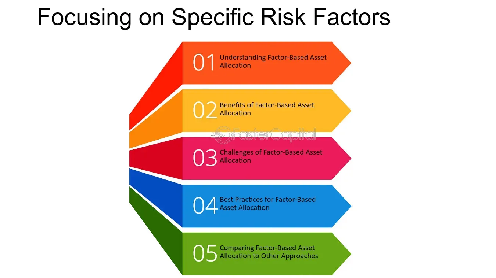

## Table of Contents

## What is risk-based asset allocation?

Risk-based asset allocation is a way of deciding how to spread your money across different types of investments. Instead of focusing on how much money you might make, it looks at how much risk you're willing to take. Everyone has a different comfort level with risk, so this method helps you pick investments that match how much risk you can handle. For example, if you don't like taking big risks, you might put more money into safer investments like bonds rather than stocks.

This approach can help you build a balanced investment portfolio. By understanding your risk tolerance, you can choose a mix of investments that won't keep you up at night worrying about losing money. It's about finding a balance that lets you feel secure while still giving your money a chance to grow. Risk-based asset allocation is useful because it helps you make smart choices based on what you're comfortable with, rather than trying to chase high returns that might be too risky for you.

## Why is risk important in asset allocation?

Risk is important in asset allocation because it helps you figure out how to spread your money in a way that feels safe for you. When you know how much risk you're okay with, you can pick investments that match that level. If you're scared of losing a lot of money, you might choose safer options like savings accounts or bonds. But if you're okay with the chance of losing some money for the possibility of making more, you might go for riskier investments like stocks or real estate.

Understanding risk also helps you keep your emotions in check. Investing can be stressful, and if you put your money into something that's too risky for you, you might panic and make bad decisions. By choosing investments that fit your risk level, you can feel more calm and confident. This way, you're less likely to sell everything in a hurry when the market goes down, which can help you stick to your long-term plan and do better over time.

## What are the basic principles of risk-based asset allocation?

Risk-based asset allocation is all about figuring out how much risk you're okay with and then [picking](/wiki/asset-class-picking) your investments based on that. Everyone is different when it comes to risk. Some people don't mind if their money goes up and down a lot, while others want to keep things steady. By knowing your own risk level, you can choose investments that won't make you too worried or stressed out. For example, if you're not comfortable with big swings in your money, you might put more into safe things like savings accounts or government bonds.

The other important part of risk-based asset allocation is balancing your investments so they match your risk level. This means spreading your money across different types of investments, like stocks, bonds, and maybe even real estate. By doing this, you can make sure that if one type of investment does badly, the others might still be doing okay. This helps protect your money and can make you feel more secure. It's all about finding a mix that lets you sleep at night while still giving your money a chance to grow over time.

## How does risk-based asset allocation differ from traditional methods?

Risk-based asset allocation and traditional methods of investing look at things differently. Traditional methods often focus on how much money you might make, trying to find the best investments that could give you the highest returns. They might look at things like how the economy is doing, what industries are growing, or what stocks are popular. This can lead to putting a lot of money into things that seem like they'll make a lot of money, but they can also be very risky.

On the other hand, risk-based asset allocation starts by figuring out how much risk you're okay with. Instead of chasing high returns, it's about finding a balance that feels safe for you. This method looks at your comfort level with risk and then picks investments that match that level. So, if you don't like taking big chances, you might end up with more in safe investments like bonds. This way, you can feel more secure and less worried about your money going up and down a lot.

Both methods have their place, but risk-based asset allocation is more about protecting you from feeling too stressed about your investments. It helps you build a portfolio that you can stick with over the long term, even when the market gets bumpy. Traditional methods might give you higher returns if you pick the right investments, but they can also lead to bigger losses and more stress if things don't go as planned.

## What are some common risk-based asset allocation strategies?

One common risk-based asset allocation strategy is called the risk parity approach. This strategy tries to balance the risk across different types of investments. Instead of putting most of your money into stocks because they might grow a lot, you spread it out so that each type of investment carries about the same amount of risk. For example, you might put some money into stocks, some into bonds, and some into other things like real estate. The idea is to make sure that if one type of investment does badly, the others can help balance it out, so your overall risk stays the same.

Another strategy is called the minimum volatility approach. This one focuses on picking investments that don't go up and down a lot. The goal is to keep your money as steady as possible. You might choose more bonds and fewer stocks because bonds usually don't change in value as much as stocks do. This can be good if you don't like big swings in your money and want to feel more secure.

A third strategy is the target risk approach. With this method, you decide on a specific level of risk you're comfortable with, like low, medium, or high. Then, you pick investments that match that risk level. For example, if you choose a low-risk level, you might put most of your money into safe things like savings accounts or government bonds. If you go for a high-risk level, you might put more into stocks or other investments that could grow a lot but also might lose value. This way, you can keep your investments in line with how much risk you're okay with.

## How can risk tolerance be assessed for asset allocation?

To figure out your risk tolerance for asset allocation, you need to think about how you feel about losing money and how much you can handle. One way to do this is by taking a risk tolerance questionnaire. These questionnaires ask you questions like how you would react if your investments lost value, or how much money you can afford to lose without it affecting your life too much. The answers help you see if you're okay with taking big risks, or if you prefer to keep things safe and steady.

Another way to assess your risk tolerance is by looking at your past experiences with money. If you've invested before, think about how you felt during times when the market went down. Did you panic and sell everything, or were you able to stay calm and stick with your plan? Your reactions can tell you a lot about your comfort level with risk. Talking to a financial advisor can also help. They can ask you questions and use their experience to help you figure out the right level of risk for your investments.

## What role does diversification play in risk-based asset allocation?

Diversification is a big part of risk-based asset allocation. It means spreading your money across different types of investments. When you diversify, you don't put all your money into just one thing. Instead, you might put some into stocks, some into bonds, and maybe some into real estate. This helps lower your risk because if one type of investment does badly, the others might still be doing okay. For example, if the stock market goes down, your bonds might stay steady or even go up, which can help balance things out.

By diversifying, you can make your investments match your comfort level with risk. If you don't like taking big chances, you can put more money into safer investments like bonds. But if you're okay with more risk, you might put more into stocks. Diversification helps you build a portfolio that feels right for you. It's like having a safety net that can help you feel more secure about your money, even when the market gets bumpy.

## How do you implement a risk parity approach in asset allocation?

To implement a risk parity approach in asset allocation, you start by figuring out how much risk each type of investment carries. Instead of focusing on how much money you might make, you look at how much each investment could go up or down. You then spread your money across different investments so that each one contributes about the same amount of risk to your overall portfolio. For example, if stocks are riskier than bonds, you might put less money into stocks and more into bonds to balance things out. The goal is to make sure that the risk from each part of your portfolio is equal, so if one type of investment does badly, the others can help keep things steady.

Once you've figured out how to balance the risk, you need to keep an eye on your investments and make changes when needed. Markets change, and the risk levels of different investments can go up or down over time. You might need to adjust how much money you have in stocks, bonds, or other things to keep the risk balanced. This can mean selling some of one type of investment and buying more of another. By doing this, you can stick to your risk parity approach and keep your portfolio in line with how much risk you're okay with.

## What are the advantages and disadvantages of using a risk-based approach?

Using a risk-based approach to asset allocation has some big advantages. It helps you pick investments that match how much risk you're okay with. This way, you can feel more secure about your money and less worried about big ups and downs. It also helps you stick to your plan even when the market gets bumpy. By spreading your money across different types of investments, you can lower your risk and protect your money better. This approach is good because it focuses on what's important to you, rather than just trying to make as much money as possible.

But there are also some downsides to using a risk-based approach. It can be hard to figure out exactly how much risk you're okay with, and it might change over time. This means you need to keep checking and changing your investments, which can take a lot of work. Also, focusing too much on risk might mean you miss out on some investments that could grow a lot. If you're too worried about risk, you might end up with a portfolio that doesn't grow as much as it could. So, while a risk-based approach can help you feel more secure, it's important to think about whether it might limit your chances to make more money.

## How can advanced statistical methods enhance risk-based asset allocation?

Advanced statistical methods can make risk-based asset allocation better by helping you understand and predict how much risk you're taking. These methods can look at a lot of data from the past to figure out how different investments move together. By using tools like regression analysis or [machine learning](/wiki/machine-learning), you can see which investments might go up or down at the same time. This helps you spread your money in a way that lowers your overall risk. For example, if you know that stocks and bonds usually don't move together, you can put money into both to balance things out. These methods also help you find the best mix of investments for your risk level, so you can feel more secure about your money.

Another way advanced statistical methods help is by making it easier to keep your portfolio in line with your risk level. As markets change, the risk of your investments can change too. By using these methods, you can keep an eye on your investments and make changes when needed. For example, if stocks start to get riskier, you might need to put more money into bonds to keep your overall risk the same. These tools can also help you test different scenarios to see how your investments might do in the future. This way, you can make smart choices and adjust your plan to make sure it still matches how much risk you're okay with.

## What are the latest trends in risk-based asset allocation research?

The latest trends in risk-based asset allocation research are focusing a lot on using new technology and data to make better decisions. One big trend is using machine learning and [artificial intelligence](/wiki/ai-artificial-intelligence) to predict how investments will do. These tools can look at a huge amount of data from the past to find patterns that might be hard for people to see. By using this information, researchers can figure out how to spread your money across different investments in a way that matches your risk level even better. Another trend is using more real-time data to make quick changes to your investments. This means you can adjust your portfolio faster when the market changes, which can help keep your risk level steady.

Another trend is looking at how different risks affect each other. This is called multi-factor risk modeling. Researchers are trying to understand how things like interest rates, inflation, and global events can impact your investments all at once. By figuring this out, they can help you build a portfolio that is more protected against these different risks. Also, there's more focus on how people feel about risk and how that can change over time. Researchers are studying how emotions and life events can affect your risk tolerance, so they can help you make choices that feel right for you, even when things get stressful.

## How can risk-based asset allocation be optimized for different market conditions?

Risk-based asset allocation can be optimized for different market conditions by keeping a close eye on what's happening in the market and adjusting your investments accordingly. If the market is doing well and stocks are growing, you might want to put more money into stocks to take advantage of the good times. But if the market starts to go down and things get risky, you might want to move some of your money into safer investments like bonds. By using real-time data and advanced tools, you can make these changes quickly and keep your risk level steady, no matter what the market is doing.

Another way to optimize risk-based asset allocation is by understanding how different types of risks affect each other. For example, if interest rates go up, that can make stocks go down and bonds go up. By knowing these relationships, you can adjust your investments to balance out the risks. Also, it's important to think about how your feelings about risk might change when the market gets bumpy. If you start to feel more worried, you might need to shift your investments to feel more secure. By staying flexible and making smart changes, you can keep your portfolio in line with your risk level, even when the market changes.

## What is Exploring Risk-Based Asset Allocation?

Risk-based asset allocation is a strategic approach that allocates assets based on their respective risk profiles. This methodology is designed to balance portfolio resilience against market [volatility](/wiki/volatility-trading-strategies) while targeting desired returns. By focusing on risk rather than expected returns, investors aim to achieve a more stable investment performance across various market conditions.

The core of risk-based asset allocation rests on identifying and analyzing risk exposures across different asset classes. Such analysis involves understanding each asset's volatility, correlation with other assets, and overall contribution to portfolio risk. For instance, assets are often assessed using statistical measures such as standard deviation and beta. Standard deviation quantifies how much returns can deviate from the average return, whereas beta measures an asset's volatility relative to the market. Mathematically, the variance of a portfolio's return, $\sigma^2_p$, can be expressed as:

$$
\sigma^2_p = \sum_{i=1}^{n} \sum_{j=1}^{n} w_i w_j \sigma_i \sigma_j \rho_{ij}
$$

Where $w_i$ and $w_j$ are the weights of assets $i$ and $j$ in the portfolio, $\sigma_i$ and $\sigma_j$ are the standard deviations of the assets, and $\rho_{ij}$ is the correlation coefficient between the assets.

An essential aspect of risk-based allocation is the implementation of quantitative models that align the proportions of asset classes with an investor's risk tolerance. Risk parity is a popular model often used in this context, where the portfolio is structured so that each asset class contributes equally to the portfolio's overall risk. The aim is to prevent any single asset from disproportionately influencing the portfolio's performance.

These quantitative approaches help address the trade-off between risk and reward. Investors can use Python libraries such as NumPy or pandas to model and simulate various allocation scenarios, adjusting asset weights in alignment with risk tolerance. This way, they maintain exposure to growth opportunities while mitigating potential downsides.

Effective risk-based allocation requires continuous monitoring and adjustment of the asset mix as market conditions evolve. By regularly assessing the risk exposures and recalibrating the portfolio when necessary, investors can better withstand market turbulence and ensure that their investments remain on track to achieve long-term financial goals.

## What is Real-time Data Processing in Algorithmic Trading?

Processing real-time data is critical in [algorithmic trading](/wiki/algorithmic-trading), as it allows traders to maintain a competitive edge by ensuring precise timing for market entries and exits. Python, a versatile programming language, offers a range of libraries such as Pandas, NumPy, and SciPy, tailored for the efficient handling and analysis of real-time trading data. These tools facilitate the swift computation of large datasets, enabling traders to identify market trends and make immediate, informed decisions.

One common methodology in real-time data analysis is the implementation of moving averages. Moving averages are used to smooth out price data over a specified period, helping to identify trends by filtering out short-term fluctuations. The formula for a simple moving average (SMA) is expressed as:

$$
\text{SMA} = \frac{\sum_{i=1}^{N} P_i}{N}
$$

where $P_i$ is the price at time $i$, and $N$ is the number of time periods.

Volatility indices, another essential tool, help measure price movement variability and assess market intensity. For example, the standard deviation of price changes can serve as a direct quantifier of volatility.

Python's data visualization capabilities, through libraries like Matplotlib and Seaborn, enhance the ability to detect and respond to market shifts visually. Visualization aids in understanding complex datasets, thus supporting timely adjustments to trading strategies. For instance, plotting price movements against moving averages can provide visual cues on potential buy or sell signals.

By efficiently processing and visualizing real-time data, algorithmic trading systems can dynamically adapt to evolving market conditions, thus ensuring optimized trade execution and enhanced market timing accuracy. These methods contribute to a robust trading strategy, leveraging the power of immediate data analysis.

## How can one implement risk management strategies?

Risk management in trading is a critical component designed to limit potential financial losses by employing various strategies. A key element of this is volatility analysis, which allows traders to identify and quantify the degree of risk in their portfolios. Volatility, often quantified by the standard deviation of returns, is a vital metric as it signals how much a security's price might change over a given period. The formula for calculating the standard deviation $\sigma$ of returns is:

$$
\sigma = \sqrt{\frac{1}{N-1} \sum_{i=1}^{N} (r_i - \bar{r})^2}
$$

where $N$ is the number of data points, $r_i$ is the individual return, and $\bar{r}$ is the average return. Understanding volatility can guide not only the allocation but also specific trading actions—helping traders to choose when to enter or exit positions.

Stop-loss orders are another integral part of managing trading risks. These orders automatically sell a security when it reaches a certain price, capping potential losses and letting traders adhere to a disciplined investment strategy even amidst fluctuating markets.

Furthermore, diversification is an age-old strategy to mitigate risk. By spreading investments across various asset classes, sectors, or geographies, a portfolio can be protected against market downturns that affect individual assets or markets disproportionately. The correlation between assets is a crucial [factor](/wiki/factor-investing) in diversification; ideally, assets should have low or negative correlation to achieve effective risk reduction.

Integrating these risk management strategies into algorithmic trading can maintain a balanced risk-return ratio. Tools and programming languages like Python play a pivotal role in this integration due to their capacity to handle complex data analysis and automation tasks. Python’s libraries, such as NumPy and pandas for data manipulation and analysis, and SciPy for statistical computations, can be utilized to develop sophisticated strategies. 

For example, the following Python code demonstrates how to compute the moving average of price data, which can be part of a broader risk management algorithm:

```python
import pandas as pd

# Assume 'data' is a pandas DataFrame with a 'price' column
data['moving_average'] = data['price'].rolling(window=20).mean()

# Plotting the moving average
data[['price', 'moving_average']].plot()
```

By automating these calculations and visualizations, traders can promptly detect shifts in market volatility and adapt strategies in real-time.

Thus, incorporating risk management protocols within algorithmic trading frameworks ensures traders can navigate volatile markets effectively. This ongoing assessment and real-time reaction capability provided by modern computational tools like Python is indispensable for maintaining investment stability and achieving desired financial outcomes.

## References & Further Reading

[1]: ["Advances in Financial Machine Learning"](https://www.amazon.com/Advances-Financial-Machine-Learning-Marcos/dp/1119482089) by Marcos Lopez de Prado

[2]: ["Machine Learning for Algorithmic Trading"](https://github.com/stefan-jansen/machine-learning-for-trading) by Stefan Jansen

[3]: ["Quantitative Trading: How to Build Your Own Algorithmic Trading Business"](https://books.google.com/books/about/Quantitative_Trading.html?id=j70yEAAAQBAJ) by Ernest P. Chan

[4]: ["Evidence-Based Technical Analysis: Applying the Scientific Method and Statistical Inference to Trading Signals"](https://www.amazon.com/Evidence-Based-Technical-Analysis-Scientific-Statistical/dp/0470008741) by David Aronson

[5]: Bergstra, J., Bardenet, R., Bengio, Y., & Kégl, B. (2011). ["Algorithms for Hyper-Parameter Optimization,"](https://dl.acm.org/doi/10.5555/2986459.2986743) Advances in Neural Information Processing Systems 24.