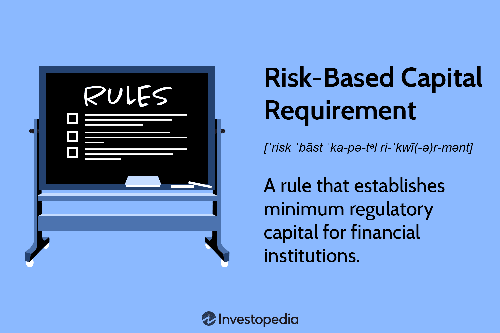

## Table of Contents

## What is risk-based capital requirement?

Risk-based capital requirement is a rule that tells banks and insurance companies how much money they need to keep as a safety net. This money is called capital, and it helps protect the company if things go wrong, like if people can't pay back their loans or if there's a big disaster. The amount of capital a company needs depends on how risky its business is. If a company does riskier things, it has to keep more money in reserve.

The idea behind risk-based capital is to make sure that financial companies are strong enough to handle problems without going bankrupt. Regulators, who are like supervisors for these companies, set these rules to keep the financial system safe. By making companies hold more capital for riskier activities, regulators hope to prevent big financial crises. This way, even if something bad happens, the company can still pay its bills and keep running.

## Why is risk-based capital important for financial institutions?

Risk-based capital is important for financial institutions because it helps them stay safe and strong. Imagine a bank like a big ship sailing through the ocean. The ocean can be calm, but sometimes there are big storms. Risk-based capital is like having enough lifeboats and safety equipment on the ship. If the bank takes on more risky loans or investments, it's like sailing into stormier waters, so it needs more lifeboats. This way, if something goes wrong, the bank can still keep going without sinking.

Regulators set these rules to make sure banks and insurance companies don't take too many risks. By requiring more capital for riskier activities, they help prevent big financial problems that could hurt the whole economy. If a bank has enough capital, it can handle losses from loans that aren't paid back or other unexpected events. This makes the financial system more stable and protects people who have money in banks or buy insurance. So, risk-based capital is a key part of keeping the financial world safe and trustworthy.

## How does risk-based capital requirement differ from other capital requirements?

Risk-based capital requirement is different from other capital requirements because it looks at how risky a bank's activities are. Other types of capital requirements might just say a bank needs to keep a certain amount of money, no matter what it does. But risk-based capital says, "If you do riskier things, you need to keep more money as a safety net." So, a bank that gives out a lot of risky loans will need more capital than a bank that only does safe things.

This difference is important because it makes banks think more carefully about the risks they take. With risk-based capital, banks have to plan better and maybe choose safer activities if they don't want to keep a lot of extra money. Other capital requirements don't change based on what the bank does, so they might not stop a bank from taking big risks. By making banks keep more money for riskier actions, risk-based capital helps keep the whole financial system safer and more stable.

## What are the main components involved in calculating risk-based capital?

Calculating risk-based capital involves looking at different kinds of risks that a bank or insurance company faces. The main components are credit risk, which is the risk that people won't pay back their loans; market risk, which is the risk that the value of investments will go down; and operational risk, which is the risk of losses from things like fraud or mistakes in the company's operations. Each of these risks is measured and then used to figure out how much capital the company needs to keep as a safety net.

To calculate the capital needed for credit risk, banks look at how likely it is that borrowers will default on their loans and how much money they might lose if that happens. For market risk, they consider how much their investments could lose value if the market goes down. Operational risk is trickier to measure, but banks use past data and models to estimate how much they might lose from operational problems. By adding up the capital needed for all these risks, the company can find out its total risk-based capital requirement.

## Can you explain the concept of risk weighting in the context of capital requirements?

Risk weighting is a way to figure out how much money a bank needs to keep as a safety net based on how risky its activities are. Imagine a bank gives out loans. Some loans are safer, like ones to people with good jobs and steady income. Other loans are riskier, like ones to businesses that might not make it. Risk weighting means the bank has to keep more money for the riskier loans. It's like saying, "If you want to take bigger chances, you need a bigger safety net."

Regulators use risk weights to decide how much capital a bank needs. They give different activities different weights. Safe activities get low weights, so the bank doesn't need to keep much money for them. Risky activities get high weights, so the bank needs to keep more money. This way, banks are encouraged to be careful and not take too many risks. It helps keep the bank and the whole financial system stable and safe.

## What are the different tiers of capital under risk-based capital requirements?

Under risk-based capital requirements, banks have to keep different kinds of money, called capital, to protect themselves. This capital is divided into different tiers, like levels. Tier 1 capital is the most important and strongest kind. It includes money that the bank can easily use, like its own money from shareholders and some types of profits. This is the core money that helps the bank stay strong if things go wrong. Tier 2 capital is less important but still helpful. It includes things like some kinds of loans that can turn into money if needed, but they are not as strong as Tier 1 capital.

Tier 3 capital is sometimes used for specific risks, like trading risks, but it's not as common as Tier 1 and Tier 2. It includes even less strong kinds of money, like short-term loans. Regulators look at all these tiers to make sure banks have enough money to cover their risks. The idea is to have a mix of strong and less strong money so the bank can handle different kinds of problems. By having different tiers, banks can better manage their risks and keep the financial system safe.

## How is Tier 1 capital defined and calculated?

Tier 1 capital is the most important kind of money a bank needs to keep as a safety net. It's like the strongest part of a bank's financial armor. Tier 1 capital includes things like the money that shareholders put into the bank, which is called common equity, and some types of profits that the bank keeps instead of giving them out as dividends. This kind of capital is really important because it's the money that the bank can use right away if something goes wrong. It's the core strength of the bank.

To calculate Tier 1 capital, you add up the common equity, which is the money from shareholders, and any other money that counts as Tier 1, like some profits that the bank has kept. Then, you take away things like goodwill, which is the value of a company's reputation or brand, because that's not money the bank can use right away. The final number is the bank's Tier 1 capital. Regulators look at this number to make sure the bank has enough strong money to handle risks and stay safe.

## What constitutes Tier 2 capital and how is it calculated?

Tier 2 capital is the second level of money a bank needs to keep as a safety net. It's not as strong as Tier 1 capital but still helps the bank stay safe. Tier 2 capital includes things like some kinds of loans that can turn into money if needed, called subordinated debt. It also includes some money set aside for losses that haven't happened yet, called loan loss reserves. These are not as strong as Tier 1 capital because they might not be as easy to use right away if the bank needs them.

To calculate Tier 2 capital, you add up the money from subordinated debt and the loan loss reserves. But there's a limit to how much of these can count as Tier 2 capital. For example, only a certain amount of loan loss reserves can be included. Once you add up these amounts and make sure they fit within the limits, you have the bank's Tier 2 capital. Regulators look at this number along with Tier 1 capital to make sure the bank has enough money to handle risks and stay strong.

## How do regulatory bodies like the Basel Committee influence risk-based capital requirements?

The Basel Committee on Banking Supervision is a group that helps make rules for banks all over the world. They want to make sure banks are safe and don't take too many risks. One of the big things they do is set rules for how much money banks need to keep as a safety net, called risk-based capital requirements. These rules say that banks should keep more money if they do riskier things. The Basel Committee works with countries to make sure these rules are followed, so banks everywhere are playing by the same safe standards.

The Basel Committee has made different sets of rules over time, like Basel I, Basel II, and Basel III. Each set tries to make the rules better and safer. For example, Basel III came after the big financial crisis in 2008 and made banks keep even more money to be safer. The Committee keeps updating these rules to make sure they work well with the changing world of banking. By setting these rules, the Basel Committee helps keep the whole financial system stable and protects people who use banks.

## What are the common challenges faced by banks when implementing risk-based capital requirements?

Banks face several challenges when they try to follow risk-based capital requirements. One big challenge is figuring out how risky their activities are. Banks have to use complicated math and models to guess how likely it is that people won't pay back their loans or that their investments will lose value. Getting these guesses right is hard, and if banks make mistakes, they might not keep enough money to stay safe. Another challenge is the cost. Keeping more money as a safety net means banks can't use that money for other things, like giving out more loans or investing in new projects. This can make it harder for banks to make money and grow.

Another challenge is dealing with all the rules and paperwork that come with risk-based capital requirements. Banks have to keep track of a lot of information and report it to regulators, which can take a lot of time and effort. They also need to have good systems and people in place to manage all this. If they don't, they might get in trouble with regulators or even face fines. On top of that, the rules can change over time, so banks have to keep updating their plans and systems to stay in line. All these challenges make it tough for banks to follow risk-based capital requirements, but it's important for keeping the financial system safe.

## How can a bank optimize its capital structure to meet risk-based capital requirements more efficiently?

A bank can optimize its capital structure to meet risk-based capital requirements more efficiently by focusing on its mix of Tier 1 and Tier 2 capital. Tier 1 capital, which includes money from shareholders and some profits, is the strongest kind of capital. Banks can try to increase this by raising more money from investors or keeping more of their profits instead of giving them out as dividends. By having more Tier 1 capital, banks can show regulators that they are strong and safe. They can also use less risky activities that need less capital, which helps them use their money more wisely.

Another way to optimize is by carefully managing Tier 2 capital, which includes things like certain loans and reserves for future losses. Banks can use these to add to their safety net without needing to raise more money from shareholders. They need to make sure they don't go over the limits on how much Tier 2 capital they can use. By balancing both types of capital well, banks can meet the rules without tying up too much money. This helps them stay safe and still have enough money to lend and invest, keeping their business running smoothly.

## What advanced methodologies are used for calculating risk-based capital in large financial institutions?

Large financial institutions use advanced methods to figure out their risk-based capital. One common method is the Internal Ratings-Based (IRB) approach. This method lets banks use their own data and models to guess how likely it is that people won't pay back their loans. Banks look at things like how much money people make, their credit history, and other signs to decide how risky a loan is. Then, they use these guesses to figure out how much money they need to keep as a safety net. This way, banks can be more accurate about their risks and keep just the right amount of money to stay safe.

Another advanced method is the Advanced Measurement Approach (AMA) for operational risk. This method helps banks guess how much money they might lose from things like fraud, mistakes, or other problems in their business. Banks use past data, their own models, and sometimes even outside experts to make these guesses. By understanding their operational risks better, banks can set aside the right amount of money to cover these risks. These advanced methods help large financial institutions meet risk-based capital requirements more accurately and efficiently, making sure they are ready for any problems that might come up.

## What are Risk-Based Capital Requirements?

Risk-based capital requirements are vital regulatory standards that financial institutions must adhere to, ensuring they maintain a minimum amount of capital aligned with the riskiness of their asset portfolios. These requirements are fundamental in safeguarding investors, clients, and the broader economy by acting as a financial cushion against potential losses. By compelling institutions to hold capital proportional to the risk they undertake, these regulations aim to foster a more resilient financial system.

The calculation of risk-based capital requirements typically involves assessing the risk-weighted assets (RWAs) of an institution. RWAs are computed by assigning a risk weight to each asset type based on its risk profile. Assets with higher credit risk, such as unsecured loans, receive a higher weight compared to less risky assets like government securities. The capital adequacy ratio (CAR) is then derived, which ensures that a bank's capital is sufficient to cover its RWAs. This ratio is calculated as:

$$
\text{CAR} = \frac{\text{Tier 1 Capital} + \text{Tier 2 Capital}}{\text{Risk-Weighted Assets}}
$$

To meet regulatory standards, banks must maintain a CAR above a specified minimum threshold, which varies by jurisdiction and regulatory framework.

The Basel III framework, developed by the Basel Committee on Banking Supervision, is a pivotal international standard that augments these risk-based capital requirements. Introduced in response to the financial crisis of 2007-2008, Basel III strengthens bank capital requirements through improved definitions, measurements, and a greater emphasis on [liquidity](/wiki/liquidity-risk-premium) and leverage. It introduces various components:

1. **Capital Adequacy**: Basel III increases the required minimum ratios of Tier 1 and Tier 2 capital to RWAs, ensuring banks are better capitalized.

2. **Stress Testing**: Institutions must conduct regular stress tests to evaluate their capital adequacy under adverse economic scenarios. This helps in assessing their ability to withstand financial shocks.

3. **Market Liquidity Risk**: Basel III implements two critical ratios—the Liquidity Coverage Ratio (LCR) and the Net Stable Funding Ratio (NSFR)—to ensure that banks hold sufficient high-quality liquid assets and maintain a stable funding profile, respectively.

These requirements ensure financial institutions remain solvent and are equipped to handle distress, thereby maintaining market confidence. Through adherence to these frameworks, institutions not only safeguard themselves but also contribute to the overall stability of the financial system.

The implications of these requirements are wide-ranging. For financial institutions, particularly those engaged in high-risk activities like [algorithmic trading](/wiki/algorithmic-trading), maintaining compliance with risk-based capital requirements necessitates careful capital management. It impacts their strategic decisions, influencing asset allocation, market activities, and overall risk appetite.

In summary, risk-based capital requirements form the backbone of financial regulation, ensuring institutions are resilient to risks and capable of supporting economic stability. Through frameworks like Basel III, these standards continue to evolve, reflecting the dynamic nature of global financial markets and the need for robust risk management practices.

## References & Further Reading

[1]: ["The Basel III Accord"](https://www.bis.org/bcbs/basel3.htm) - Bank for International Settlements

[2]: ["Advances in Financial Machine Learning"](https://www.amazon.com/Advances-Financial-Machine-Learning-Marcos/dp/1119482089) by Marcos Lopez de Prado

[3]: ["Algorithmic Trading: Winning Strategies and Their Rationale"](https://www.amazon.com/Algorithmic-Trading-Winning-Strategies-Rationale-ebook/dp/B00CY5HC0U) by Ernest P. Chan

[4]: Fabozzi, F. J., Focardi, S. M., & Kolm, P. N. (2010). ["Quantitative Equity Investing: Techniques and Strategies"](https://www.semanticscholar.org/paper/Quantitative-Equity-Investing%3A-Techniques-and-Fabozzi-Focardi/1c49a2a53919f7e65cb96f16691b8ff726fd3cd7)

[5]: ["Risk Management and Financial Institutions"](https://books.google.com/books/about/Risk_Management_and_Financial_Institutio.html?id=1J1QDwAAQBAJ) by John Hull