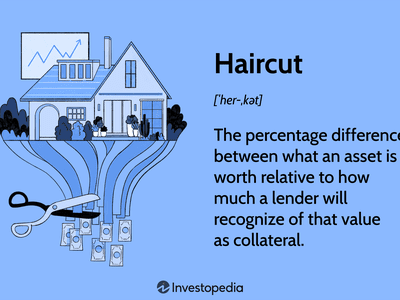

In the world of finance, understanding the nuances of collateral management and risk assessment is paramount. With the increasing complexity of financial markets, tools such as risk-based haircuts have become critical elements in maintaining market stability and mitigating potential losses. A risk-based haircut refers to a deliberate reduction in the recognized value of an asset used as collateral, particularly in environments susceptible to sharp market fluctuations. This practice is crucial in determining acceptable margins and managing financial leverage effectively.

Algorithmic (algo) trading, known for its reliance on speed and precision, has amplified the need for robust risk management techniques, including the use of risk-based haircuts. In this context, haircuts play a pivotal role by offering a cushion against the devaluation of assets, providing a safeguard for investors and lenders alike. By ensuring that asset values do not fall below their calculated thresholds, haircuts help minimize the risk of margin calls, which can lead to forced sales and market destabilization. 



This article explores the calculations involved in setting risk-based haircuts, the rationale behind their usage, and their broader implications on trading strategies. Through mathematical models and financial theories such as the Cox-Ross-Rubinstein and Black-Scholes methodologies, haircuts are quantitatively formulated to assess price volatility and determine necessary capital reserves. 

By examining real-world scenarios, including well-documented financial crises, readers will gain insights into the practical applications and lessons learned from adopting or neglecting risk-based haircuts. Ultimately, this article aims to provide a comprehensive understanding of how these financial mechanisms act as buffers in volatile markets, ensuring both lender and investor security in a rapidly evolving financial landscape.

## Table of Contents

## What Is a Risk-Based Haircut?

A risk-based haircut is a calculated reduction applied to the valuation of an asset when it is used as collateral in financial transactions. This reduction reflects the potential risk associated with the asset's market value fluctuations. By determining an acceptable margin or financial leverage, haircuts serve as a precautionary measure to shield investors and lenders from potential financial stress, such as margin calls, which occur when the collateral value falls below a required level.

The essential function of haircuts is to maintain a buffer against asset devaluation. The haircut percentage signifies the degree of reduction applied to the asset's market value to arrive at its collateral value. For instance, if an asset with a market value of $1,000 is given a 10% haircut, its recognized collateral value would be $900. This adjustment helps mitigate the risk of the asset's market value dropping below this collateral threshold.

Determining appropriate haircuts requires assessing several factors, such as the asset's [volatility](/wiki/volatility-trading-strategies), credit quality, and [liquidity](/wiki/liquidity-risk-premium). Volatile assets are subject to higher haircuts due to their unpredictable price movements. Similarly, assets with lower credit ratings or limited market liquidity may also face steeper haircuts. This assessment ensures that the collateral maintains a stable value relative to its market price, thus providing a financial safeguard for all parties involved in the transaction.

In summary, risk-based haircuts are crucial for mitigating the inherent risks associated with collateralized assets. By accounting for potential market value declines, these reductions play a pivotal role in preserving financial stability and protecting stakeholders from unexpected financial losses.

## Understanding Collateral Haircut in Finance

Collateral haircuts are a fundamental component of financial transactions involving lending and borrowing, serving to mitigate risks associated with fluctuations in asset values. By applying a haircut to an asset used as collateral, lenders reduce their exposure to potential default or depreciation, thereby creating a safety margin. This concept is essential for maintaining stability within the financial system, ensuring that lenders are not overly vulnerable to changes in the market values of assets they accept as security.

The degree of a haircut is influenced primarily by three factors: volatility, credit quality, and liquidity of the asset. Volatility refers to the extent and frequency of price changes that an asset experiences over time. Highly volatile assets are subjected to higher haircuts because their value can quickly diminish, increasing the risk for lenders. For example, equities often [carry](/wiki/carry-trading) higher haircut rates compared to more stable debt securities due to their fluctuating nature.

Credit quality assesses the likelihood of a borrower defaulting on their obligations. Assets issued by entities with lower credit ratings usually attract higher haircuts. This compensates lenders for the added risk of default. For instance, bonds from a company with a poor credit rating might require a larger haircut compared to those from a government entity with a high credit rating.

Liquidity pertains to how quickly and easily an asset can be converted into cash without significantly affecting its market price. Less liquid assets demand higher haircuts, reflecting the potential difficulty in liquidating the asset at full value in the event of a default. For example, real estate properties or rare artworks may incur substantial haircuts due to the time and market conditions required to sell such assets.

Different scenarios illustrate how varying haircuts are applied. In high-volatility markets, even traditionally low-risk assets like government bonds might experience increased haircuts to account for market instability. Conversely, in stable economic conditions, these assets would typically have minimal, if any, haircuts due to their perceived safety and reliability.

Additionally, structured financial products, such as mortgage-backed securities, often undergo complex haircut evaluations due to the diverse risk factors associated with underlying asset pools. These products may require advanced financial modeling to determine appropriate haircut levels.

The application of collateral haircuts thus serves a crucial role in financial risk management, acting as a buffer against unexpected changes in asset values and ensuring that lenders maintain a secure and balanced portfolio.

## Calculation of Risk-Based Haircuts

Calculating risk-based haircuts is crucial in assessing the value of collateral assets in financial markets. This calculation relies on complex financial models such as the Cox-Ross-Rubinstein (CRR) and Black-Scholes methodologies, which provide frameworks for evaluating potential price movements and determining appropriate capital charges for portfolios.

### Cox-Ross-Rubinstein Model

The Cox-Ross-Rubinstein model is a binomial tree model used for option pricing. It evaluates the possible future movements in the price of the underlying asset, presenting them as an up or down movement over a discrete time period. This is represented mathematically by:

$$
u = e^{\sigma \sqrt{\Delta t}}
$$
$$
d = \frac{1}{u}
$$

where $\sigma$ is the volatility of the underlying asset and $\Delta t$ is the time interval. The probabilities of upward and downward movements are calculated as:

$$
p = \frac{e^{r \Delta t} - d}{u - d}
$$

Here, $r$ represents the risk-free [interest rate](/wiki/interest-rate-trading-strategies). The CRR model is instrumental in estimating the price changes of the asset, enabling the calculation of haircuts by assessing these potential fluctuations.

### Black-Scholes Model

The Black-Scholes model provides a continuous time framework for option pricing. It is particularly useful in calculating the theoretical value of European call and put options. The core of the Black-Scholes formula is:

$$
C = S_0 N(d_1) - X e^{-rT} N(d_2)
$$

where:

$$
d_1 = \frac{\ln(S_0/X) + (r + \sigma^2 / 2)T}{\sigma \sqrt{T}}
$$
$$
d_2 = d_1 - \sigma \sqrt{T}
$$

In these formulas, $C$ is the call option price, $S_0$ is the current stock price, $X$ is the strike price, $T$ is the time to expiration, $N(d)$ is the cumulative distribution function of the standard normal distribution, and $\sigma$ is the asset's volatility. By using these calculations, financial institutions assess the risk exposure of a portfolio and apply haircuts to safeguard against potential price declines.

### Significance in Algo Trading

For [algorithmic trading](/wiki/algorithmic-trading), understanding these models is vital in crafting strategies that effectively manage collateral and leverage risk. Algorithms deploy these models to predict price movements and ensure sufficient buffer by applying risk-based haircuts. These calculations are essential in maintaining portfolio stability, preventing forced sales triggered by margin calls, and minimizing financial risks in volatile markets.

In Python, one could simulate these calculations using relevant financial libraries for practical applications. For instance, using the `numpy` and `scipy` libraries to compute the Black-Scholes option pricing:

```python
import numpy as np
from scipy.stats import norm

def black_scholes_call(S, X, T, r, sigma):
    d1 = (np.log(S/X) + (r + sigma**2 / 2)*T) / (sigma * np.sqrt(T))
    d2 = d1 - sigma * np.sqrt(T)
    call_price = S * norm.cdf(d1) - X * np.exp(-r*T) * norm.cdf(d2)
    return call_price

# Example usage
S = 100  # Current stock price
X = 100  # Strike price
T = 1    # Time to expiration in years
r = 0.05 # Risk-free interest rate
sigma = 0.2 # Volatility

print(black_scholes_call(S, X, T, r, sigma))
```

This code snippet offers a straightforward method for calculating the price of an option, a crucial component of determining risk-based haircuts and managing financial risk efficiently.

## Impact of Haircuts on Algorithmic Trading

In algorithmic trading, haircuts play a crucial role in the strategies employed by traders to manage collateral and mitigate leverage risks. Haircuts are essentially discounts applied to the market value of assets used as collateral, reflecting the underlying risk and potential volatility of those assets. By incorporating haircuts, traders can more accurately assess the buffer needed to protect against market fluctuations and ensure that there is sufficient margin to cover potential losses.

### Influence on Trading Decisions and Portfolio Management

Haircuts significantly impact trading decisions, particularly in high-frequency trading environments where swift decisions are paramount. A larger haircut on an asset signals greater risk, prompting traders to possibly reduce exposure to such assets or demand higher collateral to compensate for elevated risk. This conservatism in asset valuation compels traders to strategically consider their asset portfolio composition, ensuring a balance between risk and potential returns.

For example, traders need to continuously evaluate the liquidity and volatility of the assets being used as collateral. Assets with high volatility or low liquidity are likely to have larger haircuts, urging traders to either secure more stable assets or adjust their strategies to accommodate the increased capital requirements. This strategic adjustment helps maintain a robust collateral management system, safeguarding the trading portfolio against potential market upheavals.

### Maintaining Market Stability and Avoiding Forced Sales

Haircuts are also pivotal in maintaining market stability and preventing forced sales due to margin calls. When markets are volatile, assets can rapidly devalue, causing the real market value of collateral to fall below the required margin. A well-calculated haircut provides a buffer that absorbs price shocks, reducing the likelihood of margin calls that force traders to liquidate positions rapidly, potentially exacerbating market volatility.

For instance, suppose an algorithmic trading firm uses a combination of stocks and bonds as collateral. If the stock market experiences a downturn, the applied haircuts ensure that the firm does not immediately face a liquidity crisis, as the buffer provided by the haircuts maintains the firm's margin at safe levels. This stability allows the firm to navigate turbulent markets without needing to liquidate assets at unfavorable prices, thus maintaining the integrity of their trading strategies and contributing to overall market steadiness.

### Real-World Examples

Real-world trading scenarios illustrate the importance of haircuts in automated trading environments. During the 2008 financial crisis, inappropriate valuation of collateral contributed to liquidity shortages as institutions faced severe margin calls. Many firms had to sell assets at significantly depressed prices, a situation that proper haircut application could have alleviated by providing an adequate buffer against market swings. 

Algorithmic trading systems that incorporate dynamic haircut adjustments based on real-time market data are crucial for managing such scenarios effectively. By using sophisticated models that [factor](/wiki/factor-investing) in current volatility and liquidity conditions, algorithmic systems can adjust haircuts dynamically, ensuring that collateral values remain realistic and reflective of market conditions. 

In conclusion, haircuts are vital tools in algorithmic trading for managing collateral efficiently and mitigating leverage risks. They influence trading decisions, maintain market stability, and prevent forced sales, thereby protecting portfolios from adverse market movements while ensuring strategic alignment with risk management goals.

## Case Examples of Risk-Based Haircuts

Long-Term Capital Management (LTCM) provides one of the most instructive examples of the significance of risk-based haircuts in financial markets. In the late 1990s, LTCM, a renowned [hedge fund](/wiki/hedge-fund-trading-strategies), engaged in high-leverage strategies based on fixed-income [arbitrage](/wiki/arbitrage). Despite having esteemed economists and Nobel laureates on its board, LTCM faced catastrophic losses due to insufficient risk management practices, including inadequate application of haircuts.

LTCM's strategy involved taking large leveraged positions in bonds with the expectation of capitalizing on small pricing anomalies. The firm relied heavily on models predicting mean reversion in bond spreads. However, in 1998, unforeseen market conditions, including the Russian government's default on its debt, led to widespread financial turmoil. This resulted in a liquidity crisis where LTCM's positions experienced significant devaluation.

The inadequacy of haircuts in LTCM's collateral management became evident during this period. The firm underestimated the potential volatility of its assets, thereby under-calculating appropriate haircuts. When the market value of their collateral declined, creditors called for additional margin deposits, which LTCM was unable to meet, leading to a liquidity crunch. Ultimately, this forced a $3.6 billion bailout organized by major financial institutions to stabilize the markets.

The LTCM case highlights critical lessons regarding risk-based haircuts. Firstly, the importance of accurately assessing asset volatility when determining haircuts cannot be overstated. A conservative approach to haircuts would have served as a buffer against the drastic market movements and minimized the need for sudden liquidation of assets.

Moreover, the LTCM episode underscores the necessity for dynamic haircuts adjusted to real-time market conditions. Static models that fail to account for market shocks can leave financial institutions vulnerable to insolvency. The incident demonstrated that risk-based haircuts are not merely a theoretical safeguard but a practical necessity to absorb shocks and maintain the integrity of financial systems.

This example also reflects the interconnectedness of global financial markets. The systemic risk posed by insufficient haircuts extends beyond individual firms. In LTCM's case, the potential fallout threatened the broader financial ecosystem, prompting intervention at a systemic level.

In conclusion, the LTCM case exemplifies the critical role of risk-based haircuts in financial risk management. The lessons learned from this incident continue to inform current practices, ensuring that financial institutions institute robust models to calculate haircuts capable of withstanding volatile market conditions and preventing systemic crises.

## Conclusion

Risk-based haircuts are fundamental instruments in financial risk management, particularly in environments characterized by market volatility. By providing a margin of safety, these haircuts help shield both lenders and investors from undesirable financial exposure. The importance of accurately calculating and applying haircuts lies in the ability to mitigate the risk of asset devaluation, ensuring that the collateral's value is consistently aligned with market conditions.

For professionals involved in financial trading or collateral management, an in-depth grasp of how these haircuts are determined and utilized is essential. The calculation of risk-based haircuts often requires sophisticated financial models such as the Cox-Ross-Rubinstein or Black-Scholes models, which evaluate potential price fluctuations and thereby inform prudent capital allocation strategies.

As algorithmic trading continues to evolve, the challenge of managing these haircuts effectively will become even more critical. Algorithmic trading relies heavily on precise risk mitigation measures to maintain portfolio stability and avoid forced sales triggered by margin calls. Consequently, risk-based haircuts play a pivotal role in preserving market stability and exemplify a necessary component of contemporary financial practices. Understanding and implementing these measures will not only protect assets but also enhance the robustness of trading strategies, ultimately contributing to a resilient financial landscape.

## References & Further Reading

[1]: Black, F., & Scholes, M. (1973). ["The Pricing of Options and Corporate Liabilities."](https://www.cs.princeton.edu/courses/archive/fall09/cos323/papers/black_scholes73.pdf) Journal of Political Economy, 81(3), 637-654.

[2]: Cox, J. C., Ross, S. A., & Rubinstein, M. (1979). ["Option Pricing: A Simplified Approach."](https://www.sciencedirect.com/science/article/pii/0304405X79900151) Journal of Financial Economics, 7(3), 229-263.

[3]: Jorion, P. (2000). ["Value at Risk: The New Benchmark for Managing Financial Risk."](https://www.amazon.com/Value-Risk-3rd-Ed-Benchmark-ebook/dp/B004MPQFTO) McGraw-Hill.

[4]: Hull, J. C. (2009). ["Options, Futures, and Other Derivatives."](https://www.amazon.com/Options-Futures-Other-Derivatives-9th/dp/0133456315) Pearson.

[5]: Mehrling, P. G. (2010). ["The New Lombard Street: How the Fed Became the Dealer of Last Resort."](https://www.degruyter.com/document/doi/10.1515/9781400836260-fm/pdf) Princeton University Press. 

[6]: Longstaff, F. A., & Schwartz, E. S. (2001). ["Valuing American Options by Simulation: A Simple Least-Squares Approach."](https://people.math.ethz.ch/~hjfurrer/teaching/LongstaffSchwartzAmericanOptionsLeastSquareMonteCarlo.pdf) Review of Financial Studies, 14(1), 113-147.

[7]: Brigo, D., & Mercurio, F. (2006). ["Interest Rate Models - Theory and Practice: With Smile, Inflation and Credit."](https://www.amazon.com/Interest-Rate-Models-Practice-Inflation/dp/3540221492) Springer.