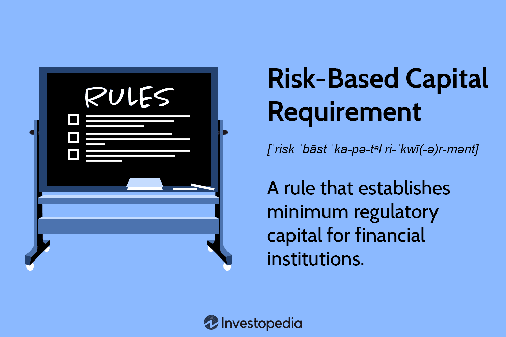

The landscape of financial markets is evolving rapidly, driven by advancements in technology, globalization, and innovative financial instruments. This evolution demands more sophisticated strategies to outperform benchmarks and manage risks effectively. Three key components stand out in this dynamic context: risk capital investment, financial management, and algorithmic (algo) trading. 

Risk capital, essential for driving growth and innovation, comprises funds that investors are willing to allocate to projects with substantial potential yet high uncertainty. This type of capital is often pivotal in fostering emerging industries and groundbreaking technologies, accepting significant risk for the prospect of higher returns. Diversification is a fundamental principle in managing this risk, ensuring that investments are spread across varied opportunities to mitigate potential losses.



Comprehensive financial management complements risk capital by applying strategic allocation and rigorous analysis. It encompasses understanding risk tolerance, optimizing portfolio diversification, and ensuring capital preservation, especially in volatile markets. The balance between risk and stability is crucial in creating a sound financial strategy, particularly for individuals near or in retirement who need to safeguard their investments.

Algorithmic trading represents the technological backbone of modern financial strategies. By automating trade execution through pre-set rules and algorithms, investors can capitalize on market opportunities with unprecedented speed and accuracy. However, the sophistication of algo trading also introduces new challenges, such as technical risks and the need for robust risk management protocols to protect against market volatility.

In this article, we explore how these components—risk capital investment, meticulous financial management, and advanced algorithmic trading—interconnect to form a comprehensive investment strategy. Understanding each component's role and synergy is vital for investors aiming to maximize returns while navigating the complexities and uncertainties of today's financial markets.

## Table of Contents

## Understanding Risk Capital

Risk capital is a fundamental concept in financial markets, referring to funds specifically allocated towards investments that offer the potential for high returns while simultaneously carrying significant risk. Its role is crucial in innovative investment ventures where the outcomes are uncertain, allowing investors to explore opportunities that traditional investment paths might overlook.

### The Importance of Diversification

Diversification is essential in managing risk capital investments effectively. By spreading investments across a variety of assets, investors can mitigate exposure to any single economic event, reducing potential losses. The fundamental idea is that different assets or asset classes will respond differently to the same market event, which helps stabilize overall portfolio performance. It is generally advised that only a portion of an investor’s total portfolio—often up to 10%—should be allocated as risk capital. This approach balances the potential for high rewards with the prudence required to avoid jeopardizing the entire portfolio.

### Risk Capital in Venture Capital

In venture capital, risk capital is frequently allocated to fund startups with high growth potential but minimal track records. These startups often have innovative ideas or technologies that could disrupt existing industries, posing considerable risk to investors. However, if successful, the returns can be substantial, justifying the allocation of risk capital. The very nature of venture capital demands a willingness to take on higher risks in exchange for the possibility of exceptional returns. This aligns with the core principle of risk capital, which is to embrace uncertainty for prospective gains.

Understanding risk capital permits investors to strategically position their portfolios to not only cushion against losses but also to capitalize on high-reward opportunities. This knowledge empowers the investor to navigate complex financial landscapes while embracing innovation and the prospects of substantial long-term growth.

## Financial Management Strategies for Risk Capital

Effective financial management is critical to leveraging risk capital efficiently, primarily through strategic allocation, diversification, and understanding an investor’s risk tolerance. Risk capital refers to the portion of an investment portfolio allocated to high-risk, high-reward ventures, which necessitates particularly diligent management to optimize potential returns while mitigating potential losses.

### Strategic Allocation

The cornerstone of managing risk capital is strategic allocation. Investors are advised to allocate a small percentage of their total portfolio to risk capital, generally recommended at 10% or less. However, individuals with a higher risk tolerance or seasoned investors might allocate more, depending on their financial goals and capacity to absorb potential losses. The strategic allocation involves setting clear criteria for investment selection and regularly reviewing and adjusting these allocations to align with changing market conditions and personal financial circumstances.

### Diversification

Diversification is essential to moderating the risks associated with risk capital investments. By spreading investments across various sectors, asset classes, and geographical regions, investors can reduce the impact of poor performance in any single investment on their overall portfolio. This approach not only maximizes the potential for gains by taking advantage of differing market conditions across sectors and regions but also buffers against [volatility](/wiki/volatility-trading-strategies).

Mathematically, diversification aims to optimize the risk-return trade-off, typically employing strategies such as the Markowitz Modern Portfolio Theory, where the expected return $E(R_p)$ and the portfolio variance $\sigma^2_p$ are calculated to ensure efficient portfolio construction:

$$

E(R_p) = \sum_{i=1}^{n} w_i \cdot E(R_i) 
$$

$$

\sigma^2_p = \sum_{i=1}^{n} \sum_{j=1}^{n} w_i w_j \sigma_{ij} 
$$

Here, $w_i$ and $w_j$ represent the portfolio weights of the investments, and $\sigma_{ij}$ is the covariance between the returns of different investments.

### Risk Tolerance

Understanding and gauging one’s risk tolerance is essential in managing risk capital. Risk tolerance determines how much risk an investor can comfortably take without jeopardizing financial security or peace of mind. Age, income level, [liquidity](/wiki/liquidity-risk-premium) needs, and investment timeline all influence risk tolerance levels. For example, retirees typically have lower risk tolerance as they may rely on their investment returns for living expenses and cannot afford the potential loss of significant capital.

### Balancing Stable Investments

To prevent catastrophic losses, it is crucial to balance high-risk investments with more stable, lower-risk assets such as bonds, index funds, or blue-chip stocks. This balance provides a safety net that can maintain portfolio stability during market downturns. For retirees or those nearing retirement, the emphasis on stability is even more pronounced, as preserving capital takes precedence over potentially higher, yet volatile, returns.

In conclusion, managing risk capital efficiently through strategic allocation, diversification, and aligning with personal risk tolerance helps investors navigate the volatility around high-risk investments. By complementing risk capital with stable investments, investors can safeguard their portfolios against significant losses. As markets evolve, continually adapting financial management strategies is vital for sustainable financial growth.

## Algo Trading and Risk Management

Algorithmic trading, commonly referred to as algo trading, utilizes automated systems to execute trades according to predefined criteria. This approach is particularly beneficial in volatile markets where quick reaction times can lead to more effective capitalizing on small price movements. By removing the need for manual intervention, algo trading can significantly enhance the speed and accuracy of trading operations, thereby potentially increasing profitability.

However, algo trading presents its own set of risks that must be carefully managed. Key among these is market volatility, which can lead to large swings in asset prices. To mitigate such risks, investors often employ risk management strategies including stop-loss orders and portfolio diversification. A stop-loss order is an automatic trade order that sells a security once its price reaches a specified level, limiting an investor's loss on a position. Portfolio diversification, on the other hand, reduces exposure to any single asset or risk [factor](/wiki/factor-investing), helping to cushion the impact of adverse market movements.

Moreover, the technical and operational challenges associated with algo trading cannot be underestimated. System malfunctions or failures could lead to unintended trades or losses. Therefore, regular system checks and rigorous monitoring are essential to ensure the algorithms are functioning as intended and in compliance with the intended strategy. This includes constant reviewing and fine-tuning of algorithms to adapt to changing market conditions.

The integration of [machine learning](/wiki/machine-learning) and big data analytics can also play a significant role in enhancing risk management strategies within algo trading. Machine learning algorithms can analyze vast amounts of data to identify patterns and trends that may not be immediately apparent to human analysts, thereby improving decision-making. For instance, Python libraries such as TensorFlow or scikit-learn can be applied to develop predictive models that can preempt market movements, contributing to more efficient trade executions.

In the Python programming language, a simple example to illustrate a part of algo trading could be:

```python
import pandas as pd
import numpy as np

# Mock data for price movements
price_data = pd.Series([100, 102, 101, 105, 110, 108, 112])

# Example of a simple moving average strategy
sma_short = price_data.rolling(window=2).mean()
sma_long = price_data.rolling(window=3).mean()

# Signal generation
signal = np.where(sma_short > sma_long, 1, 0)  # Buy signal when short-term SMA is above long-term SMA

print("Signals:", signal)
```

This simplistic strategy creates buy signals when the short-term simple moving average (SMA) crosses above the long-term SMA, which is a common technique amongst traders to indicate potential bullish movements. While this example is rudimentary, it demonstrates the principles of algo trading and the need for careful risk management practices to navigate market volatility and technical challenges effectively.

## Mitigating Risks in Algo Trading

Risk management in [algorithmic trading](/wiki/algorithmic-trading) is fundamental to safeguarding investments and optimizing returns. Setting clear investment goals is the first step in mitigating risks. This involves understanding specific financial objectives, whether they be growth-oriented or income-based, and ensuring that algo trading strategies align with these aims. Clarity in goals aids in crafting algorithms that execute trades reflecting the investor's broader financial strategy.

Implementing stop-loss and take-profit orders is essential in minimizing losses and securing profits. A stop-loss order automatically closes a losing position once a particular price point is reached, preventing further losses. Conversely, a take-profit order locks in gains when prices reach a specified level. These tools automate decision-making, removing emotional interference and ensuring that trades adhere to pre-established risk tolerance levels.

Diversification is another critical tactic in reducing exposure to market shifts. By spreading investments across various financial instruments—such as stocks, bonds, and commodities—the overall risk is diluted. This strategy reduces the impact of poor performance in any single asset or market sector on the overall portfolio.

Hedging strategies provide another layer of protection against adverse market movements. Hedging involves taking positions that offset potential losses in an investment portfolio. For instance, using options or futures contracts can protect against market volatility. A common approach is to short-sell against long positions, establishing a balance where losses in one are offset by gains in another.

Quantitative risk analysis is a powerful method in algo trading to evaluate potential risks and returns. Using mathematical models and statistical techniques, traders can simulate various market conditions and their impact on investment portfolios. Tools such as Value at Risk (VaR) or Conditional Value at Risk (CVaR) provide quantitative insights into potential losses and the likelihood of those losses occurring, allowing for more informed risk management decisions.

Integrating advanced risk management tools and technologies aids in sustaining long-term growth. Machine learning algorithms, for instance, can learn from historical data to predict future market trends and adjust trading strategies accordingly. Additionally, real-time data analytics enhances decision-making by providing up-to-date information on market dynamics.

Overall, a multi-faceted risk management strategy in algorithmic trading that combines goal setting, order strategies, diversification, hedging, and quantitative analysis can significantly enhance capital protection and ensure more stable, long-term investment growth.

## Implementing Effective Investment Strategies

Developing a robust investment strategy requires a comprehensive understanding of one's financial goals and risk tolerance. Paramount to achieving this is the diversification across multiple asset classes. This approach mitigates risk by ensuring that the investment portfolio is not overly reliant on the performance of a single asset or sector. Famed investor Harry Markowitz championed the concept of diversification, illustrating how a diversified portfolio can optimize returns for a given level of risk—a principle known as the Efficient Frontier in Modern Portfolio Theory[[1\]](https://doi.org/10.2139/ssrn.10451).

An effective strategy necessitates the continuous evaluation of investment performance. This ongoing assessment helps investors adjust their portfolios in response to changing market dynamics and personal financial objectives. Tools like portfolio rebalancing ensure that the asset allocation remains aligned with strategic goals, particularly after market movements have shifted the original investment proportions.

Risk management must be an integral part of this investment process, evolving alongside market conditions. This involves regularly reviewing asset allocations, understanding each asset's sensitivity to market fluctuations, and incorporating technological advancements. In particular, the application of algorithmic trading can significantly enhance precision and outcomes by executing trades based on predetermined criteria, thus reducing human error and emotion-driven decisions.

Investors can achieve superior returns while effectively managing risk by combining risk capital with advanced financial management techniques and algorithmic strategies. Risk capital—funds available for speculative, high-risk investments—requires careful attention. A calculated allocation, often a small portion of the total investment portfolio, allows investors to pursue potentially high-reward opportunities without jeopardizing their overall financial stability.

Algorithmic trading systems can be employed to monitor market conditions continuously and execute trades swiftly to capitalize on transient opportunities. They can also enforce risk management protocols, such as stop-loss orders, to automatically sell securities at pre-defined prices to limit losses. Algorithm-based strategies can utilize advanced computational techniques, such as machine learning, to identify market patterns and optimize trading decisions.

In conclusion, crafting an effective investment strategy involves a balanced interplay of diversification, continuous performance evaluation, risk management, and embracing technological advancements. By aligning these elements with individual risk appetites and financial goals, investors can navigate the complexities of the financial markets with greater confidence and poise.

[1] Markowitz, H. (1952). "Portfolio Selection". Journal of Finance.

## Conclusion

Risk capital investment, financial management, and algorithmic trading form a formidable combination in today's rapidly advancing financial market landscape. Each element plays a distinct yet interrelated role in shaping effective investment strategies. By allocating risk capital, investors can embrace opportunities with high potential returns while acknowledging associated risks. Financial management, on the other hand, ensures that these investments are made with a strategic allocation of resources, balanced diversification, and a comprehensive understanding of risk tolerance.

Algorithmic trading complements these strategies by offering enhanced efficiency and faster response times in dynamic market conditions. However, its effective application requires robust risk management protocols, such as stop-loss orders, portfolio diversification, and continual monitoring. The integration of these components enables investors to make informed decisions that weigh the scale between risk and reward, ultimately optimizing potential financial outcomes.

Furthermore, as financial markets undergo continuous change driven by technological advances and evolving economic conditions, investors must remain informed and adapt their strategies accordingly. This dynamic approach is essential in maintaining and enhancing their investment success over time. By combining the strategic allocation of risk capital with thoughtful financial management and leveraging algorithmic trading technology, investors can aim for superior returns while adeptly managing potential risks. This holistic strategy positions investors favorably in navigating today's complex and ever-evolving financial environment.

## References & Further Reading

[1]: Markowitz, H. (1952). ["Portfolio Selection."](https://onlinelibrary.wiley.com/doi/abs/10.1111/j.1540-6261.1952.tb01525.x) Journal of Finance.

[2]: Bergstra, J., Bardenet, R., Bengio, Y., & Kégl, B. (2011). ["Algorithms for Hyper-Parameter Optimization."](https://dl.acm.org/doi/10.5555/2986459.2986743) Advances in Neural Information Processing Systems 24.

[3]: ["Advances in Financial Machine Learning"](https://www.amazon.com/Advances-Financial-Machine-Learning-Marcos/dp/1119482089) by Marcos Lopez de Prado.

[4]: ["Evidence-Based Technical Analysis: Applying the Scientific Method and Statistical Inference to Trading Signals"](https://www.amazon.com/Evidence-Based-Technical-Analysis-Scientific-Statistical/dp/0470008741) by David Aronson.

[5]: ["Machine Learning for Algorithmic Trading"](https://github.com/stefan-jansen/machine-learning-for-trading) by Stefan Jansen.

[6]: ["Quantitative Trading: How to Build Your Own Algorithmic Trading Business"](https://www.amazon.com/Quantitative-Trading-Build-Algorithmic-Business/dp/1119800064) by Ernest P. Chan.