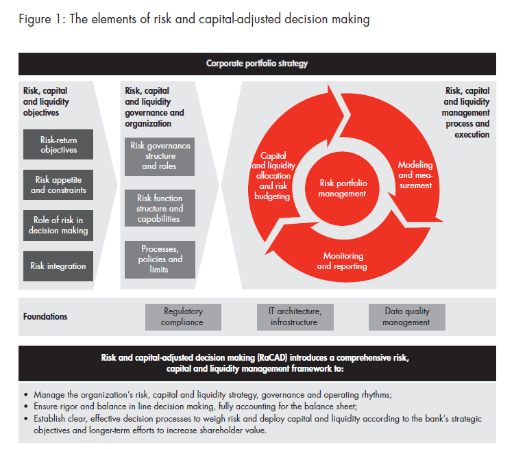

## Table of Contents

## What is risk capital?

Risk capital is money that people or companies are willing to lose when they invest in something new or risky. It's like betting on a new business or project that might not work out. People use risk capital because they hope to make a big profit if their investment does well. But, they know there's a chance they could lose all their money if things go wrong.

This type of capital is often used by startups and entrepreneurs who need money to get their ideas off the ground. Investors who provide risk capital, like venture capitalists, are looking for high returns and are okay with taking big risks. They understand that many of their investments might fail, but they hope that one big success will make up for all the losses.

## How does risk capital differ from other types of capital?

Risk capital is different from other types of capital because it's money that people are ready to lose. It's used for risky investments, like new businesses or projects that might not succeed. People who use risk capital hope to make a lot of money if their investment does well, but they know they might lose everything if it doesn't. This is different from safer investments, like savings accounts or government bonds, where the risk of losing money is much lower.

Other types of capital, like debt capital, are loans that need to be paid back with interest. This is less risky for the lender but can be risky for the borrower if they can't pay back the loan. Equity capital is money invested in a company in exchange for ownership. It's less risky than risk capital because it's usually invested in more established companies with a better chance of success. Risk capital, on the other hand, is often used for new and untested ideas, making it the riskiest type of capital.

## What are the primary sources of risk capital?

The main sources of risk capital are venture capitalists and angel investors. Venture capitalists are companies or funds that invest money in new businesses, hoping to make a big profit if the business does well. They often invest in tech startups and other high-growth companies. Angel investors are rich people who use their own money to invest in new businesses. They usually invest smaller amounts than venture capitalists and often help the business with advice and connections.

Another source of risk capital is crowdfunding. This is when a lot of people give small amounts of money to help fund a new project or business. Websites like Kickstarter and Indiegogo are popular places for crowdfunding. People who give money through crowdfunding might get rewards or a small piece of the business, but they know there's a big risk that the project might not succeed.

Friends and family can also be a source of risk capital. When someone starts a new business, they might ask people they know for money. These people usually trust the person starting the business and are willing to take a risk to help them out. But, like all risk capital, there's a chance they might not get their money back if the business fails.

## What are the main functions of risk capital in business?

Risk capital helps new businesses get started and grow. When someone has a new idea for a business, they often need money to make it happen. Risk capital gives them the money they need to do things like make a product, hire people, and start selling. This kind of money is important because banks usually won't lend money to new businesses that don't have a track record yet. Without risk capital, many new ideas would never turn into real businesses.

Risk capital also helps businesses take big risks that could lead to big rewards. For example, a company might use risk capital to try out a new product or enter a new market. These are risky moves because they might not work out, but if they do, the company could grow a lot and make a lot of money. Investors who provide risk capital are okay with the chance of losing their money because they hope that one big success will make up for any failures. This helps businesses keep trying new things and growing.

## How is risk capital used in startup companies?

Risk capital is really important for startup companies. It's the money that helps them get started and grow. When someone has a new idea for a business, they often need money to make it happen. Risk capital gives them the money they need to do things like make a product, hire people, and start selling. Banks usually won't lend money to new businesses because they don't know if the business will succeed yet. So, startups often get risk capital from investors like venture capitalists or angel investors who are willing to take a chance on new ideas.

Startups use risk capital to take big risks that could lead to big rewards. For example, a startup might use risk capital to try out a new product or enter a new market. These are risky moves because they might not work out, but if they do, the startup could grow a lot and make a lot of money. The investors who provide risk capital know they might lose their money, but they hope that one big success will make up for any failures. This helps startups keep trying new things and growing, even when things are uncertain.

## What role does risk capital play in innovation and growth?

Risk capital plays a big role in helping new ideas turn into real things. When someone has a new idea for a business or product, they often need money to make it happen. Risk capital is the money that people or companies are willing to lose if the idea doesn't work out. This money helps startups buy what they need, hire people, and start selling their product. Without risk capital, many new ideas would never get off the ground because banks usually won't lend money to new businesses that don't have a track record yet.

Risk capital also helps businesses take big risks that could lead to big rewards. For example, a company might use risk capital to try out a new product or enter a new market. These are risky moves because they might not work out, but if they do, the company could grow a lot and make a lot of money. Investors who provide risk capital are okay with the chance of losing their money because they hope that one big success will make up for any failures. This helps businesses keep trying new things and growing, which is important for innovation and growth in the economy.

## What are the risks associated with investing in risk capital?

Investing in risk capital is very risky. When you give money to a new business or project, there's a big chance you might lose all of it. This is because new businesses often fail. They might not be able to sell their product, or they might run out of money before they start making a profit. So, if you invest in risk capital, you need to be ready to lose your money.

Even though it's risky, people still invest in risk capital because they hope to make a lot of money if the business does well. For example, if you invest in a startup that becomes very successful, you could make a lot more money than you put in. But, this doesn't happen very often. Most of the time, the business fails, and the investors lose their money. So, it's important to only invest money you can afford to lose and to understand that the chances of making a big profit are small.

## How can risk capital be effectively managed to minimize potential losses?

Managing risk capital to minimize potential losses involves careful planning and smart decision-making. One way to do this is by spreading your money across different investments. Instead of putting all your money into one new business, you can invest smaller amounts in several different startups. This way, if one business fails, you won't lose all your money. It's like not putting all your eggs in one basket. Another way is to do a lot of research before you invest. Look at the business plan, the people running the business, and the market they are trying to enter. The more you know, the better you can decide if the investment is worth the risk.

Another important part of managing risk capital is setting clear goals and limits. Decide how much money you are willing to lose before you start investing. This way, you won't lose more than you can afford. It's also good to keep an eye on your investments and be ready to pull out your money if things start to go wrong. Sometimes, cutting your losses early can save you from losing even more money later. By being careful and smart, you can manage risk capital in a way that helps you minimize potential losses.

## What are some successful examples of risk capital investments?

One successful example of risk capital investment is the early funding of Google. In 1998, when Google was just starting out, two Stanford students, Larry Page and Sergey Brin, needed money to grow their new search engine. They got risk capital from investors like Andy Bechtolsheim, who gave them $100,000. This money helped them build their business, and now Google is one of the biggest companies in the world. The investors who gave them risk capital made a lot of money because Google became so successful.

Another example is the investment in Airbnb. In 2008, Brian Chesky and Joe Gebbia needed money to start their new idea of renting out people's homes. They got risk capital from investors like Y Combinator and Sequoia Capital. This money helped them grow their business, and now Airbnb is a huge company that people all over the world use to find places to stay. The investors who gave them risk capital made a lot of money because Airbnb became very successful.

## How do regulatory environments affect the deployment of risk capital?

Regulatory environments can make it easier or harder for businesses to get risk capital. If the rules are strict, it might be hard for new businesses to get the money they need. For example, if there are a lot of rules about how companies can raise money, it might scare away investors. They might be worried about getting in trouble if they don't follow all the rules. On the other hand, if the rules are not too strict, it can be easier for new businesses to get risk capital. Investors might feel more comfortable taking risks if they know the rules won't make things too hard for them.

Different countries have different rules about risk capital. In some places, the government might help new businesses by making it easier to get risk capital. They might offer tax breaks or other benefits to investors who put money into new businesses. This can encourage more people to invest in risky ideas. In other places, the rules might be very strict, and it can be hard for new businesses to get the money they need. This can slow down innovation and growth because new businesses might not be able to get the risk capital they need to start and grow.

## What advanced strategies can be used to optimize the use of risk capital?

One advanced strategy to optimize the use of risk capital is to use data and analytics to make better investment decisions. By looking at data about the market, the competition, and the potential customers, investors can make smarter choices about which businesses to invest in. For example, they might use data to see which products are popular and which ones are not. This can help them decide if a new business has a good chance of succeeding. Another part of this strategy is to use technology to keep track of how the business is doing after the investment. This way, investors can see if the business is on the right track and make changes if needed.

Another strategy is to build a strong network of experts and mentors who can help the new business. This can include people who know a lot about the industry, as well as people who have started successful businesses before. These experts can give advice and help the business avoid common mistakes. By having a strong network, the business can get the support it needs to grow and succeed. This can make the risk capital investment more likely to pay off, because the business has a better chance of making it through the early stages and becoming successful.

## How does risk capital contribute to economic development on a macro level?

Risk capital helps the economy grow by giving new businesses the money they need to start and grow. When people invest in new businesses, they help create jobs and new products. This can lead to more people working and more money being spent in the economy. Without risk capital, many new ideas would never turn into real businesses, and the economy would not grow as fast. So, risk capital is important because it helps turn new ideas into businesses that can help the economy.

Risk capital also helps the economy by encouraging people to take risks and try new things. When investors are willing to lose their money on new ideas, it can lead to big innovations that change the way we live and work. For example, companies like Google and Airbnb started with risk capital and now they help the economy in big ways. By having risk capital available, the economy can keep growing and changing, which is good for everyone.

## What are effective Financial Management Strategies for Risk Capital?

Effective financial management is critical to leveraging risk capital efficiently, primarily through strategic allocation, diversification, and understanding an investor’s risk tolerance. Risk capital refers to the portion of an investment portfolio allocated to high-risk, high-reward ventures, which necessitates particularly diligent management to optimize potential returns while mitigating potential losses.

### Strategic Allocation

The cornerstone of managing risk capital is strategic allocation. Investors are advised to allocate a small percentage of their total portfolio to risk capital, generally recommended at 10% or less. However, individuals with a higher risk tolerance or seasoned investors might allocate more, depending on their financial goals and capacity to absorb potential losses. The strategic allocation involves setting clear criteria for investment selection and regularly reviewing and adjusting these allocations to align with changing market conditions and personal financial circumstances.

### Diversification

Diversification is essential to moderating the risks associated with risk capital investments. By spreading investments across various sectors, asset classes, and geographical regions, investors can reduce the impact of poor performance in any single investment on their overall portfolio. This approach not only maximizes the potential for gains by taking advantage of differing market conditions across sectors and regions but also buffers against [volatility](/wiki/volatility-trading-strategies).

Mathematically, diversification aims to optimize the risk-return trade-off, typically employing strategies such as the Markowitz Modern Portfolio Theory, where the expected return $E(R_p)$ and the portfolio variance $\sigma^2_p$ are calculated to ensure efficient portfolio construction:

$$

E(R_p) = \sum_{i=1}^{n} w_i \cdot E(R_i) 
$$

$$

\sigma^2_p = \sum_{i=1}^{n} \sum_{j=1}^{n} w_i w_j \sigma_{ij} 
$$

Here, $w_i$ and $w_j$ represent the portfolio weights of the investments, and $\sigma_{ij}$ is the covariance between the returns of different investments.

### Risk Tolerance

Understanding and gauging one’s risk tolerance is essential in managing risk capital. Risk tolerance determines how much risk an investor can comfortably take without jeopardizing financial security or peace of mind. Age, income level, [liquidity](/wiki/liquidity-risk-premium) needs, and investment timeline all influence risk tolerance levels. For example, retirees typically have lower risk tolerance as they may rely on their investment returns for living expenses and cannot afford the potential loss of significant capital.

### Balancing Stable Investments

To prevent catastrophic losses, it is crucial to balance high-risk investments with more stable, lower-risk assets such as bonds, index funds, or blue-chip stocks. This balance provides a safety net that can maintain portfolio stability during market downturns. For retirees or those nearing retirement, the emphasis on stability is even more pronounced, as preserving capital takes precedence over potentially higher, yet volatile, returns.

In conclusion, managing risk capital efficiently through strategic allocation, diversification, and aligning with personal risk tolerance helps investors navigate the volatility around high-risk investments. By complementing risk capital with stable investments, investors can safeguard their portfolios against significant losses. As markets evolve, continually adapting financial management strategies is vital for sustainable financial growth.

## References & Further Reading

[1]: Markowitz, H. (1952). ["Portfolio Selection."](https://onlinelibrary.wiley.com/doi/abs/10.1111/j.1540-6261.1952.tb01525.x) Journal of Finance.

[2]: Bergstra, J., Bardenet, R., Bengio, Y., & Kégl, B. (2011). ["Algorithms for Hyper-Parameter Optimization."](https://dl.acm.org/doi/10.5555/2986459.2986743) Advances in Neural Information Processing Systems 24.

[3]: ["Advances in Financial Machine Learning"](https://www.amazon.com/Advances-Financial-Machine-Learning-Marcos/dp/1119482089) by Marcos Lopez de Prado.

[4]: ["Evidence-Based Technical Analysis: Applying the Scientific Method and Statistical Inference to Trading Signals"](https://www.amazon.com/Evidence-Based-Technical-Analysis-Scientific-Statistical/dp/0470008741) by David Aronson.

[5]: ["Machine Learning for Algorithmic Trading"](https://github.com/stefan-jansen/machine-learning-for-trading) by Stefan Jansen.

[6]: ["Quantitative Trading: How to Build Your Own Algorithmic Trading Business"](https://www.amazon.com/Quantitative-Trading-Build-Algorithmic-Business/dp/1119800064) by Ernest P. Chan.