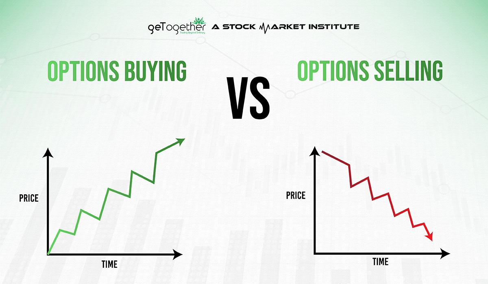

## Table of Contents

## What are options in the context of financial markets?

Options are financial products that give you the right, but not the obligation, to buy or sell an asset at a set price before a certain date. The asset could be stocks, commodities, or currencies. There are two types of options: calls and puts. A call option lets you buy the asset, while a put option lets you sell it. You pay a price called a premium to get this right.

Options are used by investors for different reasons. Some use them to make money from price movements without owning the actual asset. Others use options to protect their investments from big price drops. For example, if you own a stock and are worried about its price falling, you can buy a put option to sell it at a set price, even if the market price goes lower. This way, you limit your losses. Options can be complex, so it's important to understand them well before using them.

## What is the difference between buying and selling options?

When you buy an option, you are paying for the right to buy or sell an asset at a specific price before a certain date. If you buy a call option, you have the right to buy the asset. If you buy a put option, you have the right to sell the asset. You hope the price of the asset will move in a way that makes your option more valuable. For example, if you buy a call option and the price of the asset goes up, you can make money by either selling the option for more than you paid or by using it to buy the asset at a lower price than the market.

When you sell an option, you are giving someone else the right to buy or sell the asset from you at the set price. If you sell a call option, you must sell the asset if the buyer decides to use the option. If you sell a put option, you must buy the asset if the buyer decides to use the option. Selling options can earn you money from the premium the buyer pays you, but it also comes with risks. If the price moves against you, you might have to buy or sell the asset at a loss. For example, if you sell a call option and the price of the asset goes up a lot, you might have to sell it at a lower price than the market, losing money.

## What are the basic risks associated with buying options?

When you buy options, one big risk is that they can expire worthless. Options have an expiration date, and if the price of the asset doesn't move the way you hoped by that date, your option becomes useless. You lose the money you spent on the option, which is called the premium. This risk is higher for options that are far from the current price of the asset because they have a lower chance of becoming profitable.

Another risk is that options can be very volatile. The price of an option can change a lot in a short time, which can be exciting but also scary. If the market moves against you, the value of your option can drop quickly, and you could lose a lot of money. This makes options risky, especially if you don't have much experience trading them.

## What are the basic risks associated with selling options?

When you sell options, you face the risk of having to buy or sell the asset at a price that's not good for you. If you sell a call option and the price of the asset goes up a lot, you might have to sell it at a much lower price than the market. This can lead to big losses. If you sell a put option and the price of the asset goes down a lot, you might have to buy it at a higher price than the market, which can also lead to losses.

Another risk is that selling options can lead to unlimited losses. When you sell a call option, there's no limit to how high the price of the asset can go, so your potential loss can be huge. When you sell a put option, your loss is limited to how low the price can go, but it can still be a lot of money. This makes selling options riskier than buying them, especially if you're not ready for big price moves.

## How does the time decay affect the risk of buying options?

Time decay is a big risk when you buy options. It means that the value of your option goes down as time passes. This happens because the closer you get to the expiration date, the less time there is for the price of the asset to move in a way that makes your option more valuable. So, even if the price of the asset stays the same, your option loses value every day. This makes it harder for your option to become profitable because you need the price to move enough to cover the cost of the option and the loss from time decay.

The risk of time decay is bigger for options that are close to expiring. If you buy an option that expires soon, you have less time for the price to move in your favor, and the time decay happens faster. This means you need a bigger price move to make money. On the other hand, if you buy an option with a lot of time until it expires, the time decay is slower, but you pay more for the option because it has more time value. So, understanding time decay is important when you decide which options to buy and how long to hold them.

## How does the time decay affect the risk of selling options?

When you sell options, time decay works in your favor. As time passes, the value of the option you sold goes down. This means that if the buyer doesn't use the option before it expires, you keep the money they paid you, called the premium. The closer the option gets to expiring, the faster it loses value, so the risk of the buyer using the option goes down. This makes selling options less risky as time goes on, because the chance of losing money from the option being used gets smaller.

However, even though time decay helps you, there's still risk. If the price of the asset moves a lot against you before the option expires, you could lose more money than the premium you got. Time decay can't protect you from big price moves. So, while time decay reduces the risk of the option being used as time goes on, you still need to be ready for the price to move in a way that could lead to losses.

## What role does volatility play in the risk of buying options?

Volatility is how much the price of an asset goes up and down. When you buy options, high [volatility](/wiki/volatility-trading-strategies) can be good and bad. It's good because if the price moves a lot in the direction you want, your option can become more valuable quickly. This means you can make more money. But it's bad because if the price moves a lot in the wrong direction, your option can lose value fast. This means you can lose money quickly too. So, high volatility makes buying options riskier because the price can change a lot in a short time.

Low volatility means the price doesn't move much. When you buy options in a low volatility market, it's harder for your option to become more valuable. The price needs to move more than you expected to make money, and if it doesn't, your option might expire worthless. This makes buying options in a low volatility market riskier because you need a bigger price move to cover the cost of the option. So, whether volatility is high or low, it affects the risk of buying options in different ways.

## What role does volatility play in the risk of selling options?

When you sell options, high volatility can be risky. It means the price of the asset can move a lot, and if it moves against you, you could lose a lot of money. For example, if you sell a call option and the price goes up a lot, you might have to sell the asset at a much lower price than the market. This can lead to big losses. High volatility makes selling options riskier because the price can change a lot in a short time, and you might not be able to control the losses.

On the other hand, low volatility can be good for you when you sell options. It means the price doesn't move much, so the chance of the option being used against you is smaller. If the price stays the same or doesn't move much, the option you sold will likely expire worthless, and you get to keep the money the buyer paid you, called the premium. Low volatility makes selling options less risky because the price is less likely to move in a way that hurts you.

## How can leverage impact the risks of buying options?

When you buy options, you use leverage. This means you can control a big amount of an asset with a small amount of money. The money you pay for the option is called the premium, and it's usually less than what you would pay to buy the actual asset. This can be good because if the price of the asset goes up, your option can become more valuable, and you can make a lot of money compared to what you paid. But it's also risky because if the price goes down, you can lose all the money you paid for the option.

Leverage makes the price changes bigger for your option. If the price of the asset moves a little, the value of your option can move a lot. This means you can make or lose money faster than if you just owned the asset. So, while leverage can help you make more money, it also makes buying options riskier because the losses can be big if the price doesn't move the way you hoped.

## How can leverage impact the risks of selling options?

When you sell options, you also use leverage, but it works differently than when you buy options. Selling options means you get money upfront, called the premium, but you also take on the risk of having to buy or sell the asset at a set price. If the price of the asset moves a lot against you, the leverage can make your losses much bigger than the money you got from selling the option. For example, if you sell a call option and the price of the asset goes up a lot, you might have to sell it at a much lower price than the market, leading to big losses.

Leverage makes selling options riskier because it can lead to unlimited losses. When you sell a call option, there's no limit to how high the price of the asset can go, so your potential loss can be huge. Even though you get the premium upfront, the leverage means that if the price moves against you, the money you lose can be much more than what you gained. So, while leverage can help you make money from selling options, it also makes the risk of big losses much higher.

## What advanced strategies can be used to mitigate risks when buying options?

One advanced strategy to lower the risks when buying options is called a "vertical spread." This means you buy one option and sell another option on the same asset with the same expiration date but different prices. For example, you can buy a call option at a lower price and sell a call option at a higher price. This way, you pay less for the trade because the money you get from selling the second option helps cover the cost of the first one. The risk is that your profit is limited, but so is your loss. This can be a good way to protect yourself from big losses while still having a chance to make money.

Another strategy is called "hedging." This means you buy options to protect other investments you own. For example, if you own a stock and are worried about its price going down, you can buy a put option on that stock. This gives you the right to sell the stock at a set price, even if the market price goes lower. This way, you limit your losses on the stock. Hedging can be more complex because it involves managing two investments at the same time, but it can help you sleep better at night knowing your losses are limited.

A third strategy is called "straddles" or "strangles." These are used when you think the price of an asset will move a lot, but you're not sure which way. A straddle means you buy a call option and a put option on the same asset with the same expiration date and price. A strangle is similar, but the call and put options have different prices. These strategies can be expensive because you're buying two options, but they let you make money no matter which way the price moves, as long as it moves a lot. The risk is that if the price doesn't move much, you can lose the money you spent on both options.

## What advanced strategies can be used to mitigate risks when selling options?

One way to lower the risks when selling options is by using a strategy called a "credit spread." This means you sell one option and buy another option on the same asset with the same expiration date but different prices. For example, if you sell a call option at a lower price, you can buy a call option at a higher price. This way, you get money from selling the first option, but you also limit your losses because the second option you bought can protect you if the price goes up a lot. The downside is that your profit is limited, but so is your risk.

Another strategy is called "covered calls." This means you sell a call option on a stock you already own. If someone uses the option, you have to sell your stock at the set price, but you get to keep the money from selling the option. This can help you make extra money from your stock, and it also limits your risk because the worst that can happen is you sell your stock at a good price. The risk is that if the stock price goes up a lot, you miss out on the extra profit you could have made if you hadn't sold the option.

A third strategy is called "iron condors." This is a more complex strategy where you sell a call option and a put option, and also buy a call option at a higher price and a put option at a lower price. All options are on the same asset and have the same expiration date. This creates a range where you make money if the price stays within that range. The money you get from selling the options can be more than what you pay for the options you buy, so you can make a profit. The risk is that if the price moves a lot outside the range, you can lose money, but the options you bought can help limit your losses.

## References & Further Reading

[1]: Black, F., & Scholes, M. (1973). ["The Pricing of Options and Corporate Liabilities"](https://www.cs.princeton.edu/courses/archive/fall09/cos323/papers/black_scholes73.pdf). Journal of Political Economy, 81(3), 637-654.

[2]: Hull, J. C. (2018). ["Options, Futures, and Other Derivatives"](https://www.semanticscholar.org/paper/Options%2C-Futures%2C-and-Other-Derivatives-Hull/89bdee500c8623864fc9eb7a471546aa713acc44) (9th ed.). Pearson.

[3]: Narang, R. (2013). ["Inside the Black Box: A Simple Guide to Quantitative and High-Frequency Trading"](https://onlinelibrary.wiley.com/doi/book/10.1002/9781118662717) (2nd ed.). Wiley.

[4]: Lopez de Prado, M. (2018). ["Advances in Financial Machine Learning"](https://www.amazon.com/Advances-Financial-Machine-Learning-Marcos/dp/1119482089). Wiley.

[5]: Chriss, N. A. (1997). ["Black-Scholes and Beyond: Option Pricing Models"](https://archive.org/details/blackscholesbeyo00chri_0). McGraw-Hill.

[6]: Taleb, N. N. (1997). ["Dynamic Hedging: Managing Vanilla and Exotic Options"](https://archive.org/details/dynamichedgingma0000tale). Wiley.

[7]: Chan, E. (2009). ["Quantitative Trading: How to Build Your Own Algorithmic Trading Business"](https://github.com/ftvision/quant_trading_echan_book). Wiley.

[8]: Jansen, S. (2020). ["Machine Learning for Algorithmic Trading"](https://github.com/stefan-jansen/machine-learning-for-trading). Packt Publishing.