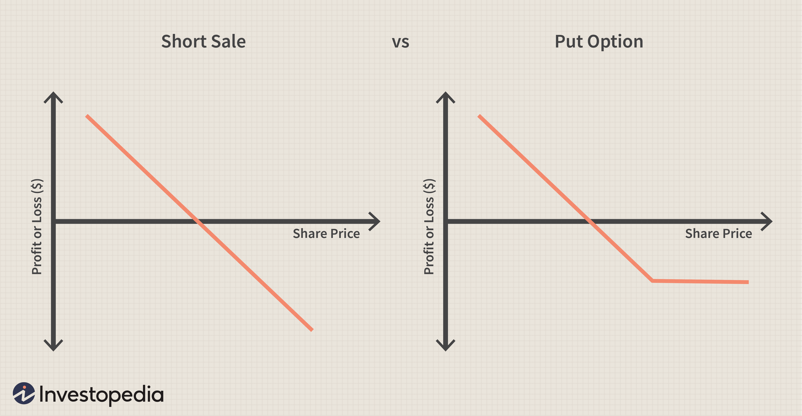

In the world of finance, derivatives such as options provide investors with unique opportunities to diversify portfolios, hedge risks, and enhance returns. Options are financial instruments that give the holder the right, but not the obligation, to buy or sell an underlying asset at a specified price before a certain date. This flexibility makes options trading a powerful tool, but it also comes with a set of challenges centered around effective risk management.

Options trading is inherently complex, requiring traders to make informed decisions while navigating market dynamics and inherent uncertainties. The risk factors include market volatility, time decay, and liquidity constraints. These aspects can significantly influence the profitability of options strategies, demanding a sophisticated understanding of both the instruments themselves and the external factors impacting them.



Algorithmic trading has significantly transformed the approach to options trading. By utilizing computer programs to execute trades based on predefined criteria, algorithmic trading offers a level of precision and efficiency that manual trading cannot match. These programs can analyze vast datasets to identify trading opportunities and execute trades at speeds impossible for human traders.

This article explores the complexities of financial derivatives, with a focus on options trading, risk management, and the role of algorithmic trading. It offers valuable insights for both beginners looking to understand the fundamentals and seasoned traders seeking advanced strategies to navigate these financial landscapes effectively. By integrating traditional and algorithmic approaches, traders can better manage the risks and rewards inherent in the dynamic world of options trading.

## Table of Contents

## Understanding Financial Derivatives and Options Trading

Financial derivatives are contracts whose value derives from an underlying asset, typically stocks, bonds, commodities, or indices. These contracts allow investors to speculate on or hedge against future price movements. Among the various types of financial derivatives, options are particularly prominent. Options provide the buyer with the right, but not the obligation, to buy or sell an underlying asset at a predetermined price, known as the strike price, before or at a specified expiration date.

Options come in two primary forms: calls and puts. A call option gives the holder the right to purchase the underlying asset at the strike price, while a put option grants the right to sell the underlying asset at the strike price. These instruments can be used for several strategic purposes, such as hedging against potential losses, generating income, or speculating on market direction. 

Understanding the basic characteristics and behaviors of options is crucial for anyone interested in options trading. This involves familiarizing oneself with how and when each type of option can be employed. For example, traders often use call options when they anticipate that an asset's price will rise and put options when they expect a price decline. Moreover, options are also leveraged instruments, which means controlling a larger position with a relatively smaller amount of capital, amplifying both potential gains and risks.

The valuation of options also involves understanding variables known as the "Greeks," which measure the sensitivity of an option's price to various factors such as the underlying asset's price movements, the passage of time, and implied [volatility](/wiki/volatility-trading-strategies). This intrinsic complexity requires traders to have a thorough comprehension of these dynamics to manage positions effectively and achieve desired investment outcomes.

By recognizing these foundational aspects, traders can better navigate options trading's opportunities and challenges, thereby positioning themselves to use options as a versatile tool within their broader investment strategy.

## Identifying and Managing Risks in Options Trading

Options trading is inherently associated with distinct risks including market volatility, time decay, and [liquidity](/wiki/liquidity-risk-premium) concerns. Addressing these risks through strategic risk management is vital for achieving successful outcomes in trading activities.

Market volatility represents a major risk in options trading, as rapid price changes can lead to significant fluctuations in the value of options. Volatility is often represented using metrics such as the VIX, which gauges market expectations of future volatility based on S&P 500 index options. Traders must remain vigilant to such variations to protect their portfolios. 

Time decay is another critical [factor](/wiki/factor-investing), particularly influencing options known as theta decay. Since options have an expiration date, their value declines as the expiration approaches, causing a natural erosion in their price over time. Understanding the rate of time decay can help traders time their strategies more efficiently.

Liquidity concerns refer to the ability to buy or sell options without causing significant impact on their prices. Low liquidity can lead to higher spreads between bid and ask prices, making it costly to enter and [exit](/wiki/exit-strategy) positions. Traders should evaluate the liquidity of options contracts, often indicated by the trading [volume](/wiki/volume-trading-strategy) and open interest, to ensure efficient execution of trades.

To manage these risks effectively, several strategies are employed:

1. **Diversification** - Spreading investments across different options and underlying assets can reduce exposure to any single asset's risk.

2. **Hedging** - Using options to hedge against potential losses in other investments is a common practice. For example, a trader may buy put options to protect against a potential drop in the price of an owned stock.

3. **Position Sizing** - Carefully determining the size of each trade relative to the entire portfolio helps mitigate the impact of individual losses.

Moreover, options traders should also be aware of technical risks associated with the digital platforms they use for trading. These platforms are susceptible to outages, data errors, and cyber threats, which can disrupt trading activities and lead to financial losses. Ensuring the use of reliable platforms, backing up trading data, and implementing robust cybersecurity measures can safeguard against such risks. 

By integrating these risk management strategies, traders can navigate the challenges of options trading more effectively, balancing the potential rewards with the associated risks.

## Advanced Risk Management Strategies

Sophisticated risk management strategies in options trading are essential for handling the complexities of market dynamics and protecting investments. Three primary methods employed by traders include stop-loss orders, delta-neutral strategies, and volatility analysis. Each of these techniques plays a significant role in managing the inherent risks associated with options trading.

Stop-loss orders are a fundamental tool used to automatically trigger the sale of an option when its price falls to a predetermined level. This mechanism helps traders limit potential losses by taking emotion out of the decision-making process. For instance, if an investor holds a call option and the underlying asset’s price begins to decline, a stop-loss order can be set to sell the option once it hits a critical price threshold, thereby preventing further financial detriment.

Delta-neutral strategies focus on the delta, which measures the sensitivity of an option's price in relation to changes in the price of the underlying asset. By adopting positions that counterbalance the delta to a net zero, traders can mitigate the risk of price movements in the underlying asset. This is achieved by carefully balancing the options and their underlying securities. For example, if a trader holds a long call with a delta of 0.5, they might short half of the underlying asset to maintain a delta-neutral position.

Volatility analysis involves examining the volatility index, implied volatility, and historical volatility to gauge the market's expectations of future price swings. A key aspect of volatility analysis is understanding the Greeks, which provide deeper insights into the risk and reward dynamics of options positions:

- **Delta (Δ):** Represents the rate of change of the option's price with respect to changes in the underlying asset's price.
- **Gamma (Γ):** Measures the rate of change of delta with respect to the price of the underlying asset, offering insights into how delta will change as the underlying asset's price moves.
- **Theta (Θ):** Indicates the rate of time decay of an option, reflecting how the option's price decreases as it nears expiration.
- **Vega (ν):** Represents the sensitivity of an option's price to changes in the underlying asset's volatility.

Evaluating potential impacts using Value at Risk (VaR) and stress testing allows traders to quantify the risk of loss in a portfolio over a specific time frame. VaR provides a statistical measure that estimates the maximum potential loss with a given confidence level. Stress testing, on the other hand, assesses how portfolios perform under extreme market conditions, helping traders prepare for unexpected market events.

These advanced risk management strategies, when applied effectively, offer traders a robust framework to navigate the complexities of options trading. By combining quantitative tools and strategic insights, traders can better control the risks and capitalize on opportunities in fluctuating market environments.

## Algorithmic Trading in Options Markets

Algorithmic trading in options markets utilizes sophisticated computer programs to execute trades based on pre-established parameters, significantly enhancing both the speed and accuracy of transactions. The dynamic nature of options markets makes [algorithmic trading](/wiki/algorithmic-trading) particularly advantageous as it allows traders to process and analyze vast datasets rapidly—identifying trading opportunities that might be undetectable through traditional manual methods.

In options trading, algorithmic systems often rely on complex mathematical models and quantitative analysis techniques to forecast price movements and determine optimal trade entry and exit points. For instance, algorithms can incorporate variables such as historical volatility, option Greeks (Delta, Gamma, Theta, Vega), and implied volatility to assess trading opportunities comprehensively.

The implementation of algorithms in options markets necessitates a profound understanding of several core areas. Firstly, proficiency in programming languages such as Python, R, or C++ is crucial for developing and testing algorithms. In addition, a solid grasp of quantitative analysis enables traders to craft strategies involving statistical models, regression analysis, and stochastic processes.

Moreover, an astute awareness of market dynamics is essential. Algorithm developers must understand market microstructure, liquidity considerations, and potential slippage effects arising from transaction costs and market impact. This knowledge helps in refining algorithms to be robust against market noise and ensure that strategies remain profitable under varying conditions.

Beyond development, the deployment of trading algorithms involves rigorous [backtesting](/wiki/backtesting)—a process where strategies are tested against historical data to confirm their effectiveness. This step helps identify any weaknesses in the algorithm that may lead to unexpected losses in real-world applications. Additionally, ongoing performance monitoring is crucial, allowing for the continuous adaptation of algorithms to evolving market trends and conditions.

Overall, the integration of algorithmic trading within options markets represents a convergence of advanced technology, data analysis, and traditional financial expertise, offering traders the tools needed to navigate complex markets with greater precision and efficacy.

## Implementing Algorithmic Strategies for Risk Management

Algorithmic strategies are essential for managing risk in options trading. Many traders employ complex algorithms to automate strategies such as delta hedging and statistical [arbitrage](/wiki/arbitrage). Delta hedging involves balancing the delta of a portfolio, a measure of how much an option's price is expected to change based on a $1 change in the underlying asset's price. By using algorithms to maintain a delta-neutral position, traders can minimize their exposure to the price movements of the underlying asset.

Statistical arbitrage, on the other hand, capitalizes on pricing inefficiencies between related financial instruments. Algorithms used in [statistical arbitrage](/wiki/statistical-arbitrage) can analyze large datasets to identify patterns, correlations, or deviations from historical norms, allowing traders to exploit these anomalies for profit. Both delta hedging and statistical arbitrage benefit greatly from automation, as it reduces human errors and eliminates emotional biases that could negatively impact trading decisions.

Backtesting is a critical component in implementing algorithmic strategies effectively. Historical data is used to simulate how an algorithm would have performed in the past, which helps traders understand its potential future performance. Backtesting enables the identification of weaknesses in the strategy and provides insights into the necessary adjustments. Optimization further fine-tunes algorithm parameters to maximize returns while controlling risks.

A Python snippet for a basic backtesting could look like this:

```python
import pandas as pd
import numpy as np

def strategy_returns(prices, strategy):
    signals = strategy(prices)
    returns = np.diff(prices) / prices[:-1]
    return (signals[:-1] * returns).cumsum()

def simple_moving_average_strategy(prices, short_window=20, long_window=50):
    short_mavg = pd.Series(prices).rolling(window=short_window, min_periods=1).mean()
    long_mavg = pd.Series(prices).rolling(window=long_window, min_periods=1).mean()
    return np.where(short_mavg > long_mavg, 1.0, -1.0)

prices = np.random.randn(100) + np.arange(100)  # Simulated price data
strat_returns = strategy_returns(prices, simple_moving_average_strategy)
```

Continuous monitoring and adjustment of algorithmic strategies are equally necessary. Market conditions are not static; they change due to various factors like economic shifts, geopolitical events, and technological developments. Adaptive algorithms, which can update their parameters in response to these changes, are more resilient and effective.

The successful implementation of algorithmic strategies for risk management often involves a feedback loop consisting of monitoring, evaluating, and refining strategies. By doing so, traders ensure that their algorithms remain relevant, effective, and aligned with their risk management objectives in dynamic market environments.

## Case Studies and Real-World Applications

The integration of algorithmic trading in options markets has been transformative for various trading strategies, as evidenced by several notable case studies. These real-world applications highlight how traders have leveraged algorithmic strategies alongside traditional risk management techniques to optimize performance and manage risks effectively.

One prominent example comes from the portfolio management success of Renaissance Technologies, a [hedge fund](/wiki/hedge-fund-trading-strategies) renowned for its quantitative strategies and extensive use of algorithms. The firm uses advanced mathematical models and extensive datasets to identify pricing discrepancies in options markets. By employing algorithms that execute trades within milliseconds, they effectively manage arbitrage opportunities while mitigating associated risks. This case illustrates the potential for algorithms to enhance decision-making processes beyond human capability, leading to increased profitability and reduced risk exposure.

In another instance, Goldman Sachs applied algorithmic trading to execute complex options strategies with high-frequency trading components. By developing advanced predictive models, the firm could anticipate market movements and efficiently manage substantial options volumes even during volatile conditions. This capability proved especially valuable during events of extreme market stress, where traditional trading methods could falter. Goldman's approach exemplifies integrating quantitative data analysis and [machine learning](/wiki/machine-learning) to forecast price developments with high precision.

A further example involves the use of delta-neutral strategies enhanced through algorithmic execution. Wolves.Tech, a tech-driven trading firm, developed automated algorithms capable of managing delta-neutral portfolios in real-time. This approach involves continually adjusting options positions to maintain a balance in delta exposure, effectively controlling directional risk while capturing volatility profits. The integration of algorithmic trading allowed Wolves.Tech to automate adjustments based on real-time market data, increasing efficiency and minimizing manual trading errors.

Each of these cases underscores the significance of keeping pace with technological advancements. For traders, staying informed about the latest developments in algorithmic strategies and risk management techniques is crucial for maintaining a competitive advantage in dynamic markets. By leveraging the capabilities of algorithms, traders can successfully integrate these technologies with traditional practices, enhancing their overall trading strategy and performance. Thus, the role of algorithmic trading in options markets continues to grow, offering new opportunities for innovation and optimization in finance.

## Conclusion: Navigating the Risks and Rewards

Trading financial derivatives such as options presents traders with opportunities to attain significant rewards by leveraging strategic positions based on the price movements of underlying assets. However, these opportunities come hand-in-hand with substantial risks. Effective risk management is crucial for navigating these challenges, allowing traders to protect their investments and optimize returns. Implementing algorithmic strategies can further enhance this process, providing a tangible competitive advantage.

In the context of options trading, risk management involves strategies such as diversification, hedging, and position sizing to mitigate exposure to market volatility, time decay, and liquidity constraints. Adopting algorithmic trading brings an added layer of precision to these strategies. Algorithms, with their ability to process large datasets and execute trades at high speed, can help traders react swiftly to market developments, minimizing potential losses and maximizing profit potential.

Algorithmic strategies, such as delta hedging, enable traders to maintain a neutral position relative to the underlying asset's price movements, thereby stabilizing risk levels. Further, advanced algorithms can perform continuous backtesting and optimization, ensuring strategies are not only effective under current market conditions but adaptable to future changes.

As technology continues to evolve, staying informed about the latest advancements is crucial for traders. This approach helps them to remain competitive in the dynamic landscape of options trading. Tools like machine learning and big data analytics are increasingly becoming integral to refining trading algorithms, offering deeper insights into market patterns and behaviors.

In conclusion, the potential returns of trading financial derivatives are balanced by inherent risks. Effective risk management combined with the strategic use of algorithmic trading can significantly enhance a trader's ability to navigate these risks successfully. As the financial landscape shifts with technological advancements, adaptability and continuous learning remain essential for traders aiming to succeed in the options market.

## References & Further Reading

[1]: Black, F., & Scholes, M. (1973). ["The Pricing of Options and Corporate Liabilities"](https://www.cs.princeton.edu/courses/archive/fall09/cos323/papers/black_scholes73.pdf). Journal of Political Economy, 81(3), 637-654.

[2]: Hull, J. C. (2018). ["Options, Futures, and Other Derivatives"](https://www.semanticscholar.org/paper/Options%2C-Futures%2C-and-Other-Derivatives-Hull/89bdee500c8623864fc9eb7a471546aa713acc44) (9th ed.). Pearson.

[3]: Narang, R. (2013). ["Inside the Black Box: A Simple Guide to Quantitative and High-Frequency Trading"](https://onlinelibrary.wiley.com/doi/book/10.1002/9781118662717) (2nd ed.). Wiley.

[4]: Lopez de Prado, M. (2018). ["Advances in Financial Machine Learning"](https://www.amazon.com/Advances-Financial-Machine-Learning-Marcos/dp/1119482089). Wiley.

[5]: Chriss, N. A. (1997). ["Black-Scholes and Beyond: Option Pricing Models"](https://archive.org/details/blackscholesbeyo00chri_0). McGraw-Hill.

[6]: Taleb, N. N. (1997). ["Dynamic Hedging: Managing Vanilla and Exotic Options"](https://archive.org/details/dynamichedgingma0000tale). Wiley.

[7]: Chan, E. (2009). ["Quantitative Trading: How to Build Your Own Algorithmic Trading Business"](https://github.com/ftvision/quant_trading_echan_book). Wiley.

[8]: Jansen, S. (2020). ["Machine Learning for Algorithmic Trading"](https://github.com/stefan-jansen/machine-learning-for-trading). Packt Publishing.