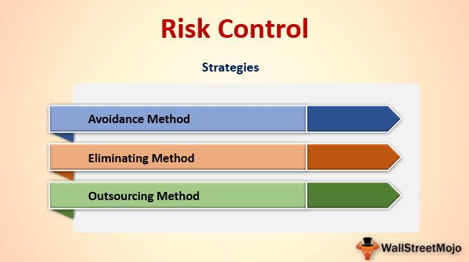

Algorithmic trading has revolutionized financial markets, bringing both opportunities and challenges. As algorithms execute trades at incredible speeds, they also require a sophisticated approach to risk management. Understanding and managing risk is critical to ensure the stability and profitability of trading strategies.

Risk control, risk management, and risk mitigation are fundamental for traders in navigating the complexities of financial markets. Each element plays a distinct role in ensuring that the automated processes do not become liabilities. Risk control involves identifying potential threats and implementing strategies to address them effectively. For instance, traders may implement loss prevention measures or diversify their portfolios to mitigate potential losses.



Risk management covers a broader spectrum, involving a comprehensive understanding of various risks—technical, market, operational, and behavioral—that traders face. By using tools such as stop-loss orders and position sizing, traders can manage their exposure and maintain control over trading activities. An effective risk management strategy enables traders to adapt to changing market conditions, maintaining the efficacy of their trading strategies.

Risk mitigation is about reducing the potential adverse impacts of unforeseen events or market volatility. Advanced techniques, such as hedging strategies and quantitative risk analysis, allow traders to buffer against sudden market shifts.

Algorithmic trading necessitates an advanced approach to managing these inherent risks. The automatic nature of trade execution means that there is little room for error, emphasizing the need for robust risk management frameworks. Technological advancements, such as machine learning and AI, offer tools that can predict risks based on real-time data, allowing traders to make informed decisions swiftly.

In conclusion, understanding the nuances of risk management is crucial in the fast-paced world of algorithmic trading. By prioritizing risk control, management, and mitigation, traders can navigate uncertainties more effectively, potentially enhancing their market position and ensuring sustained success.

## Table of Contents

## The Role of Risk Control in Algo Trading

Algorithmic trading demands rigorous attention to risk control, a pivotal component designed to mitigate potential threats. In the context of algo trading, risk control seeks to evaluate and implement strategies that either minimize or entirely eliminate risks associated with market uncertainties. The automated nature of [algorithmic trading](/wiki/algorithmic-trading) systems means that errors can quickly escalate if not managed proactively; thus, effective risk control is vital to safeguard investments and optimize trading strategies.

Traders can significantly enhance their confidence in navigating the complexities of the financial markets by mastering various risk control techniques. These techniques allow for a structured approach to uncertainty, whereby potential risks are systematically identified, assessed, and addressed.

Avoidance is the first critical strategy. It involves refraining from engaging in specific trades that present high levels of risk beyond an acceptable threshold. By setting stringent trading criteria, traders can ensure that their algorithms operate only within environments that align with their predefined risk appetites.

Loss prevention and loss reduction are closely related strategies that aim to minimize the impact of adverse market movements. Loss prevention involves taking steps to prevent potential trading errors from occurring, such as implementing robust algorithm checks and fail-safes. Conversely, loss reduction focuses on diminishing the impact of such errors should they occur. This could involve preemptively setting stop-loss orders or utilizing other [exit](/wiki/exit-strategy) strategies to cap potential losses.

Separation and duplication are complementary strategies that enhance resilience. Separation involves dividing assets across different trading strategies or accounts to isolate risk; should one strategy fail, the others remain unaffected. Duplication, while seemingly similar, involves replicating successful strategies across diverse instruments or markets. This replication diversifies the risk profile, ensuring that performance is not reliant on a single source.

Finally, diversification is a cornerstone of risk control in algorithmic trading. By distributing capital across various asset classes, sectors, or geographic regions, traders can spread their risk exposure and reduce the impact of adverse occurrences in any single area. Diversification ensures that the overall portfolio remains balanced and resilient in volatile market conditions.

In summary, understanding the nuances of risk control in algorithmic trading is essential for traders seeking to manage complexity and safeguard their investments. By employing strategies such as avoidance, loss prevention, loss reduction, separation, duplication, and diversification, traders can effectively navigate market uncertainties and enhance their trading strategies.

## Risk Management Strategies in Algorithmic Trading

Effective risk management in algorithmic trading necessitates a thorough understanding of various risk categories, namely technical, market, operational, and behavioral risks. This comprehensive understanding allows traders to anticipate potential threats and employ strategic measures to minimize risk exposure.

Technical risks arise from the technological infrastructure and algorithmic logic employed in trading. Ensuring robust software development, regular system testing, and reliable data feeds are crucial to mitigating these risks. Market risks, on the other hand, relate to the potential losses due to market changes, which can be addressed through tools such as stop-loss orders, position sizing, and diversification. Stop-loss orders automatically close positions once they reach a predefined loss threshold, thereby limiting potential losses. Position sizing refers to determining the optimal number of units to trade based on risk tolerance and portfolio size. Diversification involves spreading investments across various asset classes to reduce the impact of a downturn in any single market.

Operational risks stem from internal processes, human errors, and external events affecting trading operations. To manage these risks, traders implement stringent operational protocols, conduct regular audits, and develop contingency plans. Behavioral risks arise from the cognitive biases and emotional responses of traders themselves. Staying informed and implementing systematic trading rules can help counteract these psychological pitfalls.

Adapting to dynamic market conditions is essential in maintaining effective trading strategies. This requires a proactive approach, with algorithmic traders continuously analyzing real-time data and adjusting their strategies accordingly. An adaptive risk management framework not only fortifies the existing strategies against current market volatilities but also prepares them for future uncertainties.

In conclusion, by understanding the multifaceted nature of risks and employing systematic strategies, traders can effectively mitigate risk exposure and optimize their trading performance.

## Risk Mitigation Techniques

In algorithmic trading, risk mitigation is critical to prevent substantial losses due to unforeseen market changes and [volatility](/wiki/volatility-trading-strategies). To achieve this, traders employ advanced techniques like hedging and quantitative risk analysis. 

Hedging involves creating positions that offset potential losses in other investments. By trading instruments that have inverse relationships, traders can protect their portfolios from adverse price movements. For instance, if a trader holds a long position on a stock expecting it to rise, they can simultaneously take a short position on a similar security or an index to hedge against potential losses if the stock price falls. This approach minimizes the financial impact of unexpected downturns in the market.

Quantitative risk analysis, on the other hand, utilizes mathematical models and statistical techniques to assess and manage risks. Traders analyze historical data and conduct simulations to predict potential market behaviors and their consequent risk implications. The Value at Risk (VaR) model is commonly used to estimate the potential loss in the value of a portfolio under normal market conditions over a set time frame. The model can be represented as:

$$
\text{VaR} = \mu - \sigma \times z
$$

where $\mu$ is the expected return, $\sigma$ is the standard deviation of the portfolio's returns, and $z$ is the z-score corresponding to the desired confidence level.

To ensure that risk mitigation techniques remain effective, traders engage in continuous monitoring and refinement of their strategies. As market conditions change, it is essential to adjust models and hedging positions accordingly. Advanced trading platforms and tools help traders automate the monitoring process and quickly respond to changes, maintaining the robustness of their risk mitigation efforts. By integrating these sophisticated techniques, algorithmic traders can better shield their investments from the unpredictable nature of financial markets.

## Utilizing Technology for Enhanced Risk Management

Algorithmic traders harness the power of technology and data analysis to forecast potential risks and make informed decisions. In an industry characterized by rapid changes and complexities, the utilization of [machine learning](/wiki/machine-learning) and [artificial intelligence](/wiki/ai-artificial-intelligence) (AI) has become indispensable. These advanced tools enhance risk assessment and management, allowing traders to stay ahead of market dynamics.

Machine learning algorithms analyze vast amounts of historical and real-time data, identifying patterns and trends that might be invisible to the human eye. For example, using techniques such as logistic regression, decision trees, or neural networks, traders can develop predictive models that estimate the probability of adverse market events. This ability to foresee risks enables traders to implement preemptive measures, thus safeguarding their portfolios.

AI-driven technologies also facilitate the continuous processing of incoming data, ensuring that trading strategies remain aligned with current market conditions. Real-time data feeds, processed using natural language processing (NLP) or sentiment analysis, allow traders to interpret market mood and volatility more effectively. Here’s a simple Python example of how sentiment analysis might be implemented:

```python
from textblob import TextBlob
import requests

def fetch_market_news():
    # Hypothetical function for fetching current market news
    response = requests.get('http://api.marketnews.com/latest')
    return response.json()

def analyze_sentiment(news):
    sentiment_scores = []
    for article in news:
        blob = TextBlob(article['content'])
        sentiment_scores.append(blob.sentiment.polarity)
    return sum(sentiment_scores) / len(sentiment_scores)

current_news = fetch_market_news()
market_sentiment = analyze_sentiment(current_news)
print(f"Current market sentiment score: {market_sentiment}")
```

Such sentiment analysis allows traders to adjust their strategies quickly if the market sentiment shifts, demonstrating the adaptability offered by technology. Moreover, AI can optimize position sizing and portfolio rebalancing, minimizing exposure to risk while maximizing potential returns.

One significant advantage of technological integration is the capacity to backtest strategies against historical data, ensuring that algorithms are not only theoretically sound but also practically viable. By simulating different market scenarios, traders can refine their algorithms, reducing the likelihood of unexpected failures.

Ultimately, the continuous evolution of AI and machine learning systems empowers traders to fine-tune their risk management approaches, ensuring they remain agile and responsive to an ever-changing financial landscape. By leveraging these technological advancements, traders are better equipped to navigate the uncertainties inherent in financial markets.

## Real-world Examples of Effective Risk Control

Case studies provide practical insights into how organizations can effectively implement risk control measures. Two notable examples are BP's response to the Deepwater Horizon oil spill and Starbucks' management of its supply chain.

BP's post-oil spill measures offer a vivid illustration of crisis management and risk control in action. The Deepwater Horizon accident in 2010 was one of the largest environmental disasters, with extensive financial and reputational damages. In response, BP undertook substantial efforts to control and mitigate the risk of future incidents. These measures included the enhancement of safety protocols, investment in advanced drilling technologies, and strengthening operational oversight. BP's approach underscores the significance of learning from past mistakes to develop more robust risk mitigation strategies. The company also implemented extensive training programs for staff to enhance safety culture across its operations, highlighting the critical role of human factors in risk management.

Starbucks exemplifies effective risk management through its supply chain strategies. The company faces numerous risks, including fluctuating coffee bean prices, climate change impacts, and transportation disruptions. Starbucks mitigates these risks by diversifying its supply base, investing in sustainable farming practices, and building long-term relationships with suppliers. This diversification ensures that the company is not overly dependent on a single geographic region or supplier, thus reducing its overall risk exposure. Furthermore, Starbucks employs hedging strategies to manage price volatility and continuously assesses its supply chain for potential vulnerabilities, adapting its strategies as necessary to maintain operational resilience.

Both BP and Starbucks emphasize the importance of continuous improvement and adaptation in risk management practices. By learning from past incidents and integrating advanced technologies and processes, organizations can enhance their ability to control risks effectively and maintain stability in dynamic environments.

## Challenges and Opportunities in Risk Management for Algo Trading

In the fast-evolving landscape of algorithmic trading, the utilization of technology presents both opportunities and challenges in risk management. The potential of technology to enhance risk management is significant; however, it simultaneously introduces complexities such as model risk and data integrity.

Model risk arises from the possibility that a financial model may not perform as expected. In algo trading, where strategies are heavily reliant on mathematical models and algorithms, the risks of inaccuracies, overfitting, or erroneous assumptions can lead to substantial financial losses. For instance, a model that fails to account for unprecedented market movements can produce suboptimal trading decisions. Consequently, traders must rigorously validate and back-test their models using historical and synthetic data to ensure robustness and reliability. Continual monitoring and recalibration of models are essential to adapt to changing market conditions and maintain their relevance.

Data integrity is another vital challenge. Algo trading systems depend on accurate, high-quality data to function effectively. Inadequate data quality can significantly impact the performance of trading algorithms, leading to erroneous analysis and decision-making. Traders must implement stringent data quality checks and use data cleansing techniques to mitigate these risks. Ensuring that data feeds are secure, timely, and free from errors is crucial for maintaining data integrity.

Amidst these challenges, regulatory compliance and ethical considerations play a critical role in sustaining trading strategies. As algorithmic trading continues to grow, regulatory bodies across the globe are imposing stricter regulations aimed at ensuring market integrity and protecting investors. Traders must navigate these requirements, including adhering to order-to-trade ratios, maintaining sufficient audit trails, and ensuring fair execution practices.

Ethical considerations are equally important. Traders should design algorithms that avoid market manipulation and ensure fair access to market information. Transparency in algorithmic operations and intentions is vital to maintaining trust and credibility in the financial markets.

While these challenges may seem formidable, they also present opportunities. Advancements in machine learning and artificial intelligence offer traders innovative solutions for improving risk management. For example, AI-driven predictive analytics can help in identifying subtle market trends that traditional models might miss, thus improving decision-making accuracy. The use of blockchain technology can potentially enhance data integrity by providing decentralized and tamper-proof record-keeping solutions.

In conclusion, the integration of cutting-edge technology in algorithmic trading provides traders with powerful tools to enhance their risk management capabilities. However, they must remain vigilant to the challenges posed by model risk, data integrity, regulatory compliance, and ethical standards. By carefully balancing these elements, traders can turn challenges into opportunities, ensuring sustainable and effective trading strategies.

## Conclusion

Risk control, management, and mitigation are interdependent elements that form the backbone of successful algorithmic trading. Each component plays a critical role in ensuring that trading strategies are not only effective but also resilient to the complexities and uncertainties of financial markets. Effective risk management begins with a well-structured risk control plan that identifies potential threats and implements strategies to minimize or eliminate them. This proactive approach allows traders to safeguard their investments against adverse events, thus enhancing their market position.

The dynamic nature of algorithmic trading necessitates constant vigilance and adaptation. By prioritizing risk control, traders can develop robust strategies that withstand volatility and market shifts. Moreover, the integration of technology, such as machine learning and AI-driven tools, has revolutionized risk management by enabling real-time data processing and advanced risk assessment. These technological advancements provide traders with the capability to predict potential risks and adjust their strategies accordingly.

However, the continued evolution of technology and regulations presents both challenges and opportunities. Traders must navigate issues such as model risk, data integrity, and regulatory compliance to ensure their strategies remain sustainable. These factors highlight the importance of adopting innovative risk management strategies that are both adaptable and compliant with evolving standards.

In conclusion, risk control, management, and mitigation are essential components of algorithmic trading that help traders effectively manage uncertainties. By leveraging technology and adhering to regulatory frameworks, traders can capitalize on opportunities while maintaining a competitive edge in the market. This comprehensive approach to risk management is crucial for success in the ever-evolving landscape of financial trading.

## References & Further Reading

[1]: Bergstra, J., Bardenet, R., Bengio, Y., & Kégl, B. (2011). ["Algorithms for Hyper-Parameter Optimization."](https://dl.acm.org/doi/10.5555/2986459.2986743) Advances in Neural Information Processing Systems 24.

[2]: ["Advances in Financial Machine Learning"](https://www.amazon.com/Advances-Financial-Machine-Learning-Marcos/dp/1119482089) by Marcos Lopez de Prado

[3]: ["Evidence-Based Technical Analysis: Applying the Scientific Method and Statistical Inference to Trading Signals"](https://www.amazon.com/Evidence-Based-Technical-Analysis-Scientific-Statistical/dp/0470008741) by David Aronson

[4]: ["Machine Learning for Algorithmic Trading"](https://github.com/PacktPublishing/Machine-Learning-for-Algorithmic-Trading-Second-Edition) by Stefan Jansen

[5]: ["Quantitative Trading: How to Build Your Own Algorithmic Trading Business"](https://books.google.com/books/about/Quantitative_Trading.html?id=j70yEAAAQBAJ) by Ernest P. Chan