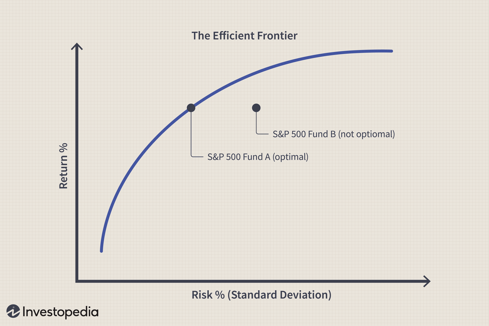

## Table of Contents

## What is a risk curve?

A risk curve is a graph that shows how much risk is involved in different situations or choices. It helps people understand the relationship between risk and reward. For example, in investing, a risk curve can show that higher risks might lead to higher rewards, but it also means there's a bigger chance of losing money.

In everyday life, a risk curve can be used to make decisions. For instance, if you're thinking about trying a new hobby, the risk curve can help you see if the potential fun and benefits are worth the risks, like the chance of getting hurt or spending a lot of money. By looking at the risk curve, you can make smarter choices and understand what might happen if you take a certain action.

## Why is understanding a risk curve important for decision-making?

Understanding a risk curve is important for decision-making because it shows you the possible outcomes of your choices. It helps you see how much risk you are taking and what you might gain or lose. This way, you can make choices that match what you are comfortable with. For example, if you know that a certain investment has a high risk but also a high reward, you can decide if it's worth it for you.

Using a risk curve also helps you plan better. By looking at the curve, you can prepare for different situations and have a backup plan if things don't go as expected. This makes your decisions more thoughtful and less about guessing. Overall, a risk curve gives you a clear picture of what might happen, helping you make smarter choices in life, whether it's about money, health, or trying new things.

## How is a risk curve typically represented graphically?

A risk curve is usually shown on a graph with two lines that cross each other. One line goes up and down and shows how much risk there is. The other line goes left to right and shows how much reward you might get. The curve itself is a line that bends and shows how risk and reward are connected. If the curve goes up a lot, it means that for a little more risk, you can get a lot more reward. If it goes up slowly, it means you need to take a lot more risk to get just a little more reward.

Sometimes, the risk curve can be shown in different ways depending on what it's used for. For example, in finance, the curve might be drawn with numbers that show how much money you could make or lose. In other situations, like health or safety, the curve might use different measures, like the chance of getting sick or hurt. No matter how it's shown, the main idea is the same: the risk curve helps you see how much risk you're taking and what you might gain from it.

## What are the basic components of a risk curve?

A risk curve has a few basic parts that help you understand it. The first part is the x-axis, which is the line that goes left to right on the graph. This line shows the reward or benefit you might get from taking a risk. The numbers on this line can be things like money you could earn or how much fun you might have. The second part is the y-axis, which is the line that goes up and down. This line shows the amount of risk you are taking. The numbers here can show things like the chance of losing money or getting hurt.

The third part of a risk curve is the curve itself, which is a line that bends and shows how risk and reward are connected. If the curve goes up a lot, it means that for a little more risk, you can get a lot more reward. If it goes up slowly, it means you need to take a lot more risk to get just a little more reward. Understanding these parts helps you see how much risk you are taking and what you might gain from it, making it easier to make smart choices.

## Can you explain the difference between a risk curve and a risk-return tradeoff?

A risk curve and a risk-return tradeoff are related ideas, but they are a bit different. A risk curve is a graph that shows how risk and reward are connected. It helps you see how much reward you might get for taking different levels of risk. The curve on the graph bends to show that sometimes a little more risk can give you a lot more reward, and other times you need to take a lot more risk just to get a little more reward. This helps you understand what might happen if you take a certain action.

A risk-return tradeoff is a simpler idea that says if you want more reward, you usually have to take more risk. It's like a rule that says you can't have a big reward without taking a big risk. While a risk curve shows this idea on a graph, the risk-return tradeoff is just the general idea that more risk can lead to more reward. Both ideas help you make choices, but the risk curve gives you a more detailed picture of what might happen.

## How do different industries use risk curves in their planning?

In the finance industry, risk curves are used to help make decisions about investments. People in finance look at the risk curve to see how much money they might make and how much they might lose. If the curve shows that a certain investment has a high risk but also a high reward, they might decide to go for it if they think the reward is worth the risk. This helps them plan their investments and manage their money better. They can also use the risk curve to explain to their clients why they are making certain choices, making it easier for everyone to understand the risks and rewards.

In the healthcare industry, risk curves help doctors and hospitals plan treatments for patients. They use the curve to see the risks of different treatments and how much they might help the patient. For example, a new medicine might have a high risk of side effects but could also cure a serious illness. By looking at the risk curve, doctors can decide if the medicine is worth trying. This helps them plan the best care for their patients and explain the choices to them clearly. It also helps hospitals decide how to spend their money on different treatments and medicines.

In the engineering industry, risk curves are used to plan projects like building bridges or designing new products. Engineers look at the risk curve to see the risks of different choices and how much they might improve the project. For example, using a new material might have a high risk of failing but could also make the bridge stronger. By studying the risk curve, engineers can decide if the new material is worth using. This helps them plan safer and better projects, and it also helps them explain their choices to the people who will use the bridge or product.

## What are common methodologies for constructing a risk curve?

To make a risk curve, people often start by gathering data about the risks and rewards of different choices. They might look at past events to see what happened when people took certain risks. For example, in finance, they might study how different investments did over time. They use this data to figure out how likely it is that something good or bad will happen. Then, they put this information on a graph. The x-axis shows the reward, like how much money you might make, and the y-axis shows the risk, like the chance of losing money. They draw a line that shows how risk and reward are connected, and this line is the risk curve.

Another way to make a risk curve is by using math models. These models use numbers and formulas to guess what might happen in the future. People put in information about the risks and rewards, and the model calculates how they might be connected. This can be useful when there isn't a lot of past data to look at. For example, in healthcare, they might use a model to predict how well a new medicine will work and what side effects it might have. Once they have the results from the model, they can draw the risk curve on a graph. This helps them see how much risk they are taking and what they might gain from it.

## How does the shape of a risk curve influence strategic decisions?

The shape of a risk curve can tell you a lot about the choices you have to make. If the curve goes up a lot, it means that for a little more risk, you can get a lot more reward. This might make you want to take the risk if you think the reward is worth it. For example, in business, if the risk curve shows that a new product could make a lot of money with just a little more risk, the company might decide to go ahead with it. On the other hand, if the curve goes up slowly, it means you need to take a lot more risk to get just a little more reward. This might make you think twice about taking the risk because it might not be worth it.

The shape of the risk curve also helps you plan for the future. If the curve shows that the risks are high but the rewards are low, you might want to have a backup plan in case things go wrong. For example, in healthcare, if a new treatment has a high risk of side effects but only a small chance of helping the patient, doctors might decide to use it only if other treatments don't work. By looking at the risk curve, you can make smarter choices and be ready for different outcomes. This helps you make decisions that are more likely to work out well in the end.

## What are the limitations of using risk curves in predictive modeling?

One big problem with using risk curves in predictive modeling is that they rely on past data. If the past doesn't look like the future, the risk curve might not be very helpful. For example, if a new technology changes how things work, the old data might not tell you what will happen next. Also, risk curves can be hard to make if you don't have a lot of good data. If you're trying to predict something new, like how a new medicine will work, you might not have enough information to draw a good risk curve.

Another issue is that risk curves can be too simple. Real life is often more complicated than a graph can show. A risk curve might not include all the things that can affect the outcome, like how people feel or what other things are happening at the same time. This means the curve might not give you the whole picture. Even if you use math models to make the curve, these models can be wrong if they don't think about all the different things that can happen. So, while risk curves can help you make decisions, you need to remember their limits and use other ways to check your choices too.

## How can risk curves be adjusted for different risk tolerance levels?

Risk curves can be changed to fit different people's comfort with risk. If someone likes to take big risks, they might want a risk curve that shows bigger rewards for the same amount of risk. To do this, you can move the curve up on the graph so it shows more reward for each level of risk. On the other hand, if someone doesn't like taking risks, they might want a curve that shows smaller rewards for the same risk. You can move the curve down on the graph to show less reward for each level of risk. This way, the risk curve can help everyone, no matter how they feel about risk.

Another way to adjust risk curves for different risk tolerance levels is by changing how steep the curve is. If someone is okay with taking more risk, you can make the curve steeper so it shows that a little more risk can lead to a lot more reward. If someone is not comfortable with risk, you can make the curve less steep so it shows that you need to take a lot more risk to get just a little more reward. By changing the steepness of the curve, you can help people see the risks and rewards in a way that fits their comfort level.

## What advanced statistical techniques can enhance the accuracy of a risk curve?

One way to make a risk curve more accurate is by using a technique called regression analysis. This method helps you see how different things are connected. For example, in finance, you can use regression to figure out how the price of a stock changes with different risks. By doing this, you can make a risk curve that is more exact and shows what might happen in the future. Regression analysis can also help you see if there are other things, like the economy or news events, that might affect the risk and reward. This makes the risk curve better at predicting what will happen.

Another advanced technique is called Monte Carlo simulation. This method uses a computer to run many different scenarios and see what might happen. For example, in healthcare, you can use Monte Carlo simulation to predict how a new medicine might work for different people. By running these simulations, you can make a risk curve that shows all the possible outcomes and how likely they are. This helps you see the full range of risks and rewards, making your predictions more accurate. Both regression analysis and Monte Carlo simulation can make risk curves more helpful for making decisions.

## How do experts validate and update risk curves over time?

Experts validate and update risk curves by looking at new data and checking if the old risk curve still works. They collect new information about what has happened since the last time they made the curve. For example, in finance, they might look at how new investments have done. If the new data shows that the old risk curve is not right anymore, they change it to fit the new information. This helps make sure the risk curve stays useful and accurate for making choices.

To update a risk curve, experts often use the same methods they used to make it in the first place. They might use regression analysis to see how the new data changes the connection between risk and reward. Or they might use Monte Carlo simulations to see all the possible outcomes with the new information. By doing this, they can draw a new risk curve that shows the latest risks and rewards. This way, the risk curve keeps helping people make smart decisions as things change over time.

## What is the Risk Curve and how can we explore it?

The risk curve is a visual representation of the relationship between risk and return, providing a foundational framework in financial analysis. In the specific context of algorithmic trading, this concept is pivotal for evaluating the balance between the expected returns of a trading strategy and the inherent risks involved. The insights derived from the risk curve enable traders to understand the trade-offs they are making and facilitate the optimization of trading strategies to achieve maximum returns while endeavoring to minimize potential losses.

Within algo trading, the risk curve is employed to analyze and compare different trading strategies and the associated risks. One common method to illustrate this relationship is the Risk-Return Tradeoff graph, where the y-axis represents expected returns and the x-axis represents the risk, usually expressed as [volatility](/wiki/volatility-trading-strategies) or standard deviation. This visualization aids traders in assessing how various assets or strategies might behave under different market conditions, thereby informing decisions about which strategies might yield the optimal balance between risk and reward.

Using the risk curve, traders can apply various quantitative tools and methodologies to refine their strategies. For instance, by employing techniques such as mean-variance optimization, traders can select a portfolio that sits on the efficient frontier—a set of optimal portfolios offering the highest expected return for a defined level of risk. The mathematical formula for this optimization involves solving a quadratic programming problem:

$$
\begin{align*}
\min & \quad \sigma^T \Sigma \sigma \\
\text{subject to} & \quad \mu^T \sigma = R_f \\
& \quad \mathbf{1}^T \sigma = 1
\end{align*}
$$

Where:
- $\sigma$ represents the portfolio weights
- $\Sigma$ is the covariance matrix of asset returns
- $R_f$ is the target return
- $\mu$ is the vector of expected returns
- $\mathbf{1}$ is a vector of ones

Understanding where different asset classes or trading strategies fall on the risk curve can significantly inform strategy development and execution decisions. For example, high-risk, high-return strategies might be suitable for some traders or conditions, while more conservative approaches might be preferred in others. By positioning a portfolio or trading strategy along the risk curve appropriately, traders can better align their risk tolerance with expected outcomes.

In conclusion, the risk curve serves as an essential tool in algorithmic trading, enabling traders to visualize and assess the trade-offs between risk and return. This understanding supports informed decision-making and strategic adjustments that can enhance the effectiveness and resilience of trading strategies.

## References & Further Reading

[1]: Prayag, S., & Shah, C. (2018). ["Algorithmic Trading and the Importance of Risk Management."](https://www.simmons-simmons.com/en/publications/ck0alau5hnf4u0b33k721db1a/050718-algorithmic-trading-and-pras-focus-on-senior-management-responsibility) IIMB Management Review.

[2]: Aldridge, I. (2013). ["High-Frequency Trading: A Practical Guide to Algorithmic Strategies and Trading Systems"](https://www.amazon.com/High-Frequency-Trading-Practical-Algorithmic-Strategies/dp/1118343506). Wiley.

[3]: Kissell, R. (2013). ["The Science of Algorithmic Trading and Portfolio Management"](https://www.sciencedirect.com/book/9780124016897/the-science-of-algorithmic-trading-and-portfolio-management). Academic Press.

[4]: Marcos Lopez de Prado. (2018). ["Advances in Financial Machine Learning"](https://www.amazon.com/Advances-Financial-Machine-Learning-Marcos/dp/1119482089). Wiley.

[5]: Chan, E. P. (2009). ["Quantitative Trading: How to Build Your Own Algorithmic Trading Business"](https://github.com/ftvision/quant_trading_echan_book). Wiley.

[6]: Jansen, S. (2020). ["Machine Learning for Algorithmic Trading"](https://github.com/stefan-jansen/machine-learning-for-trading).

[7]: Aronson, D. R. (2007). ["Evidence-Based Technical Analysis: Applying the Scientific Method and Statistical Inference to Trading Signals"](https://onlinelibrary.wiley.com/doi/book/10.1002/9781118268315). Wiley.