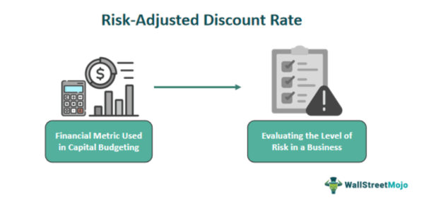

Financial risk management plays a vital role in trading and investment by enabling market participants to identify, assess, and mitigate potential losses. In today's volatile financial markets, understanding and managing risk is crucial to achieving consistent returns and safeguarding capital. Integral to this is the concept of risk discount, which reflects the decreased value investors might be willing to pay for an asset due to perceived risks. Unlike risk premiums, where investors require additional returns to compensate for risk exposure, risk discounts are subtracted to adjust valuation based on risk factors. Risk discount is essential in algorithmic trading, where strategies are systematically executed using pre-set rules and models, enabling traders to incorporate real-time risk assessments into their trading decisions.

Algorithmic trading, also known as algo-trading, has gained momentum in modern financial markets due to advancements in technology and data analytics. It allows for fast, efficient, and accurate trading by utilizing complex algorithms to analyze multiple market variables simultaneously. This automation helps in executing large volumes of trades quickly, reducing the potential for human error, and optimizing trade execution costs. As algorithmic trading grows in prominence, so does the need for robust risk management strategies to counterbalance the inherent risks, such as market volatility, data errors, and system failures.



This article will cover key topics central to contemporary financial risk management and valuation within the context of algorithmic trading. It will explore strategies for managing risk, including the application of risk discounts and premiums, and discuss valuation techniques commonly used in assessing asset worth, such as the discounted cash flow method. Additionally, we will examine the integration of risk management tools like Value at Risk (VaR) in algorithmic systems and delve into advanced risk management techniques, including the use of machine learning and data analytics. The aim is to provide a comprehensive understanding of how financial risk management is essential to enhancing the stability and efficiency of trading strategies in an ever-evolving financial landscape.

## Table of Contents

## Understanding Financial Risk and Risk Discounts

Financial risk refers to the possibility of losing financial resources due to market fluctuations, credit defaults, illiquidity, operational failings, or other financial uncertainties. For investors, these risks can manifest as losses in asset value, reduced income streams, or additional capital costs, ultimately affecting the overall return on their investments. Addressing financial risk is crucial for preserving capital and achieving investment objectives in uncertain market conditions.

A risk discount is a reduction in the expected value or cost of an asset due to the uncertainty associated with its future returns. It acts as a hedge against potential losses by accounting for uncertainties in asset valuation. In contrast, a risk premium is the additional return expected by an investor for taking on higher risk. While a risk discount reduces the valuation of an asset to reflect uncertainty, a risk premium increases expected returns to compensate for risk exposure. Both concepts are integral to investment decisions, reflecting the trade-off between risk and return.

Risk discounts are critical in investment decisions as they adjust asset valuations to reflect inherent risks. This adjustment ensures that investors make informed decisions by considering potential adverse outcomes. By incorporating a risk discount, investors account for uncertainties like market volatility, geopolitical events, or regulatory changes, which might impact an asset's performance.

Examples of scenarios where risk discounts might be utilized include:

1. **Startup Investments**: Venture capitalists often apply substantial risk discounts when evaluating startups due to their high failure rates and uncertain cash flow projections.

2. **Real Estate Valuation**: When assessing properties in economically unstable regions, investors might apply a risk discount to account for potential market downturns or regulatory changes that could impact property values.

3. **Emerging Market Bonds**: Investors demand risk discounts on bonds issued by emerging markets due to the higher risk of default or economic instability compared to established markets.

In financial markets, risk discounts serve as a critical tool for accurately pricing assets by acknowledging potential uncertainties, thus aiding investors in making well-informed decisions that align with their risk tolerance and investment objectives.

## Valuation Techniques in Financial Markets

Valuation techniques in financial markets are critical tools that investors and financial analysts use to assess the worth of various financial instruments, businesses, or markets. These techniques primarily aim to estimate the intrinsic value based on expected future cash flows, asset values, or other relevant financial metrics. Accurate valuation is essential for making informed investment decisions, ensuring that investments yield adequate returns relative to their risks.

One of the most common valuation techniques is the Discounted Cash Flow (DCF) method. This approach involves forecasting the expected cash flows that an investment will generate and then discounting these cash flows back to their present value using a discount rate. The discount rate typically reflects the risk and time value of money associated with the investment.

$$
\text{DCF} = \sum \left( \frac{CF_t}{(1 + r)^t} \right)
$$

Where:
- $CF_t$ is the cash flow at time $t$.
- $r$ is the discount rate.
- $t$ is the time period.

Risk discounts and premiums are incorporated into valuation by adjusting the discount rate. A higher risk premium will increase the discount rate, reducing the present value of future cash flows, which reflects greater uncertainty or higher risk. Conversely, a risk discount could occur if an investment is considered safer or less volatile, which results in a lower discount rate and a higher present value.

For example, a company operating in a stable industry with predictable cash flows may warrant a lower discount rate compared to a tech startup with uncertain future revenue, even if both have similar cash flow projections.

Accurate valuation is crucial because it provides a benchmark against which the market price of an asset can be compared. Purchases that are made when an asset is undervalued can result in significant financial gains once the market corrects its price, whereas overvalued investments can lead to detrimental financial losses.

In addition to DCF, other valuation techniques include the comparables method, which involves assessing similar assets in the market to benchmark value, and asset-based valuation, which focuses on the company's net asset value. Each method provides unique insights and challenges, and they are often used in combination to triangulate a more reliable value estimation.

By incorporating a mindful assessment of risk and the appropriate application of valuation techniques, investors can make more informed decisions that better align with their financial goals and risk tolerance. This integration is a cornerstone of effective financial risk management, aiding in the maximization of returns while minimizing exposure to unfavorable outcomes.

## Algorithmic Trading and Risk Management

Algorithmic trading refers to the use of computer algorithms to automate trading decisions and execute orders in financial markets. These algorithms are designed to evaluate market data, identify trading opportunities, and execute trades at speeds and frequencies beyond human capability. The application of algorithms in trading offers numerous benefits including increased efficiency, reduced transaction costs, and the ability to process large volumes of data quickly. Moreover, [algorithmic trading](/wiki/algorithmic-trading) minimizes human errors which can result from emotional decision-making.

However, algorithmic trading also introduces several risks. One of the major risks is the occurrence of flash crashes, which are extreme price movements within a very short time span caused by trading algorithms. These can lead to substantial financial losses and increased market [volatility](/wiki/volatility-trading-strategies). Other risks include technological failures, such as software bugs or network outages, and the potential for algorithms to exploit market inefficiencies in unintended or speculative ways, which could lead to regulatory scrutiny.

To mitigate such risks, various risk management strategies are employed in algorithmic trading. One fundamental approach is the use of robust [backtesting](/wiki/backtesting) procedures to evaluate the performance of an algorithm using historical data before its deployment in live markets. This is often complemented by real-time monitoring of the trading system to detect anomalies and malfunctions.

Another key strategy involves the use of portfolio diversification techniques to spread risks across different asset classes or trading strategies, thereby reducing overall exposure. Moreover, setting strict position limits and implementing stop-loss mechanisms can help in controlling the financial impact of adverse market movements.

Algorithms also integrate risk assessments to dynamically adjust trading strategies in response to changing market conditions. For instance, risk metrics such as Value at Risk (VaR) can be used to determine the potential loss in a portfolio over a given time frame with a specified confidence level. An algorithm might use VaR calculations to limit the size of its trades or to adjust its portfolio balance in order to remain within acceptable risk thresholds.

In practice, a simplified Python example of incorporating risk assessments might involve using financial libraries like `numpy` and `pandas` to calculate the VaR of a portfolio. A basic implementation could look like this:

```python
import numpy as np
import pandas as pd

# Simulate daily returns for a portfolio
np.random.seed(0)
returns = np.random.normal(0.001, 0.02, 1000)

# Calculate VaR at 95% confidence level
confidence_level = 0.95
var_threshold = np.percentile(returns, (1 - confidence_level) * 100)

print(f"Value at Risk (VaR) at {confidence_level * 100}% confidence level: {var_threshold:.4f}")
```

The calculated VaR helps in quantifying risk and feeds into algorithmic strategies to ensure that trading activities remain within predefined risk limits. The effective application of these risk management techniques is integral to achieving sustainable success in algorithmic trading.

## Utilizing Value at Risk (VaR) in Algorithmic Trading

Value at Risk (VaR) is a crucial statistical measure used to quantify the potential maximum loss in value of a portfolio or trading position over a specified time period for a given confidence interval. VaR plays a significant role in financial markets, particularly in risk management, by enabling investors and traders to understand the extent of potential financial exposure under normal market conditions.

To calculate VaR, one must determine three key components: the time period over which the risk will be assessed, the confidence level at which the risk is acceptable, and the currency or number of units at risk. The confidence level typically ranges from 95% to 99%, implying the worst expected loss over a period under normal market conditions.

There are several methods to compute VaR, including the historical method, the variance-covariance method, and the Monte Carlo simulation. 

1. **Historical Method**: This approach uses historical data to simulate possible future losses by observing past returns. It's simple but assumes the future will mirror the past.

2. **Variance-Covariance Method**: Commonly used for its simplicity, this method assumes returns are normally distributed, allowing for the straightforward application of statistical techniques.

3. **Monte Carlo Simulation**: This involves simulating a large number of potential future states of the world, based on statistical models of market behavior. It offers flexibility but requires significant computational resources.

In algorithmic trading, VaR is integrated to manage financial risks by using it to set risk limits and trading thresholds. Algorithms can adjust their trading strategies dynamically based on the current VaR to ensure operations remain within the predefined risk tolerance levels. This integration helps automate the risk management process, reduce human errors, and enhance consistency in trading decisions.

For a practical illustration, consider the following simple Python example using the variance-covariance method to calculate the VaR for a portfolio at a 95% confidence level. Assume we have a normally distributed return on assets:

```python
import numpy as np
from scipy.stats import norm

# Parameters
portfolio_value = 1000000  # Example portfolio value in USD
mean_return = 0.001        # Hypothetical mean daily return
std_deviation = 0.02       # Hypothetical standard deviation of daily returns
confidence_level = 0.95

# Calculate the Z-score for the given confidence level
z_score = norm.ppf(1 - confidence_level)

# Calculate VaR
VaR = portfolio_value * (mean_return - z_score * std_deviation)

print(f'The 1-day VaR at a {confidence_level*100}% confidence level is: ${abs(VaR):,.2f}')
```

In this code, the SciPy library's `norm.ppf` function computes the percentile point function, which returns the z-score that corresponds to the cumulative distribution function (CDF) for a given confidence level. The VaR formula then estimates the potential loss based on expected returns adjusted by the risk (standard deviation) and confidence interval.

Overall, VaR remains a foundational tool within algorithmic trading systems by providing a quantitative basis for real-time risk assessment, aiding traders in maintaining desired risk exposure levels and optimizing portfolio performance.

## Advanced Techniques in Financial Risk Management

Advanced risk management techniques in financial markets are critical for effectively navigating the complexities of modern trading environments. Stressed Value at Risk (stressed VaR) and Conditional Value at Risk (CVaR) represent two pivotal methodologies designed to enhance risk assessment and management.

### Stressed Value at Risk (Stressed VaR)

Stressed VaR is an extension of the traditional Value at Risk (VaR) metric, introduced to account for potential losses during periods of financial turmoil. Unlike standard VaR, which typically uses historical data over a fixed period, stressed VaR incorporates data from periods of significant financial stress to ensure portfolios are robust under adverse conditions.

### Conditional Value at Risk (CVaR)

Conditional Value at Risk, or CVaR, provides an estimate of the expected loss, assuming that a VaR threshold is breached. It is defined as the average loss in the worst-case percentile of the return distribution. Mathematically, CVaR can be expressed as:

$$
\text{CVaR}_{\alpha}(X) = E[X \mid X \leq \text{VaR}_{\alpha}(X)]
$$

where $X$ represents the portfolio returns and $\alpha$ is the confidence level.

### Use of Machine Learning and Data Analytics

Machine learning and data analytics play an increasingly important role in enhancing risk management strategies. By leveraging large datasets and sophisticated algorithms, such as neural networks and decision trees, traders can identify patterns and predict future market movements with greater accuracy. Techniques like clustering and regression analysis help in developing models that can better capture the complexities of financial data.

For example, [machine learning](/wiki/machine-learning) models can be trained to forecast market volatility, helping traders adjust their risk exposure dynamically. In addition, data analytics tools enable the processing of vast amounts of real-time data to optimize trading algorithms and quickly respond to market changes.

### Application in Algorithmic Trading Systems

In algorithmic trading, these advanced risk management techniques are often integrated into automated systems to adjust trading strategies based on real-time risk assessments. For instance, algorithms can be programmed to trigger specific actions if stressed VaR exceeds predetermined limits, such as reducing positions or hedging against potential losses using derivatives.

Here is a simple example of calculating CVaR using Python to illustrate its application:

```python
import numpy as np

def calculate_cvar(returns, alpha=0.95):
    var_threshold = np.percentile(returns, 100 * (1 - alpha))
    cvar = returns[returns <= var_threshold].mean()
    return cvar

# Simulated portfolio returns
simulated_returns = np.random.normal(loc=0, scale=1, size=1000)

cvar_95 = calculate_cvar(simulated_returns, alpha=0.95)
print(f"The 95% CVaR of the portfolio is {cvar_95:.2f}")
```

### Future Trends in Risk Management Technology

The future of risk management in trading will likely see a deeper integration of [artificial intelligence](/wiki/ai-artificial-intelligence) and machine learning, enabling more predictive and adaptive models. Quantum computing also holds promise for transforming financial risk management by solving complex optimization problems more efficiently than classical computers.

Moreover, blockchain technology may offer improved transparency and traceability in transaction records, providing clearer insights into risk exposures and enabling more robust compliance with regulatory requirements.

In summary, the evolution of risk management tools and technologies continues to enhance the ability of traders and financial institutions to manage uncertainties and safeguard against potential losses in increasingly complex market environments.

## Conclusion

The conclusion of our analysis of financial risk, valuation, and algorithmic trading underscores the crucial role that risk management plays in maintaining financial stability in trading environments. Throughout the financial markets, understanding and managing risk is of paramount importance, as it influences decision-making and potential profitability. Effective risk management strategies like Value at Risk (VaR) and Conditional VaR provide frameworks for assessing potential losses, while advanced methods such as stressed VaR offer resilience against extreme market conditions.

Valuation techniques remain fundamental in assessing the worth of assets and opportunities, allowing investors to make informed decisions. Methods such as discounted cash flow (DCF) integrate risk factors, ensuring that valuation accounts for both potential revenue and underlying uncertainties.

Algorithmic trading is significantly transforming the financial markets with its ability to process data rapidly and execute trades at optimal conditions. However, the inherent risks, including algorithmic malfunctions and market volatility, necessitate robust risk management processes. Integrating risk assessments within algorithmic systems enables dynamic adjustment of trading strategies, thus safeguarding against unfavorable outcomes.

As trading landscapes continue to evolve, fueled by advancements in technology and data analytics, the future of risk management points towards more sophisticated and adaptive methodologies. Machine learning and artificial intelligence are paving the way for enhanced predictive analytics, promising greater accuracy and efficiency in managing risks. The ongoing development in risk management techniques not only aims to improve financial stability but also aligns with the fast-paced and dynamic nature of modern financial markets. Maintaining a proactive and integrated approach to risk management is essential for capitalizing on opportunities while protecting against potential financial adversities.

## References & Further Reading

1. **Books**
   - **"Options, Futures, and Other Derivatives" by John C. Hull**: This book offers a comprehensive introduction to derivatives, delving into pricing options, futures, and risk management strategies. Hull's work is a staple in financial academic circles.

   - **"Algorithmic Trading: Winning Strategies and Their Rationale" by Ernest P. Chan**: Chan's book provides insights into developing algorithmic trading strategies with examples and case studies. It discusses both the quantitative and implementation aspects of algorithmic trading.

   - **"Financial Risk Management: Models, History, and Institutions" by Allan M. Malz**: This text presents an in-depth look into financial risk management frameworks, emphasizing practical applications and case studies.

2. **Articles and Papers**
   - **"The Theory and Practice of Algorithmic Trading and Portfolio Management" by Robert Kissell**: This article provides a glimpse into the strategies employed in algorithmic trading and portfolio management, with practical insights into risk management.

   - **"Risk Management and Financial Derivatives: An Overview" by Rene M. Stulz**: Stulz discusses the integration of financial derivatives into risk management practices, highlighting both theoretical and real-world implications.

3. **Online Resources**
   - **Investopedia's Algorithmic Trading Section**: A comprehensive resource explaining various algorithmic trading concepts, risk management techniques, and the financial implications of these practices. (Visit: https://www.investopedia.com/algorithmic-trading-4683645)

   - **Khan Academy's Finance and Capital Markets Course**: Offers free educational videos covering a range of topics including financial risk management, algorithm trading strategies, and valuation techniques. (Visit: https://www.khanacademy.org/economics-finance-domain/core-finance)

4. **Research Journals**
   - **Journal of Financial Economics**: A scholarly journal that publishes articles on a wide range of topics in financial risk management and trading algorithms. Access typically requires a subscription through academic or professional institutions.

   - **Quantitative Finance**: This journal focuses on the application of quantitative techniques in finance, covering algorithmic trading, risk management methodologies, and financial economics.

5. **Python Libraries and Documentation**
   - **NumPy and Pandas Documentation**: Essential for any quantitative analyst or algorithmic trader, these libraries allow for efficient handling of financial data and computation of complex risk measures.
   - **SciPy and Statsmodels**: Useful libraries for performing advanced statistical analysis and risk modeling.

These recommended readings and resources are intended to guide further exploration into the topics of financial risk management, valuation techniques, and algorithmic trading, providing a mix of theoretical foundations and practical applications.

