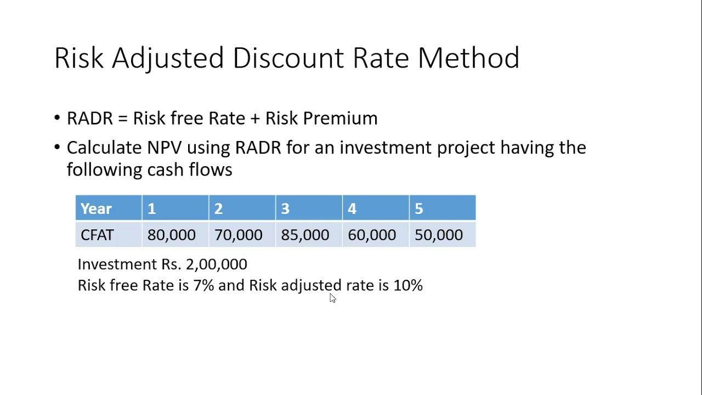

## Table of Contents

## What is a risk discount?

A risk discount is a way to lower the value of something because it might not be safe or certain. Imagine you want to buy a used car. If the car has a history of breaking down a lot, you might not want to pay as much for it. The lower price you're willing to pay because of the risk is called a risk discount. It's like getting a discount because you're taking a chance that something might go wrong.

In business, people use risk discounts all the time. For example, if a company is thinking about investing in a new project, they might lower the expected value of that project because there's a chance it might not work out. By doing this, they are being careful and trying to protect themselves from losing too much money. So, a risk discount helps people make smarter decisions by considering the risks involved.

## Why is risk discount important in financial analysis?

Risk discount is important in financial analysis because it helps people make better decisions about where to put their money. When someone is thinking about investing in something, like a company or a project, they need to think about the chances that it might not work out. By using a risk discount, they lower the expected value of the investment to account for these risks. This way, they can see if the investment is still worth it even if things don't go perfectly.

For example, imagine you're looking at two different investments. One is very safe, like a savings account, but it doesn't grow your money much. The other is riskier, like a new tech startup, and could make you a lot of money, but it could also fail. By applying a risk discount to the startup, you can compare it more fairly to the savings account. This helps you decide if the potential reward is worth the risk. So, risk discount is a key tool in making smart financial choices.

## How is risk discount calculated?

Calculating a risk discount involves figuring out how much risk is involved in an investment and then lowering its expected value because of that risk. People often use something called the "risk-adjusted discount rate" to do this. This rate is higher than the normal discount rate you might use for safer investments. The higher rate reflects the extra risk. So, if you're looking at a risky project, you might use a discount rate of, say, 15% instead of the 5% you'd use for a safer investment. This higher rate means the future cash flows from the project are worth less today, which is the risk discount.

To actually calculate the risk discount, you start with the expected future cash flows from the investment. Then, you apply the risk-adjusted discount rate to these cash flows using a formula called the present value calculation. This formula takes the future cash flows and discounts them back to today's value using the higher rate. The difference between the value of the cash flows without the risk discount and with the risk discount is the amount of the risk discount. This helps investors see if the investment is still worth it, even after accounting for the risk.

## What are the common methods used to determine risk discount?

One common method to determine risk discount is using the Capital Asset Pricing Model (CAPM). This method looks at how much risk an investment has compared to the overall market. It uses something called the "beta" to measure this risk. If an investment has a high beta, it means it's riskier than the market, so you'd use a higher discount rate. The CAPM formula helps figure out this rate by taking the risk-free rate (like what you'd get from a safe investment like a government bond) and adding extra for the risk. This way, you can see how much to lower the value of the investment because of its risk.

Another way is to use the Weighted Average Cost of Capital (WACC). This method looks at all the different ways a company gets money, like loans and stock, and figures out the average cost of all that money. If a project is riskier than the company's usual business, you might add a bit more to the WACC to account for that extra risk. This adjusted WACC becomes the discount rate you use to lower the value of future cash flows from the project. It's a bit more complicated, but it gives a good idea of how much risk to account for when looking at different parts of a business.

Sometimes, people also use a simpler method called the Risk Premium Approach. This involves starting with a basic discount rate for safe investments and then adding extra percentages for different kinds of risk, like market risk or project-specific risk. For example, if the safe rate is 3%, you might add 5% for market risk and another 2% for the project being new and untested. This total rate of 10% would be the discount rate used to calculate the risk discount. This method is easier to understand but might not be as precise as CAPM or WACC.

## Can you explain the difference between risk discount and risk premium?

A risk discount and a risk premium are two sides of the same coin when it comes to figuring out how much risk affects the value of an investment. A risk discount is about lowering the value of an investment because it's risky. Imagine you're buying a used car that might break down a lot. You wouldn't pay as much for it as you would for a new car, right? That lower price you're willing to pay is the risk discount. It's like getting a discount because you're taking a chance that something might go wrong. In financial terms, you apply a higher discount rate to the expected future cash flows of the investment to account for the risk, which lowers its present value.

On the other hand, a risk premium is the extra return you expect to get for taking on that risk. It's like a bonus you want because you're willing to take a chance. Using the same car example, if you bought the used car and it worked perfectly, you'd feel like you got a good deal. That good feeling, or the extra value you got, is like a risk premium. In finance, the risk premium is added to the basic return rate of a safe investment to figure out the total return you'd need to make the risky investment worthwhile. So, while a risk discount lowers the value of an investment to account for risk, a risk premium is the extra reward you expect for taking on that risk.

## What factors influence the size of a risk discount?

The size of a risk discount depends on how risky the investment is. If an investment is really risky, like starting a new business in a field you don't know much about, the risk discount will be bigger. That's because there's a higher chance things could go wrong. On the other hand, if the investment is pretty safe, like buying government bonds, the risk discount will be smaller. The amount of risk is often figured out by looking at things like how stable the market is, how well the company is doing, and how likely it is that the project will succeed.

Another [factor](/wiki/factor-investing) that influences the size of a risk discount is how much the investor can handle risk. If someone is okay with taking big chances, they might not lower the value of the investment as much. But if someone is more careful and doesn't like risk, they'll use a bigger risk discount. Also, the time until you get your money back matters. The longer you have to wait, the more things could go wrong, so the risk discount might be bigger for long-term investments. By thinking about all these things, people can decide how much to lower the value of an investment because of risk.

## How does risk discount affect investment decisions?

Risk discount affects investment decisions by making investors think carefully about how much risk they're willing to take. When someone looks at an investment, they use a risk discount to lower its value because of the chance that things might not go as planned. If the risk discount is big, it means the investment is seen as very risky, and the investor might decide it's not worth it. For example, if a new tech startup seems exciting but has a high chance of failing, the risk discount might make its value look too low to invest in.

On the other hand, if the risk discount is small, the investment seems safer, and the investor might be more likely to go for it. This helps people compare different investments more fairly. A safe investment like a savings account might not grow much, but it also doesn't need a big risk discount. So, by using risk discounts, investors can see if the possible reward from a riskier investment is worth the chance of losing money. This way, they can make smarter choices about where to put their money.

## What are the limitations of using risk discount in valuation?

Using risk discount in valuation can be tricky because it's hard to guess how risky something really is. People might not agree on how much risk there is, so they might use different risk discounts. This can make the value of an investment look very different depending on who's doing the math. Also, the future is hard to predict, and the things we think will happen might not. So, if the risk discount is based on guesses about the future, it might not be very accurate.

Another problem is that risk discount doesn't always take into account all the different kinds of risks. For example, it might focus on financial risks but not think about other things like changes in laws or new technology that could affect the investment. This means the risk discount might not cover all the ways an investment could go wrong. So, while risk discount helps people make better decisions, it's not perfect and should be used carefully.

## How do different industries apply risk discount differently?

Different industries apply risk discount differently because the risks they face are not the same. In the tech industry, where things change fast and new inventions come out all the time, the risk discount might be bigger. That's because a new tech company could easily be beaten by another company with a better idea. So, people who invest in tech might lower the value of the company a lot because it's hard to know if it will succeed. On the other hand, in the utility industry, like electricity or water companies, the risk discount might be smaller. These businesses are more stable and less likely to be affected by quick changes, so the risk of losing money is lower.

In the healthcare industry, the risk discount can be influenced by things like new laws or the success of new drugs. If a company is working on a new medicine, the risk discount might be big because there's a chance the medicine won't work or won't be approved. But if the company is selling a medicine that's already popular and approved, the risk discount might be smaller. Each industry has its own set of risks, and the people who invest in them have to think about these risks when deciding how much to lower the value of their investments.

## What advanced models incorporate risk discount in financial forecasting?

One advanced model that uses risk discount in financial forecasting is the Discounted Cash Flow (DCF) model. This model looks at all the money a company might make in the future and then brings that money back to today's value. To do this, it uses a discount rate that includes a risk discount. If the company is risky, like a new tech startup, the risk discount will be bigger, making the future money worth less today. This helps investors see if the company is a good investment even with the risk.

Another model is the Monte Carlo Simulation. This model uses a lot of guesses about what might happen in the future and runs them through a computer many times. Each time, it changes the numbers a little bit to see different outcomes. The risk discount is part of these guesses and helps figure out how much the value of the investment might change because of risk. By looking at all these different outcomes, investors can get a better idea of how risky the investment really is and decide if it's worth it.

## How can risk discount be adjusted for emerging markets?

In emerging markets, the risk discount needs to be bigger because these places can be more unpredictable. Things like changes in government, money losing value quickly, or not having good rules for businesses can make investments riskier. So, when people invest in an emerging market, they lower the value of the investment more to account for these extra risks. For example, if a company wants to start a business in a country where the government might change the laws suddenly, they would use a bigger risk discount to make sure they're not expecting too much money from it.

To adjust the risk discount for emerging markets, people often look at things like how stable the country's economy is, how easy it is to do business there, and how well the government works. They might also add extra percentages to the discount rate to cover risks that are specific to that country. For example, if there's a chance of a big change in the exchange rate, they might add more to the risk discount. By doing this, they can make a better guess about how much to lower the value of their investment because of the extra risks in emerging markets.

## What are the latest research findings on the effectiveness of risk discount in long-term investment strategies?

Recent research on the effectiveness of risk discount in long-term investment strategies shows that it's really important to think about risk over a long time. When people invest for a long time, like saving for retirement, they need to be careful about how much they lower the value of their investments because of risk. Studies have found that using a risk discount helps people make better choices by showing them how much risk they're taking. For example, if someone is investing in a new company that might not make money for many years, a bigger risk discount can help them see if it's still a good idea even if things don't go perfectly.

Another finding from recent research is that the way people calculate risk discount can make a big difference in long-term investments. Some studies suggest that using more advanced methods, like the Monte Carlo Simulation, can give a better picture of how risk affects investments over time. These methods look at many different possible outcomes and help people see how much the value of their investment might change because of risk. By using these advanced tools, investors can feel more confident that they're not expecting too much from their long-term investments and can plan better for the future.

## What are the valuation techniques used in financial markets?

Valuation techniques in financial markets are critical tools that investors and financial analysts use to assess the worth of various financial instruments, businesses, or markets. These techniques primarily aim to estimate the intrinsic value based on expected future cash flows, asset values, or other relevant financial metrics. Accurate valuation is essential for making informed investment decisions, ensuring that investments yield adequate returns relative to their risks.

One of the most common valuation techniques is the Discounted Cash Flow (DCF) method. This approach involves forecasting the expected cash flows that an investment will generate and then discounting these cash flows back to their present value using a discount rate. The discount rate typically reflects the risk and time value of money associated with the investment.

$$
\text{DCF} = \sum \left( \frac{CF_t}{(1 + r)^t} \right)
$$

Where:
- $CF_t$ is the cash flow at time $t$.
- $r$ is the discount rate.
- $t$ is the time period.

Risk discounts and premiums are incorporated into valuation by adjusting the discount rate. A higher risk premium will increase the discount rate, reducing the present value of future cash flows, which reflects greater uncertainty or higher risk. Conversely, a risk discount could occur if an investment is considered safer or less volatile, which results in a lower discount rate and a higher present value.

For example, a company operating in a stable industry with predictable cash flows may warrant a lower discount rate compared to a tech startup with uncertain future revenue, even if both have similar cash flow projections.

Accurate valuation is crucial because it provides a benchmark against which the market price of an asset can be compared. Purchases that are made when an asset is undervalued can result in significant financial gains once the market corrects its price, whereas overvalued investments can lead to detrimental financial losses.

In addition to DCF, other valuation techniques include the comparables method, which involves assessing similar assets in the market to benchmark value, and asset-based valuation, which focuses on the company's net asset value. Each method provides unique insights and challenges, and they are often used in combination to triangulate a more reliable value estimation.

By incorporating a mindful assessment of risk and the appropriate application of valuation techniques, investors can make more informed decisions that better align with their financial goals and risk tolerance. This integration is a cornerstone of effective financial risk management, aiding in the maximization of returns while minimizing exposure to unfavorable outcomes.

## What are the advanced techniques in financial risk management?

Advanced risk management techniques in financial markets are critical for effectively navigating the complexities of modern trading environments. Stressed Value at Risk (stressed VaR) and Conditional Value at Risk (CVaR) represent two pivotal methodologies designed to enhance risk assessment and management.

### Stressed Value at Risk (Stressed VaR)

Stressed VaR is an extension of the traditional Value at Risk (VaR) metric, introduced to account for potential losses during periods of financial turmoil. Unlike standard VaR, which typically uses historical data over a fixed period, stressed VaR incorporates data from periods of significant financial stress to ensure portfolios are robust under adverse conditions.

### Conditional Value at Risk (CVaR)

Conditional Value at Risk, or CVaR, provides an estimate of the expected loss, assuming that a VaR threshold is breached. It is defined as the average loss in the worst-case percentile of the return distribution. Mathematically, CVaR can be expressed as:

$$
\text{CVaR}_{\alpha}(X) = E[X \mid X \leq \text{VaR}_{\alpha}(X)]
$$

where $X$ represents the portfolio returns and $\alpha$ is the confidence level.

### Use of Machine Learning and Data Analytics

Machine learning and data analytics play an increasingly important role in enhancing risk management strategies. By leveraging large datasets and sophisticated algorithms, such as neural networks and decision trees, traders can identify patterns and predict future market movements with greater accuracy. Techniques like clustering and regression analysis help in developing models that can better capture the complexities of financial data.

For example, [machine learning](/wiki/machine-learning) models can be trained to forecast market [volatility](/wiki/volatility-trading-strategies), helping traders adjust their risk exposure dynamically. In addition, data analytics tools enable the processing of vast amounts of real-time data to optimize trading algorithms and quickly respond to market changes.

### Application in Algorithmic Trading Systems

In [algorithmic trading](/wiki/algorithmic-trading), these advanced risk management techniques are often integrated into automated systems to adjust trading strategies based on real-time risk assessments. For instance, algorithms can be programmed to trigger specific actions if stressed VaR exceeds predetermined limits, such as reducing positions or hedging against potential losses using derivatives.

Here is a simple example of calculating CVaR using Python to illustrate its application:

```python
import numpy as np

def calculate_cvar(returns, alpha=0.95):
    var_threshold = np.percentile(returns, 100 * (1 - alpha))
    cvar = returns[returns <= var_threshold].mean()
    return cvar

# Simulated portfolio returns
simulated_returns = np.random.normal(loc=0, scale=1, size=1000)

cvar_95 = calculate_cvar(simulated_returns, alpha=0.95)
print(f"The 95% CVaR of the portfolio is {cvar_95:.2f}")
```

### Future Trends in Risk Management Technology

The future of risk management in trading will likely see a deeper integration of [artificial intelligence](/wiki/ai-artificial-intelligence) and machine learning, enabling more predictive and adaptive models. Quantum computing also holds promise for transforming financial risk management by solving complex optimization problems more efficiently than classical computers.

Moreover, blockchain technology may offer improved transparency and traceability in transaction records, providing clearer insights into risk exposures and enabling more robust compliance with regulatory requirements.

In summary, the evolution of risk management tools and technologies continues to enhance the ability of traders and financial institutions to manage uncertainties and safeguard against potential losses in increasingly complex market environments.

## References & Further Reading

1. **Books**
   - **"Options, Futures, and Other Derivatives" by John C. Hull**: This book offers a comprehensive introduction to derivatives, delving into pricing options, futures, and risk management strategies. Hull's work is a staple in financial academic circles.

   - **"Algorithmic Trading: Winning Strategies and Their Rationale" by Ernest P. Chan**: Chan's book provides insights into developing algorithmic trading strategies with examples and case studies. It discusses both the quantitative and implementation aspects of algorithmic trading.

   - **"Financial Risk Management: Models, History, and Institutions" by Allan M. Malz**: This text presents an in-depth look into financial risk management frameworks, emphasizing practical applications and case studies.

2. **Articles and Papers**
   - **"The Theory and Practice of Algorithmic Trading and Portfolio Management" by Robert Kissell**: This article provides a glimpse into the strategies employed in algorithmic trading and portfolio management, with practical insights into risk management.

   - **"Risk Management and Financial Derivatives: An Overview" by Rene M. Stulz**: Stulz discusses the integration of financial derivatives into risk management practices, highlighting both theoretical and real-world implications.

3. **Online Resources**
   - **Investopedia's Algorithmic Trading Section**: A comprehensive resource explaining various algorithmic trading concepts, risk management techniques, and the financial implications of these practices. (Visit: https://www.investopedia.com/algorithmic-trading-4683645)

   - **Khan Academy's Finance and Capital Markets Course**: Offers free educational videos covering a range of topics including financial risk management, algorithm trading strategies, and valuation techniques. (Visit: https://www.khanacademy.org/economics-finance-domain/core-finance)

4. **Research Journals**
   - **Journal of Financial Economics**: A scholarly journal that publishes articles on a wide range of topics in financial risk management and trading algorithms. Access typically requires a subscription through academic or professional institutions.

   - **Quantitative Finance**: This journal focuses on the application of quantitative techniques in finance, covering algorithmic trading, risk management methodologies, and financial economics.

5. **Python Libraries and Documentation**
   - **NumPy and Pandas Documentation**: Essential for any quantitative analyst or algorithmic trader, these libraries allow for efficient handling of financial data and computation of complex risk measures.
   - **SciPy and Statsmodels**: Useful libraries for performing advanced statistical analysis and risk modeling.

These recommended readings and resources are intended to guide further exploration into the topics of financial risk management, valuation techniques, and algorithmic trading, providing a mix of theoretical foundations and practical applications.

