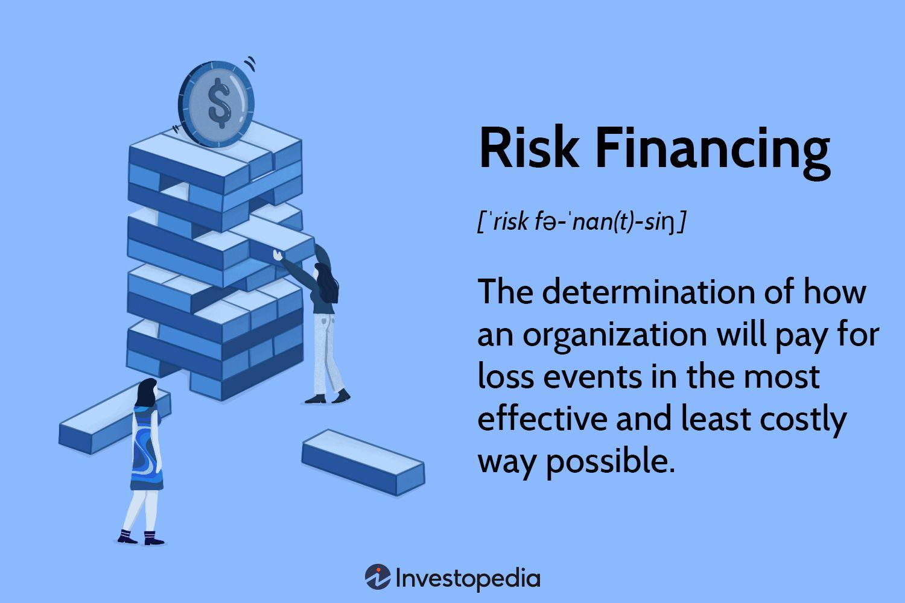

In today's rapidly evolving financial markets, understanding financial health and risk management is paramount for investors and businesses. Financial health, a critical metric, reflects the stability and potential growth trajectory of an individual or organization by encompassing a range of financial indicators such as earnings per share (EPS) and net asset value (NAV). These indicators help stakeholders appraise an entity's financial robustness and guide investment decisions and risk management strategies. 

Risk financing also stands as a significant pillar by defining how organizations prepare for potential financial setbacks. It highlights their cost-effective methodologies to cover prospective losses and sustain operations amidst uncertainties. Strategies like insurance, self-insurance, and alternative risk transfer options are employed to bolster an organization's resilience against adverse events.



The interplay between financial indicators and risk management is vital, particularly in optimizing financial health and strategic decision-making. Metrics such as the Cost of Risk (COR) provide a quantifiable measure of risk management efficacy, motivating organizations to balance cost minimization and comprehensive protective coverage.

Amid these complex financial landscapes, algorithmic trading emerges as a transformative force, enhancing market efficiency and strategic acumen. By leveraging automated systems and technical indicators—such as moving averages, Relative Strength Index (RSI), and Average True Range (ATR)—traders execute rapid, data-driven decisions. This technological advancement not only mitigates the emotional biases in trading but also bolsters market responsiveness.

This article explores the convergence of financial indicators, risk financing, and algorithmic trading, underscoring their collective role in optimizing financial decision-making and trading efficiencies. Through integrating these components, businesses and investors can refine their strategies to maximize returns while ensuring stability in contemporary financial environments.

## Table of Contents

## Understanding Financial Health

Financial health indicates the robustness of an individual’s or organization’s economic standing, encapsulating the nuances of assets, liabilities, and comprehensive financial stability. This concept serves as a cornerstone for sustainable financial management and strategic planning, ensuring that both individuals and organizations navigate economic challenges effectively.

Key financial indicators play a pivotal role in assessing financial health, with Earnings Per Share (EPS) and Net Asset Value (NAV) being among the most significant. EPS is calculated by dividing the net income available to common shareholders by the weighted average number of outstanding shares. It serves as a direct indicator of a company's profitability on a per-share basis, thereby enabling investors to gauge potential investment returns. The formula for EPS is:

$$
\text{EPS} = \frac{\text{Net Income} - \text{Dividends on Preferred Stock}}{\text{Average Outstanding Shares}}
$$

On the other hand, NAV represents the value of an entity's assets minus its liabilities, commonly used in the assessment of investment funds. It offers investors insights into the fund’s underlying value per share, assisting them in determining the fund’s performance and worth. The formula for NAV is:

$$
\text{NAV} = \frac{\text{Total Assets} - \text{Total Liabilities}}{\text{Total Outstanding Shares}}
$$

Monitoring these metrics allows stakeholders to make well-informed decisions regarding investments and risk management strategies. Effective evaluation of financial health through such indicators aids in discerning the entity's operational efficiency and fiscal reliability, thereby influencing investment decisions and risk assessment practices. Decisions made on the basis of these metrics can help in optimizing portfolios, managing risks, and aligning financial operations with long-term strategic goals.

## Risk Financing: A Key Indicator

Risk financing is a fundamental aspect of financial management, focusing on how organizations prepare to address potential losses in a manner that is both cost-effective and sustainable. This element of financial strategy is vital as it reflects an organization’s readiness to cope with financial uncertainties and its resilience in maintaining operations after encountering adverse events. A well-devised risk financing strategy not only safeguards the company's assets but also ensures operational continuity and financial stability.

Organizations employ various strategies to effectively manage risk financing. Insurance is a traditional and widely used method, providing financial protection against specified risks in exchange for premium payments. It is an effective way to transfer risk to a third party, thereby shielding the organization from direct financial impact.

Self-insurance is another strategy employed by some organizations, typically larger ones with substantial financial resources. This approach involves setting aside funds to cover potential losses, rather than purchasing insurance from external providers. By retaining risk, organizations can tailor their risk management approach to their specific needs and potentially achieve cost savings over time. However, it also requires careful assessment and management of potential risks to ensure sufficient funds are available to cover losses when they occur.

Alternative risk transfer (ART) options have gained popularity as organizations seek more sophisticated ways to manage risk. These include mechanisms such as catastrophe bonds and captive insurance, which provide flexible solutions tailored to an organization’s unique risk profile. For example, catastrophe bonds allow organizations to transfer risk to the capital markets, which can be especially beneficial for covering high-severity, low-frequency events such as natural disasters.

In assessing risk financing strategies, organizations often consider metrics such as the Cost of Risk (COR), which quantifies the total expenses related to risk management, including insurance premiums, retained losses, and administrative costs. By minimizing the COR while maintaining adequate risk coverage, an organization can enhance its financial efficiency and resilience.

Effective risk financing is vital to an organization's broader risk management strategy. By choosing the right mix of traditional and alternative risk financing options, organizations can optimize their preparedness for potential financial liabilities, ensuring that they remain both financially secure and operationally viable in the face of various challenges.

## The Interplay Between Financial Indicators and Risk Management

Financial indicators play a crucial role in aligning risk financing strategies with an organization's overall financial health, providing a comprehensive understanding of potential vulnerabilities and opportunities. One of the critical aspects of this alignment is the Cost of Risk (COR), a pivotal metric that quantifies the total expenditures associated with risk management. This includes costs related to mitigative strategies, insurance premiums, retained losses, and administrative expenses. COR serves as an excellent measure of financial efficiency, allowing organizations to assess how effectively they are managing their risk exposures compared to their financial capabilities.

The effective management of COR involves a strategic balance. Organizations strive to minimize COR to increase their financial efficiency, which in turn can lead to higher profitability and competitive advantage. However, it's essential to maintain adequate risk coverage to ensure that the organization is well-protected against potential financial setbacks, such as economic downturns, operational disruptions, or unexpected market [volatility](/wiki/volatility-trading-strategies).

To achieve this balance, companies often employ a combination of risk management strategies. These include transferring risk through insurance, retaining certain risks when it's more cost-effective, and even leveraging hedging mechanisms to offload specific exposures. The decision on which strategy to apply involves a thorough analysis of financial indicators such as [liquidity](/wiki/liquidity-risk-premium) ratios, debt service coverage ratios, and cash flow forecasts. These indicators can signal the organization’s capacity to absorb risks and therefore influence decisions on the extent and type of risk financing methods to employ.

Moreover, organizations are increasingly utilizing data analytics and advanced algorithms to enhance the precision of their risk assessments. By integrating quantitative risk models and financial indicators, companies can forecast potential losses with greater accuracy and adjust their risk financing strategies proactively. This integration not only allows for a more dynamic response to changing market conditions but also supports the optimization of risk-related expenditures, thereby maintaining financial health and ensuring ongoing operational resilience.

In summary, the interplay between financial indicators and risk management is foundational to developing sound risk financing strategies. By effectively quantifying and managing COR, and leveraging sophisticated financial analytics, organizations can enhance their ability to withstand financial adversities while maximizing opportunities for growth and profitability.

## Role of Algorithmic Trading in Financial Strategy

Algorithmic trading employs automated systems to execute trades based on predefined criteria and sophisticated financial algorithms. This trading strategy uses technical indicators, such as moving averages, the Relative Strength Index (RSI), and the Average True Range (ATR), to facilitate data-driven and accurate decision-making. 

The use of moving averages, for instance, helps in identifying market trends and potential entry or [exit](/wiki/exit-strategy) points by calculating the average price of a security over a specified number of periods. The RSI measures the speed and change of price movements, indicating potential overbought or oversold conditions in the market. ATR is used to gauge market volatility by analyzing the range within which a security's price has moved during a specific period.

These indicators are integral to [algorithmic trading](/wiki/algorithmic-trading) systems, boosting market efficiency by reducing the slippage that often results from human intervention. The automated nature of algorithmic trading significantly enhances risk management, as it allows for instantaneous responses to market changes and eliminates the emotional biases that can cloud human judgment. Such efficiency is critical for high-frequency trading environments where speed and precision are paramount.

Moreover, algorithmic trading enables traders to capitalize on fleeting market opportunities by conducting transactions at an unprecedented speed—far beyond human capability. This ability is particularly advantageous in volatile markets where prices can shift rapidly. By leveraging algorithms, traders can exploit price movements and [arbitrage](/wiki/arbitrage) opportunities with minimal execution time.

In summary, algorithmic trading's reliance on predefined criteria and technical indicators offers a robust framework for executing trades with speed and accuracy. Its contribution to market efficiency and risk management underscores its significance in contemporary financial strategies, providing a competitive edge in optimizing trading outcomes and managing financial risk.

## Popular Technical Indicators in Algo Trading

Technical indicators are vital tools in algorithmic trading, providing quantitative data to guide automated trading strategies and enhance the accuracy and timing of trade execution. Among the numerous indicators utilized, moving averages, relative strength index (RSI), and Bollinger Bands are some of the most popular due to their effectiveness in identifying market trends and generating trading signals.

**Moving Averages**

Moving averages are statistical calculations used to analyze data points by creating a series of averages of different subsets of the complete data set. In algorithmic trading, the simple moving average (SMA) and exponential moving average (EMA) are commonly used. The SMA is calculated by averaging the closing prices over a specified period, offering a smoothed visualization of price trends:

$$
\text{SMA}_n = \frac{\sum_{i=1}^{n} P_i}{n}
$$

where $P_i$ is the price at each time period $i$ and $n$ is the number of periods.

On the other hand, the EMA gives more weight to recent prices, making it more responsive to new information. The formula for calculating EMA includes a multiplier for smoothing:

$$
\text{EMA}_t = P_t \times \text{K} + \text{EMA}_{t-1} \times (1-\text{K})
$$

where $\text{K} = \frac{2}{n+1}$ and $P_t$ is the current price.

**Relative Strength Index (RSI)**

The RSI is a [momentum](/wiki/momentum) oscillator that measures the speed and change of price movements, oscillating between 0 and 100. It helps identify overbought or oversold conditions in a market. Typically, an RSI above 70 indicates an overbought market, while an RSI below 30 suggests an oversold market:

$$
\text{RSI} = 100 - \frac{100}{1 + \text{RS}}
$$

where $\text{RS} = \frac{\text{Average Gain}}{\text{Average Loss}}$.

**Bollinger Bands**

Bollinger Bands consist of a central moving average line surrounded by two volatility bands. These bands widen during volatile markets and contract during stable periods. The typical configuration uses a 20-day SMA with upper and lower bands set two standard deviations away:

$$
\text{Middle Band} = \text{SMA}_{20}
$$

$$
\text{Upper Band} = \text{SMA}_{20} + (2 \times \text{SD})
$$

$$
\text{Lower Band} = \text{SMA}_{20} - (2 \times \text{SD})
$$

where $\text{SD}$ is the standard deviation of the closing prices over the same period.

These technical indicators are integral to algorithmic trading because they facilitate automated decision-making processes, minimizing the impact of human emotions such as fear and greed. By allowing traders to craft algorithms that automatically trigger trades based on pre-determined criteria, these indicators enhance market efficiency and provide opportunities for timely and strategic entry and exit points in various market conditions.

## Mathematical Models and Risk Management

Mathematical models are essential tools in the assessment and management of financial risk, particularly within the financial derivatives market. Among the most renowned models are the Black-Scholes formula and Monte Carlo simulations, both of which play vital roles in quantifying risk and pricing financial assets. 

The Black-Scholes formula, originally developed in 1973 by Fischer Black, Myron Scholes, and Robert Merton, offers a theoretical estimate for the pricing of European-style options. The formula assumes that markets are efficient and that the stock prices follow a geometric Brownian motion with constant volatility and interest rates. The Black-Scholes equation is expressed as:

$$
C = S_0N(d_1) - Xe^{-rT}N(d_2)
$$

where:
- $C$ is the call option price,
- $S_0$ is the current stock price,
- $X$ is the strike price of the option,
- $r$ is the risk-free interest rate,
- $T$ is the time to expiration,
- $N(d)$ is the cumulative distribution function of the standard normal distribution,
- $d_1 = \frac{\ln(S_0/X) + (r + \sigma^2/2)T}{\sigma\sqrt{T}}$,
- $d_2 = d_1 - \sigma\sqrt{T}$,
- $\sigma$ is the volatility of the stock's returns.

This model not only aids in the pricing of options but also helps in crafting hedging strategies that minimize risk exposure.

Monte Carlo simulations represent another cornerstone in risk management. Unlike deterministic models, Monte Carlo simulations use randomness and statistical sampling to simulate a wide range of possible outcomes. This technique is particularly useful in stress testing and in evaluating complex derivatives, where analytical solutions might be difficult or impossible to obtain. A basic Monte Carlo algorithm in Python for pricing an option might look like the following:

```python
import numpy as np

def monte_carlo_option_pricing(S, X, r, T, sigma, n_simulations):
    np.random.seed(0)
    dt = T
    payoff_sum = 0

    for _ in range(n_simulations):
        z = np.random.normal()
        S_T = S * np.exp((r - 0.5 * sigma**2) * dt + sigma * np.sqrt(dt) * z)
        payoff = max(S_T - X, 0)
        payoff_sum += payoff

    call_price = (payoff_sum / n_simulations) * np.exp(-r * T)
    return call_price

# Example parameters
S = 100       # Current stock price
X = 105       # Strike price
r = 0.05      # Risk-free rate
T = 1         # Time to expiration (1 year)
sigma = 0.2   # Volatility
n_simulations = 100000

price = monte_carlo_option_pricing(S, X, r, T, sigma, n_simulations)
print("Monte Carlo Option Price:", price)
```

Both the Black-Scholes formula and Monte Carlo simulations provide critical insights that help in optimizing trading strategies and enhancing overall financial planning. By quantifying risks and potential returns, these models contribute to the development of robust risk management frameworks that are necessary for maintaining financial stability and achieving strategic objectives in dynamic markets.

## Conclusion: Integrating Finance and Technology for Optimal Outcomes

The integration of financial health indicators, risk financing strategies, and algorithmic trading forms a robust framework for effective financial management. This comprehensive approach allows organizations to make precise decisions, ensuring both immediate and long-term stability while maximizing returns. Financial health indicators such as earnings per share (EPS) and net asset value (NAV) provide a snapshot of an organization’s financial standing, allowing for an informed analysis of its strengths and vulnerabilities. By closely monitoring these metrics, businesses can anticipate potential financial risks and proactively develop strategies to mitigate them.

Risk financing is integral to this framework, as it offers structured methods for managing potential financial losses. By leveraging a mix of insurance, self-insurance, and alternative risk transfer options, organizations are better prepared to handle uncertainties. This readiness is crucial for maintaining operations during adverse events, thereby ensuring continued organizational stability.

Algorithmic trading enhances this financial framework by utilizing technology to execute trades based on quantitative criteria. Programs designed with technical indicators and mathematical models can swiftly analyze vast amounts of data, identifying market trends and potential opportunities. This capability reduces human error and emotional bias, leading to improved trading outcomes. For instance, the use of moving averages and the Relative Strength Index (RSI) in algorithms helps filter market noise and automate trading decisions effectively.

The continuous evolution of technology promises to further amplify these benefits. As computational power increases and analytical tools become more sophisticated, organizations can anticipate more accurate insights and greater efficiencies. Machine learning, for instance, can refine algorithms through adaptive learning, constantly improving decision-making processes as new data becomes available.

In conclusion, the seamless integration of finance and technology through financial health indicators, risk financing, and algorithmic trading is a strategic imperative for modern organizations. This triad not only strengthens financial stability and operational endurance but also maximizes profitability potential. As these strategies evolve alongside technological advancements, they hold the promise of delivering even greater efficiencies and insights within the ever-dynamic financial markets.

## References & Further Reading

[1]: Bergstra, J., Bardenet, R., Bengio, Y., & Kégl, B. (2011). ["Algorithms for Hyper-Parameter Optimization."](https://papers.nips.cc/paper/4443-algorithms-for-hyper-parameter-optimization) Advances in Neural Information Processing Systems 24.

[2]: ["Advances in Financial Machine Learning"](https://www.amazon.com/Advances-Financial-Machine-Learning-Marcos/dp/1119482089) by Marcos Lopez de Prado

[3]: ["Evidence-Based Technical Analysis: Applying the Scientific Method and Statistical Inference to Trading Signals"](https://www.amazon.com/Evidence-Based-Technical-Analysis-Scientific-Statistical/dp/0470008741) by David Aronson

[4]: ["Machine Learning for Algorithmic Trading"](https://github.com/stefan-jansen/machine-learning-for-trading) by Stefan Jansen

[5]: ["Quantitative Trading: How to Build Your Own Algorithmic Trading Business"](https://www.amazon.com/Quantitative-Trading-Build-Algorithmic-Business/dp/1119800064) by Ernest P. Chan