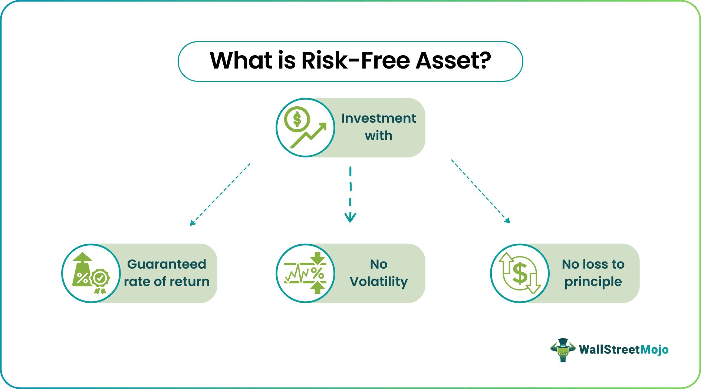

## Table of Contents

## What is a risk-free asset?

A risk-free asset is an investment that is considered to have no risk of losing money. It's like a safe place to put your money where you know you will get it back, plus a little extra. Usually, the little extra is called interest, and it's the reward you get for letting someone else use your money for a while. Governments often issue these risk-free assets in the form of bonds, which are like IOUs that promise to pay you back with interest.

However, even though we call them risk-free, they are not completely without risk. The risk is very small, but it's there. For example, if a government faces a lot of financial trouble, it might not be able to pay back its bonds. But because this is very rare, especially with strong governments, people still consider these assets to be risk-free. They are the safest investments you can find, and they are used as a benchmark to compare other investments that have more risk.

## Why are risk-free assets important in financial planning?

Risk-free assets are important in financial planning because they help you keep your money safe. Imagine you have some savings and you want to make sure you don't lose them. By putting your money in risk-free assets, like government bonds, you know you will get your money back plus a little extra. This is very helpful if you are saving for something important, like buying a house or retiring, and you don't want to take chances with your money.

They also help you balance your investments. If you have some money in riskier investments, like stocks, you can put some in risk-free assets to make your overall plan safer. This way, if the stock market goes down, you still have your risk-free assets to fall back on. It's like having a safety net that helps you sleep better at night, knowing that at least part of your money is secure.

## Can you give examples of common risk-free assets?

One common risk-free asset is a government bond. This is like a promise from the government to pay you back your money plus some interest after a certain time. In the United States, these are called Treasury securities. They are considered very safe because the government can usually find ways to pay back what it owes.

Another example is a savings account at a bank that is insured by the government. In the U.S., this insurance comes from the Federal Deposit Insurance Corporation (FDIC). If the bank has trouble and can't give you your money back, the FDIC steps in and makes sure you get your money, up to a certain amount. This makes savings accounts a safe place to keep your money.

These assets are important because they help people feel secure about their savings. Whether you're saving for a big purchase or just want to keep your money safe, risk-free assets give you peace of mind. They might not make you rich quickly, but they help protect what you already have.

## How do risk-free assets differ from risky assets?

Risk-free assets and risky assets are different in how safe they are. Risk-free assets are like a safe place to put your money. They are usually things like government bonds or insured savings accounts. When you put your money in these, you know you will get it back plus a little extra, called interest. The chance of losing money is very small, so they are called risk-free. They help you keep your money safe, especially when you are saving for something important.

On the other hand, risky assets are like a gamble. They can make you a lot of money, but they can also make you lose money. Stocks, for example, go up and down a lot. If you buy a stock and it goes up, you can make a good profit. But if it goes down, you can lose some or all of your money. People who invest in risky assets are looking for bigger rewards, but they have to be ready to take the chance of losing money too.

In financial planning, you might use both types of assets. Risk-free assets keep your money safe, while risky assets can help it grow faster. By balancing the two, you can have a plan that is both safe and has the chance to make more money.

## What is the role of risk-free assets in portfolio diversification?

Risk-free assets play a big role in making your investment portfolio safer. When you have a mix of different types of investments, it's called diversification. By including risk-free assets, like government bonds or insured savings accounts, you add a layer of safety to your portfolio. These assets won't lose value, so they help balance out the riskier parts of your investments, like stocks. If the stock market goes down and you lose money on your stocks, the risk-free assets will still be there, keeping some of your money safe.

Using risk-free assets in your portfolio also helps you sleep better at night. Knowing that part of your money is safe can make you feel more confident about taking some risks with the rest of your investments. It's like having a safety net. You can try to grow your money with riskier assets, but you also have the peace of mind that comes from knowing some of your money is protected. This balance is important for a smart investment strategy that looks after both your money and your peace of mind.

## How are risk-free rates determined?

Risk-free rates are determined by looking at the interest rate on government bonds, especially those from very stable countries like the United States. When the government borrows money from people by selling bonds, it promises to pay back the money with a little extra, which is the interest. This interest rate is used as the risk-free rate because people trust that the government will pay back what it owes. In the U.S., the most common risk-free rate is the yield on Treasury securities, like the 10-year Treasury bond.

However, the risk-free rate can change over time. It depends on things like how much people want to lend to the government, the overall economy, and what the government decides to do with its money. When the economy is doing well, people might want higher interest rates because they think they can get better returns elsewhere. But when the economy is struggling, people might be happy with lower rates because they want to keep their money safe. So, the risk-free rate is always moving, but it's still the safest bet for investors looking for a place to park their money without worrying about losing it.

## What are the limitations of risk-free assets?

Risk-free assets have some limitations that you should know about. One big limitation is that they usually don't give you a lot of money back. The interest you get from risk-free assets like government bonds or savings accounts is often very small. If you want your money to grow a lot, you might need to look at riskier investments like stocks. So, while risk-free assets keep your money safe, they might not help it grow as fast as you want.

Another limitation is that even though we call them risk-free, they are not completely without risk. For example, if a government faces big financial problems, it might not be able to pay back its bonds. This is rare, especially with strong governments, but it can happen. Also, inflation can be a problem. If the cost of things goes up a lot, the little bit of interest you get from risk-free assets might not be enough to keep up. So, while they are very safe, they are not perfect and you need to think about these limitations when planning your investments.

## How do government bonds qualify as risk-free assets?

Government bonds are considered risk-free assets because they come from the government, which people trust to pay back what it owes. When you buy a government bond, you are lending money to the government. In return, the government promises to give you your money back plus some interest after a certain time. Because the government has the power to collect taxes and print money, it's usually seen as very reliable. In the United States, Treasury securities, like the 10-year Treasury bond, are a good example of this. People trust that the U.S. government will pay back its bonds, so these bonds are seen as risk-free.

However, even though they are called risk-free, government bonds are not completely without risk. If a government faces big financial problems, it might struggle to pay back its bonds. This is rare, especially with strong governments, but it can happen. Also, inflation can affect the value of the interest you earn. If the cost of things goes up a lot, the small amount of interest you get might not be enough to keep up. So, while government bonds are very safe, they are not perfect, and you should think about these risks when you plan your investments.

## What impact do economic conditions have on the performance of risk-free assets?

Economic conditions can change how well risk-free assets do. When the economy is doing well, people might want higher interest rates on their risk-free assets like government bonds. They think they can get better returns from other places, so they want more from the safe stuff. But when the economy is struggling, people are happy with lower interest rates because they just want to keep their money safe. So, the interest rates on risk-free assets go up and down with the economy.

Another thing that happens is that during tough economic times, more people might want to buy risk-free assets. They see these as a safe place to put their money when everything else feels risky. This can push up the prices of government bonds and lower their yields, which is the interest rate you get. On the other hand, when the economy is strong, people might move their money to riskier investments to try to make more money, so fewer people buy risk-free assets, and their prices might go down. So, the economy can really change how risk-free assets perform.

## How can inflation affect the real returns of risk-free assets?

Inflation can make the money you earn from risk-free assets less valuable. Imagine you put your money in a government bond that gives you 2% interest every year. If inflation is also 2%, the extra money you get from the bond doesn't really buy you anything more than what you started with. This means the real return, or the actual increase in what your money can buy, is zero. So, even though your money grows a little bit, it doesn't grow enough to keep up with the rising prices of things.

This is a big problem for people who rely on risk-free assets to save their money. If inflation goes up a lot, the interest you get from these safe investments might not be enough to keep up. For example, if inflation is 3% and your bond only gives you 2% interest, you are actually losing money in terms of what you can buy. So, when planning your savings, it's important to think about inflation and how it can eat away at the real value of the money you earn from risk-free assets.

## What are some advanced strategies for using risk-free assets in investment portfolios?

One advanced strategy for using risk-free assets is called the barbell strategy. This is when you split your money between very safe investments, like government bonds, and very risky investments, like stocks. The idea is to keep some of your money super safe with risk-free assets while also trying to make more money with riskier investments. This can help you balance the risk and reward in your portfolio. If the stock market goes down, you still have your safe money to fall back on. But if the market goes up, you can make a good profit from your riskier investments.

Another strategy is to use risk-free assets as a way to protect against market downturns. This is called hedging. You can buy government bonds or keep money in an insured savings account to make sure you have some money that won't lose value if the stock market crashes. This way, you can use the safe money to buy more stocks when prices are low, which can help you recover faster when the market goes back up. It's like having a safety net that lets you take more risks with the rest of your money, knowing you have something secure to rely on.

A third strategy is to use risk-free assets to manage cash flow. If you have money coming in from investments or a job, you can put some of it into risk-free assets like Treasury bills. These are short-term government bonds that you can easily turn back into cash. This can help you have money available when you need it, without having to sell your riskier investments at a bad time. It's a way to keep your money safe and liquid, meaning you can use it whenever you need to, while still trying to grow your wealth with other investments.

## How do international risk-free assets compare to domestic ones in terms of safety and yield?

International risk-free assets, like government bonds from other countries, can be a bit different from domestic ones in terms of safety and yield. When you buy a bond from another country, you are trusting that their government will pay you back. If the country is very stable and trusted, like Germany or Japan, their bonds might be almost as safe as your own country's bonds. But if the country has more financial problems, their bonds might be riskier. So, the safety of international risk-free assets depends a lot on how stable the country is.

The yield, or the interest you get from international risk-free assets, can also be different. Sometimes, other countries offer higher interest rates on their bonds because they need to attract more investors. This can be good if you want to earn more money, but it also means you might be taking on more risk. On the other hand, if you stick with domestic risk-free assets, the yields might be lower, but you know they are very safe. So, when choosing between international and domestic risk-free assets, you need to think about both the safety and the yield, and decide what's more important for your investment goals.

## What are Risk-Free Assets and How Can We Explore Them?

Risk-free assets are financial instruments that theoretically offer a guaranteed rate of return with minimal risk of financial loss. The most commonly cited risk-free assets are government-issued securities, such as U.S. Treasury bonds, which are backed by the full faith and credit of the issuing government. This perceived guarantee of repayment makes them an attractive option for conservative investors seeking stability and predictability in their portfolio returns.

Despite their risk-free label, these assets are not entirely devoid of risk. One of the primary risks associated with holding risk-free assets is purchasing power risk, which arises from inflation. Inflation erodes the real value of the returns generated by these assets. For instance, if a U.S. Treasury bond offers a nominal [interest rate](/wiki/interest-rate-trading-strategies) of 3% per annum but the inflation rate is 2%, the real return is only 1%. Investors must, therefore, consider the inflation rate when evaluating the true value of the returns from risk-free assets.

### Example Calculation

To illustrate the impact of inflation on risk-free assets, consider an investor holding a 10-year U.S. Treasury bond with a nominal yield of 3% annually. If the inflation rate remains constant at 2%, the calculation for real return $R_r$ can be expressed as:

$$
R_r = \frac{(1 + R_n)}{(1 + i)} - 1
$$

where $R_n$ is the nominal return and $i$ is the inflation rate. Substituting the values:

$$
R_r = \frac{(1 + 0.03)}{(1 + 0.02)} - 1 \approx 0.0098 \text{ or } 0.98\%
$$

Over the period of the bond, the real return is therefore reduced, highlighting the significance of inflation as a risk [factor](/wiki/factor-investing) even for investments deemed risk-free.

Understanding these nuances is crucial for investors who rely heavily on such low-risk investments for income, particularly those in retirement who might depend on these returns for their day-to-day expenses. While government-backed securities offer remarkable safety against default, the purchasing power risk necessitates a strategic approach to maintain the real value of an investment portfolio over time.

## What is Reinvestment Risk?

Reinvestment risk is a crucial consideration for investors, even when holding risk-free assets. This form of risk emerges when the income or principal from an existing investment is reinvested, and the future rates at which these funds may be reinvested are uncertain. A common scenario is when a bond or certificate of deposit (CD) matures, and the investor is unable to reinvest the proceeds at a similar or higher interest rate, leading to potentially reduced returns over time.

The reinvestment risk can be particularly pronounced in a declining interest rate environment. When market interest rates fall, the available investment options for reinvesting funds typically [carry](/wiki/carry-trading) lower yields compared to the original investment. For example, if an investor holds a 10-year government bond with a yield of 5% and upon maturity, the new 10-year bonds offer only a 3% yield, the investor will earn less from the reinvested funds.

To understand the impact of reinvestment risk quantitatively, consider the formula for the future value (FV) of an investment:

$$
FV = C \times (1 + r)^n
$$

where $C$ is the initial capital, $r$ is the reinvestment rate, and $n$ is the number of periods. If the reinvestment rate $r$ is reduced due to market conditions, the future value of reinvested proceeds decreases accordingly, impacting the total returns.

Investors can employ several strategies to mitigate reinvestment risk. One approach is laddering, which involves spreading investments across multiple maturities. This ensures that only a portion of the portfolio matures at any given time, reducing exposure to fluctuating interest rates. Additionally, diversifying into assets with different levels of risk and return profiles can provide a balanced approach to managing reinvestment risk.

In essence, while risk-free assets offer stability, reinvestment risk poses a significant challenge by affecting long-term return stability, requiring strategic planning and diversification to manage effectively.

## References & Further Reading

[1]: ["High Yield Savings Accounts"](https://www.forbes.com/advisor/banking/savings/best-high-yield-savings-accounts/) - Federal Deposit Insurance Corporation (FDIC)

[2]: ["U.S. Treasury Securities"](https://www.investopedia.com/articles/investing/073113/introduction-treasury-securities.asp) - U.S. Department of the Treasury

[3]: ["Advances in Financial Machine Learning"](https://www.amazon.com/Advances-Financial-Machine-Learning-Marcos/dp/1119482089) by Marcos Lopez de Prado

[4]: ["Evidence-Based Technical Analysis: Applying the Scientific Method and Statistical Inference to Trading Signals"](https://www.amazon.com/Evidence-Based-Technical-Analysis-Scientific-Statistical/dp/0470008741) by David Aronson

[5]: ["Machine Learning for Algorithmic Trading"](https://github.com/stefan-jansen/machine-learning-for-trading) by Stefan Jansen

[6]: ["Quantitative Trading: How to Build Your Own Algorithmic Trading Business"](https://github.com/LucindaYa/quant-resources/blob/master/Quantitative%20Trading%20How%20to%20Build%20Your%20Own%20Algorithmic%20Trading%20Business.pdf) by Ernest P. Chan