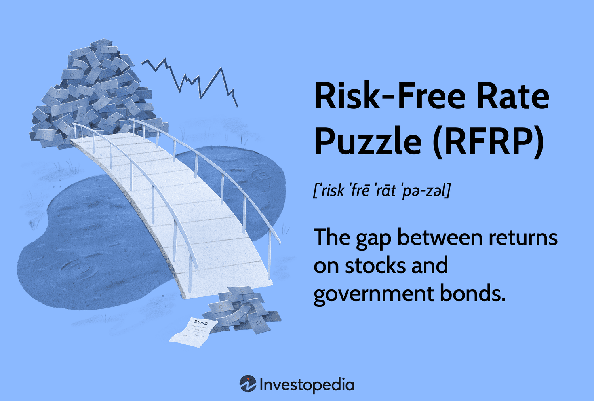

The world of finance is replete with intricate challenges and enigmatic puzzles that captivate both economists and investors alike. Understanding these puzzles is not merely an academic exercise but a crucial part of strategic financial decision-making. One such conundrum is the Risk-Free Rate Puzzle (RFRP), which challenges traditional assumptions about the expected returns on government bonds versus equities. This article will explore these financial puzzles, focusing on the RFRP, within the frameworks of economic theory and algorithmic trading (algo trading).

The Risk-Free Rate Puzzle emerges from the observation that government bonds, considered to be risk-free assets, often yield inexplicably low returns compared to higher-risk equities. This phenomenon raises critical questions about investor behavior, market dynamics, and economic principles. Economists have long debated why rational investors would disproportionately allocate their portfolios to lower-yielding government securities instead of capitalizing on potentially higher returns from equities. This puzzle poses a significant challenge to conventional models of risk and return, as initially highlighted by economists Edward Prescott and Rajnish Mehra.



A deeper understanding of these puzzles is essential for several reasons. Financial markets are influenced by a myriad of factors, including investor behavior, economic shocks, and technological advancements. By dissecting these complexities, investors can make more informed decisions and optimize trading strategies to their advantage. This requires integrating insights from economic theories that attempt to account for anomalies like the RFRP and leveraging advanced computational techniques that algo trading provides. Algorithmic trading, with its sophisticated, data-driven approaches, can offer clarity in deciphering these market puzzles by analyzing trends and identifying disparate opportunities between lower-return bonds and higher-return equities.

As we traverse this intricate landscape, the focus remains on equipping investors with the knowledge needed to navigate the uncertainties and complexities of the financial world effectively. Understanding puzzles like the RFRP is not just about intellectual curiosity; it is about enhancing one's ability to construct diversified portfolios, mitigate risks, and optimize potential returns. Mastery of these concepts is a cornerstone in the broader quest for investment success. Through this exploration, we aim to bridge the gap between economic theory and practical application, offering a comprehensive roadmap for thriving in today's dynamic financial markets.

## Table of Contents

## The Risk-Free Rate Puzzle Explained

The Risk-Free Rate Puzzle (RFRP) pertains to the enigma of persistently low yields on government bonds when juxtaposed with higher returns from equities. This discrepancy has intrigued economists and investors alike, prompting deeper analysis of investor behavior and market dynamics. Typically, government bonds are considered risk-free or possessing minimal default risk compared to equities, which are inherently riskier due to their variable market performance. However, the crux of the puzzle is the enduring preference of investors for government bonds despite their lower returns.

Economists Edward Prescott and Rajnish Mehra were seminal in highlighting this conundrum through their groundbreaking work in the early 1980s. They observed a stark disparity between bond and equity returns, which traditional models could not sufficiently explicate. In essence, the expected rate of return on equities should adequately compensate for their inherent risk when compared to risk-free government bonds. However, the risk premium for equities was observed to be significantly higher than what could be rationalized by standard economic models of that time.

This anomaly questions foundational assumptions about risk aversion among investors and the expected utility theorem. Under standard economic theories, particularly those employing the Capital Asset Pricing Model (CAPM) and its variants, the equity risk premium $E(R_e) - R_f$ where $E(R_e)$ is the expected return on equity and $R_f$ is the risk-free rate, should align closely with the levels of risk aversion in the economy. The CAPM can be formulated as:

$$
E(R_e) = R_f + \beta(E(R_m) - R_f)
$$

where $E(R_m)$ is the expected market return and $\beta$ is the sensitivity of the expected excess asset returns to the expected excess market returns.

The persistence of the RFRP suggests a fundamental gap between theoretical predictions and observed investment behavior. Prescott and Mehra's research pointed out that achieving such a high equity risk premium would require an implausible level of risk aversion among investors or a re-evaluation of the models accounting for intertemporal consumption preferences.

These observations prompt critical examination of investor psychology and the potential influence of non-traditional factors, such as [liquidity](/wiki/liquidity-risk-premium) preferences or institutional constraints, which might favor the stability offered by government bonds despite less lucrative returns. The RFRP continues to be a focal point of financial research, inspiring further explorations into asset pricing models, behavioral finance, and macroeconomic factors influencing market equilibrium.

## Understanding Economic Theory Behind RFRP

The Risk-Free Rate Puzzle (RFRP) presents a significant challenge to existing economic theories, primarily due to its implications on our understanding of investor behavior, risk aversion, and intertemporal substitution. Traditional economic models often assume that investors are rational actors who base their decision-making on expected returns and associated risks. However, the persistent nature of the RFRP, where risk-free assets like government bonds yield consistently lower returns than riskier assets like equities, suggests that these models may not fully capture the complexities of real-world investor behavior.

Existing theories typically highlight three key aspects: risk aversion, intertemporal substitution, and preference for certainty. Risk aversion refers to the tendency of investors to prefer lower-risk investments, even if such choices result in lower returns. This suggests that the puzzle might arise from an underestimation of the level of risk aversion among investors. The concept of intertemporal substitution involves the trade-off between consumption at different points in time, influenced by interest rates. However, the RFRP implies that even when risk-free rates are low, there is not enough consumption substitution over time to justify such persistent low rates, challenging the adequacy of existing models in explaining this phenomenon.

Several economists have attempted to address the RFRP through alternative models. One approach involves modifying utility functions to better reflect observed investor preferences under conditions of uncertainty and economic shocks. For instance, the inclusion of rare economic events or tail risks in asset pricing models has been suggested as a way to explain the higher equity premium and the persistent low risk-free rates. These models posit that the fear of rare but significant economic downturns might lead investors to accept lower returns on government bonds in exchange for their perceived safety.

Despite these advancements, the RFRP remains unsolved, illustrating the complexity of market dynamics. Traditional models such as the Capital Asset Pricing Model (CAPM) and the Consumption-based Capital Asset Pricing Model (CCAPM) fall short in this regard, primarily because they struggle to account for the low correlation between consumption growth and asset returns observed in empirical data. The ongoing debate and development of new models highlight the need for a deeper understanding of risk preferences and market behaviors, which continue to intrigue economists and investors alike.

## The Role of Algorithmic Trading in Dealing with RFRP

Algorithmic trading has become a crucial tool for financial markets, allowing traders and investors to navigate the intricacies of investment puzzles such as the Risk-Free Rate Puzzle (RFRP). This involves utilizing elaborate algorithms to analyze extensive market data and trends, offering insights and potential solutions to these enduring financial conundrums.

One significant advantage of [algorithmic trading](/wiki/algorithmic-trading) is its ability to exploit disparities in bond and equity returns that traditional investment approaches might overlook. By automating trading strategies, algorithms can swiftly process vast amounts of historical and real-time data, identifying patterns and discrepancies within the market. For instance, by employing quantitative models, traders can develop strategies that capitalize on the variances between the expected and actual returns of bonds and equities.

Technological advancements in algorithmic trading offer traders sophisticated tools such as [machine learning](/wiki/machine-learning) and [artificial intelligence](/wiki/ai-artificial-intelligence) to deepen their understanding of market dynamics. These technologies enable the creation of predictive models that can anticipate market movements, thereby providing a strategic edge in decision-making processes. For example, through the application of [reinforcement learning](/wiki/reinforcement-learning), algorithms can adaptively optimize trading strategies by learning from past trades, allowing continuous improvement without human intervention.

One way algorithmic trading assists in dealing with RFRP is by enhancing risk management and return optimization. Through risk assessment models, algorithms can quantify the risk associated with different investment strategies and adjust positions accordingly to minimize potential losses. These models often incorporate variables such as [volatility](/wiki/volatility-trading-strategies), [interest rate](/wiki/interest-rate-trading-strategies) movements, and macroeconomic indicators to deliver a comprehensive risk analysis. By doing so, traders can maintain a balanced portfolio that aligns with their risk appetite while still seeking to exploit the return disparities highlighted by the RFRP.

Here's a simple example of how a Python-based algorithm might be employed to optimize a portfolio addressing the RFRP:

```python
import numpy as np
import pandas as pd
from scipy.optimize import minimize

# Simulated returns for bonds and equities
np.random.seed(42)
bonds_returns = np.random.normal(0.02, 0.01, 1000)
equities_returns = np.random.normal(0.07, 0.15, 1000)

# Portfolio optimization function
def portfolio_optimization(weights, bond_returns, equity_returns):
    portfolio_return = np.dot(weights, [np.mean(bond_returns), np.mean(equity_returns)])
    portfolio_volatility = np.sqrt(np.dot(weights.T, np.dot(np.cov([bond_returns, equity_returns]), weights)))

    # Minimize negative Sharpe ratio
    return - (portfolio_return - 0.01) / portfolio_volatility

# Initial weights for bonds and equities
init_weights = [0.5, 0.5]

# Constraints and bounds
constraints = ({'type': 'eq', 'fun': lambda x: np.sum(x) - 1})
bounds = ((0, 1), (0, 1))

# Optimize the portfolio
optimized = minimize(portfolio_optimization, init_weights, args=(bonds_returns, equities_returns),
                     method='SLSQP', bounds=bounds, constraints=constraints)

optimal_weights = optimized.x
print("Optimized Portfolio Weights: Bonds - {:.2f}, Equities - {:.2f}".format(optimal_weights[0], optimal_weights[1]))
```

The role of algorithmic trading in addressing financial puzzles extends beyond risk mitigation and return enhancement. It feeds into the larger narrative of informed and strategic decision-making in financial markets, empowering investors to adapt to changing conditions and optimize their portfolios in light of persistent ambiguities such as the Risk-Free Rate Puzzle. As technology continues to evolve, the potential of algorithmic trading to tackle longstanding financial puzzles becomes ever more significant, offering a promising horizon for investors and economists alike.

## Implications for Investors and Market Strategies

Understanding financial puzzles, particularly the Risk-Free Rate Puzzle (RFRP), is essential for investors striving to enhance their portfolios. The RFRP underscores the necessity of diversification and strategic asset allocation to navigate the complexities and uncertainties of the financial markets.

The RFRP, which involves the lower-than-expected returns on government bonds compared to equities, suggests that a strategy solely focused on traditional government bonds could lead to suboptimal returns. To mitigate this, investors are encouraged to diversify their portfolios across different asset classes. Diversification reduces the risk associated with any single asset class and enhances the potential for better returns. By balancing investments in both high-return equities and stable government bonds, investors can achieve a more optimized risk-return profile.

Strategic asset allocation is crucial in managing the implications of the RFRP. It involves allocating resources among various asset classes based on an investor's risk tolerance, investment goals, and market conditions. To effectively implement strategic asset allocation, investors need to continuously assess and rebalance their portfolios. This dynamic approach ensures that portfolios remain aligned with changing market conditions and investor objectives.

Integrating economic theories and algorithmic tools is another pathway for investors to enhance their market strategies in light of the RFRP. Economic theories provide a framework to understand investor behavior and market dynamics, while algorithmic tools offer precise and data-driven insights into market trends. Algorithmic trading systems, for example, can analyze vast datasets to identify patterns and opportunities that may not be immediately apparent. These systems can execute trades based on complex algorithms designed to exploit the disparities in returns between bonds and equities.

Python is a powerful tool for developing algorithmic trading systems. Here is a simple example of a Python code snippet that could be used to backtest a simple moving average crossover strategy, a common technique used in algorithmic trading:

```python
import pandas as pd
import numpy as np

# Load historical data
data = pd.read_csv('historical_data.csv')

# Calculate moving averages
short_window = 40
long_window = 100
data['Short_MA'] = data['Close'].rolling(window=short_window, min_periods=1).mean()
data['Long_MA'] = data['Close'].rolling(window=long_window, min_periods=1).mean()

# Generate signals
data['Signal'] = 0.0
data['Signal'][short_window:] = np.where(data['Short_MA'][short_window:] > data['Long_MA'][short_window:], 1.0, 0.0)

# Calculate positions
data['Position'] = data['Signal'].diff()

print(data[['Close', 'Short_MA', 'Long_MA', 'Signal', 'Position']].tail())
```

This code calculates short-term and long-term moving averages and generates buy and sell signals based on their crossover. Such strategies, though simplistic, demonstrate the potential of algorithmic trading in improving investment decisions.

In conclusion, by understanding and responding to financial puzzles like the RFRP through diversification, strategic asset allocation, and the integration of economic theory and algorithmic tools, investors can potentially enhance their portfolios and achieve better investment outcomes.

## Conclusion

Financial puzzles, such as the Risk-Free Rate Puzzle (RFRP), present significant challenges for market participants, demanding a nuanced understanding of both economic theory and practical trading tactics. These puzzles reveal the complexities inherent in market dynamics and investor behavior, emphasizing the need for a strategic approach that blends conventional economic insights with cutting-edge technological solutions.

Integrating economic theory with advanced algorithmic trading techniques provides a formidable strategic advantage. By applying economic concepts related to risk aversion, intertemporal substitution, and investor preferences, traders can gain deeper insights into the underlying mechanisms of puzzles like the RFRP. Algorithmic trading amplifies this advantage by offering sophisticated tools for assessing market trends and anomalies. Algorithms can process large datasets to identify patterns and opportunities that might be invisible to human analysts, thus facilitating more informed and timely investment decisions.

The continuous exploration and understanding of such financial puzzles are crucial for refining decision-making and optimizing investment outcomes. A proactive approach to studying these puzzles encourages adaptability in an ever-evolving market landscape. By staying informed about the latest research and technological advancements, investors can better navigate uncertainties, refine their market strategies, and ultimately enhance portfolio performance.

In summary, while financial puzzles like the RFRP pose significant challenges, they also open up possibilities for growth and innovation. The interplay between theoretical insights and algorithmic applications can transform these challenges into opportunities for improved decision-making and investment success. As technology and economic understanding evolve, so too will the strategies to tackle these enduring financial enigmas.

## References & Further Reading

[1]: Mehra, R., & Prescott, E. C. (1985). ["The Equity Premium: A Puzzle."](https://www.academicwebpages.com/preview/mehra/pdf/The%20Equity%20Premium%20A%20Puzzle.pdf) Journal of Monetary Economics, 15(2), 145-161.

[2]: Campbell, J. Y., & Cochrane, J. H. (1999). ["By Force of Habit: A Consumption-Based Explanation of Aggregate Stock Market Behavior."](https://www.jstor.org/stable/10.1086/250059) Journal of Political Economy, 107(2), 205-251.

[3]: Hansen, L. P., & Singleton, K. J. (1983). ["Stochastic Consumption, Risk Aversion, and the Temporal Behavior of Asset Returns."](https://www.jstor.org/stable/1832056) Journal of Political Economy, 91(2), 249-265.

[4]: Lopez de Prado, M. (2018). ["Advances in Financial Machine Learning."](https://www.amazon.com/Advances-Financial-Machine-Learning-Marcos/dp/1119482089) Wiley.

[5]: Jansen, S. (2018). ["Machine Learning for Algorithmic Trading."](https://github.com/stefan-jansen/machine-learning-for-trading) Packt Publishing.