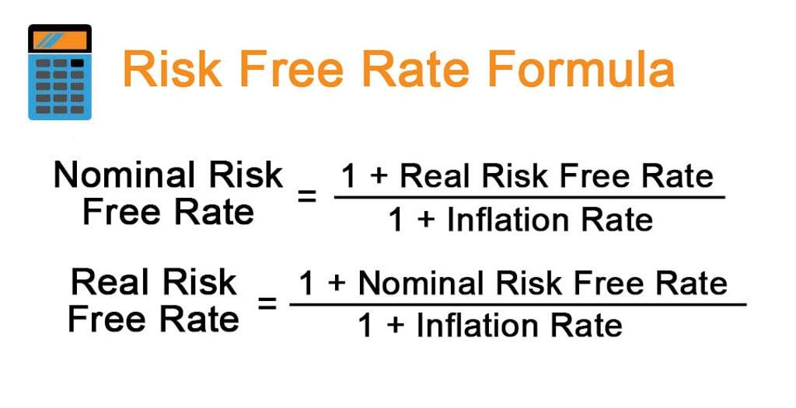

## Table of Contents

## What is a risk-free return?

A risk-free return is the money you can earn from an investment that has no risk of losing your money. Think of it like putting your money in a very safe place, like a special type of bank account or government bond, where you know you'll get your money back plus a little extra. This extra money is the return, and because it's very safe, we call it risk-free.

However, truly risk-free returns are hard to find in real life. Even the safest investments can have some small risks, like changes in interest rates or inflation. But when people talk about risk-free returns, they usually mean investments that are as close to risk-free as possible. These are often used as a benchmark to compare other investments that have more risk but might offer higher returns.

## Why is the concept of risk-free return important in finance?

The concept of risk-free return is important in finance because it helps people understand and compare different investments. Imagine you have some money to invest. You want to know if the investment is worth it, right? By knowing the risk-free return, you can see how much more you might earn from a riskier investment compared to a safe one. If a risky investment doesn't offer much more return than the risk-free one, you might decide it's not worth the risk.

This idea also helps in making financial models and decisions. For example, when figuring out how much to charge for loans or how to price stocks, people often use the risk-free return as a starting point. It's like a baseline that shows the minimum return you should expect without taking any risk. This way, everyone can make smarter choices about where to put their money, balancing the potential rewards against the risks involved.

## How is the risk-free rate typically measured?

The risk-free rate is usually measured by looking at the return on government bonds, especially those from very stable countries like the United States. These bonds are considered safe because the government is unlikely to default on them. The most common example is the yield on U.S. Treasury securities, like the 3-month Treasury bill or the 10-year Treasury note. The rate on these securities is seen as a good measure of the risk-free rate because they are backed by the full faith and credit of the U.S. government.

However, even government bonds can have some risks, like changes in interest rates or inflation. So, when people talk about the risk-free rate, they're usually talking about the closest thing to risk-free they can find. The exact rate used can depend on the time period being considered. For short-term analysis, people might use the rate of a 3-month Treasury bill, while for longer-term planning, they might look at the yield of a 10-year Treasury note.

## What are common examples of risk-free investments?

Risk-free investments are things you can put your money into that are very safe. The most common example is U.S. Treasury securities. These are like special loans you give to the U.S. government, and they promise to pay you back with a little extra. There are different types, like the 3-month Treasury bill, which is good for short-term savings, and the 10-year Treasury note, which is better for longer-term planning.

Another example of a risk-free investment is a savings account at a bank that is insured by the government. In the U.S., this is called FDIC insurance. It means that even if the bank has problems, your money is safe up to a certain amount. These accounts usually don't offer as much extra money as Treasury securities, but they are very easy to use and your money is still very safe.

While these investments are called risk-free, it's important to remember that no investment is completely without risk. Things like changes in interest rates or inflation can affect how much your money is worth. But these are the closest things to risk-free that most people can find.

## How can you calculate the risk-free return on an investment?

To calculate the risk-free return on an investment, you need to look at the [interest rate](/wiki/interest-rate-trading-strategies) or yield of a very safe investment, like U.S. Treasury securities. For example, if you buy a 3-month Treasury bill with a face value of $1,000 and it has a yield of 2%, at the end of 3 months, you will get back your $1,000 plus an extra $20. The $20 is the risk-free return, and you can calculate it by multiplying the face value by the yield (in decimal form): $1,000 x 0.02 = $20.

This calculation helps you see how much money you can earn without taking any risks. If you want to figure out the annual risk-free return, you can use the yield of a longer-term Treasury security, like a 10-year Treasury note. If the yield on a 10-year note is 3%, and you invest $1,000, you would earn $30 each year for 10 years. Again, you find this by multiplying the investment amount by the yield: $1,000 x 0.03 = $30. This gives you a clear picture of what you can expect to earn from the safest investments available.

## What is the difference between nominal and real risk-free rates?

The nominal risk-free rate is the basic interest rate you see on things like Treasury bills or savings accounts. It's the number you see before anyone thinks about inflation. If you put money into a 3-month Treasury bill with a 2% nominal rate, you'll get 2% more money back at the end of 3 months. It's simple and easy to understand.

The real risk-free rate is different because it takes inflation into account. Inflation is when prices go up over time, which means your money can buy less stuff. The real rate tries to show how much your money is really growing, after adjusting for inflation. If the nominal rate is 2% and inflation is 1%, the real rate would be about 1%. This helps you see how much better off you'll be, in terms of what your money can actually buy.

## How does inflation affect the risk-free return?

Inflation can make the risk-free return less valuable over time. Imagine you invest in a Treasury bill with a 2% return. If inflation is also 2%, the extra money you earn from the investment won't buy you any more stuff than before. That's because prices are going up at the same rate as your return. So, even though you get more dollars back, those dollars can buy the same amount of things. This means the real value of your return, after considering inflation, is actually zero.

To understand the true benefit of a risk-free investment, you need to look at the real risk-free rate, which is the nominal rate minus inflation. If your nominal rate is 2% and inflation is 1%, the real rate is 1%. This tells you that your money is actually growing a bit, even after prices go up. Knowing the real rate helps you decide if putting your money in a safe place is worth it, especially when you compare it to riskier investments that might offer higher returns but also come with more uncertainty.

## Can the risk-free rate be negative, and if so, under what circumstances?

Yes, the risk-free rate can be negative. This happens when people are willing to pay to keep their money safe, even if it means they get less money back than they started with. Imagine a world where everyone is really worried about losing their money, maybe because of a big economic problem. They might choose to put their money in very safe places, like government bonds, even if those bonds have a negative return. They do this because they believe it's better to lose a little money safely than to risk losing a lot in a risky investment.

This situation is not common, but it has happened in some countries like Switzerland and Japan. In these cases, the demand for safety is so high that people accept negative returns on government bonds. Even though they know they'll get less money back, they feel it's the best option to protect their money during uncertain times.

## How do changes in the risk-free rate impact other financial instruments?

Changes in the risk-free rate can affect other financial instruments a lot. When the risk-free rate goes up, it means that safe investments like government bonds are giving more money back. This makes other investments, like stocks or corporate bonds, look less attractive because people can get a good return without taking risks. So, the prices of these riskier investments might go down because fewer people want to buy them. Also, when the risk-free rate goes up, it can make borrowing money more expensive. This is because banks and other lenders use the risk-free rate as a starting point to decide how much to charge for loans. If the risk-free rate is higher, they might charge more interest, which can slow down spending and investment in the economy.

On the other hand, when the risk-free rate goes down, it can make other investments look more appealing. If safe investments are giving less money back, people might be more willing to take risks to get a better return. This can push up the prices of stocks and other riskier investments. Lower risk-free rates also make borrowing cheaper, which can encourage people and businesses to take out loans and spend more. This can help the economy grow, but it can also lead to more risk-taking and potentially create bubbles in the market if people get too excited about investing.

## What role does the risk-free rate play in the Capital Asset Pricing Model (CAPM)?

The risk-free rate is a key part of the Capital Asset Pricing Model, or CAPM. CAPM is a way to figure out how much return you should expect from an investment, considering how risky it is. The risk-free rate is the starting point in this model. It's like the minimum return you should get without taking any risk. In CAPM, you add a bit more return on top of the risk-free rate to account for the risk of the investment. This extra return is called the risk premium, and it depends on how much riskier the investment is compared to the risk-free one.

Think of it this way: if you can get a 2% return from a super safe investment like a Treasury bill, you wouldn't want to put your money in a riskier investment unless it offers more than 2%. CAPM helps you figure out how much more you should expect. It uses the risk-free rate as a benchmark and then adds a risk premium based on how the investment moves with the overall market. This way, you can see if the extra return you might get from a riskier investment is worth the extra risk you're taking.

## How do different countries' risk-free rates compare, and why might they differ?

Risk-free rates can be different in different countries because each country has its own economic situation and its own government bonds. For example, the risk-free rate in the United States might be higher than in Japan because the U.S. economy might be growing faster or because people believe U.S. government bonds are safer. When people think a country's government is more likely to pay back its debts, they might be willing to accept a lower return on those bonds, which means a lower risk-free rate.

These differences can also come from things like inflation rates and the overall health of the economy. If a country has high inflation, its risk-free rate might be higher to make up for the fact that money is losing value over time. On the other hand, if a country's economy is doing really well and people trust its government, the risk-free rate might be lower because everyone wants to invest in its safe bonds, even if the return is small. So, the risk-free rate in one country can be very different from another because of all these factors.

## What are the limitations and criticisms of using a risk-free rate in financial models?

One big problem with using the risk-free rate in financial models is that it's not really risk-free. Even the safest investments, like U.S. Treasury bonds, can lose value if interest rates go up or if inflation gets out of control. This means that the "risk-free" rate can change and might not be as safe as people think. Also, the risk-free rate is different in different countries, so it can be hard to use it as a standard measure when you're looking at investments around the world.

Another issue is that the risk-free rate might not be the best way to compare all kinds of investments. For example, if you're trying to decide between a stock and a government bond, using the risk-free rate might make the stock look too risky because it doesn't take into account other factors like how the stock might grow or pay dividends. Some people also argue that using the risk-free rate can make financial models too simple, missing out on the real complexities of the market. So, while the risk-free rate is a useful starting point, it has its limits and should be used carefully.

## What is involved in understanding financial calculations in investing?

Financial calculations form the backbone of investment decisions, offering essential insights into the potential gains and risks that accompany various strategies. These calculations enable investors to compare diverse opportunities and ensure alignment with financial objectives, thereby optimizing portfolio performance.

Return on Investment (ROI) is a primary metric utilized to evaluate investment profitability. It is calculated as:

$$
ROI = \left( \frac{\text{Net Profit}}{\text{Total Investment}} \right) \times 100
$$

This formula provides a straightforward indication of the [earning](/wiki/earning-announcement) potential of an investment relative to its cost, thereby permitting investors to quickly assess performance.

Net Present Value (NPV) is another vital financial metric, which helps measure the value of future cash flows generated by an investment, discounted back to their present worth. The formula for NPV is:

$$
NPV = \sum \left( \frac{C_t}{(1 + r)^t} \right) - C_0
$$

where $C_t$ is the cash inflow during period $t$, $r$ is the discount rate, and $C_0$ is the initial investment. A positive NPV indicates that the projected earnings (adjusted for time and risk) exceed the original investment cost, thus representing a potentially advantageous opportunity.

The Internal Rate of Return (IRR) is a closely related concept, representing the discount rate at which the NPV of all cash flows from a particular project equals zero. IRR is frequently used in capital budgeting to assess the viability of investments.

The Compound Annual Growth Rate (CAGR) provides another perspective by evaluating the annual growth rate of an investment over a specified time horizon. The calculation is expressed by the following formula:

$$
CAGR = \left( \frac{EV}{BV} \right)^{\frac{1}{n}} - 1
$$

where $EV$ is the ending value, $BV$ is the beginning value, and $n$ is the number of years. CAGR is instrumental in smoothing out fluctuations over time, thereby offering a normalized measure of investment growth.

Mastery of these financial metrics is crucial for investors aiming to make informed and strategic decisions. By applying these calculations, investors can gain a comprehensive understanding of the potential return and risk associated with individual investment opportunities, thereby enabling them to tailor their portfolios toward achieving their unique financial goals effectively.

## What is Risk-Free Return: Concept and Application?

Risk-free return represents the theoretical return on an investment with zero risk, typically modeled by the yield on government securities, such as U.S. Treasury bills. As a critical component in financial modeling, the risk-free return serves as a baseline metric used to gauge the performance of investments with higher risk profiles. Importantly, this metric provides investors with a means to assess the risk premium, which is the return above the risk-free rate that investors expect from a riskier asset. 

The risk-free return, despite its theoretical foundation, plays a vital role in portfolio management and investment strategy development. In the context of the Capital Asset Pricing Model (CAPM), the risk-free rate is integral to calculating the expected return of an asset. The formula for CAPM is as follows:

$$

E(R_i) = R_f + \beta_i (E(R_m) - R_f) 
$$

Where: 
- $E(R_i)$ is the expected return of the investment,
- $R_f$ is the risk-free rate,
- $\beta_i$ is the beta of the investment, indicating its volatility relative to the market,
- $E(R_m)$ is the expected market return.

The calculation of the risk premium, $E(R_m) - R_f$, helps investors evaluate whether the potential returns of a riskier investment justify the additional risk compared to a risk-free asset. Although theoretically risk-free, no investment is entirely devoid of risk due to factors such as inflation risk and credit risk inherent in even the most stable government securities.

In practice, the risk-free return is often influenced by monetary policy and economic conditions, which can affect government bond yields. Investors must continuously update their assessments based on changes in these economic factors to maintain an accurate benchmark for evaluating investment performance and managing portfolio risk.

## References & Further Reading

[1]: Fabozzi, F. J. (2009). ["Handbook of Portfolio Construction: Contemporary Applications of Markowitz Techniques"](https://link.springer.com/book/10.1007/978-0-387-77439-8). Springer.

[2]: Bodie, Z., Kane, A., & Marcus, A. J. (2014). ["Investments"](https://books.google.com/books/about/EBOOK_Investments_Global_edition.html?id=BMsvEAAAQBAJ). McGraw-Hill Education.

[3]: Hull, J. C. (2018). ["Options, Futures, and Other Derivatives"](https://www.semanticscholar.org/paper/Options%2C-Futures%2C-and-Other-Derivatives-Hull/89bdee500c8623864fc9eb7a471546aa713acc44). Pearson.

[4]: Lopez de Prado, M. (2018). ["Advances in Financial Machine Learning"](https://www.amazon.com/Advances-Financial-Machine-Learning-Marcos/dp/1119482089). Wiley.

[5]: Chan, E. P. (2009). ["Quantitative Trading: How to Build Your Own Algorithmic Trading Business"](https://github.com/ftvision/quant_trading_echan_book). Wiley.

[6]: Sharpe, W. F. (1966). ["Mutual Fund Performance."](https://www.jstor.org/stable/2351741) Journal of Business, 39(1), 119–138.

[7]: Jansen, S. (2018). ["Machine Learning for Algorithmic Trading: Predictive models to extract signals from market and alternative data for systematic trading strategies"](https://github.com/stefan-jansen/machine-learning-for-trading). Packt Publishing.