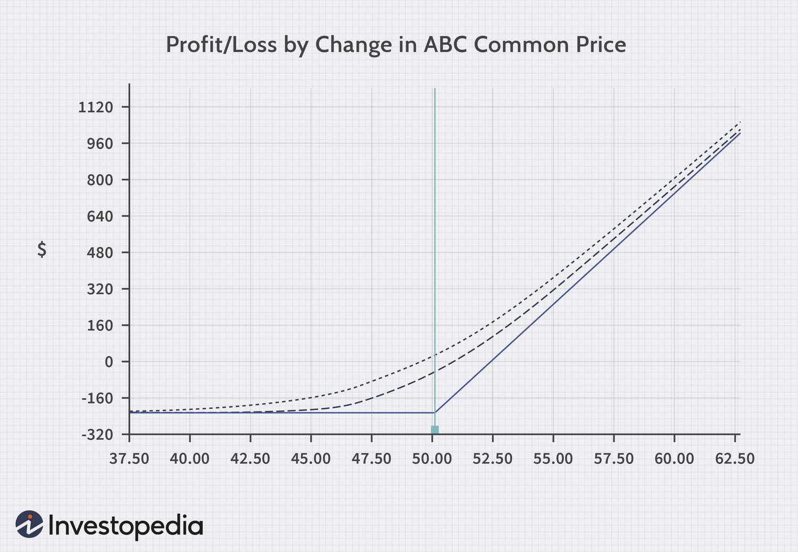

## Table of Contents

## What is a risk graph?

A risk graph, also known as a risk-reward diagram, is a visual tool used in finance to show the potential profit or loss of an investment at different price levels. It helps investors understand how much they might gain or lose depending on how the price of the investment changes. The graph usually has the price of the investment on the horizontal axis and the profit or loss on the vertical axis.

By looking at a risk graph, investors can see at a glance the possible outcomes of their investment strategy. This can help them make better decisions about whether to buy, sell, or hold their investments. For example, if the graph shows that the potential loss is much larger than the potential gain, an investor might decide that the investment is too risky.

## How does a risk graph visually represent risk?

A risk graph shows risk by drawing a line that moves up or down based on how the price of an investment changes. The line on the graph tells you how much money you could make or lose. If the line goes up, it means you could make more money as the price of the investment goes up. If the line goes down, it means you could lose money if the price goes down.

The graph has two main parts: the horizontal line at the bottom, which shows different prices of the investment, and the vertical line on the side, which shows how much profit or loss you might have. By looking at where the line on the graph is at different prices, you can see how risky the investment is. If the line shows big losses for small changes in price, the investment is very risky. If the line shows small losses or even gains for big changes in price, the investment is less risky.

## What are the basic components of a risk graph?

A risk graph has two main parts. The first part is the horizontal line at the bottom of the graph. This line shows different prices that the investment could be at. It helps you see what might happen if the price of the investment goes up or down. The second part is the vertical line on the side of the graph. This line shows how much money you could make or lose. If the line goes up, it means you could make more money. If it goes down, it means you could lose money.

The line on the graph that moves up and down is very important. It shows how much profit or loss you might have at different prices. By looking at this line, you can see if the investment is risky. If the line shows big losses for small changes in price, the investment is very risky. If the line shows small losses or even gains for big changes in price, the investment is less risky. This helps you understand the risk of the investment easily.

## What types of data are typically used in risk graphs?

Risk graphs usually use data about the price of an investment and how much money you could make or lose. The price data shows different levels that the investment could reach. This helps you see what might happen if the price goes up or down. For example, if you are looking at a stock, the graph might show the stock price at different levels, like $50, $60, or $70.

The other type of data used in risk graphs is about profit and loss. This data shows how much money you could gain or lose at different price levels. If the price of the investment goes up, the graph shows how much money you could make. If the price goes down, it shows how much money you could lose. By looking at this data on the graph, you can understand the risk of the investment better.

## How can risk graphs be used in project management?

Risk graphs can help people who manage projects see how risky different parts of the project are. They use the graph to show how likely it is that something bad might happen and how bad it could be if it does happen. For example, if a project has a part that could delay everything and cost a lot of money, the risk graph would show a big loss for that part. By looking at the graph, project managers can see which parts of the project are the most risky and need more attention or planning.

Using risk graphs in project management can also help make better plans to deal with risks. If the graph shows that one part of the project is very risky, the team can think of ways to make that part less risky. They might decide to spend more time planning that part, or they might find ways to do it differently to avoid the risk. This helps the project go more smoothly and finish on time, even when things don't go as planned.

## What are the common applications of risk graphs in financial markets?

Risk graphs are very useful in the financial markets because they help people see how much they could gain or lose from an investment. Traders and investors use these graphs to understand what might happen if the price of a stock, option, or any other investment goes up or down. By looking at the graph, they can see at different price levels how much money they could make or lose. This helps them decide if the investment is worth the risk. For example, if a risk graph shows that a stock could lose a lot of money with just a small drop in price, an investor might decide not to buy it.

In options trading, risk graphs are especially important. Options are contracts that give the buyer the right to buy or sell an asset at a certain price. A risk graph for an option shows how the option's value changes with the price of the underlying asset. This helps traders see the potential profit or loss at different prices of the asset. They can use this information to choose the right options to buy or sell, and to set up strategies that limit their risk. For instance, if a trader sees that an option's risk graph shows limited loss and high potential gain, they might decide to use that option in their trading strategy.

## How do risk graphs help in decision-making processes?

Risk graphs help people make decisions by showing them how much they could win or lose. They use a picture to make it easy to see what might happen if the price of something goes up or down. For example, if you are thinking about buying a stock, the risk graph can show you that if the stock price goes up, you could make a lot of money. But if the stock price goes down, you might lose money. By looking at the graph, you can decide if the possible reward is worth the risk.

In project management, risk graphs help managers see which parts of a project are risky. They can see how likely it is that something bad might happen and how bad it could be. If a part of the project looks very risky on the graph, the manager might decide to spend more time planning that part or find a different way to do it. This helps them make better plans and avoid problems, so the project can go smoothly and finish on time.

## What are the limitations of using risk graphs?

Risk graphs can be very helpful, but they also have some problems. One big problem is that they only show what might happen if things go as planned. They don't show what could happen if something unexpected comes up. For example, a risk graph might show what could happen to a stock's price, but it won't show what would happen if there's a big news event that changes everything. This means that while risk graphs are good for planning, they can't predict everything that might happen.

Another limitation is that risk graphs can be hard to understand if you're new to them. They use lines and numbers to show risk, and if you don't know how to read them, you might not get the full picture. This can lead to making bad decisions because you might not see all the risks. Also, risk graphs are based on numbers and guesses about the future, which means they might not always be right. If the guesses are wrong, the graph won't be very helpful.

## How can risk graphs be integrated with other risk management tools?

Risk graphs can be used together with other tools to help manage risk better. For example, they can be combined with risk matrices, which are tables that show how likely something bad is to happen and how bad it could be. By using a risk graph with a risk matrix, you can see not just how much you might lose or gain, but also how likely those outcomes are. This gives you a fuller picture of the risks you are facing and helps you make better decisions.

Another way to use risk graphs with other tools is to combine them with risk assessment software. This kind of software can help you gather and analyze a lot of data about risks. When you use this data with a risk graph, you can see how different risks might affect your project or investment. This helps you plan better and find ways to reduce the risks. By using risk graphs with other tools, you can get a clearer and more complete view of the risks you are dealing with.

## What advanced techniques can enhance the accuracy of risk graphs?

To make risk graphs more accurate, one advanced technique is using more data. Instead of just looking at past prices, you can include other information like how the market is doing overall, what news might affect the investment, and what other people are saying about it. By putting all this data into the risk graph, you get a better picture of what might happen. This can help you see risks that you might miss if you only look at price changes.

Another technique is using computer models to predict what might happen. These models can look at a lot of data very quickly and find patterns that people might not see. By using these models with risk graphs, you can make better guesses about future prices and risks. This helps make the risk graph more useful because it shows you more possible outcomes and gives you a clearer idea of what could happen.

## How do different industries customize risk graphs for their specific needs?

In the finance industry, risk graphs are often customized to show the potential profit or loss from specific investments like stocks or options. They might include different lines on the graph to show what happens if the price goes up or down by certain amounts. This helps traders and investors see exactly how much they could make or lose at different price levels. They might also add data about market trends or economic news to make the graph more accurate and useful for making decisions about buying or selling investments.

In the project management field, risk graphs are tailored to show the risks associated with different parts of a project. They might use colors or different shapes to highlight which parts are more risky and need more attention. For example, a project manager might use a risk graph to show how likely it is that a certain task will be delayed and how much that delay could cost. By customizing the graph this way, they can better plan for risks and make sure the project stays on track and within budget.

## What future developments are expected in the field of risk graph technology?

In the future, risk graph technology is expected to become even better at showing risks by using more advanced computer programs. These programs will be able to look at a lot more data, like news, social media, and other market information, to make the risk graphs more accurate. This means that people using risk graphs will be able to see not just what might happen based on past prices, but also how other things could affect their investments or projects. This will help them make better decisions because they will have a clearer picture of what could happen.

Another development that might happen is that risk graphs will become easier to use and understand. Right now, some people find them hard to read, but in the future, they could be made simpler with better designs and explanations. Also, new technology might let people use risk graphs on their phones or other devices, making them more convenient. This would help more people use risk graphs to manage risks in their work or investments, no matter where they are.

## What is the key to understanding financial risk in trading?

Financial risk in trading represents the potential for financial loss that traders may face when participating in market activities. The inherent nature of trading carries risks due to factors such as market volatility, economic fluctuations, and unforeseen global events. These elements can lead to rapid price changes, impacting investments and trading positions adversely.

Traders need to recognize and evaluate multiple types of risks to protect their portfolios effectively. The primary categories of financial risk include:

1. **Market Risk**: This risk arises from fluctuations in market prices that can lead to losses. Market risk is influenced by various factors, including changes in economic indicators, interest rates, and geopolitical events. It can be measured using statistical methods such as Value at Risk (VaR), which estimates the potential loss in value of a portfolio over a given period, under normal market conditions.
$$
   \text{VaR} = \mu - z \cdot \sigma

$$

   where $\mu$ is the expected return, $z$ is the z-score (standard deviations from the mean), and $\sigma$ is the standard deviation of portfolio returns.

2. **Credit Risk**: This type of risk occurs when a counterparty fails to fulfill their financial obligations. For traders, this means that there might be a default on payments due, affecting the liquidity and stability of their portfolio.

3. **Liquidity Risk**: Liquidity risk emerges when a trader is unable to buy or sell an asset quickly without a substantial price concession. This risk is particularly significant during periods of market stress when buyer and seller imbalances can cause significant price disparities.

Effective risk management is essential for balancing the potential returns and the exposure to these risks. Traders employ various strategies to manage and mitigate these risks, allowing for more informed decision-making processes. This involves analyzing historical data, employing statistical models, and using tools such as stop-loss orders and diversification to minimize potential adverse effects.

By acknowledging and preparing for these financial risks, traders are better positioned to navigate the complexity and uncertainty of the financial markets, ultimately contributing to more stable and profitable trading outcomes.

## What are the ways to explore risk graphs in trading?

Risk graphs, often utilized in trading, offer a critical visual mechanism for assessing potential profit and loss scenarios across different trading strategies, including options trading. These two-dimensional graphs present a simplified yet effective way to comprehend the intricate relationship between the price of an underlying asset at expiration and various potential outcomes.

At its core, a risk graph is a plot with the horizontal axis representing the price of the underlying asset and the vertical axis showing the potential profit or loss. This visualization allows traders to see how different positions—such as long calls, short puts, or complex multi-leg strategies like straddles and strangles—perform across a range of price movements at expiration.

To illustrate, consider the scenario of a call option. A risk graph for a single call option would begin to show losses equal to the option premium if the price of the underlying asset remains below the strike price at expiration. As the asset's price rises above the strike price, the graph will display increasing profits, reflecting the option's payoff structure. Mathematically, the profit $P$ from a long call option can be expressed as:

$$
P = \max(0, S - K) - C
$$

where $S$ is the price of the underlying asset, $K$ is the strike price, and $C$ is the premium paid for the option. The risk graph visually represents this formula, allowing traders to predict outcomes more intuitively.

Similarly, for more complex strategies, risk graphs can reveal the combined impact of multiple options. For instance, a straddle, which involves buying a call and a put option with the same strike price and expiration date, will show how potential profits are achieved when there is significant movement in either direction, provided the movement offsets the total premium paid for both options.

By analyzing these graphs, traders can effectively gauge the viability of specific strategies, adapting their positions based on the anticipated movement of the underlying asset. This analysis is crucial for formulating strategies that capitalize on market volatility, like exploiting expected price fluctuations around major economic announcements.

In essence, risk graphs serve as invaluable tools in the trading toolkit, enabling traders to visualize and anticipate the financial risks and rewards of different investment strategies. The clarity offered by these visual representations ensures that traders are better prepared to make informed decisions, mitigating the uncertainty inherent in financial markets.

## What are Advanced Risk Management Techniques in Algo Trading?

In algorithmic trading, advanced risk management techniques are critical to the success and sustainability of trading strategies. Quantitative analysis and [machine learning](/wiki/machine-learning) models are at the forefront of these techniques, significantly enhancing risk mitigation capabilities.

Quantitative analysis involves the use of statistical and mathematical models to understand market behaviors and predict future movements. By analyzing historical data, traders can identify patterns and trends that inform their algorithmic strategies. A popular model used is the Value at Risk (VaR), which quantifies the potential loss in value of an asset or portfolio over a defined period for a given confidence interval. The formula for VaR is generally expressed as:

$$
\text{VaR} = \sigma \cdot Z \cdot \sqrt{t}
$$

where $\sigma$ is the standard deviation of the portfolio's return, $Z$ is the Z-score corresponding to the desired confidence level, and $t$ is the time horizon.

Machine learning models further bolster these strategies by learning from large datasets to identify non-linear relationships and extract insights that may not be evident through traditional analysis. Machine learning algorithms, such as decision trees and neural networks, can provide real-time risk assessments and forecasts, adapting quickly to market changes.

Portfolio diversification is another pivotal technique. By spreading investments across various financial instruments and markets, traders can mitigate exposure to specific asset risk. This technique reduces the impact of poorly performing assets on the entire portfolio.

Dynamic position sizing is a strategy where the size of a trading position adjusts based on market volatility and portfolio risk tolerance. For automated trading systems, this can be implemented using algorithms that increase or decrease positions automatically. A simple Python implementation might include using the volatility index to adjust position sizes:

```python
def calculate_position_size(volatility_index, capital, max_risk):
    risk_adjusted_capital = capital * max_risk / volatility_index
    return risk_adjusted_capital
```

Automated triggers, such as stop-loss and take-profit orders, are essential for controlling market exposure. These triggers are programmed into algorithms to automatically execute trades when predefined price levels are reached, thus limiting losses or locking in profits. For instance, a stop-loss order automatically sells a position when the asset's price falls to a certain level, protecting the trader from further losses.

By employing these advanced risk management techniques, traders can effectively manage potential risks, secure profits, and maintain market exposure within acceptable limits. The integration of quantitative analysis, machine learning, and active risk management tools transforms how traders approach risk in the fast-paced environment of algorithmic trading, fostering more resilient and adaptive strategies.

## References & Further Reading

[1]: Koul, S. (2018). ["Trading and Pricing Financial Derivatives: A Guide to Futures, Options, and Swaps."](https://www.degruyter.com/document/doi/10.1515/9781547401161/html) Notion Press.

[2]: Hull, J.C. (2018). ["Options, Futures, and Other Derivatives"](https://www.semanticscholar.org/paper/Options%2C-Futures%2C-and-Other-Derivatives-Hull/89bdee500c8623864fc9eb7a471546aa713acc44). Pearson.

[3]: Black, F., & Scholes, M. (1973). ["The Pricing of Options and Corporate Liabilities."](https://www.cs.princeton.edu/courses/archive/fall09/cos323/papers/black_scholes73.pdf) Journal of Political Economy, 81(3), 637-654.

[4]: Cont, R., & Kan, Y.H. (2011). ["Statistical Modeling of High-Frequency Financial Data."](https://ieeexplore.ieee.org/document/5999562) IEEE Signal Processing Magazine, 28(5), 16-27.

[5]: Cartea, Á., Jaimungal, S., & Penalva, J. (2015). ["Algorithmic and High-Frequency Trading."](https://assets.cambridge.org/97811070/91146/frontmatter/9781107091146_frontmatter.pdf) Cambridge University Press.

[6]: Fabozzi, F.J., Focardi, S.M., & Kolm, P.N. (2010). ["Quantitative Equity Investing: Techniques and Strategies."](https://www.semanticscholar.org/paper/Quantitative-Equity-Investing%3A-Techniques-and-Fabozzi-Focardi/1c49a2a53919f7e65cb96f16691b8ff726fd3cd7) John Wiley & Sons.

[7]: Glasserman, P. (2004). ["Monte Carlo Methods in Financial Engineering."](https://archive.org/details/montecarlomethod0000glas) Springer.