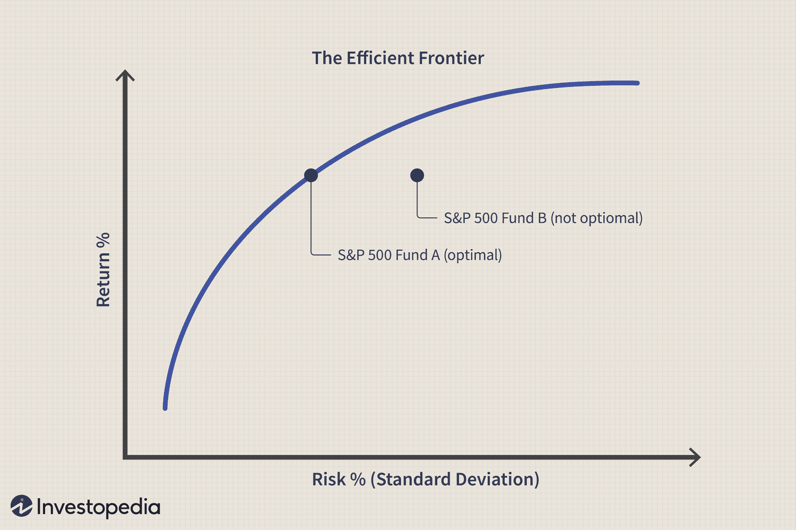

Algorithmic trading, often referred to as algo trading, has dramatically transformed the landscape of financial markets by enabling traders to execute orders with unprecedented speed and precision. This advancement is primarily driven by complex algorithms that analyze market conditions and execute trades automatically, minimizing human intervention. Despite these benefits, the integration of sophisticated algorithms introduces significant risks, such as exposure to rapid market changes and system failures, which necessitate effective risk management strategies.

In the context of algorithmic trading, understanding and managing financial risk is crucial to sustaining profitability and reducing potential losses. Financial risk, in this setting, encompasses the possibility of monetary loss due to factors such as market volatility, erroneous trades, or unforeseen economic shifts. To address these challenges, traders must employ strategies that carefully balance the potential for returns against the inherent risks, ensuring that their trading systems are both robust and adaptable.



This article explores the critical aspects of risk management and the utility of risk graphs as tools to mitigate potential losses in algorithmic trading. Risk graphs offer a visual representation of potential profit and loss scenarios for various trading strategies, allowing traders to anticipate and strategize around potential market movements effectively. By incorporating these visual aids into their decision-making processes, traders can develop more resilient and profitable trading systems.

Moreover, understanding risk dynamics is essential in crafting robust algo trading strategies. By analyzing risk models and integrating advanced risk management techniques, traders can enhance their ability to navigate the volatile landscape of financial markets. This approach not only reduces the impact of adverse market conditions but also fosters the creation of sustainable trading strategies capable of thriving amidst ever-changing market dynamics.

## Table of Contents

## Understanding Financial Risk in Trading

Financial risk in trading represents the potential for financial loss that traders may face when participating in market activities. The inherent nature of trading carries risks due to factors such as market volatility, economic fluctuations, and unforeseen global events. These elements can lead to rapid price changes, impacting investments and trading positions adversely.

Traders need to recognize and evaluate multiple types of risks to protect their portfolios effectively. The primary categories of financial risk include:

1. **Market Risk**: This risk arises from fluctuations in market prices that can lead to losses. Market risk is influenced by various factors, including changes in economic indicators, interest rates, and geopolitical events. It can be measured using statistical methods such as Value at Risk (VaR), which estimates the potential loss in value of a portfolio over a given period, under normal market conditions.
$$
   \text{VaR} = \mu - z \cdot \sigma

$$

   where $\mu$ is the expected return, $z$ is the z-score (standard deviations from the mean), and $\sigma$ is the standard deviation of portfolio returns.

2. **Credit Risk**: This type of risk occurs when a counterparty fails to fulfill their financial obligations. For traders, this means that there might be a default on payments due, affecting the liquidity and stability of their portfolio.

3. **Liquidity Risk**: Liquidity risk emerges when a trader is unable to buy or sell an asset quickly without a substantial price concession. This risk is particularly significant during periods of market stress when buyer and seller imbalances can cause significant price disparities.

Effective risk management is essential for balancing the potential returns and the exposure to these risks. Traders employ various strategies to manage and mitigate these risks, allowing for more informed decision-making processes. This involves analyzing historical data, employing statistical models, and using tools such as stop-loss orders and diversification to minimize potential adverse effects.

By acknowledging and preparing for these financial risks, traders are better positioned to navigate the complexity and uncertainty of the financial markets, ultimately contributing to more stable and profitable trading outcomes.

## The Role of Risk Management in Algo Trading

In [algorithmic trading](/wiki/algorithmic-trading), risk management is essential due to the rapid execution and complexity of trades managed by algorithms. The primary aim of risk management is to minimize potential losses while maximizing profitability. Key strategies that form the backbone of effective risk management in algorithmic trading include setting stop-loss orders, diversifying portfolios, and employing hedging techniques.

Stop-loss orders are automated triggers that instruct a trading system to sell an asset once it reaches a pre-determined price level. This strategy is critical in algorithmic trading, where the sheer number of transactions can amplify risk exposure. By pre-defining an acceptable loss threshold, traders can prevent substantial financial damage in volatile markets. For instance, if an asset is purchased at $100, a trader might set a stop-loss order at $95. This ensures that if the market moves unfavorably, losses are capped at $5 per asset.

Portfolio diversification is another fundamental strategy in managing risks. By spreading investments across a range of assets, traders reduce the potential impact from any single asset's adverse movement. Diversification minimizes unsystematic risk—risk unique to a specific company or industry—ensuring that a downturn in one market segment does not disproportionately affect the entire portfolio. A well-diversified portfolio may include a mix of equities, bonds, commodities, and foreign exchange positions.

Hedging techniques are also vital. Hedging involves taking an offsetting position in a related asset to balance any undesired market movement. For example, a trader might use options or futures contracts to hedge against potential losses in an equity position. This strategy effectively insures against downside risks, allowing traders to mitigate potential losses without liquidating their positions.

These strategies collectively assist traders in navigating market [volatility](/wiki/volatility-trading-strategies) and dynamic conditions. By preserving capital through these risk mitigation techniques, traders can sustain their operations and maintain strategic flexibility. This adaptability is crucial in a trading environment characterized by rapid technological changes and unpredictable market shifts. Effective risk management in algorithmic trading not only focuses on loss prevention but also enhances the potential to capitalize on market opportunities, contributing to long-term trading success.

## Exploring Risk Graphs in Trading

Risk graphs, often utilized in trading, offer a critical visual mechanism for assessing potential profit and loss scenarios across different trading strategies, including options trading. These two-dimensional graphs present a simplified yet effective way to comprehend the intricate relationship between the price of an underlying asset at expiration and various potential outcomes.

At its core, a risk graph is a plot with the horizontal axis representing the price of the underlying asset and the vertical axis showing the potential profit or loss. This visualization allows traders to see how different positions—such as long calls, short puts, or complex multi-leg strategies like straddles and strangles—perform across a range of price movements at expiration.

To illustrate, consider the scenario of a call option. A risk graph for a single call option would begin to show losses equal to the option premium if the price of the underlying asset remains below the strike price at expiration. As the asset's price rises above the strike price, the graph will display increasing profits, reflecting the option's payoff structure. Mathematically, the profit $P$ from a long call option can be expressed as:

$$
P = \max(0, S - K) - C
$$

where $S$ is the price of the underlying asset, $K$ is the strike price, and $C$ is the premium paid for the option. The risk graph visually represents this formula, allowing traders to predict outcomes more intuitively.

Similarly, for more complex strategies, risk graphs can reveal the combined impact of multiple options. For instance, a straddle, which involves buying a call and a put option with the same strike price and expiration date, will show how potential profits are achieved when there is significant movement in either direction, provided the movement offsets the total premium paid for both options.

By analyzing these graphs, traders can effectively gauge the viability of specific strategies, adapting their positions based on the anticipated movement of the underlying asset. This analysis is crucial for formulating strategies that capitalize on market volatility, like exploiting expected price fluctuations around major economic announcements.

In essence, risk graphs serve as invaluable tools in the trading toolkit, enabling traders to visualize and anticipate the financial risks and rewards of different investment strategies. The clarity offered by these visual representations ensures that traders are better prepared to make informed decisions, mitigating the uncertainty inherent in financial markets.

## Applying Risk Graphs to Algo Trading Strategies

In algorithmic trading, the integration of risk graphs into strategies can significantly elevate the decision-making process. Risk graphs, also known as payoff diagrams, offer a visual depiction of the relationship between the price of an underlying asset and the potential gains or losses from a trading strategy. By employing these visual tools, traders can better anticipate and evaluate the risk-reward balance of various algorithmic scenarios. This section will outline the practical application of risk graphs in algorithmic trading to optimize strategy formulation.

Risk graphs are particularly useful when analyzing options strategies, as they provide a clear representation of potential outcomes across different price points at expiration. In algorithmic trading, similar principles can be applied to analyze scenarios such as short positions, option spreads, and other complex trading strategies.

### Visualizing Payoffs for Algorithmic Scenarios

Consider an algorithm designed to execute a butterfly spread on an underlying asset. A butterfly spread typically involves buying and selling options at three different strike prices, with the goal of profiting from minimal price movement at expiration. The risk graph for such a strategy visually illustrates the maximum profit, maximum loss, and breakeven points, enabling traders to fine-tune the algorithm’s parameters for optimal performance.

For instance, the following example in Python utilizes the `matplotlib` library to plot a theoretical payoff diagram for a butterfly spread:

```python
import matplotlib.pyplot as plt
import numpy as np

strike_prices = [100, 105, 110]
premiums = [-2, 5, -2]
quantities = [1, -2, 1]

spot_prices = np.arange(90, 120, 0.5)
payoffs = []

for spot in spot_prices:
    payoff = 0
    for strike, premium, qty in zip(strike_prices, premiums, quantities):
        if spot < strike:
            payoff += qty * (spot - strike) + qty * premium
        else:
            payoff += qty * premium
    payoffs.append(payoff)

plt.plot(spot_prices, payoffs, label="Butterfly Spread")
plt.xlabel("Spot Price")
plt.ylabel("Payoff")
plt.title("Risk Graph for Butterfly Spread")
plt.axhline(0, color='black', linewidth=0.5)
plt.grid(True)
plt.legend()
plt.show()
```

This script produces a risk graph that allows the trader to visualize the risk and reward associated with the butterfly spread, guiding decision-making to ensure that the trading algorithm optimally adjusts its positions.

### Developing Comprehensive Strategies

By incorporating risk graphs, algorithmic traders can develop more comprehensive strategies that anticipate various market movements. For example, algorithms can be instructed to adjust position sizes dynamically based on the payoff profiles depicted in risk graphs, thereby improving responsiveness to market conditions.

Additionally, these visual tools can assist in stress testing algorithmic models by simulating adverse market scenarios. Traders can use risk graphs to test algorithm resilience against sudden price shifts, adjusting parameters to bolster strategy robustness.

Risk graphs also facilitate comparative analyses between different algorithmic strategies. By juxtaposing multiple risk graphs, traders can evaluate which strategy offers a lower risk profile or a more favorable risk-reward ratio, leading to informed decisions about which strategies to execute or modify.

In summary, integrating risk graphs into algorithmic trading strategies empowers traders with the ability to anticipate potential payoffs, account for diverse market movements, and optimize the overall strategy for better performance in a dynamic trading environment.

## Advanced Risk Management Techniques in Algo Trading

In algorithmic trading, advanced risk management techniques are critical to the success and sustainability of trading strategies. Quantitative analysis and [machine learning](/wiki/machine-learning) models are at the forefront of these techniques, significantly enhancing risk mitigation capabilities.

Quantitative analysis involves the use of statistical and mathematical models to understand market behaviors and predict future movements. By analyzing historical data, traders can identify patterns and trends that inform their algorithmic strategies. A popular model used is the Value at Risk (VaR), which quantifies the potential loss in value of an asset or portfolio over a defined period for a given confidence interval. The formula for VaR is generally expressed as:

$$
\text{VaR} = \sigma \cdot Z \cdot \sqrt{t}
$$

where $\sigma$ is the standard deviation of the portfolio's return, $Z$ is the Z-score corresponding to the desired confidence level, and $t$ is the time horizon.

Machine learning models further bolster these strategies by learning from large datasets to identify non-linear relationships and extract insights that may not be evident through traditional analysis. Machine learning algorithms, such as decision trees and neural networks, can provide real-time risk assessments and forecasts, adapting quickly to market changes.

Portfolio diversification is another pivotal technique. By spreading investments across various financial instruments and markets, traders can mitigate exposure to specific asset risk. This technique reduces the impact of poorly performing assets on the entire portfolio.

Dynamic position sizing is a strategy where the size of a trading position adjusts based on market volatility and portfolio risk tolerance. For automated trading systems, this can be implemented using algorithms that increase or decrease positions automatically. A simple Python implementation might include using the volatility index to adjust position sizes:

```python
def calculate_position_size(volatility_index, capital, max_risk):
    risk_adjusted_capital = capital * max_risk / volatility_index
    return risk_adjusted_capital
```

Automated triggers, such as stop-loss and take-profit orders, are essential for controlling market exposure. These triggers are programmed into algorithms to automatically execute trades when predefined price levels are reached, thus limiting losses or locking in profits. For instance, a stop-loss order automatically sells a position when the asset's price falls to a certain level, protecting the trader from further losses.

By employing these advanced risk management techniques, traders can effectively manage potential risks, secure profits, and maintain market exposure within acceptable limits. The integration of quantitative analysis, machine learning, and active risk management tools transforms how traders approach risk in the fast-paced environment of algorithmic trading, fostering more resilient and adaptive strategies.

## Conclusion

Effective financial risk management and the application of risk graphs are essential components for ensuring successful algorithmic trading strategies. By mastering these elements, traders can adeptly maneuver through the unpredictable and often volatile financial markets.

Comprehensive risk management practices enable traders to systematically evaluate potential threats and devise strategies that balance risk with anticipated returns. The use of risk graphs further aids in visualizing complex scenarios, allowing for better foresight into potential outcomes of trading strategies under varying market conditions. This analytical visualization not only aids in identifying the relationships between different risk factors but also assists in anticipating how market shifts can impact trading positions.

The integration of these tools fosters the development of robust trading strategies. By effectively understanding and managing financial risk, traders can secure a competitive edge in the fast-paced world of algo trading. They achieve this by optimizing portfolio performance through strategies that are both resilient to market disruptions and capable of capitalizing on opportunities as they arise. This careful balance between opportunity and risk results in trading strategies that are not just resilient but also profitable and sustainable.

Application of advanced risk management techniques, such as quantitative analysis and machine learning, further enhances the potential for successful trading outcomes. These tools provide traders with deep insights into market behavior, enabling the formulation of strategies that automatically adjust to evolving conditions, thus securing profits while managing potential losses.

In conclusion, a disciplined approach to financial risk management and the strategic use of risk graphs empower traders to develop algorithmic trading strategies that are well-equipped to withstand the challenges of today's dynamic market environment. These practices ensure that traders maintain a steady pursuit of profit and sustainability amidst the ever-shifting tides of global financial markets.

## References & Further Reading

[1]: Koul, S. (2018). ["Trading and Pricing Financial Derivatives: A Guide to Futures, Options, and Swaps."](https://www.degruyter.com/document/doi/10.1515/9781547401161/html) Notion Press.

[2]: Hull, J.C. (2018). ["Options, Futures, and Other Derivatives"](https://www.semanticscholar.org/paper/Options%2C-Futures%2C-and-Other-Derivatives-Hull/89bdee500c8623864fc9eb7a471546aa713acc44). Pearson.

[3]: Black, F., & Scholes, M. (1973). ["The Pricing of Options and Corporate Liabilities."](https://www.cs.princeton.edu/courses/archive/fall09/cos323/papers/black_scholes73.pdf) Journal of Political Economy, 81(3), 637-654.

[4]: Cont, R., & Kan, Y.H. (2011). ["Statistical Modeling of High-Frequency Financial Data."](https://ieeexplore.ieee.org/document/5999562) IEEE Signal Processing Magazine, 28(5), 16-27.

[5]: Cartea, Á., Jaimungal, S., & Penalva, J. (2015). ["Algorithmic and High-Frequency Trading."](https://assets.cambridge.org/97811070/91146/frontmatter/9781107091146_frontmatter.pdf) Cambridge University Press.

[6]: Fabozzi, F.J., Focardi, S.M., & Kolm, P.N. (2010). ["Quantitative Equity Investing: Techniques and Strategies."](https://www.semanticscholar.org/paper/Quantitative-Equity-Investing%3A-Techniques-and-Fabozzi-Focardi/1c49a2a53919f7e65cb96f16691b8ff726fd3cd7) John Wiley & Sons.

[7]: Glasserman, P. (2004). ["Monte Carlo Methods in Financial Engineering."](https://archive.org/details/montecarlomethod0000glas) Springer.