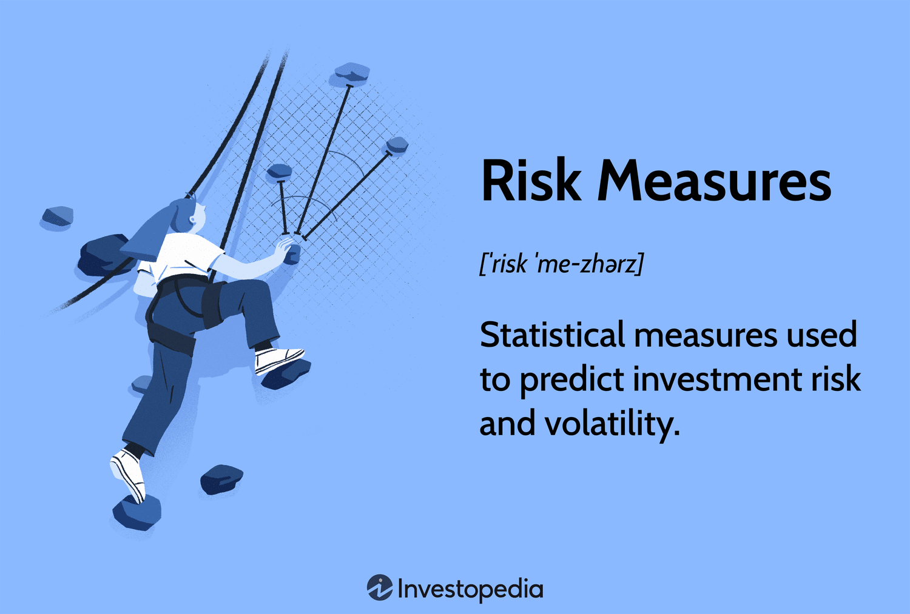

## Table of Contents

## What is risk in the context of investing?

Risk in investing means the chance that you might lose some or all of your money. When you invest, you're hoping to make more money, but there's always a possibility that things won't go as planned. For example, if you buy a stock and the company does poorly, the value of your stock could go down, and you could lose money.

Different investments have different levels of risk. Some investments, like government bonds, are considered safer because they are less likely to lose value. Other investments, like stocks in new companies, are riskier because their value can change a lot. Understanding the risk of an investment helps you decide if it's a good choice for you, based on how much risk you're willing to take and how long you plan to keep your money invested.

## How can beginners identify different types of investment risks?

Beginners can start by understanding that there are different kinds of risks when investing. One common type is market risk, which means the value of your investment can go up or down because of what's happening in the overall market. For example, if the stock market goes down, most stocks will lose value too. Another type is interest rate risk, where the value of bonds can change if interest rates go up or down. There's also company risk, where the value of a stock can drop if the company itself is not doing well.

Another way to identify risks is by looking at how much an investment's value can change over time. This is called volatility. Investments like stocks can be very volatile, meaning their value can swing a lot in a short time. On the other hand, things like savings accounts or government bonds are usually less volatile. Beginners can also consider inflation risk, which is the chance that the money you get back from your investment won't be worth as much because of rising prices. By understanding these different types of risks, beginners can make smarter choices about where to put their money.

## What are common methods to measure investment risk?

One common way to measure investment risk is by looking at something called standard deviation. This tells you how much an investment's returns can go up and down. If an investment has a high standard deviation, it means its value can change a lot, which is riskier. If it has a low standard deviation, it means the value doesn't change as much, so it's less risky. For example, stocks usually have a higher standard deviation than bonds.

Another method is to use a tool called beta. Beta measures how much an investment moves compared to the overall market. If a stock has a beta of 1, it moves the same way as the market. If it has a beta higher than 1, it's more volatile than the market, which means it's riskier. If it has a beta lower than 1, it's less volatile, so it's less risky. This can help investors understand how their investment might behave in different market conditions.

There's also the Sharpe ratio, which looks at how much return you're getting for the risk you're taking. It compares the return of an investment to a risk-free investment like a government bond. A higher Sharpe ratio means you're getting more return for the risk you're taking, which is good. A lower Sharpe ratio means you're not getting much return for the risk, which is not as good. These methods help investors see how risky their investments might be and make better choices.

## How does the concept of risk tolerance affect investment decisions?

Risk tolerance is how much risk someone is okay with when they invest. It's really important because it helps people decide which investments are right for them. If someone has a high risk tolerance, they might be okay with their money going up and down a lot. They might choose to invest in things like stocks, which can be riskier but might also give them bigger returns. On the other hand, if someone has a low risk tolerance, they might not want their money to change a lot. They might pick safer investments, like bonds or savings accounts, even if the returns are smaller.

Understanding your risk tolerance can help you make better investment choices. For example, if you're young and saving for retirement, you might have a higher risk tolerance because you have a long time before you need the money. You might choose to invest in stocks to try and grow your money more. But if you're closer to retirement, you might have a lower risk tolerance because you don't want to lose money right before you need it. You might move your money into safer investments to protect it. Knowing your risk tolerance helps you pick investments that you feel comfortable with and that fit your financial goals.

## What is the difference between systematic and unsystematic risk?

Systematic risk is the kind of risk that affects the whole market or a big part of it. It's sometimes called "market risk" because it's about things that can make the entire market go up or down. Things like changes in interest rates, inflation, or even big events like a global economic crisis can cause systematic risk. You can't really avoid systematic risk by choosing different investments because it affects everything. For example, if there's a big drop in the stock market, most stocks will probably go down too.

Unsystematic risk, on the other hand, is the risk that comes from specific companies or industries. It's also called "specific risk" because it's about things that only affect one company or a small group of companies. For example, if a company's CEO gets into trouble, or if there's a problem with one of its products, the value of that company's stock might go down. But this kind of risk doesn't affect the whole market. You can reduce unsystematic risk by spreading your investments across different companies and industries, a strategy known as diversification.

## How can diversification help in managing investment risk?

Diversification is like not putting all your eggs in one basket. When you spread your money across different types of investments, like stocks, bonds, and real estate, you're less likely to lose everything if one of them goes bad. If one company or industry has a problem, it might not affect your whole investment because you have money in other places too. This way, you can lower the risk that comes from things that only affect one company or industry, which is called unsystematic risk.

Even though diversification can't get rid of all risk, it can make your investments safer. It doesn't protect you from things that affect the whole market, like a big economic downturn, but it can help smooth out the ups and downs of your investment returns. By having a mix of different investments, you're more likely to have some that do well even when others aren't doing so great. This can help you feel more comfortable with your investments and keep your money safer over time.

## What role do risk-adjusted returns play in evaluating investments?

Risk-adjusted returns help you see how well an investment is doing when you consider the risk involved. It's like looking at the score of a game but also thinking about how hard the game was. If two investments give you the same amount of money back, but one was a lot riskier, the one that was less risky would have a better risk-adjusted return. This helps you understand if the extra risk you took was worth it or if you could have gotten similar returns with less risk.

One common way to measure risk-adjusted returns is by using the Sharpe ratio. This tool compares the return of an investment to a safe investment like a government bond. If an investment has a high Sharpe ratio, it means you're getting a good return for the risk you're taking. If it has a low Sharpe ratio, you might be taking too much risk for the return you're getting. By looking at risk-adjusted returns, you can make smarter choices about where to put your money, [picking](/wiki/asset-class-picking) investments that give you the best balance of risk and reward.

## How can advanced investors use statistical measures like standard deviation and beta to assess risk?

Advanced investors can use standard deviation to understand how much an investment's value might go up and down. Standard deviation is like a measure of how bumpy the ride might be. If an investment has a high standard deviation, it means its value can change a lot, which is riskier. For example, stocks usually have a higher standard deviation than bonds, meaning their prices can swing more wildly. By looking at the standard deviation, advanced investors can decide if they're okay with how much the value of their investment might move around. This helps them pick investments that match their comfort level with risk.

Beta is another tool that advanced investors use to assess risk, and it shows how an investment moves compared to the overall market. If a stock has a beta of 1, it moves the same way as the market. A beta higher than 1 means the stock is more volatile than the market, making it riskier. A beta lower than 1 means it's less volatile, which is less risky. For example, if the market goes up by 10%, a stock with a beta of 1.5 might go up by 15%. By understanding an investment's beta, advanced investors can see how it might react during different market conditions and choose investments that fit their risk tolerance and investment strategy.

## What are Value at Risk (VaR) and Conditional Value at Risk (CVaR), and how are they used in risk management?

Value at Risk (VaR) is a way to measure how much money you might lose from an investment over a certain time period. It's like saying, "There's a 5% chance I could lose this much money in the next month." VaR helps investors and companies understand the worst-case scenario they might face. For example, if a bank calculates a VaR of $1 million at a 5% level for one day, it means there's a 5% chance they could lose up to $1 million in a single day. By using VaR, people can make better decisions about how much risk they want to take and plan for potential losses.

Conditional Value at Risk (CVaR), also known as Expected Shortfall, goes a step further than VaR. While VaR tells you the maximum loss you might face at a certain confidence level, CVaR tells you what the average loss might be if you go beyond that VaR level. So, if your VaR says you might lose up to $1 million with a 5% chance, CVaR would tell you that, if you do lose more than $1 million, the average loss might be $1.5 million. This helps investors understand not just the worst-case scenario but also how bad things could get if that scenario happens. Both VaR and CVaR are important tools in risk management because they give a clearer picture of potential losses and help in making more informed investment decisions.

## How can hedging strategies be employed to mitigate investment risk?

Hedging is like buying insurance for your investments. It's a way to protect your money from big losses by making another investment that can help balance things out. For example, if you own a stock and you're worried it might go down, you can use a hedging strategy called buying a put option. A put option gives you the right to sell your stock at a certain price, even if the market price drops lower. This way, if the stock does go down, the put option can help cover some of your losses.

Another way to hedge is by using something called futures contracts. If you're worried that the price of something you own, like oil or wheat, might go down, you can sell a futures contract. This means you agree to sell that thing at a set price in the future. If the price does drop, the money you make from the futures contract can help make up for the loss in value of what you own. Hedging can't stop all risk, but it can make your investments safer by reducing how much you could lose if things go wrong.

## What are the implications of using leverage on investment risk?

Using leverage means borrowing money to invest. It can make your gains bigger if your investment does well, but it also makes your losses bigger if it doesn't. Think of it like this: if you use leverage to buy more stocks and the stocks go up, you make more money than if you had just used your own money. But if the stocks go down, you lose more money too, because you still have to pay back what you borrowed.

Because of this, using leverage can make your investments a lot riskier. If the market goes against you, you could lose more than you started with. This is why it's important to understand how much risk you're taking on when you use leverage. It's like riding a bike with no hands – it can be exciting, but it's also more dangerous. So, if you decide to use leverage, make sure you know what you're doing and are ready for the possibility of bigger losses.

## How do regulatory frameworks and compliance affect risk management strategies in investing?

Regulatory frameworks and compliance rules are like the rules of the game for investing. They are made by governments and financial groups to make sure that everyone plays fair and to protect people who invest their money. These rules can affect how investors manage risk by setting limits on what they can do. For example, some rules might say how much money you can borrow to invest, which is called leverage. If you can't use as much leverage because of the rules, you might not be able to take as big of risks. Also, these rules can make companies share more information about their risks, which helps investors make smarter choices.

Having to follow these rules can make risk management strategies more complicated. Investors need to keep up with changes in the rules and make sure they're doing everything right. This can take time and money, but it can also help reduce risk by making sure everyone is playing by the same rules. For example, if a new rule says that banks have to keep more money in reserve, it might make the whole financial system safer. This can help investors feel more secure about their investments, knowing that there are rules in place to protect them.

## What is the Importance of Risk Measurement?

Risk measurement is a critical component of investment strategy, serving as a fundamental tool for evaluating potential loss and making informed trading decisions. Accurately measuring risk enables investors and traders to identify vulnerabilities within their portfolios and devise strategies to mitigate those risks, ultimately fostering more robust decision-making processes.

Three traditional metrics widely utilized in risk measurement are standard deviation, Value at Risk (VaR), and Beta. Standard deviation is a statistical measure that quantifies the amount of variation or [dispersion](/wiki/dispersion-trading) in a set of values. In investment terms, it represents the degree to which an asset's returns can deviate from its average return, providing insights into the asset's [volatility](/wiki/volatility-trading-strategies). A higher standard deviation indicates greater return variability, which may imply higher risk.

$$
\sigma = \sqrt{\frac{1}{N}\sum_{i=1}^{N}(x_i - \mu)^2}
$$

Value at Risk (VaR) is another crucial metric providing a probabilistic assessment of the maximum expected loss within a specified confidence level and time horizon. By evaluating historical return data, VaR helps investors understand and manage the potential financial impact of adverse market movements. The calculation of VaR typically involves historical simulation, variance-covariance method, or Monte Carlo simulation, allowing traders to tailor risk assessments to their specific needs.

Beta is a measure of an asset's sensitivity to market movements. It quantifies the extent to which an asset's returns respond to changes in the overall market, often represented by a relevant benchmark index. A beta greater than one suggests that the asset is more volatile than the market, while a beta less than one indicates reduced sensitivity. Beta thus enables investors to gauge the systematic risk associated with individual securities or portfolios in relation to broader market fluctuations.

Assessing risk often involves analyzing historical data and market volatility. Historical data provides context for how an asset or portfolio has performed under various conditions, highlighting periods of high volatility or adverse events that may inform future risk assessments. By understanding past behavior, investors can better anticipate potential risks and adjust their strategies accordingly.

Various risk measurement tools are available to identify where risk lies within a portfolio and how it can potentially impact an investment strategy. These tools, including scenario analysis, stress testing, and sensitivity analysis, allow investors to simulate different market conditions and evaluate their portfolios' resilience under such scenarios. Through these analyses, traders can gain a deeper understanding of which components of their portfolios may pose the greatest risk and devise strategies to address these vulnerabilities.

Overall, robust risk measurement is integral to prudent investment management, enabling investors and traders to navigate the complexities of financial markets with greater confidence. By applying these traditional metrics and leveraging sophisticated analysis tools, they can more effectively manage risks and optimize their investment outcomes.

## References & Further Reading

[1]: Bergstra, J., Bardenet, R., Bengio, Y., & Kégl, B. (2011). ["Algorithms for Hyper-Parameter Optimization."](https://dl.acm.org/doi/10.5555/2986459.2986743) Advances in Neural Information Processing Systems 24.

[2]: ["Advances in Financial Machine Learning"](https://www.amazon.com/Advances-Financial-Machine-Learning-Marcos/dp/1119482089) by Marcos Lopez de Prado

[3]: ["Evidence-Based Technical Analysis: Applying the Scientific Method and Statistical Inference to Trading Signals"](https://www.amazon.com/Evidence-Based-Technical-Analysis-Scientific-Statistical/dp/0470008741) by David Aronson

[4]: ["Machine Learning for Algorithmic Trading"](https://github.com/stefan-jansen/machine-learning-for-trading) by Stefan Jansen

[5]: ["Quantitative Trading: How to Build Your Own Algorithmic Trading Business"](https://www.amazon.com/Quantitative-Trading-Build-Algorithmic-Business/dp/1119800064) by Ernest P. Chan