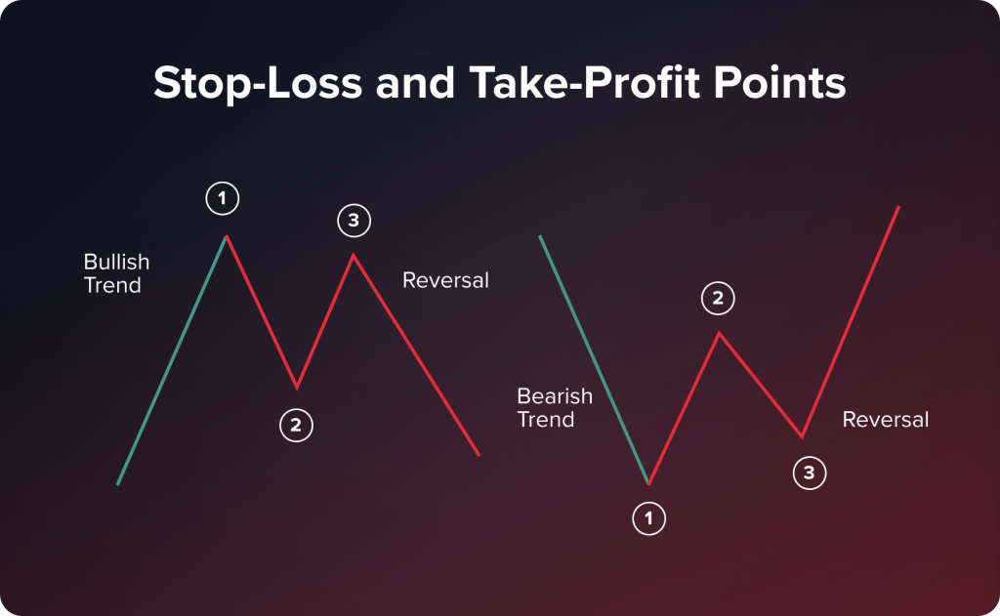

## Table of Contents

## What is risk management in trading?

Risk management in trading is about making smart choices to protect your money while you trade. It's like having a safety net that helps you avoid big losses. Traders use risk management to decide how much money they can afford to lose on each trade, set limits on their losses, and choose the right times to buy and sell. This way, even if some trades don't go well, they won't lose all their money.

A common way to manage risk is by using something called a "stop-loss order." This is like a rule you set that automatically sells your investment if it drops to a certain price, so you don't lose more money than you're okay with losing. Another way is to not put all your money into one trade. Instead, you spread it out over different investments, which is called diversification. This can help because if one investment goes down, the others might still be doing well.

## Why is risk management important for traders?

Risk management is super important for traders because it helps them keep their money safe. When you trade, there's always a chance you could lose money. But with good risk management, traders can set up rules and limits that stop them from losing too much on any single trade. This means they can keep trading even if some trades don't work out, without risking all their money at once.

It's also about making smart choices. By using tools like stop-loss orders and spreading their money across different investments, traders can protect themselves from big losses. This way, they can stay in the game longer and have more chances to make money. Without risk management, traders might make quick, risky decisions that could lead to losing everything, so it's a key part of successful trading.

## What are the common types of risks in trading?

In trading, there are several types of risks that traders need to watch out for. One big risk is market risk, which happens when the whole market goes up or down. This can affect all the investments a trader has, no matter how good they are. Another common risk is credit risk, which is when the company or person a trader has invested in can't pay back the money they owe. This can lead to losing money if the company goes bankrupt.

There's also liquidity risk, which is when it's hard to buy or sell an investment quickly without losing money. If a trader needs to sell something fast but can't find a buyer, they might have to sell it for less than it's worth. Lastly, operational risk is about problems with the systems and processes used for trading. This can include things like computer failures or mistakes made by the people handling the trades. All these risks can impact how much money a trader makes or loses, so it's important to understand and manage them.

## How can a beginner start implementing basic risk management strategies?

For a beginner, starting with basic risk management strategies means first understanding how much money you can afford to lose. This is called your risk capital. It's the money you can use for trading without worrying about losing your rent or grocery money. Once you know your risk capital, you can decide how much to put into each trade. A common rule is to never risk more than 1-2% of your total trading money on a single trade. This way, even if you lose on a few trades, you won't lose all your money.

Another simple strategy is using stop-loss orders. A stop-loss order is like setting a safety net. You decide a price at which you want to sell your investment if it starts dropping too much. This helps you limit your losses. Also, try not to put all your money into one type of investment. This is called diversification. By spreading your money across different investments, you reduce the risk of losing everything if one investment goes bad. These basic steps can help a beginner manage risks and trade more safely.

## What is the difference between stop-loss and take-profit orders?

A stop-loss order is like a safety net that you set up when you're trading. It tells your trading platform to automatically sell your investment if its price drops to a certain level. This helps you limit how much money you lose on a trade. For example, if you buy a stock at $100 and set a stop-loss at $90, the stock will be sold automatically if its price falls to $90, so you don't lose more than $10.

On the other hand, a take-profit order is like setting a goal for your trade. It tells your platform to sell your investment when it reaches a certain higher price, so you can lock in your profits. For instance, if you buy that same stock at $100 and set a take-profit at $110, the stock will be sold automatically when it reaches $110, ensuring you make a profit of $10 per share. Both orders help you manage your trades, but they work in opposite ways: stop-losses protect you from big losses, while take-profits help you secure your gains.

## How do leverage and margin affect risk in trading?

Leverage and margin can make trading riskier but also potentially more rewarding. Leverage means borrowing money from your broker to make bigger trades than you could with just your own money. It's like using a lever to lift a heavy weight; a little effort can move a lot more. But if the trade goes against you, you could lose more than you started with because you're using borrowed money. Margin is the money you put down as a deposit to use leverage. It's like a down payment on a house. If your trades go well, you can make bigger profits because you're trading with more money. But if they go badly, you might get a margin call, where you have to add more money or close your trades, which can lead to bigger losses.

Using leverage and margin can be a double-edged sword. On one hand, they let you control larger positions with less of your own money, which can lead to bigger gains if the market moves in your favor. On the other hand, if the market moves against you, the losses can be much bigger too. That's why it's important to use these tools carefully and always have a solid risk management plan in place. For example, setting stop-loss orders can help limit your losses when you're using leverage, and making sure you have enough money in your account to cover potential margin calls is crucial.

## What are some advanced risk management techniques used by experienced traders?

Experienced traders often use a technique called position sizing to manage risk. This means they carefully decide how much money to put into each trade based on how risky it is and how much they can afford to lose. They might use a formula to figure out the right size for each position, making sure they don't risk too much of their total money on any single trade. They also pay attention to the correlation between different investments, making sure they're not too similar so that a drop in one doesn't hurt all their trades at once. This helps them spread out their risk and keep their trading account safe.

Another advanced technique is using options and futures to hedge their trades. Hedging is like buying insurance for your investments. If a trader thinks a stock might go down, they can use options or futures to protect themselves from losing too much money. This way, even if the stock price drops, the loss on the trade might be offset by gains in the hedging instruments. Experienced traders also keep an eye on their overall portfolio risk, using tools like Value at Risk (VaR) to understand how much they could potentially lose in a bad market day. By combining these techniques, they can manage their risks better and keep trading even when the market gets tough.

## How can diversification help in managing trading risks?

Diversification is like not putting all your eggs in one basket. When you spread your money across different types of investments, you reduce the risk of losing everything if one investment goes bad. For example, if you only invest in one company's stock and that company does poorly, you could lose a lot of money. But if you also have money in other stocks, bonds, or even different industries, a drop in one won't hurt your whole portfolio as much. This way, you have a better chance of keeping your money safe and still making some gains.

By diversifying, you're also taking advantage of different market conditions. Some investments might do well when others are struggling. For instance, when the stock market is down, bonds might be doing better. By having a mix of investments, you can balance out the ups and downs. This helps you manage risk because even if one part of your portfolio loses value, another part might be gaining, which can help cushion the blow. Diversification doesn't guarantee you won't lose money, but it can make your trading safer and more stable over time.

## What role does psychological risk play in trading, and how can it be managed?

Psychological risk in trading is about the emotions and feelings that can make traders do things they shouldn't. When you're trading, it's easy to get scared, excited, or stressed. These feelings can make you buy or sell at the wrong times, like selling a stock too soon because you're afraid it will go down more, even though it might go back up. Or you might hold onto a losing trade too long, hoping it will turn around, even though it's better to cut your losses. These emotional decisions can lead to big mistakes and big losses.

To manage psychological risk, traders need to stay calm and stick to their plans. One way to do this is by setting clear rules for when to buy and sell, and then following those rules no matter how you feel. Using stop-loss and take-profit orders can help take the emotion out of trading because they automatically do what you planned. It's also helpful to take breaks and not trade when you're feeling too emotional. Talking to other traders or a mentor can give you support and help you learn from your mistakes. By managing your emotions, you can make better trading decisions and avoid the big losses that come from letting your feelings take over.

## How should traders adjust their risk management strategies in different market conditions?

Traders need to change their risk management strategies depending on what the market is doing. In a bull market, where prices are going up, traders might feel more confident and want to take on more risk. They might put more money into each trade or use more leverage. But they should still be careful and use stop-loss orders to protect their gains. It's easy to get too excited in a bull market and forget about risk management, but sticking to a plan can help traders keep their money safe and make smart decisions.

In a bear market, where prices are going down, traders need to be more careful. They might use less leverage and put less money into each trade to avoid big losses. It's a good idea to use wider stop-loss orders to give their investments more room to move without getting sold off too soon. Diversifying their investments can also help protect their money. By adjusting their risk management to fit the market, traders can handle tough times better and be ready for when the market starts to recover.

## What are the best practices for reviewing and adjusting risk management plans?

Regularly reviewing your risk management plan is key to staying safe while trading. You should check your plan often to see if it's working well. Look at how much money you're making or losing, and think about if your rules for buying and selling are good. If you find that you're losing more money than you planned, or if the market is changing a lot, it might be time to make some changes. Talk to other traders or a mentor to get their advice. It's also a good idea to write down what you learn from your trades so you can use that information to make your plan better next time.

Adjusting your risk management plan can help you handle different market conditions better. If the market is doing well, you might want to take on a bit more risk, but still keep your stop-loss orders in place to protect your gains. If the market is doing badly, you should be more careful and use less leverage, and maybe even make your stop-loss orders wider so your investments have more room to move. By keeping your plan up to date and making changes when you need to, you can trade more safely and have a better chance of making money in the long run.

## How can traders use quantitative analysis to enhance their risk management?

Traders can use quantitative analysis to make their risk management better by looking at numbers and data to understand how risky their trades are. They can use tools like standard deviation to see how much their investments might go up or down. This helps them set stop-loss orders at the right places to limit their losses. They can also use something called the Sharpe ratio to see if the risk they're taking is worth the reward they're getting. By using these numbers, traders can make smarter choices about how much money to put into each trade and when to buy or sell.

Another way quantitative analysis helps is by using models like Value at Risk (VaR) to predict how much money they might lose on a bad day. This can help traders decide how much risk they're comfortable with and adjust their trading plan accordingly. They can also use backtesting to see how well their risk management strategies would have worked in the past. By looking at this data, traders can find out what works and what doesn't, and then make their plan better. Using numbers and data in this way helps traders manage their risks more carefully and make trading safer.

## References & Further Reading

[1]: Chan, E. (2009). ["Quantitative Trading: How to Build Your Own Algorithmic Trading Business."](https://github.com/ftvision/quant_trading_echan_book) John Wiley & Sons.

[2]: Jansen, S. (2020). ["Machine Learning for Algorithmic Trading - Second Edition: Predictive models to extract signals from market and alternative data for systematic trading strategies with Python."](https://github.com/stefan-jansen/machine-learning-for-trading) Packt Publishing.

[3]: Lopez de Prado, M. (2018). ["Advances in Financial Machine Learning."](https://www.amazon.com/Advances-Financial-Machine-Learning-Marcos/dp/1119482089) Wiley.

[4]: Aronson, D. R. (2007). ["Evidence-Based Technical Analysis: Applying the Scientific Method and Statistical Inference to Trading Signals."](https://www.amazon.com/Evidence-Based-Technical-Analysis-Scientific-Statistical/dp/0470008741) Wiley.

[5]: Aldridge, I. (2013). ["High-Frequency Trading: A Practical Guide to Algorithmic Strategies and Trading Systems."](https://www.amazon.com/High-Frequency-Trading-Practical-Algorithmic-Strategies/dp/1118343506) Wiley.