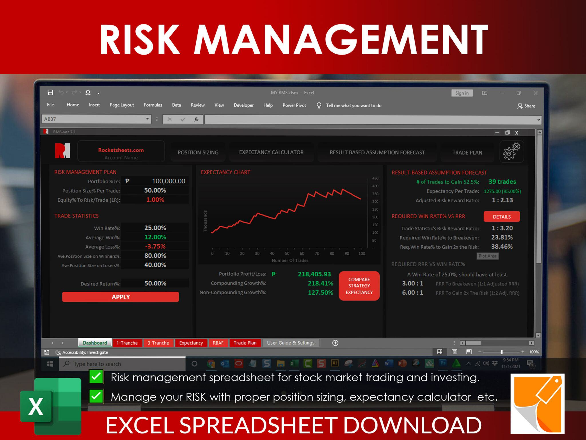

Algorithmic trading, commonly known as algo trading, leverages advanced algorithms to execute trading decisions at speeds and complexities that far exceed human capabilities. This high-speed and intricate environment necessitates meticulous risk management to prevent substantial financial losses. With predefined algorithms handling a vast number of transactions, maintaining stability and profitability hinges on robust risk management practices.

In the ever-evolving landscape of finance, the significance of risk management in algo trading cannot be overstated. As this article outlines, understanding various risk types and developing strategies to mitigate them is essential for sustaining operational success. The rapid pace at which trades occur amplifies potential risks, making it imperative to implement effective risk management strategies capable of safeguarding against market volatilities.



Technological advancements have broadened the accessibility of risk management tools, allowing algo traders to more readily integrate these protocols into their systems. This integration is critical because the nature of algorithmic trading exposes traders to a wide array of risks that require constant attention and adaptation. As such, traders are tasked with a delicate balancing act between optimizing returns and managing risks.

To successfully navigate volatile markets, traders must not only understand but also anticipate the balance between potential returns and associated risks. This understanding is crucial for maximizing profitability while minimizing potential downsides. Through strategic risk management, traders can ensure that their algo trading systems remain both efficient and resilient against adverse market conditions.

## Table of Contents

## Defining Risk Management in Algo Trading

Risk management in trading is the systematic approach to identifying, analyzing, and minimizing risks inherent in trading activities. In algorithmic trading, this process involves utilizing automated systems to manage the various risks associated with complex algorithms and rapid decision-making. The primary objective of effective risk management is to safeguard capital, reduce potential losses, and ensure the stability and reliability of trading algorithms.

Automated processes in algo trading play a pivotal role in risk management, as they offer a means to handle the vast data and rapid computations required in this domain. These systems are designed to continually monitor market conditions and make split-second decisions based on predefined criteria. By doing so, they aim to maintain a favorable risk-return ratio, allowing traders to undertake calculated risks with enhanced precision.

Integral to algorithmic risk management is the establishment of measures that enhance the efficiency and reliability of trading activities. For instance, setting up automated stop-loss orders or implementing dynamic hedging strategies can help prevent substantial financial setbacks. These mechanisms are vital to ensure that trading operations remain stable, even in the face of volatile market conditions.

To further illustrate, consider the process of measuring risk using Value at Risk (VaR). VaR estimates how much a portfolio might lose over a given period for a specified confidence interval. Such metrics are crucial for assessing the potential financial impact and informing the decision-making process regarding risk mitigation strategies.

```python
import numpy as np

def calculate_var(returns, confidence_level=0.95):
    """
    Calculate the Value at Risk (VaR) for a set of returns.

    :param returns: Array of returns
    :param confidence_level: Confidence level for VaR calculation
    :returns: VaR value
    """
    sorted_returns = np.sort(returns)
    index = int((1 - confidence_level) * len(sorted_returns))
    return abs(sorted_returns[index])

# Example usage:
returns = np.random.normal(0, 0.1, 1000)
var = calculate_var(returns)
print(f"Value at Risk (VaR): {var}")
```

Overall, algorithmic risk management seeks to bolster the operational framework within which these algorithms function, minimizing the likelihood of adverse outcomes. Through strategic planning and leveraging technology, it ensures the algorithms perform effectively without incurring unnecessary financial risks.

## Various Risks in Algo Trading

Algorithmic trading, commonly referred to as algo trading, presents a distinct set of risks compared to traditional manual trading. These risks demand robust risk management strategies to safeguard investments and ensure operational stability. The risks inherent in algo trading can be broadly categorized into market, credit, [liquidity](/wiki/liquidity-risk-premium), technological, and operational risks.

Market risk is a significant concern in algo trading, primarily due to the high [volatility](/wiki/volatility-trading-strategies) that can occur in financial markets. As prices fluctuate rapidly, algorithms must be nimble to adapt to sudden market shifts, which can lead to substantial gains or losses. This unpredictability highlights the necessity for algorithms to have built-in mechanisms to react appropriately to market changes.

Credit risk in [algorithmic trading](/wiki/algorithmic-trading) pertains to the uncertainties surrounding financial obligations between counterparties. When engaging in transactions, the possibility of default from one party can pose a significant risk, leading to financial shortfalls. Mitigating this risk involves rigorous assessment of counterparties' creditworthiness and employing strategies to minimize exposure to potential defaults.

Liquidity risk arises when an asset cannot be quickly sold or bought without causing a significant impact on its price. In algo trading, liquidity risk is crucial, as algorithmic strategies often rely on the ability to enter and [exit](/wiki/exit-strategy) positions swiftly. Illiquid markets can exacerbate this issue, making it challenging for traders to implement their strategies effectively.

Technological risks are particularly pronounced in algo trading due to the reliance on complex systems and algorithms. These risks include system failures, glitches, connectivity issues, and errors in algorithm design or implementation. A system failure at a critical moment can lead to missed trading opportunities or unanticipated losses. Sophisticated testing environments and rigorous system checks are essential to minimize such risks.

Operational risks encompass failures within internal processes, regulatory non-compliance, and human errors. Algo trading operations must adhere to compliance requirements to avoid legal penalties and maintain credibility in the market. Additionally, any error in the execution of trades, whether due to human oversight or process inefficiencies, can result in significant financial repercussions.

High-frequency trading ([HFT](/wiki/high-frequency-trading-strategies)), a subset of algorithmic trading that involves executing large volumes of transactions at rapid speeds, introduces further risks. The high speed at which trades are executed can lead to market instability and extreme price fluctuations. Moreover, HFT firms need to navigate the latency and execution issues that come with operating at such high velocities.

Addressing these various risks in algo trading requires a multifaceted approach that includes rigorous testing, continuous monitoring, and the implementation of sophisticated risk management practices. By understanding and mitigating these risks, traders can enhance the safety and efficacy of their algorithmic trading strategies.

## The Need for Risk Management in Algorithmic Trading

Algorithmic trading, a process driven by technology, is inherently subject to a variety of risks that necessitate robust risk management practices. The reliance on automated systems means that unforeseen events and system failures can lead to significant financial setbacks. Effective risk management is crucial in protecting trading operations from drastic losses that may arise due to market anomalies, sudden regulatory changes, and unpredictable black swan events. These occurrences can disrupt normal trading patterns and lead to unexpected financial impacts.

Algorithmic errors, such as coding mistakes or logical flaws in the trading algorithms, and data inaccuracies pose additional challenges. Behavioral risks, influenced by market sentiment and human decision-making, are factors algorithmic traders must address. Risk management strategies that consider these variables are essential for maintaining operational stability and ensuring accurate performance outcomes.

Compliance with regulatory frameworks is indispensable for avoiding penalties and sustaining market credibility. As regulations continue to evolve, traders must ensure their algos operate within these guidelines to avoid legal repercussions and reputational damage.

Overfitting is another critical concern in algorithmic trading models. Overfitting occurs when a trading algorithm is excessively tailored to historical data, thereby reducing its effectiveness in live market conditions. Implementing risk management measures tailored to prevent overfitting is crucial. This involves continuously adapting algorithms to reflect real-time market conditions, ensuring they remain robust and effective in diverse trading environments.

In summary, risk management in algorithmic trading involves anticipating and mitigating potential threats through strategic planning and adhering to regulatory requirements. By addressing these issues proactively, traders can secure their operations against financial losses and maximize the efficacy and reliability of their trading systems.

## Achieving Effective Risk Management

Effective risk management in algorithmic trading is critically dependent on leveraging advanced technologies and continuous evaluation of trading strategies. The integration of [artificial intelligence](/wiki/ai-artificial-intelligence) (AI) and [machine learning](/wiki/machine-learning) (ML) plays a vital role in enhancing the predictive capabilities and optimization of trading systems. These technologies help in analyzing vast datasets to identify potential risks and provide recommendations for strategy adjustments, thereby ensuring that the overall trading operation remains robust and adaptive to market dynamics.

Building a knowledgeable and dedicated team is fundamental for the development and maintenance of effective risk management protocols. Such a team should possess a deep understanding of both financial markets and computational technologies to design and implement strategies that effectively mitigate risk. The team's expertise is crucial in setting up a framework that encompasses various risk management techniques, ensuring that all potential vulnerabilities are addressed.

Continuous monitoring of system productivity and performance is essential to maintain compliance with established risk management standards. This involves regular audits of trading algorithms and systems to detect any anomalies or inefficiencies that could expose the trading operation to unnecessary risks. Automated monitoring tools can be employed to provide real-time insights into system performance metrics, enabling prompt responses to any identified issues.

In terms of proactive measures, setting drawdown limits is a key strategy to control risk exposure. A drawdown limit defines a threshold for acceptable losses, which once reached, triggers specific actions to curtail further losses. This could involve halting trading activities or liquidating positions to preserve capital. Additionally, optimizing leverage is crucial to prevent excessive exposure that could result in substantial financial setbacks. By carefully adjusting leverage ratios, traders can maintain a balance between potential returns and acceptable risk levels.

Diversification of portfolios also serves as a significant risk mitigation tactic. By spreading investments across different asset classes, traders can reduce the impact of adverse market movements on their overall portfolio. This approach not only lowers risk exposure but also enhances the potential for returns through different market conditions.

To illustrate some of these concepts in practice, consider the following Python code snippet for setting a drawdown limit:

```python
def check_drawdown_limit(portfolio, limit):
    """
    Monitors portfolio drawdown and triggers alerts/actions 
    if the drawdown exceeds the predefined limit.

    Parameters:
    portfolio (dict): A dictionary containing portfolio values over time.
    limit (float): The drawdown limit percentage to monitor against.

    Returns:
    alert (bool): True if the drawdown limit is exceeded, False otherwise.
    """
    peak_value = 0
    for date, value in portfolio.items():
        if value > peak_value:
            peak_value = value
        drawdown_percent = ((peak_value - value) / peak_value) * 100
        if drawdown_percent > limit:
            return True
    return False

# Example usage
portfolio_values = {"2023-01-01": 1000, "2023-02-01": 950, "2023-03-01": 900}
drawdown_limit = 5.0
alert_triggered = check_drawdown_limit(portfolio_values, drawdown_limit)
```

This code checks whether the portfolio has exceeded a specified drawdown limit, providing a straightforward method to monitor and control risk levels.

In summary, achieving effective risk management in algorithmic trading requires an integrative approach that combines advanced technology, expert knowledge, and proactive measures. By adopting these practices, traders can significantly enhance the resilience and performance of their algorithmic trading operations in an ever-evolving market landscape.

## How to Reduce Risks?

Implementing specific risk management strategies in algorithmic trading is essential to minimize losses and maximize profits. Key approaches to reducing risks include setting appropriate stop loss and drawdown limits, optimizing leverage, updating and rebalancing portfolios, and conducting thorough [backtesting](/wiki/backtesting) and simulation of trading strategies.

Stop loss and drawdown limits are integral in defining the threshold at which a trading position is exited to prevent further losses. Stop loss limits trigger automated sales when prices reach a predetermined level, ensuring a cap on potential loss per trade. Drawdown limits focus on the maximum allowable loss in an account's value from a peak to a trough before recovering. These limits are vital in stabilizing equity and protecting against catastrophic losses during adverse market conditions.

Leverage optimization is another crucial aspect of risk management in algo trading. Leverage allows traders to amplify their market positions, but excessive leverage can lead to significant losses if the market moves unfavorably. By optimizing the use of leverage, traders can ensure they maintain a sustainable level of exposure and mitigate the possibility of margin calls and forced liquidation.

Continuous updates and rebalancing of portfolios are essential to align trading strategies with prevailing market conditions. Market dynamics are constantly shifting, and keeping portfolio allocations updated helps reduce risk exposure. Regular rebalancing ensures that the initial risk and return assumptions remain valid over time.

Thorough backtesting and simulation of strategies provide invaluable insights into the potential performance and pitfalls of trading algorithms. By using historical data to test strategies, traders can identify weaknesses and areas for improvement, enhancing the robustness of their trading system. Effective backtesting involves simulating different market scenarios to gauge how strategies would perform under varied conditions.

Implementing these strategies requires a methodical approach and the use of advanced tools. For instance, Python, with its extensive libraries such as NumPy and pandas, is an excellent choice for developing algorithms that can execute these strategies efficiently. A simple Python snippet to simulate backtesting could look like this:

```python
import pandas as pd
import numpy as np

# Simulate trade data
prices = pd.Series(np.random.randn(100).cumsum() + 100)  # Random price series
stop_loss_pct = 0.05  # 5% stop loss
drawdown_pct = 0.1  # 10% drawdown threshold

# Calculate signals
buy_signals = (prices < prices.shift(1) * (1 - stop_loss_pct))
sell_signals = (prices > prices.shift(1) * (1 + drawdown_pct))

# Backtesting logic
portfolio = prices.copy()
portfolio[buy_signals] = prices[buy_signals]
portfolio[sell_signals] = prices[sell_signals]

# Output results
print("Final Portfolio Value:", portfolio.iloc[-1])
print("Number of Buy Signals:", buy_signals.sum())
print("Number of Sell Signals:", sell_signals.sum())
```

This code simulates price movements and implements basic buy and sell signals based on predefined stop loss and drawdown percentages, providing a practical way to test the effectiveness of risk management strategies.

## Conclusion

Algorithmic trading leverages technology to execute trades at speeds and frequencies far greater than human capacity, necessitating stringent risk management to guard against potential financial losses and operational failures. A comprehensive approach to risk management is essential, beginning with a thorough understanding of the various risk types intrinsic to algorithmic trading. These include market risk, credit risk, liquidity risk, and the technological risks associated with potential system failures or connectivity issues. 

Robust risk management strategies are crucial for navigating these threats. This involves setting up automated systems capable of rapid responses to adverse market conditions, compliance with regulatory standards, and adaptation to market changes. By leveraging technology and algorithms designed to manage these risks, traders can create a framework that mitigates potential financial setbacks. Continuous planning, strategy evaluation, and technological advancements further enhance the reliability and effectiveness of trading operations. 

Through the use of backtesting and simulations, traders can identify flaws and optimize strategies before deploying them in real-time markets. This proactive approach is vital to ensure that trading systems are resilient against unanticipated events and systemic inefficiencies. Moreover, incorporating machine learning and artificial intelligence tools enhances predictive capabilities, allowing traders to optimize their strategies dynamically in response to ever-evolving market landscapes.

Ultimately, the goal is to achieve sustainable success in algorithmic trading by maintaining a delicate balance between risk and reward. Carefully weighed tactics help in maximizing returns while minimizing exposure to risk. This requires not only technological solutions but also a deep understanding of financial markets and strategic foresight. Through meticulous risk management, traders can safeguard their capital and ensure the long-term stability and profitability of their algorithmic trading operations.

## References & Further Reading

[1]: Chan, E. (2009). ["Quantitative Trading: How to Build Your Own Algorithmic Trading Business."](https://github.com/ftvision/quant_trading_echan_book) John Wiley & Sons.

[2]: Jansen, S. (2020). ["Machine Learning for Algorithmic Trading - Second Edition: Predictive models to extract signals from market and alternative data for systematic trading strategies with Python."](https://github.com/stefan-jansen/machine-learning-for-trading) Packt Publishing.

[3]: Lopez de Prado, M. (2018). ["Advances in Financial Machine Learning."](https://www.amazon.com/Advances-Financial-Machine-Learning-Marcos/dp/1119482089) Wiley.

[4]: Aronson, D. R. (2007). ["Evidence-Based Technical Analysis: Applying the Scientific Method and Statistical Inference to Trading Signals."](https://www.amazon.com/Evidence-Based-Technical-Analysis-Scientific-Statistical/dp/0470008741) Wiley.

[5]: Aldridge, I. (2013). ["High-Frequency Trading: A Practical Guide to Algorithmic Strategies and Trading Systems."](https://www.amazon.com/High-Frequency-Trading-Practical-Algorithmic-Strategies/dp/1118343506) Wiley.