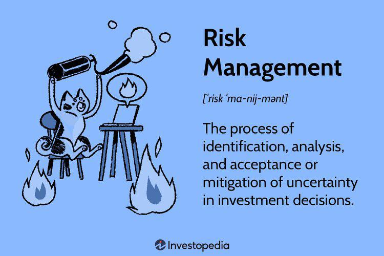

## Table of Contents

## What is risk management in finance?

Risk management in finance is about figuring out what could go wrong with money and investments, and then finding ways to handle those problems. It's like making a plan to keep your money safe when things might get risky. People who work in finance look at different kinds of risks, like the chance that a company might not pay back a loan, or that the value of investments might go down. They use special tools and methods to measure these risks and decide how much risk is okay to take.

Once they know the risks, they can take steps to manage them. This might mean spreading out investments so that if one goes bad, it doesn't hurt everything. Or they might use insurance or other financial products to protect against losses. The goal is to balance the chance of making money with the chance of losing it, so that overall, the financial plan stays strong and safe.

## Why is risk management important in financial planning?

Risk management is really important in financial planning because it helps keep your money safe. When you plan your finances, you want to make sure you're not putting all your money in one place where it could be lost easily. By understanding the risks, you can make smarter choices about where to put your money. This means looking at things like stocks, bonds, or even starting a business, and figuring out what could go wrong and how likely it is to happen.

Once you know the risks, you can take steps to protect your money. This might mean spreading your money across different types of investments so that if one goes down, you're not losing everything. Or you might use insurance or other tools to guard against big losses. By managing risks, you can aim to grow your money while also keeping it safe from big surprises. This balance is key to a strong financial plan that can help you reach your goals without losing sleep over what might go wrong.

## What are the different types of financial risks?

There are several types of financial risks that people need to think about when planning their money. One type is market risk, which is when the value of investments like stocks or bonds goes up and down because of what's happening in the market. Another type is credit risk, which happens when someone you lend money to, like a company or a person, might not be able to pay you back. There's also [liquidity](/wiki/liquidity-risk-premium) risk, which is the risk that you won't be able to quickly turn your investments into cash without losing money.

Another important type of financial risk is [interest rate](/wiki/interest-rate-trading-strategies) risk. This happens when changes in interest rates affect the value of your investments, like bonds. Inflation risk is also something to watch out for, as it's when the money you have loses value because prices for things go up over time. Currency risk is another one, which comes into play if you have money in different countries and the value of one currency changes compared to another.

Lastly, there's operational risk, which is about problems in how a business runs, like mistakes or fraud. And there's also legal and regulatory risk, which is when changes in laws or rules can affect your money. Understanding all these different risks helps you make better plans to keep your money safe and growing.

## How can individuals and businesses identify financial risks?

Individuals and businesses can start identifying financial risks by looking at their own situation and the world around them. For individuals, this means thinking about things like job security, how much debt they have, and how their investments are doing. They should also keep an eye on the economy, like if there might be a recession or if inflation is going up. For businesses, it's important to look at things like how much they owe, how their sales are doing, and if there are any big changes coming in their industry. Both should also think about risks that come from outside, like natural disasters or changes in laws.

Once they have a good understanding of their own situation and the bigger picture, they can start to see where the risks might be. This might mean doing some research, like reading financial news or talking to experts. They can also use tools like financial statements or risk assessment models to help spot the risks. By being aware and looking closely at what's going on, individuals and businesses can find the risks before they become big problems. This way, they can plan ahead and take steps to protect their money.

## What are common risk management strategies used in finance?

One common risk management strategy in finance is diversification. This means spreading your money across different types of investments, like stocks, bonds, and real estate. The idea is that if one investment goes down, the others might still be okay, so you don't lose all your money at once. Another strategy is hedging, which is like buying insurance for your investments. For example, you might use financial products like options or futures to protect against big losses if the market goes down.

Another strategy is asset allocation, where you decide how much of your money to put into different kinds of investments based on how much risk you're willing to take. This can change over time, like putting more money into safer investments as you get closer to a big goal, like retirement. Lastly, there's risk transfer, which is when you move the risk to someone else, like buying insurance to cover potential losses. By using these strategies, people and businesses can manage their risks better and feel more secure about their financial future.

## How does diversification help in managing financial risk?

Diversification helps in managing financial risk by spreading your money across different types of investments. Instead of putting all your money into one thing, like just stocks or just real estate, you spread it out. This way, if one investment goes down in value, you won't lose everything because your other investments might still be doing well. It's like not putting all your eggs in one basket. By having a mix of investments, you can reduce the impact of any single investment doing badly.

For example, if you only invest in tech stocks and the tech industry has a bad year, you could lose a lot of money. But if you also have some money in bonds, real estate, and maybe even some international stocks, a downturn in the tech industry won't hurt your whole portfolio as much. Diversification doesn't guarantee you won't lose money, but it can help lower the overall risk and make your financial plan more stable. This way, you're better protected against surprises in the market.

## What role do financial derivatives play in risk management?

Financial derivatives are like special tools that help people and businesses manage risk. They are agreements between two parties that get their value from something else, like the price of a stock, a commodity, or even an interest rate. By using derivatives, you can protect yourself against big changes in the market. For example, if you're worried that the price of oil might go up and hurt your business, you can use a derivative called a futures contract to lock in today's price for future delivery. This way, no matter what happens to the oil price later, you know what you'll be paying.

Derivatives can also be used to hedge against other risks, like changes in currency values or interest rates. If you have money in different countries, you might use a currency swap to protect against one currency losing value compared to another. Or if you have a lot of debt and you're worried about interest rates going up, you might use an interest rate swap to fix your rate. By using these tools, you can make your financial plan more stable and less likely to be thrown off by big market changes. It's like having an umbrella ready in case it rains, so you can keep moving forward without getting soaked.

## How can risk management tools like Value at Risk (VaR) be applied?

Value at Risk, or VaR, is a tool that helps people figure out how much money they might lose on their investments over a certain time, like a day or a month, with a certain level of confidence. For example, if you have a portfolio of stocks and your VaR is $10,000 at a 95% confidence level for one day, it means there's a 5% chance you could lose more than $10,000 in one day. People use VaR to understand the risk in their investments and to make better decisions about how much risk they want to take. It's like looking at a weather forecast to decide if you need an umbrella; VaR gives you an idea of how bad the financial storm might be.

To use VaR, you need to gather data about how your investments have moved in the past and use special math to predict how they might move in the future. This can be done with computer programs that look at lots of numbers and come up with a VaR number. Once you have your VaR, you can compare it to how much risk you're okay with taking. If the VaR is too high, you might decide to change your investments to lower the risk, like by selling some risky stocks and buying safer bonds. VaR isn't perfect, and it can't predict everything, but it's a helpful way to get a handle on the risks in your financial plan.

## What are the challenges of implementing risk management in large financial institutions?

Implementing risk management in large financial institutions can be really tough because these places are big and complicated. They have lots of different parts, like different departments and branches, and each part might be dealing with its own risks. It's hard to keep track of all these risks and make sure everyone is following the same rules. Plus, these institutions often use a lot of different financial products and investments, which can make things even more confusing. They need special computer systems and lots of data to figure out the risks, and sometimes the systems they have aren't good enough or don't work well together.

Another challenge is that risk management needs to change and grow as the world changes. New laws, new technologies, and new ways of doing business can all affect how these institutions manage risk. Keeping up with all these changes takes a lot of work and can be expensive. Also, people in these big institutions might not always agree on how much risk is okay to take. Some might want to take more risks to make more money, while others want to be safer. Balancing these different views and making sure everyone understands and follows the risk management plan is a big job.

## How does regulatory compliance affect risk management practices?

Regulatory compliance means following the rules and laws set by governments and other official groups. These rules can have a big effect on how financial institutions manage risk. For example, there might be rules about how much money a bank needs to keep on hand to cover possible losses. If a bank doesn't follow these rules, it could get in trouble and have to pay fines or even lose its license to operate. So, to stay safe and legal, financial institutions need to build these rules into their risk management plans. This means they have to keep a close eye on their risks and make sure they're always meeting the legal requirements.

Sometimes, these rules can make risk management harder. The rules can be complicated and change a lot, so it takes a lot of work to keep up with them. Financial institutions need to spend time and money to understand the rules and make sure they're following them. They also need to train their employees and maybe even change how they do business to meet the new rules. But, even though it's hard, following these rules is important because it helps keep the financial system stable and protects customers. So, while regulatory compliance adds to the challenge of risk management, it's a key part of keeping everything safe and sound.

## What advanced techniques are used for risk assessment in finance?

In finance, people use some pretty smart techniques to figure out risks. One of these is called stress testing. It's like imagining the worst things that could happen, like a big drop in the stock market or a sudden change in interest rates, and then seeing how your investments would do in those situations. By doing this, you can find out if your investments are strong enough to handle tough times. Another technique is using something called Monte Carlo simulations. This is where a computer runs lots of different scenarios to see how your investments might do in the future. It's like playing out many different possible futures to see what could happen and how likely it is.

Another advanced method is called scenario analysis. This is where you look at specific situations, like what would happen if there was a big economic crisis or a new law changed how businesses work. You think about how these situations could affect your money and plan for them. Then there's [factor](/wiki/factor-investing) analysis, which looks at the different things that can affect your investments, like interest rates or how well the economy is doing. By understanding these factors, you can see which ones are most important for your investments and plan around them. All these techniques help people in finance get a better handle on risks and make smarter decisions about their money.

## How can machine learning and AI enhance risk management strategies?

Machine learning and AI can make risk management better by looking at huge amounts of data really quickly. They can find patterns and predict what might happen next, which is something people can't do as fast or as well. For example, AI can look at past data about how the stock market moved and use that to guess what might happen in the future. This helps people in finance make better choices about where to put their money and how much risk to take. AI can also keep an eye on things all the time, so if something starts to go wrong, it can warn people right away, which gives them more time to fix the problem before it gets too big.

Another way AI and machine learning help is by making risk models more accurate. These models are like math formulas that try to guess how risky something is. With AI, these models can learn from new data and get better over time. This means the predictions about risk get more and more accurate, which helps people make safer and smarter financial plans. AI can also help by looking at different kinds of risks all at once, like market risk and credit risk, and figuring out how they might affect each other. This big-picture view can make risk management more complete and effective.

## What is Real-time Data Processing and Risk Management?

Processing real-time data is crucial for effective risk management in [algorithmic trading](/wiki/algorithmic-trading). The speed at which markets operate necessitates the ability to ingest, analyze, and react to data instantaneously. Real-time data enables traders to monitor market fluctuations and adjust trading strategies dynamically to mitigate risks and capitalize on opportunities.

Python is a popular choice for real-time data analysis due to its robust libraries and frameworks. Libraries such as Pandas, NumPy, and SciPy offer powerful tools for data manipulation and statistical analysis. Furthermore, packages like PyAlgoTrade and Backtrader are specifically designed for developing and testing trading strategies.

Risk management systems rely on continuous data monitoring and analysis to proactively adjust strategies. This process involves using algorithms to track metrics such as price [volatility](/wiki/volatility-trading-strategies), trading [volume](/wiki/volume-trading-strategy), and market trends. Such systems often employ moving averages to smooth out price data and highlight underlying trends, reducing the noise from short-term fluctuations. For example, a simple moving average (SMA) can be calculated using:

$$
\text{SMA}(t) = \frac{1}{N} \sum_{i=t-N+1}^{t} P_i
$$

where $P_i$ is the price at time $i$ and $N$ is the number of periods.

Data visualization is another critical aspect of real-time data processing. Tools like Matplotlib and Seaborn enable the creation of charts and graphs that help traders visually interpret trends and patterns. Visual representations can quickly convey complex data relationships, making it easier to understand market movements and assess risk exposures.

Incorporating these technologies into a risk management framework allows for the development of responsive strategies that are adaptive to market conditions. Real-time data processing not only aids in risk mitigation but also enhances the agility and effectiveness of algorithmic trading operations.

## What are the strategies for risk management in algorithmic trading?

Effective risk management in algorithmic trading involves implementing strategies tailored to address the inherent risks associated with high-speed, automated transactions. These strategies are imperative to ensure that trading activities remain profitable while minimizing potential losses.

Volatility analysis is a cornerstone of risk management, focusing on the fluctuations in asset prices. In algorithmic trading, automated systems must constantly monitor these fluctuations to adjust their strategies accordingly. One common method for measuring volatility is the standard deviation, which quantifies how much asset prices deviate from their average value. The formula for standard deviation ($\sigma$) is:

$$
\sigma = \sqrt{\frac{1}{N}\sum_{i=1}^{N}(X_i - \mu)^2}
$$

where $N$ is the number of data points, $X_i$ is each individual data point, and $\mu$ is the mean of the data points. This calculation allows traders to quantify risk and adjust their strategies to maintain an optimal risk-reward balance.

Portfolio diversification is another essential strategy deployed in algorithmic trading to manage risk. By distributing investments across various assets, traders can mitigate the impact of negative price movements in any single asset. This diversification is automated within trading algorithms, ensuring that the portfolio adjusts dynamically based on real-time market conditions. 

Automating these strategies is crucial for maintaining a desirable risk-reward ratio. Risk management systems within the trading algorithms are designed to automatically execute trades, rebalance portfolios, and adjust exposure based on pre-defined parameters. This automation reduces the reliance on human intervention, leading to quicker and more accurate responses to market changes.

Drawdown calculations are also integral in visualizing and managing risk. A drawdown represents the decline from a peak to a trough in the value of an asset or portfolio. Monitoring drawdowns helps in understanding the potential maximum loss, enabling traders to set stop-loss levels effectively.

Moreover, [machine learning](/wiki/machine-learning) models significantly enhance risk prediction and management capabilities in algorithmic trading. By using historical data to train these models, traders can forecast market movements and adjust strategies proactively. Models such as Random Forests can classify and predict potential price directions, adding a layer of foresight to risk management processes. For example, a simplified Python implementation for training a Random Forest model might include:

```python
from sklearn.ensemble import RandomForestClassifier
from sklearn.model_selection import train_test_split
from sklearn.metrics import accuracy_score

# Assuming data is already prepared in dataframe 'df' with 'features' and 'target'
X_train, X_test, y_train, y_test = train_test_split(df[features], df[target], test_size=0.2, random_state=42)

# Initialize and train the Random Forest model
rf_model = RandomForestClassifier(n_estimators=100, random_state=42)
rf_model.fit(X_train, y_train)

# Predict and evaluate accuracy
predictions = rf_model.predict(X_test)
accuracy = accuracy_score(y_test, predictions)

print(f"Model Accuracy: {accuracy:.2f}")
```

Through the integration of machine learning models into their trading systems, traders can achieve enhanced predictive analytics, leading to more informed decision-making. This integration of advanced technology into risk management strategies ensures that algorithmic trading remains adaptive and resilient in the face of market volatility.

## References & Further Reading

[1]: Bergstra, J., Bardenet, R., Bengio, Y., & Kégl, B. (2011). ["Algorithms for Hyper-Parameter Optimization."](https://papers.nips.cc/paper/4443-algorithms-for-hyper-parameter-optimization) Advances in Neural Information Processing Systems 24.

[2]: ["Advances in Financial Machine Learning"](https://www.amazon.com/Advances-Financial-Machine-Learning-Marcos/dp/1119482089) by Marcos Lopez de Prado

[3]: ["Evidence-Based Technical Analysis: Applying the Scientific Method and Statistical Inference to Trading Signals"](https://www.amazon.com/Evidence-Based-Technical-Analysis-Scientific-Statistical/dp/0470008741) by David Aronson

[4]: ["Machine Learning for Algorithmic Trading"](https://github.com/PacktPublishing/Machine-Learning-for-Algorithmic-Trading-Second-Edition) by Stefan Jansen

[5]: ["Quantitative Trading: How to Build Your Own Algorithmic Trading Business"](https://www.amazon.com/Quantitative-Trading-Build-Algorithmic-Business/dp/1119800064) by Ernest P. Chan