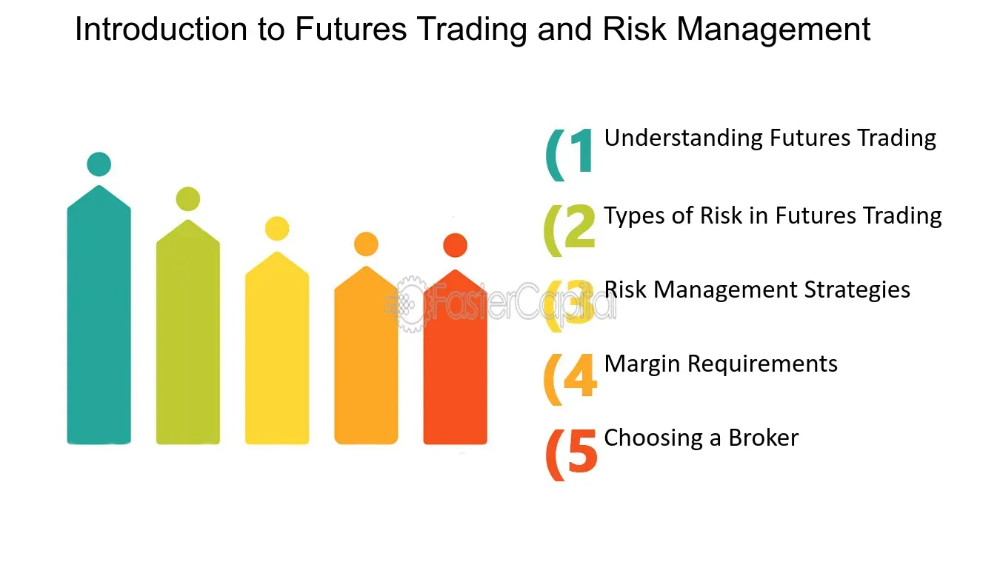

## Table of Contents

## What is risk management in the context of futures trading?

Risk management in futures trading is all about figuring out and controlling the risks that come with trading futures contracts. Futures contracts are agreements to buy or sell something at a future date for a price set today. Because the prices of these things can change a lot, there's always a chance you might lose money. Traders use risk management to make sure they don't lose too much by setting limits on how much they're willing to risk and using different strategies to protect their money.

One common way to manage risk in futures trading is by using stop-loss orders. A stop-loss order is like a safety net that automatically sells your futures contract if the price drops to a certain level. This helps limit your losses if the market moves against you. Another way is through diversification, which means not putting all your money into one type of futures contract. By spreading your money across different kinds of futures, you can reduce the risk because if one goes down, the others might go up or stay the same.

## Why is risk management important for futures traders?

Risk management is super important for futures traders because it helps them protect their money. Futures trading can be risky because the prices of things like oil, gold, or corn can go up and down a lot. If a trader doesn't manage their risk, they could lose a lot of money very quickly. By using risk management, traders can set limits on how much they're willing to lose on each trade. This way, even if the market moves against them, they won't lose more than they can handle.

Another reason risk management is key is that it helps traders stay in the game longer. Trading futures can be stressful, and big losses can make traders want to give up. But with good risk management, traders can keep their losses small and their wins big. This means they can keep trading and learning without running out of money. Over time, this can lead to better results and more success in futures trading.

## What are the basic principles of risk management in futures trading?

The first basic principle of risk management in futures trading is knowing your risk tolerance. This means figuring out how much money you can afford to lose without it hurting your financial situation. Every trader is different, so it's important to set a limit on how much you're willing to risk on each trade. This helps you avoid big losses that could wipe out your trading account. Another part of this principle is understanding the market you're trading in. Different futures markets have different levels of risk, so you need to know what you're getting into before you start trading.

The second principle is using tools and strategies to manage your risk. One common tool is the stop-loss order, which automatically sells your futures contract if the price goes down to a certain level. This helps limit your losses if the market moves against you. Another strategy is diversification, which means not putting all your money into one type of futures contract. By spreading your money across different kinds of futures, you can reduce the risk because if one goes down, the others might go up or stay the same. Using these tools and strategies can help you trade more safely and keep your losses under control.

The third principle is keeping a close eye on your trades and being ready to act. Futures markets can change quickly, so it's important to monitor your positions and be ready to make changes if needed. This might mean closing a losing trade early to limit your losses or taking profits when the market moves in your favor. Being proactive and staying on top of your trades can help you manage risk better and improve your chances of success in futures trading.

## How can beginners start implementing risk management strategies in futures trading?

Beginners in futures trading can start implementing risk management strategies by first figuring out how much money they can afford to lose. This is called knowing your risk tolerance. It's important to set a limit on how much you're willing to risk on each trade. For example, you might decide that you won't risk more than 1% of your trading account on any single trade. This helps keep your losses small so you can keep trading even if you have a few bad trades. Another simple step is to learn about the futures market you want to trade in. Different markets have different risks, so understanding what you're getting into can help you make better decisions.

Once you know your risk tolerance, you can start using tools like stop-loss orders to manage your risk. A stop-loss order is like a safety net that automatically sells your futures contract if the price drops to a certain level. This can help limit your losses if the market moves against you. Another strategy is diversification, which means not putting all your money into one type of futures contract. By spreading your money across different kinds of futures, you can reduce the risk because if one goes down, the others might go up or stay the same. As you start trading, always keep an eye on your trades and be ready to make changes if needed. This might mean closing a losing trade early or taking profits when the market moves in your favor. Being proactive can help you manage risk better and improve your chances of success in futures trading.

## What are common risk management tools used in futures trading?

One common risk management tool in futures trading is the stop-loss order. A stop-loss order helps traders limit their losses by automatically selling a futures contract if its price falls to a certain level. This is like having a safety net that stops you from losing too much money if the market moves against you. For example, if you buy a futures contract at $100 and set a stop-loss order at $95, the contract will be sold automatically if the price drops to $95, limiting your loss to $5 per contract.

Another tool is diversification. This means not putting all your money into one type of futures contract. By spreading your money across different kinds of futures, like oil, gold, and corn, you can reduce the risk. If one type of futures goes down, the others might go up or stay the same, which can help balance out your losses. Diversification is like not putting all your eggs in one basket, making your trading safer.

A third tool is position sizing. This involves deciding how much of your trading account to risk on each trade. A common rule is to risk no more than 1% to 2% of your account on any single trade. This helps you keep your losses small so you can keep trading even if you have a few bad trades. By managing the size of your positions, you can control your risk and protect your trading capital.

## How does leverage affect risk management in futures trading?

Leverage in futures trading can make your potential profits bigger, but it also makes your potential losses bigger. When you use leverage, you're borrowing money to trade with more than you actually have. This means you can control a lot of futures contracts with just a small amount of money, called the margin. If the market moves in your favor, you can make a lot of money. But if the market moves against you, you can lose a lot of money very quickly. Because of this, managing risk becomes even more important when you're using leverage.

To manage risk with leverage, you need to be really careful about how much you're willing to risk on each trade. Using tools like stop-loss orders becomes even more important because they can help you limit your losses if the market goes against you. You also need to think about how much leverage you're using. The more leverage you use, the riskier your trades become. So, it's a good idea to start with less leverage until you get more experience and feel comfortable with the risks. By being smart about how you use leverage, you can trade more safely and protect your money.

## What are the differences between stop-loss and take-profit orders in managing risks?

Stop-loss and take-profit orders are two important tools that traders use to manage their risks in futures trading. A stop-loss order is like a safety net that helps you limit your losses. When you set a stop-loss order, you decide on a price level where you're willing to sell your futures contract if the price goes down to that level. This way, if the market moves against you, you won't lose more money than you can handle. For example, if you buy a futures contract at $100 and set a stop-loss at $95, the contract will be sold automatically if the price drops to $95, limiting your loss to $5 per contract.

On the other hand, a take-profit order helps you lock in your profits. When you set a take-profit order, you decide on a price level where you want to sell your futures contract if the price goes up to that level. This way, if the market moves in your favor, you can make sure you don't miss out on your gains. For example, if you buy a futures contract at $100 and set a take-profit at $105, the contract will be sold automatically if the price reaches $105, securing your profit of $5 per contract. Both stop-loss and take-profit orders help you manage your trades without having to watch the market all the time, but they serve different purposes in managing your risks.

## How can advanced traders use options to hedge their futures positions?

Advanced traders can use options to hedge their futures positions as a way to protect against big losses. Hedging means taking another trade that can help balance out the risk of the first trade. For example, if a trader has a futures position that they think might lose value, they can buy a put option on the same futures contract. A put option gives the trader the right to sell the futures contract at a set price, called the strike price, before the option expires. If the futures price goes down, the put option will gain value, helping to offset the loss on the futures position. This way, the trader can limit their losses while still keeping the chance to make money if the market moves in their favor.

Using options to hedge can be a bit more complicated but also more flexible than just using stop-loss orders. Traders can choose different strike prices and expiration dates for their options, giving them more control over how much they want to protect their futures positions. For instance, if a trader expects the market to be very volatile, they might buy an option with a strike price far from the current futures price to cover a bigger potential drop. Or, if they think the market might only move a little, they might choose an option with a strike price closer to the current price. By carefully selecting the right options, advanced traders can fine-tune their risk management strategies and better protect their investments in futures trading.

## What role does portfolio diversification play in managing risks in futures trading?

Portfolio diversification is a key part of managing risks in futures trading. It means spreading your money across different types of futures contracts instead of putting it all into one. For example, instead of just trading oil futures, you might also trade gold, corn, and stock index futures. This way, if the price of oil goes down and you lose money on your oil futures, you might still make money on your gold, corn, or stock index futures. By having a mix of different futures, you can reduce the risk of losing all your money if one market goes bad.

Diversification helps because different markets don't always move in the same way. Sometimes, when one market goes down, another might go up or stay the same. This can help balance out your losses and gains. For example, if you have some money in energy futures and some in agricultural futures, a drop in oil prices might hurt your energy futures, but if corn prices go up at the same time, your agricultural futures might make up for some of that loss. By diversifying your portfolio, you can make your trading safer and keep your losses under control, even when the markets are unpredictable.

## How can traders assess and adjust their risk tolerance in futures trading?

Traders can assess their risk tolerance in futures trading by first figuring out how much money they can afford to lose without it hurting their financial situation. This means looking at their overall finances and deciding on a limit for how much they're willing to risk on each trade. A common rule is to risk no more than 1% to 2% of their trading account on any single trade. This helps keep losses small so they can keep trading even if they have a few bad trades. Traders should also think about their emotional comfort with risk. If big swings in the market make them feel stressed or scared, they might need to lower their risk tolerance to feel more comfortable.

Adjusting risk tolerance in futures trading can be done by changing the size of their positions or using different risk management tools. If a trader finds that they're losing too much money or feeling too stressed, they might decide to risk less on each trade by lowering their position size. They can also use tools like stop-loss orders to automatically limit their losses if the market moves against them. Over time, as traders gain more experience and confidence, they might feel ready to take on more risk. But it's important to make these adjustments slowly and carefully, always keeping an eye on their overall financial situation and emotional comfort with risk.

## What are some advanced risk management techniques used by professional futures traders?

Professional futures traders often use advanced risk management techniques like delta hedging to manage their risks. Delta hedging involves using options to balance out the risk of their futures positions. If a trader has a futures contract that might lose value, they can buy a put option on the same futures contract. This put option gives them the right to sell the futures at a set price, which can help offset any losses if the futures price goes down. By carefully choosing the right options, traders can fine-tune their risk management and protect their investments even in volatile markets.

Another advanced technique is using [volatility](/wiki/volatility-trading-strategies)-based stop-loss orders. Instead of setting a fixed price for a stop-loss, traders use the market's volatility to set their stop-loss levels. This means the stop-loss price can move with the market's ups and downs, helping to avoid getting stopped out by normal market fluctuations. Professional traders also use [backtesting](/wiki/backtesting) to test their risk management strategies. Backtesting involves looking at past market data to see how a strategy would have worked. By doing this, traders can find out if their risk management techniques are good enough and make changes if needed to improve their trading results.

## How can traders evaluate the effectiveness of their risk management strategies over time?

Traders can evaluate the effectiveness of their risk management strategies over time by keeping track of their trades and looking at how well they've done. They should write down things like how much money they made or lost on each trade, how often they used stop-loss orders, and if those orders helped them avoid big losses. By looking at this information, traders can see if their risk management is working. For example, if they find that they're losing less money on losing trades and still making money on winning trades, it means their risk management is helping them trade better.

Another way to evaluate risk management strategies is by using backtesting. This means looking at past market data to see how a strategy would have worked if it was used before. Traders can use special software to do this and see if their risk management techniques would have helped them make more money or lose less money in the past. If the backtesting shows good results, it's a sign that the strategies are effective. But if the results are not good, traders might need to change their strategies to make them better. By regularly checking and adjusting their risk management, traders can keep improving and do better in futures trading.

## What are the steps for implementing risk management in algo trading?

Algorithmic trading has revolutionized financial markets by introducing precision and speed to trading activities. However, the increased reliance on algorithmic systems necessitates a robust risk management framework to protect against potential market adversities and technical failures. Here are the essential steps for implementing effective risk management in [algorithmic trading](/wiki/algorithmic-trading):

1. **Define Trading Goals and Set Risk Tolerance Levels**

   Establishing clear trading goals and defining risk tolerance is the first step in algorithmic trading. Traders should assess their financial objectives and the maximum acceptable level of loss they are willing to endure. This involves quantifying the risk-reward ratio and understanding how much capital to allocate per trade. For instance, a common method is the Kelly Criterion, which helps determine the optimal size of a series of trades by maximizing expected log wealth:
$$
   f^* = \frac{bp - q}{b}

$$

   where $f^*$ is the fraction of the capital to wager, $b$ is the odds received on the wager, $p$ is the probability of winning, and $q = 1 - p$.

2. **Diversify Investments to Avoid Overconcentration**

   Diversification is a fundamental principle in risk management to mitigate potential losses. By spreading investments across various asset classes or instruments, traders can reduce the impact of adverse price movements in a single asset. Portfolio diversification limits overexposure and helps stabilize returns. This can be implemented using Python to calculate and balance the portfolio allocation:

   ```python
   import numpy as np

   def optimize_portfolio(returns, risk_tolerance):
       cov_matrix = np.cov(returns)
       inv_cov_matrix = np.linalg.inv(cov_matrix)
       weights = np.dot(inv_cov_matrix, np.mean(returns, axis=1))
       weights /= np.sum(weights) 
       return weights * risk_tolerance

   # Example usage with mock return data
   returns = np.array([[0.05, 0.1, 0.02], [0.04, 0.12, 0.01]])
   optimal_weights = optimize_portfolio(returns, 0.5)
   ```

3. **Use Stop-Loss Orders to Automatically Exit Losing Trades**

   Stop-loss orders are essential tools in limiting potential losses by executing a trade to sell an asset once it reaches a specific price. This pre-defined [exit](/wiki/exit-strategy) strategy can prevent small losses from escalating. Setting stop-loss thresholds appropriately ensures that emotions do not interfere with trading decisions. This approach is often integrated into algorithmic systems to trigger automated responses to adverse movements.

4. **Conduct Regular Market Analysis**

   Continuous monitoring and analysis of market conditions are crucial for maintaining effective trading strategies. Traders need to adapt their algorithms to evolving market dynamics, which means conducting regular reviews to refine parameters and strategies. Adapting to changes might involve adjusting the algorithm's risk parameters or incorporating new data analytics to better predict market movements.

In summary, implementing risk management in algorithmic trading requires setting clear objectives and risk thresholds, diversifying investments, using automated exit strategies, and maintaining a vigilant approach to market changes. These steps help safeguard against potential market risks, thus enhancing the resilience of algorithmic trading systems.

## References & Further Reading

[1]: Hull, J. C. (2018). ["Options, Futures, and Other Derivatives"](https://www.semanticscholar.org/paper/Options%2C-Futures%2C-and-Other-Derivatives-Hull/89bdee500c8623864fc9eb7a471546aa713acc44) (10th Edition). Pearson.

[2]: Lopez de Prado, M. (2018). ["Advances in Financial Machine Learning"](https://www.amazon.com/Advances-Financial-Machine-Learning-Marcos/dp/1119482089). Wiley.

[3]: Aronson, D. R. (2007). ["Evidence-Based Technical Analysis: Applying the Scientific Method and Statistical Inference to Trading Signals"](https://onlinelibrary.wiley.com/doi/book/10.1002/9781118268315). Wiley.

[4]: Jansen, S. (2020). ["Machine Learning for Algorithmic Trading: Predictive Models to Extract Signals from Market and Alternative Data for Systematic Trading Strategies with Python"](https://github.com/stefan-jansen/machine-learning-for-trading). Packt Publishing.

[5]: Chan, E. P. (2008). ["Quantitative Trading: How to Build Your Own Algorithmic Trading Business"](https://github.com/ftvision/quant_trading_echan_book). Wiley.