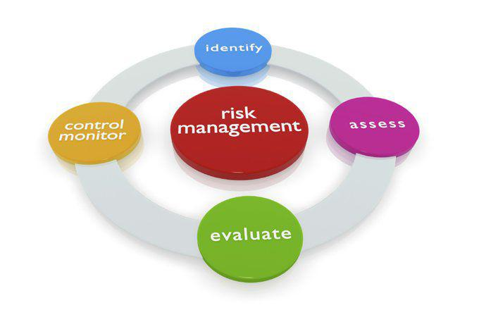

Risk management is a cornerstone of successful trading, playing a pivotal role in both active and algorithmic trading environments, where market dynamics can often be volatile and unpredictable. As traders navigate these challenging landscapes, the ability to manage risk effectively is essential for both capital preservation and return optimization. This article sets out to explore the various risk management strategies employed by active traders and examines how these strategies can be seamlessly integrated into algorithmic trading frameworks.

Understanding risk involves acknowledging the potential for financial losses that arise from market movements, which can be sudden and pronounced. By mastering risk management, traders not only aim to shield their investments from adverse market conditions but also position themselves to take advantage of market opportunities. This article will cover diverse risk management techniques including the use of stop-loss orders, diversification strategies, and more complex hedging mechanisms.



Stop-loss orders are a fundamental tool for traders, providing a pre-defined limit on potential losses, thus imposing discipline and preventing emotional decision-making. Diversification, on the other hand, spreads investment risk across various assets or sectors, reducing the overall impact of any single adverse event. These strategies are fundamental in enhancing trading performance, ensuring that losses are minimized while gains are maximized.

By integrating these risk management practices into trading strategies, whether manually executed by active traders or automated through algorithms, traders can enhance their resilience against volatile market forces. This article will serve as a guide to understanding and applying these critical strategies in the continually evolving trading landscape.

## Table of Contents

## Understanding Risk in Trading

Risk in trading is fundamentally the potential for incurring financial losses due to fluctuations in market prices. This potential arises from the inherent unpredictability of financial markets, where asset values can change due to a myriad of factors, including economic data releases, geopolitical events, or changes in market sentiment. Understanding these risks is crucial for traders to manage their portfolios effectively.

Active trading, characterized by frequent transactions to capitalize on short-term movements, exposes traders to several types of risks:

1. **Market Risk**: This is the most common risk, defined as the possibility of an asset's value declining due to broader economic factors or market dynamics. For instance, if a trader holds a position in a particular stock, unexpected news or economic reports can lead to a decrease in the stock's price, resulting in potential losses.

2. **Liquidity Risk**: This risk arises when a trader is unable to execute a transaction at the desired price due to a lack of market participants. For active traders, liquidity risk is critical as it can affect the ability to enter or exit positions swiftly, potentially magnifying losses during volatile periods.

3. **Operational Risk**: Involves the potential for losses resulting from inadequate processes, systems failures, or human errors. For instance, a trader may miscalculate a trade order due to a software glitch or incorrect data entry, leading to unintended exposure.

Algorithmic trading, which involves using computer programs for executing trades at speeds and frequencies beyond human capability, introduces additional technical risks:

- **System Failures**: Algorithmic systems may fail due to hardware malfunctions, software bugs, or connectivity issues. Such failures can lead to significant financial losses if trades are improperly executed or missed entirely.

- **Programming Errors**: Flaws or bugs in the trading algorithms can result in unintended trading behavior, such as over-leveraging or executing trades at unfavorable prices. Thorough testing and validation of algorithms are necessary to mitigate such risks.

Effective risk management in trading involves strategies to balance potential returns with these risks. This requires implementing measures such as setting defined risk tolerance levels, employing diversification, and using sophisticated metrics to track and adjust exposure dynamically. By quantifying risks and systematically managing them, traders can aim to achieve a more stable and sustainable performance in volatile market environments.

## Key Risk Management Strategies for Active Trading

Active traders use a variety of risk management strategies to protect their investments and maximize their returns. One of the foundational techniques is the use of stop-loss and take-profit points. A stop-loss order is set at a predetermined price level, ensuring that a trade is automatically closed to prevent further losses when the market moves unfavorably. Conversely, a take-profit order is designed to lock in profits once a target price is reached. These orders help traders maintain discipline and prevent emotional decision-making during volatile market conditions.

The one-percent rule is another critical strategy. This rule stipulates that traders should not risk more than 1% of their total trading capital on a single trade. For example, if a trader has $10,000 in their trading account, they should only risk $100 on any given trade. By limiting the exposure per trade, the one-percent rule helps protect against catastrophic losses that could significantly deplete trading capital. The formula for calculating the position size under the one-percent rule is as follows:

$$
\text{Position Size} = \frac{\text{Total Capital} \times 0.01}{\text{Stop-Loss Distance}}
$$

where the stop-loss distance is the difference between the entry price and the stop-loss price.

Diversification is also an essential strategy for managing risk. By spreading investments across different assets, sectors, or even geographical regions, traders can reduce the impact of adverse market movements on their overall portfolio. Diversification aims to minimize the correlation between different investments so that a loss in one can potentially be offset by gains in another.

Advanced traders may also employ hedging strategies to protect against significant losses. Hedging involves taking an offsetting position in a related security to mitigate the risk of adverse price movements. For instance, traders can use put options to protect against potential declines in an asset they hold. A put option gives the trader the right, but not the obligation, to sell the asset at a specific price before the option expires, providing a safety net if the asset's price drops below the predetermined level. 

These risk management strategies are not mutually exclusive and can be combined to tailor a comprehensive risk management approach that aligns with a trader’s individual risk tolerance, trading style, and market conditions. Proper implementation of these techniques can enhance trading performance and preserve capital over the long term.

## Risk Management in Algorithmic Trading

Algorithmic trading requires an advanced risk management framework due to the high speed and automated nature of its operations. The rapid execution and frequency of trades place significant emphasis on minimizing risks that could result in substantial losses. One of the primary strategies in managing risk in [algorithmic trading](/wiki/algorithmic-trading) is the use of automated stop-loss and take-profit orders. These orders are crucial for removing emotional biases from trading decisions, as they are pre-set to execute at specific price points. A stop-loss order automatically triggers the sale of a security when its price falls to a predetermined level, thus limiting the potential loss on a trade. Similarly, a take-profit order locks in gains by selling the security when its price reaches a specified target.

Another effective risk management technique in algorithmic trading is the implementation of trailing stops and dynamic position sizing. A trailing stop is a variation of a stop-loss order that moves with the market price, maintaining a predefined distance. This allows traders to capitalize on favorable market movements while still protecting against downturns. Dynamic position sizing allows traders to adjust the size of their positions based on market conditions and risk tolerance. This adaptability is crucial in volatile markets where static positions can lead to significant exposure.

Operational risks, which are unique challenges in algorithmic trading, stem from system failures, connectivity issues, and programming errors. To mitigate these risks, ensuring system reliability is paramount. This can be achieved through thorough testing and validation of algorithms before they are implemented in live trading environments. Moreover, regular audits and updates to trading systems help maintain their functionality and security. Regulatory compliance also plays a significant role in managing operational risks. Adhering to industry standards and legal requirements helps prevent legal repercussions and ensures that ethical trading practices are upheld.

In conclusion, algorithmic trading demands a sophisticated risk management framework that incorporates automated strategies, adaptability to market conditions, and meticulous attention to system integrity and compliance. By integrating these elements, traders can navigate the complexities of algorithmic trading with greater confidence and reduced risk.

## Utilizing Technology and Analytics

Advanced analytics and [machine learning](/wiki/machine-learning) play a critical role in enhancing risk management strategies within algorithmic trading. The integration of these technologies not only streamlines the risk management process but also equips traders with the tools needed to respond effectively to market developments.

### Advanced Analytics and Machine Learning

Machine learning algorithms bring the capability to analyze vast datasets to identify patterns and predict future market behavior. This prediction capability is vital in creating more robust risk management strategies. For example, machine learning can help in identifying non-linear relationships in market data that traditional statistical methods might miss, making risk assessment more comprehensive.

Python has become a popular language for implementing machine learning models due to its extensive libraries like scikit-learn, TensorFlow, and PyTorch. These libraries facilitate the development and training of models that can predict potential market risks. An example Python code snippet for a basic predictive model might look like this:

```python
from sklearn.model_selection import train_test_split
from sklearn.ensemble import RandomForestClassifier
from sklearn.metrics import accuracy_score

# Assume X is your features dataset and y is your target variable
X_train, X_test, y_train, y_test = train_test_split(X, y, test_size=0.2, random_state=42)

model = RandomForestClassifier(n_estimators=100, random_state=42)
model.fit(X_train, y_train)
predictions = model.predict(X_test)

print("Accuracy:", accuracy_score(y_test, predictions))
```

### Backtesting Strategies

Backtesting involves simulating a trading strategy using historical data to evaluate its performance before actual deployment. This step is essential to adjust strategies according to market changes and ensure they are effective. It helps traders understand potential pitfalls in their strategies and refine their risk management approaches.

A comprehensive [backtesting](/wiki/backtesting) framework allows traders to modify parameters and test various strategies under different market scenarios. By doing so, traders can identify weaknesses and optimize strategies, which reduces potential losses and enhances profitability.

### Real-Time Monitoring and Adaptive Risk Measures

In fast-paced financial markets, the ability to monitor trades in real-time and adapt risk measures quickly can mean the difference between profit and loss. Real-time analytics tools aggregate data from multiple sources to provide traders with up-to-the-minute insights. By employing dashboards and alert systems, traders can rapidly respond to anomalies and adjust their risk parameters accordingly.

Adaptive risk measures, such as dynamic position sizing, automatically adjust trade sizes based on current market [volatility](/wiki/volatility-trading-strategies) and risk threshold. This approach not only helps in managing risk effectively but also optimizes capital allocation in varying market conditions.

In summary, the use of technology and analytics empowers traders to implement sophisticated risk management strategies in algorithmic trading. By leveraging machine learning for pattern recognition, conducting rigorous backtesting, and maintaining constant market vigilance through real-time monitoring, traders are better positioned to manage risks and maximize returns.

## Conclusion

Risk management plays a crucial role in both active and algorithmic trading, serving as a vital mechanism to preserve capital and optimize returns. By implementing sound risk management practices, traders are better equipped to navigate the inherent volatility of financial markets and shield themselves from significant losses. This protection is not only vital for short-term trading success but also for ensuring the sustainability of trading operations over the long term.

One of the key advantages of a robust risk management framework is its ability to enable traders to make informed decisions based on quantitative data rather than emotional reactions. This is particularly important in volatile markets where rapid price movements can lead to impulsive trading decisions that undermine returns. By sticking to pre-defined strategies, such as stop-loss orders and position sizing rules, traders can maintain discipline and adhere to their trading plans, thereby reducing the emotional impact on decision-making.

Moreover, continuous learning and adapting to new technologies can significantly enhance the effectiveness of risk management strategies. The integration of advanced analytics and real-time data processing allows traders to respond adaptively to changing market conditions, enabling them to make timely adjustments to their positions and risk exposure. These technologies also facilitate the backtesting of strategies, allowing traders to evaluate their performance across a range of market scenarios and refine their approaches accordingly.

In conclusion, the ever-evolving landscape of financial markets necessitates an ongoing commitment to refining risk management practices. By doing so, traders can safeguard their investments, adapt to evolving market dynamics, and ultimately optimize their trading performance. The capacity to manage risk effectively remains a fundamental skill in achieving sustained trading success.

## References & Further Reading

[1]: Hull, J. C. (2018). ["Risk Management and Financial Institutions."](https://books.google.com/books/about/Risk_Management_and_Financial_Institutio.html?id=1J1QDwAAQBAJ) Wiley Finance.

[2]: Liew, J. K. S., Bryan, A., & Walters, D. R. (2016). ["Algorithmic Trading and the Efficient Market Hypothesis: Systematic Risk in Periods of Stress."](https://pmc.ncbi.nlm.nih.gov/articles/PMC10529678/) Financial Management.

[3]: ["The Art of Trading: A Complete Guide to Trading the Australian Markets"](https://www.amazon.com/Art-Trading-Complete-Australian-Markets-ebook/dp/B01FT9LDCU) by Christopher Tate

[4]: Pardo, R. (2011). ["The Evaluation and Optimization of Trading Strategies."](https://onlinelibrary.wiley.com/doi/book/10.1002/9781119196969) Wiley Trading.

[5]: Tsang, E,P.K. et al. (2004). ["Genetic Programming for Financial Trading: A Survey in."](https://www.bracil.net/finance/papers/TsangMartinez-CompFinance-Ieee_conneCtIonS2004.pdf) Financial Markets: Research and Applications.

