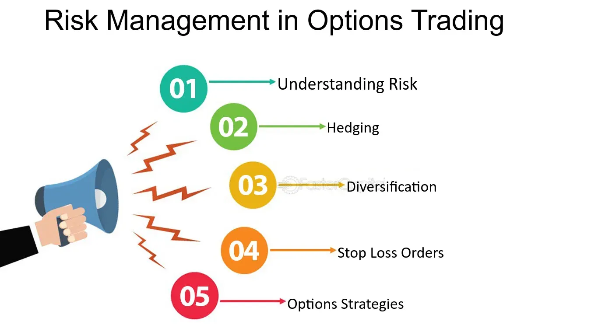

## Table of Contents

## What are options and how do they work in the context of risk management?

Options are financial tools that give you the right, but not the obligation, to buy or sell an asset at a specific price before a certain date. They can be used in risk management to protect against price changes in stocks, commodities, or other assets. For example, if you own a stock and are worried that its price might fall, you can buy a put option. This option lets you sell the stock at a set price, even if the market price drops lower. This way, you limit your potential losses.

In another scenario, if you want to buy a stock but think its price will go up soon, you can buy a call option. This gives you the right to buy the stock at a set price, even if the market price rises higher. This can save you money if the stock's price increases before you actually buy it. Options can be complex, but they are powerful tools for managing risk because they allow you to set a maximum loss or gain, helping you plan and protect your investments more effectively.

## What are the basic types of options and their uses in managing risk?

The two basic types of options are call options and put options. A call option gives you the right to buy an asset at a specific price before a certain date. If you think the price of a stock will go up, you can buy a call option to lock in the current lower price. This way, if the stock's price rises, you can buy it at the lower price you set with the option, saving you money. Call options are useful for managing the risk of missing out on a price increase.

A put option gives you the right to sell an asset at a specific price before a certain date. If you own a stock and are worried its price might fall, you can buy a put option. This option lets you sell the stock at the set price, even if the market price drops lower. This limits your loss because you can sell at the higher price you locked in with the option. Put options are helpful for managing the risk of a price drop.

Both types of options help you control risk by setting a maximum loss or gain. They give you more flexibility and control over your investments, allowing you to plan better and protect against unexpected market changes.

## How can options be used to hedge against potential losses in an investment portfolio?

Options can be used to hedge against potential losses in an investment portfolio by allowing you to set a price at which you can buy or sell an asset, no matter what happens in the market. If you own stocks and are worried their value might go down, you can buy put options. These options give you the right to sell your stocks at a set price, even if the market price falls lower. This way, you limit how much money you could lose because you can always sell at the higher price you locked in with the put option.

For example, imagine you own shares of a company that you think might drop in value due to upcoming news. You can buy put options to protect your investment. If the stock price does go down, you can use the put options to sell your shares at the price you set, reducing your losses. On the other hand, if the stock price stays the same or goes up, you only lose the small amount you paid for the put options, which is much less than what you could have lost if the stock price dropped without any protection. This is how options help manage risk in a portfolio by providing a safety net against big losses.

## What is the difference between a call option and a put option in risk management?

A call option gives you the right to buy an asset at a set price before a certain date. If you think the price of a stock will go up, you can buy a call option to lock in the current lower price. This way, if the stock's price rises, you can buy it at the lower price you set with the option, saving you money. Call options are useful for managing the risk of missing out on a price increase. They help you take advantage of rising prices without having to pay the full price for the stock right away.

A put option gives you the right to sell an asset at a set price before a certain date. If you own a stock and are worried its price might fall, you can buy a put option. This option lets you sell the stock at the set price, even if the market price drops lower. This limits your loss because you can sell at the higher price you locked in with the option. Put options are helpful for managing the risk of a price drop. They act like insurance, protecting your investments from big losses if the market goes down.

## How does the pricing of options affect risk management strategies?

The price of options, or the premium, can greatly affect how you manage risk in your investments. The premium is what you pay to buy an option. It depends on things like how long the option lasts, how much the stock's price might change, and how far the stock's price is from the price set in the option. If the premium is high, it might not be worth buying the option because the cost of protection is too much. But if the premium is low, it's a cheaper way to protect your investments from big losses or to take advantage of price changes.

When deciding on a risk management strategy, you need to think about how much it costs to use options. If you buy a put option to protect against a drop in stock price, a high premium means you're spending more to protect your investment. You have to weigh this cost against the possible loss you're trying to avoid. On the other hand, if you buy a call option to take advantage of a rising stock price, a low premium makes it easier to bet on the stock going up without spending a lot of money upfront. Understanding option pricing helps you make better choices about how to use options to manage risk in your portfolio.

## What are some common options strategies for managing risk, such as covered calls and protective puts?

One common options strategy for managing risk is the covered call. This is when you own a stock and sell someone else the right to buy it from you at a set price before a certain date. By doing this, you get paid a premium upfront. If the stock price stays the same or goes down, you keep the premium and the stock, which helps offset any loss in the stock's value. But if the stock price goes above the set price, the buyer might want to buy it from you, and you have to sell it at the lower set price. This limits how much you can make from the stock going up, but the premium you got helps reduce the risk of the stock's price falling.

Another strategy is the protective put. This is like buying insurance for your stock. If you own a stock and are worried it might lose value, you can buy a put option. This gives you the right to sell the stock at a set price, even if the market price drops lower. The put option costs you a premium, but it limits how much you can lose if the stock's price falls. If the stock's price goes down, you can use the put option to sell at the higher set price, protecting your investment. If the stock's price stays the same or goes up, you only lose the premium you paid for the put, which is less than what you could have lost without the protection.

## How can options be used to manage risk in volatile markets?

In volatile markets, where prices can swing a lot, options are very useful for managing risk. If you own a stock and are worried its price might drop a lot, you can buy a put option. This is like buying insurance. It gives you the right to sell your stock at a set price, even if the market price falls lower. So, if the stock's price does go down, you can still sell it at the higher price you set with the put option. This way, you limit your loss. If the stock's price stays the same or goes up, you only lose the small amount you paid for the put option, which is much less than what you could have lost if the stock price fell without any protection.

Another way to use options in volatile markets is by selling covered calls. If you own a stock, you can sell someone else the right to buy it from you at a set price before a certain date. You get paid a premium for this, which can help offset any losses if the stock's price goes down. If the stock's price stays below the set price, you keep the premium and the stock. But if the stock's price goes above the set price, the buyer might want to buy it from you, and you have to sell it at the lower set price. This limits how much you can make if the stock goes up a lot, but the premium you got helps reduce the risk of the stock's price falling in a volatile market.

## What are the risks associated with using options for risk management?

Using options for risk management can help you protect your investments, but it also comes with its own risks. One big risk is that options can lose all their value if the stock's price doesn't move the way you thought it would. For example, if you buy a put option to protect against a stock price drop, but the stock price stays the same or goes up, you lose the money you paid for the put option. This is called the premium, and it's like paying for insurance that you don't end up using.

Another risk is that options can be complicated and hard to understand. If you don't know exactly how they work, you might make mistakes that cost you money. For example, if you sell a covered call and the stock price goes way up, you might miss out on big profits because you have to sell the stock at a lower price. Also, options can be affected by things like how much the stock's price might change, how long the option lasts, and even the overall mood of the market, which can make them risky to use if you're not careful.

## How do advanced options strategies like straddles and strangles help in managing complex risk scenarios?

Advanced options strategies like straddles and strangles can be used to manage complex risk scenarios where you're not sure if a stock's price will go up or down, but you expect it to move a lot. A straddle involves buying both a call option and a put option at the same strike price and expiration date. If the stock's price moves a lot in either direction, one of the options will gain value and can offset the cost of the other option, which might lose value. This way, you can make money no matter which way the stock's price goes, as long as it moves enough to cover the cost of both options. Straddles are useful when you expect big news or events that could cause the stock's price to swing wildly.

Strangles are similar to straddles but are used when you think the stock's price will move a lot, but you're not sure by how much. In a strangle, you buy a call option with a higher strike price and a put option with a lower strike price, both with the same expiration date. Because the strike prices are further apart, strangles are cheaper than straddles, but the stock's price needs to move more to make money. If the stock's price does move a lot in either direction, one of the options will gain value enough to cover the cost of both options. Strangles are good for managing risk when you expect big changes in the stock's price but want to spend less money upfront.

## What role does the Greeks (Delta, Gamma, Theta, Vega) play in managing risk with options?

The Greeks are important tools that help you understand and manage risk when using options. Delta tells you how much the price of an option will change if the stock's price changes by one dollar. If you have a call option with a Delta of 0.5, the option's price will go up by about 50 cents if the stock's price goes up by one dollar. Delta helps you know how sensitive your option is to the stock's price movement, which is key for managing risk because it lets you see how much your option's value might change.

Gamma, Theta, and Vega are other important Greeks. Gamma tells you how much Delta will change if the stock's price moves. It's like the speed of Delta's change. Theta measures how much the option's value goes down as time passes. Options lose value as they get closer to expiring, and Theta helps you see how much. Vega tells you how much the option's price will change if the stock's volatility changes. If you expect the stock's price to swing a lot, Vega helps you understand how that might affect your option's value. Knowing these Greeks helps you make better decisions about managing risk with options, because you can see how different factors might affect your investments.

## How can one assess the effectiveness of an options-based risk management strategy?

To assess the effectiveness of an options-based risk management strategy, you need to look at how well it protects your investments from big losses and if it helps you make money when the market moves in your favor. One way to do this is by keeping track of how much money you make or lose from using options. If you're using options to limit losses, see if the cost of the options is less than what you would have lost without them. If you're using options to take advantage of price changes, check if the gains from the options are more than what you paid for them.

Another important thing to consider is how well your options strategy fits with your overall investment goals. If your goal is to protect against a big drop in stock prices, a strategy like buying put options might be effective if it keeps your losses small. But if your goal is to make money from rising stock prices, selling covered calls might be good if it lets you earn extra money from the premiums. By comparing your actual results with what you were hoping to achieve, you can tell if your options strategy is working well or if you need to make changes.

## What are the regulatory and tax considerations when using options for risk management?

When using options for risk management, it's important to know about the rules set by regulators like the Securities and Exchange Commission (SEC) in the United States. The SEC has rules to make sure options trading is fair and safe. For example, you need to have a certain amount of money in your account before you can trade options, and you have to use a special type of account called a margin account. Also, there are rules about who can sell options and how they need to be reported. If you don't follow these rules, you could get in trouble or have to pay fines. So, it's a good idea to learn about these rules or talk to a financial advisor before you start trading options.

There are also tax rules you need to think about when using options. In the U.S., the money you make from options is usually taxed as capital gains. How much tax you pay depends on how long you held the option before selling it. If you held it for less than a year, it's a short-term capital gain, and you pay your regular income tax rate. If you held it for more than a year, it's a long-term capital gain, and the tax rate is lower. Also, the cost of buying options can sometimes be used to reduce your taxes. It's important to keep good records of your options trades because the tax rules can be complicated, and you might need to talk to a tax professional to make sure you're doing everything right.

## What is Risk Management in Options Trading?

Risk management is a crucial aspect of financial trading, particularly in options trading where the complexity and leverage involved can lead to significant financial exposure. The primary objective of risk management is to identify, assess, and prioritize risks followed by coordinated efforts to minimize, control, and monitor the probability and impact of unexpected events that could lead to losses.

**Key Risk Factors in Options Trading**

1. **Market Risk**: This is the risk of losses due to movements in market prices. Options traders are exposed to market risk because the value of options is inherently tied to the price of the underlying asset. Fluctuations in stock prices, interest rates, or commodity prices can significantly impact the value of options portfolios.

2. **Volatility Risk**: Known also as "vega risk," this involves changes in the volatility of the underlying asset. Since options are sensitive to volatility (known as the "implied volatility"), unexpected spikes or drops in volatility can have a profound effect on the price of options.

3. **Liquidity Risk**: This is the risk of being unable to close or reduce a position at a favorable price due to insufficient market activity. Options with low volume or open interest can be particularly vulnerable to liquidity risk, which can lead to unfavorable execution prices or larger bid-ask spreads.

**Risk Management Techniques**

1. **Portfolio Diversification**: Diversification involves spreading investments across various financial instruments, industries, or other categories to reduce exposure to any single asset or risk. A well-diversified options portfolio can mitigate risks associated with market movements or sector-specific issues.

2. **Hedging**: Hedging involves taking an offsetting position in a related security to reduce the risk of adverse price movements. For instance, traders might use options to hedge a stock position by buying put options to protect against downside risk, or by selling call options to generate income and offset a potential decline.

3. **Stop-loss Orders**: These are orders placed with a broker to sell a security once it reaches a certain price. In options trading, stop-loss orders can protect against large losses but can also be tricky due to the volatility and time decay inherent in options pricing.

**Assessing and Monitoring Risk**

Traders employ a variety of metrics and tools to assess and monitor risk. One of the most commonly used measures is Value at Risk (VAR), which estimates the potential loss in value of a portfolio over a defined period for a given confidence interval. The formula for VAR is typically defined as:

$$
\text{VAR} = \text{Portfolio Value} \times \text{Volatility} \times \sqrt{\text{Time Period}}
$$

Advanced statistical models and software are utilized to calculate VAR, taking into account the correlations between assets.

Traders also use option Greeks (Delta, Gamma, Theta, Vega, and Rho) to understand how different factors affect the pricing of options. Delta measures sensitivity to changes in the price of the underlying asset, while Vega measures sensitivity to [volatility](/wiki/volatility-trading-strategies).

Risk management in options trading is not solely about mitigating risk but also about understanding and harnessing risk to enhance returns. By utilizing a blend of diversification, hedging strategies, and stop-loss orders, combined with sophisticated risk assessment tools like VAR and option Greeks, traders can better navigate the complexities of the options market and improve their ability to manage potential financial exposure effectively.

## References & Further Reading

[1]: Hull, J. C. (2017). ["Options, Futures, and Other Derivatives"](https://www.semanticscholar.org/paper/Options%2C-Futures%2C-and-Other-Derivatives-Hull/89bdee500c8623864fc9eb7a471546aa713acc44). Pearson.

[2]: Black, F., & Scholes, M. (1973). ["The Pricing of Options and Corporate Liabilities."](https://www.cs.princeton.edu/courses/archive/fall09/cos323/papers/black_scholes73.pdf) Journal of Political Economy, 81(3), 637-654.

[3]: Jarrow, R., & Turnbull, S. (1994). ["Derivative Securities."](https://archive.org/details/derivativesecuri0000jarr_r8m0) South-Western Publishing.

[4]: Li, C., & Madhavan, A. N. (2015). ["Algorithms and the Allocation of Trading in the Market."](https://www.sciencedirect.com/science/article/pii/S1386418100000070) Financial Analysts Journal, 71(1), 4-16. 

[5]: De Prado, M. L. (2018). ["Advances in Financial Machine Learning."](https://www.amazon.com/Advances-Financial-Machine-Learning-Marcos/dp/1119482089) Wiley.