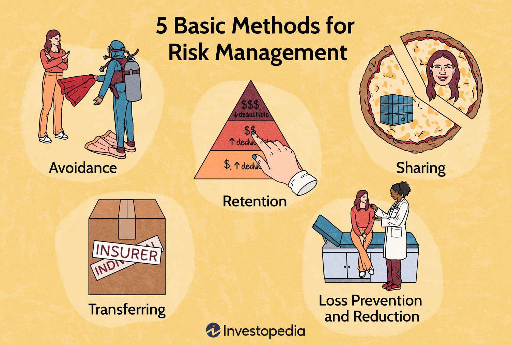

Financial derivatives are complex financial instruments that derive their value from an underlying asset, index, or benchmark. These instruments are pivotal in modern finance as they enable market participants to hedge risks, speculate on future price movements, and enhance liquidity. The basic types of derivatives include futures, options, swaps, and forwards. Each type serves unique purposes, but collectively, they form the backbone of many risk management and trading strategies.

Options trading, a significant segment of derivatives, allows investors to engage with the financial markets via contracts that grant the right, but not the obligation, to buy or sell an asset at a predetermined price before a specified expiration date. Options are categorized into call options, which confer the right to buy, and put options, which confer the right to sell. Options trading is instrumental for hedging potential price changes and leveraging capital for speculative gains.



Risk management is an essential concept in trading, involving the identification, assessment, and prioritization of risks followed by the coordinated application of resources to minimize or control their impact. Effective risk management in trading helps protect against market volatility, enhance decision-making, and preserve capital. In derivatives markets, strategies such as diversification, hedging, and the use of stop-loss orders are commonly employed to mitigate risk exposure.

Algorithmic trading has emerged as a transformative force in the financial markets, revolutionizing how trades are executed. Algorithms use predefined criteria to automate trading strategies, significantly enhancing the speed, efficiency, and accuracy of trade executions. This automation reduces human error and enables the execution of complex strategies in milliseconds, responding to market fluctuations with precision. 

The interplay between options trading, risk management, and algorithmic trading is profound. Algorithms are increasingly used to manage risks in options trading by automating the execution of hedging strategies and continuously monitoring risk metrics. The sophistication of technology allows traders to integrate real-time data analytics with algorithms, thus fine-tuning risk controls and improving trading outcomes. Understanding these interconnections is crucial for navigating the complexities of modern financial markets effectively.

## Table of Contents

## Understanding Financial Derivatives

Financial derivatives are financial instruments whose value is derived from an underlying asset or group of assets, such as stocks, bonds, currencies, interest rates, or market indices. The primary types of financial derivatives include futures, options, swaps, and forwards, each serving unique purposes in financial markets.

**Types of Financial Derivatives**

1. **Futures**: Futures contracts obligate the buyer to purchase, and the seller to sell, an asset at a predetermined future date and price. These contracts are standardized and traded on exchanges, making them highly liquid and transparent.

2. **Options**: Options provide the holder with the right, but not the obligation, to buy or sell an asset at a specified price before or on a particular date. There are two types of options: call options, which give the right to buy, and put options, which allow the right to sell.

3. **Swaps**: Swaps involve an exchange of cash flows between two parties. The most common are interest rate swaps, where fixed-rate interest payments are exchanged for floating-rate payments, and currency swaps, which involve exchanging principal and interest payments in different currencies.

4. **Forwards**: Forward contracts are customized agreements between two parties to buy or sell an asset at a specific future date for a price agreed upon today. Unlike futures, forwards are not standardized or traded on exchanges, leading to increased counterparty risk.

**Uses of Derivatives**

Derivatives are employed for both hedging and speculation, providing a versatile toolset for investors and companies.

- **Hedging**: Derivatives are used to mitigate risk by locking in prices or rates. For example, a farmer might use futures contracts to guarantee a selling price for their crop, thus shielding against the risk of a price drop.

- **Speculation**: Traders use derivatives to speculate on future price movements of an asset, aiming to profit from price changes. Options, for instance, allow traders to benefit from stock price volatility without owning the underlying stock.

**Advantages and Complexities**

The advantages of trading derivatives include:

- **Leverage**: Derivatives allow for significant exposure with minimal capital, as small changes in the price of the underlying asset can lead to substantial profits or losses.

- **Flexibility**: They provide flexibility in trading strategies, accommodating various market views and conditions.

- **Market Access**: Derivatives offer access to otherwise difficult-to-trade markets and assets, expanding investment opportunities.

However, they also come with complexities:

- **Complex Valuation**: The valuation can be complex, as it often involves understanding the pricing models like the Black-Scholes model for options.

- **Risk**: Derivatives can significantly amplify risk, leading to substantial losses if not managed properly.

- **Regulatory Challenges**: Regulatory variations across regions can impact trading and must be carefully navigated.

**Key Market Players**

Key market players in the derivatives market include:

- **Hedgers**: Entities such as corporations, financial institutions, and investors looking to reduce the risk of price movements affecting their operations or portfolios.

- **Speculators**: Individual and institutional traders aiming to profit from price fluctuations, often providing liquidity to the markets.

- **Arbitrageurs**: Traders who exploit price differentials between markets or instruments, ensuring price consistency across platforms.

The motivations of these players range from risk management and profit maximization to maintaining market efficiency. Understanding the mechanics and implications of financial derivatives is essential for anyone engaging in modern financial markets.

## Options Trading: A Deep Dive

Options trading is a significant component of financial derivatives that allows investors to increase their investment strategies' complexity and flexibility. An understanding of options, the types available, and related trading strategies is essential for effective portfolio management.

Options are financial contracts that give the holder the right, but not the obligation, to buy or sell an underlying asset at a predetermined price (strike price) on or before a specified expiration date. The two primary types of options are call options and put options. A call option grants the holder the right to purchase the asset, whereas a put option provides the right to sell. Options are utilized for hedging or speculative purposes, providing market participants the chance to capitalize on asset price movements with a defined risk profile.

The strike price is a crucial attribute, determining the exercise price of the option. The expiration date specifies the period until which the option remains valid, beyond which it expires worthless if not exercised. Options strategies leverage these attributes to manage risk and exploit market conditions.

Common strategies include covered calls, straddles, and spreads:
- **Covered Calls**: This involves holding the underlying asset while selling a call option against it. It is a strategy to generate income from the option premium while potentially limiting upside profits.
- **Straddles**: Involves purchasing both a call and a put option at the same strike price and expiration date. This strategy benefits from significant price movements in either direction, irrespective of whether the price goes up or down.
- **Spreads**: These are strategies involving multiple options contracts, such as buying and selling calls or puts simultaneously, which aim to limit risk or to profit from certain market conditions. Examples include bull spreads, bear spreads, and butterfly spreads.

The management of an options portfolio requires understanding the options greeks, which are the sensitivity measures of an option's price to various factors. The most common greeks include:
- **Delta**: Measures the sensitivity of the option's price to changes in the price of the underlying asset.
- **Gamma**: Reflects the rate of change of delta with respect to changes in the underlying asset’s price.
- **Theta**: Represents the rate at which the option's price decreases as time to expiration decreases.
- **Vega**: Captures the sensitivity of the option's price to volatility changes in the underlying asset.
- **Rho**: Indicates the sensitivity of the option's price to interest rate fluctuations.

These greeks play an essential role in managing options portfolios, enabling traders to assess risk exposure and make informed adjustments.

Financial instruments involved in options trading can vary widely, including stocks, indices, commodities, and currencies. Options are used in numerous real-world applications, such as:
- **Risk Management**: Hedgers, such as farmers or corporations, utilize options to mitigate the risk of price fluctuations in commodities or currencies.
- **Income Generation**: Through strategies like covered calls, investors can earn premium income.
- **Leverage**: Speculators use options to gain exposure to asset price movements with lower capital requirements compared to holding the underlying asset directly.

In conclusion, options trading is an intricate component of financial markets offering diverse opportunities for risk management and speculative gains. A comprehensive understanding of options, along with strategic application, is crucial for leveraging their full potential.

## Risk Management in Options Trading

Risk management is a crucial aspect of financial trading, particularly in options trading where the complexity and leverage involved can lead to significant financial exposure. The primary objective of risk management is to identify, assess, and prioritize risks followed by coordinated efforts to minimize, control, and monitor the probability and impact of unexpected events that could lead to losses.

**Key Risk Factors in Options Trading**

1. **Market Risk**: This is the risk of losses due to movements in market prices. Options traders are exposed to market risk because the value of options is inherently tied to the price of the underlying asset. Fluctuations in stock prices, interest rates, or commodity prices can significantly impact the value of options portfolios.

2. **Volatility Risk**: Known also as "vega risk," this involves changes in the volatility of the underlying asset. Since options are sensitive to volatility (known as the "implied volatility"), unexpected spikes or drops in volatility can have a profound effect on the price of options.

3. **Liquidity Risk**: This is the risk of being unable to close or reduce a position at a favorable price due to insufficient market activity. Options with low volume or open interest can be particularly vulnerable to liquidity risk, which can lead to unfavorable execution prices or larger bid-ask spreads.

**Risk Management Techniques**

1. **Portfolio Diversification**: Diversification involves spreading investments across various financial instruments, industries, or other categories to reduce exposure to any single asset or risk. A well-diversified options portfolio can mitigate risks associated with market movements or sector-specific issues.

2. **Hedging**: Hedging involves taking an offsetting position in a related security to reduce the risk of adverse price movements. For instance, traders might use options to hedge a stock position by buying put options to protect against downside risk, or by selling call options to generate income and offset a potential decline.

3. **Stop-loss Orders**: These are orders placed with a broker to sell a security once it reaches a certain price. In options trading, stop-loss orders can protect against large losses but can also be tricky due to the volatility and time decay inherent in options pricing.

**Assessing and Monitoring Risk**

Traders employ a variety of metrics and tools to assess and monitor risk. One of the most commonly used measures is Value at Risk (VAR), which estimates the potential loss in value of a portfolio over a defined period for a given confidence interval. The formula for VAR is typically defined as:

$$
\text{VAR} = \text{Portfolio Value} \times \text{Volatility} \times \sqrt{\text{Time Period}}
$$

Advanced statistical models and software are utilized to calculate VAR, taking into account the correlations between assets.

Traders also use option Greeks (Delta, Gamma, Theta, Vega, and Rho) to understand how different factors affect the pricing of options. Delta measures sensitivity to changes in the price of the underlying asset, while Vega measures sensitivity to [volatility](/wiki/volatility-trading-strategies).

Risk management in options trading is not solely about mitigating risk but also about understanding and harnessing risk to enhance returns. By utilizing a blend of diversification, hedging strategies, and stop-loss orders, combined with sophisticated risk assessment tools like VAR and option Greeks, traders can better navigate the complexities of the options market and improve their ability to manage potential financial exposure effectively.

## The Role of Algorithmic Trading

Algorithmic trading refers to the use of computer algorithms to execute financial transactions at speeds and efficiencies beyond human capabilities. By employing advanced computational models and quantitative techniques, traders can automate strategies, react to market movements in milliseconds, and process vast amounts of data, thus enhancing decision-making in trading. The adoption of [algorithmic trading](/wiki/algorithmic-trading) has transformed the landscape of financial markets, with algorithms now responsible for a significant portion of global trading [volume](/wiki/volume-trading-strategy).

Algorithms can automate a wide range of trading strategies, including those related to options. In options trading, algorithms analyze patterns, market signals, and historical data to make trading decisions. By codifying trading strategies, algorithms can identify pricing inefficiencies, assess risk, and execute trades under pre-defined criteria without human intervention. Such automation is indispensable for [high frequency](/wiki/high-frequency-trading) trading ([HFT](/wiki/high-frequency-trading-strategies)), where speed is crucial for profitability.

There are several advantages to algorithmic trading. One of the most prominent is speed; algorithms can execute trades in fractions of a second, enabling traders to capitalize on the smallest market movements. Efficiency is another key benefit; algorithms can process vast datasets, perform complex calculations, and execute trades across multiple markets simultaneously. This reduces transaction costs and improves the accuracy of trade execution. Furthermore, reliance on algorithms minimizes human error and emotion-driven decisions, leading to more consistent trading outcomes.

Common strategies employed in algorithmic trading include [arbitrage](/wiki/arbitrage), [trend following](/wiki/trend-following), and [statistical arbitrage](/wiki/statistical-arbitrage). Arbitrage strategies involve exploiting price discrepancies of an asset across different markets or forms. For example, an algorithm might buy an asset in one market at a lower price and sell it in another at a higher price. 

Trend-following strategies focus on identifying and capitalizing on prevailing market trends through technical analysis. These algorithms often use moving averages or [momentum](/wiki/momentum) indicators to determine entry and [exit](/wiki/exit-strategy) points in the direction of the trend.

Statistical arbitrage relies on statistical and mathematical models to identify trading opportunities. By analyzing historical data, statistical arbitrage algorithms can predict the expected behavior of asset prices, allowing traders to profit from deviations from these predictions. 

The effective use of algorithmic trading necessitates combining financial expertise, quantitative analysis, and technological proficiency. As markets evolve, the role of algorithms is poised to grow even further, making it imperative for traders and institutions to integrate such systems into their trading operations.

## Integrating Risk Management with Algo Trading

Algorithms can be programmed to integrate risk management protocols by embedding predefined risk parameters and rules into the trading logic. These algorithms are designed to monitor market conditions continuously, assess portfolio risks, and make real-time adjustments to trading strategies to mitigate potential losses. Risk management protocols include setting maximum allowable losses, position limits, and volatility thresholds. For instance, an algorithm could automatically reduce exposure by selling off assets when volatility exceeds a certain level or when losses approach a predefined limit.

Real-time data analytics plays a crucial role in enhancing risk controls within algorithmic trading. By leveraging large volumes of market data, algorithms can quickly identify and respond to emerging risks. Advanced data analytics tools and techniques, such as [machine learning](/wiki/machine-learning) and [artificial intelligence](/wiki/ai-artificial-intelligence), improve an algorithm's ability to predict market movements and adjust strategies proactively. These tools help identify patterns and correlations within the market that human traders might overlook, allowing for more nuanced and effective risk management strategies.

Case studies highlight successful integrations of algo trading with strong risk management practices. One example is the use of machine learning algorithms to dynamically adjust portfolios based on risk factors. These algorithms can process vast amounts of data to identify predictors of market downturns, enabling traders to hedge their portfolios proactively. Another case study involves the application of statistical arbitrage strategies, where algorithms assess historical data to find asset pricing discrepancies while incorporating risk constraints to manage exposure effectively.

Technological advancements and tools have significantly supported the integration of risk management with algorithmic trading. Cloud computing offers scalable infrastructure to process large datasets and execute high-frequency trading strategies without delay. Advanced risk analytics platforms provide comprehensive dashboards that track key risk metrics in real time, offering traders deeper insights into their risk exposure. Moreover, developments in blockchain technology are enhancing transparency and security within trading algorithms, ensuring that risk management protocols are tamper-proof and that audit trails are maintained.

Programming languages like Python are commonly used to implement these solutions. Python's extensive libraries, such as Pandas for data analysis and PyTorch or TensorFlow for machine learning, facilitate the development of sophisticated trading algorithms with integrated risk management capabilities. Here is a basic example of how a Python script might implement a risk-controlled trading strategy:

```python
import pandas as pd

# Define risk management parameters
max_loss = 0.05  # Maximum loss threshold
max_volatility = 0.02  # Maximum volatility threshold

# Simulated function to fetch real-time market data
def get_real_time_data(asset):
    # Placeholder for real-time data fetching logic
    return pd.DataFrame({'price': [100, 102, 101, 105, 107], 
                         'volatility': [0.01, 0.015, 0.02, 0.025, 0.02]})

# Define trading strategy with embedded risk management
def trading_strategy(asset):
    data = get_real_time_data(asset)
    position = 0  # Initial position is neutral

    for index, row in data.iterrows():
        if row['volatility'] <= max_volatility:
            if position == 0:  # Enter a position
                position = 1
                entry_price = row['price']
            elif row['price'] < entry_price * (1 - max_loss):
                position = 0  # Exit if loss threshold is exceeded

        # Output current strategy decision
        print(f"Index: {index}, Price: {row['price']}, Position: {position}")

# Execute trading strategy
trading_strategy('SampleAsset')
```

This script demonstrates a basic implementation where the algorithm evaluates market conditions against set risk parameters and adjusts its trading strategy accordingly. Such methods underscore the power of algorithmic trading in combining risk management with data-driven precision, ultimately aiming to optimize trading outcomes in volatile financial markets.

## Challenges and Future of Derivatives, Options, and Algo Trading

Options and algorithmic trading continue to evolve within the dynamic landscape of financial markets. However, these practices are accompanied by significant challenges, most notably regulatory issues and market volatility. Regulatory bodies worldwide strive to standardize and enforce rules that mitigate risks inherent in these high-stakes trading environments, often leading to complex compliance landscapes for traders and firms. Market volatility, inherent in both options and algo trading, poses its own set of risks, necessitating sophisticated models and strategies to predict and manage price fluctuations effectively.

Looking forward, emerging trends in algorithmic trading and risk management technology hold promise. The integration of AI and machine learning into trading strategies is a crucial development. These technologies enable the creation of adaptive models that can optimize trading strategies by learning from vast datasets and identifying market patterns that human traders might overlook. Machine learning algorithms, for instance, enhance predictive analytics, providing more accurate forecasts and enabling traders to make data-driven decisions. Such advancements drive efficiency and precision in executing trades, reducing the time frame from market observation to trade execution.

Python serves as a key programming language in developing these machine learning models due to its simplicity and robust libraries like TensorFlow and PyTorch. Here's a simple example of how machine learning might be employed in trading:

```python
import numpy as np
from sklearn.linear_model import LinearRegression

# Hypothetical price data
prices = np.array([[1], [2], [3], [4], [5]])
returns = np.array([1.1, 1.9, 3.0, 4.1, 5.1])

# Train a linear regression model
model = LinearRegression().fit(prices, returns)

# Predict future prices
predicted_return = model.predict(np.array([[6]]))
print("Predicted return:", predicted_return)
```

In this sample code, a linear regression model predicts future returns based on historical price data, illustrating the foundational concept of machine learning in trading applications.

The anticipated developments within derivatives markets are also notable. Global markets are likely to witness increased standardization and transparency driven by technological advancements and regulatory reforms. There is likely to be a continued push towards harmonizing trading practices across different jurisdictions, influenced by the necessity to manage systemic risks and to provide fair trading environments across borders. Furthermore, the ongoing digitization of financial services suggests that blockchain technology might play a more significant role, potentially transforming how derivatives are traded by enhancing security and reducing transaction costs.

In conclusion, while the challenges in derivatives, options, and algorithmic trading persist, technological and regulatory advancements are setting the stage for a more efficient and secure financial ecosystem. The integration of AI and machine learning marks a turning point, promising enhanced trading strategies and risk management processes. As these trends unfold, market participants must remain agile, embracing innovation to navigate the complexities and opportunities of future financial markets.

## Conclusion

Understanding and managing risk in options trading is a cornerstone of successful financial market participation. Options, by their nature, [carry](/wiki/carry-trading) distinct risks such as market volatility and [liquidity](/wiki/liquidity-risk-premium) constraints. Traders and investors who effectively identify, assess, and mitigate these risks can preserve capital and optimize returns. Implementing robust risk management strategies, such as diversification and the use of derivatives for hedging, enables market participants to navigate price fluctuations while enhancing their portfolio's resilience against unforeseen market dynamics.

Algorithmic trading has become an indispensable tool in modern finance, driving significant improvements in trading efficiency and risk management. By employing complex algorithms, traders can swiftly execute strategies that adjust to market conditions in real-time. This enhances decision-making speed and precision, reducing the likelihood of human error. Moreover, algorithms can be programmed to enforce risk management protocols, ensuring consistent adherence to predefined risk parameters. As a result, algorithmic trading not only increases efficiency but also empowers traders with sophisticated methods for risk control.

The financial markets are continuously evolving, with rapid advancements in technology reshaping traditional trading paradigms. In this fast-paced environment, ongoing education and flexibility are crucial for staying competitive. Traders and investors must stay informed about technological innovations, regulatory changes, and emerging market trends to effectively adapt their strategies. Embracing new tools and platforms, such as AI and machine learning, will further enhance their ability to manage risk and exploit market opportunities effectively.

In conclusion, a comprehensive understanding of risk management, coupled with the strategic application of algorithmic trading, is essential for success in the financial markets. As global financial landscapes continue to evolve, embracing education and technological advancements will be key to thriving in the dynamic world of derivatives and options trading.

## References & Further Reading

[1]: Hull, J. C. (2017). ["Options, Futures, and Other Derivatives"](https://www.semanticscholar.org/paper/Options%2C-Futures%2C-and-Other-Derivatives-Hull/89bdee500c8623864fc9eb7a471546aa713acc44). Pearson.

[2]: Black, F., & Scholes, M. (1973). ["The Pricing of Options and Corporate Liabilities."](https://www.cs.princeton.edu/courses/archive/fall09/cos323/papers/black_scholes73.pdf) Journal of Political Economy, 81(3), 637-654.

[3]: Jarrow, R., & Turnbull, S. (1994). ["Derivative Securities."](https://archive.org/details/derivativesecuri0000jarr_r8m0) South-Western Publishing.

[4]: Li, C., & Madhavan, A. N. (2015). ["Algorithms and the Allocation of Trading in the Market."](https://www.sciencedirect.com/science/article/pii/S1386418100000070) Financial Analysts Journal, 71(1), 4-16. 

[5]: De Prado, M. L. (2018). ["Advances in Financial Machine Learning."](https://www.amazon.com/Advances-Financial-Machine-Learning-Marcos/dp/1119482089) Wiley.