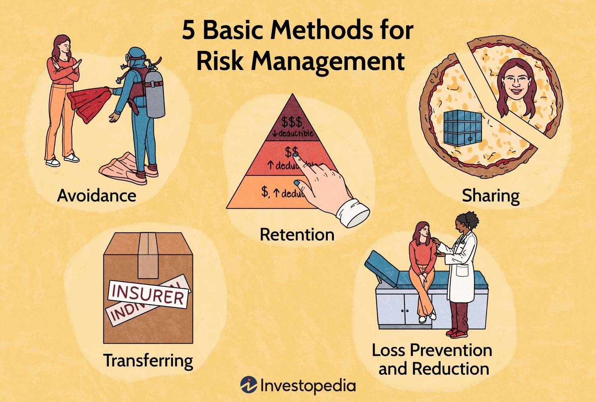

Algorithmic trading has significantly reshaped the landscape of financial markets, leveraging advanced technology and high-speed data processing to automate the trading process. This approach utilizes computer algorithms to execute trades instantly based on predefined instructions, which can include timing, price, or quantity of orders, without human intervention. By automating processes, algorithmic trading aides in executing orders with greater precision, speed, and efficiency than traditional manual trading methods. It allows market participants to capitalize on market conditions quickly, contributing to increased market liquidity and reduced transaction costs.

However, the benefits of algorithmic trading are accompanied by a range of risks that necessitate comprehensive risk management practices. These risks include potential system failures, unintended market impacts, and compliance issues. For instance, the rapid execution capability that is an advantage can also transmit shocks through global markets at an unprecedented pace, exemplifying a systemic risk. Moreover, algorithms lacking robust checks can exacerbate market volatility, lead to operational failures, or even manipulate trading inadvertently. Thus, developing and implementing effective risk management strategies is essential to mitigate these risks and ensure the stability and integrity of the financial markets.

This article examines the risk management aspects integral to algorithmic trading. It delves into strategies for managing systemic and operational risks, highlights tools for mitigating volatility risks, and discusses the importance of regulatory compliance and ethical practices. By understanding and addressing these core challenges, traders and firms can better safeguard their operations and maintain confidence in an increasingly automated trading environment.

## Table of Contents

## Understanding Algorithmic Trading

Algorithmic trading, often referred to as algo trading, involves the use of computer algorithms to execute trading strategies with minimal human intervention. These sophisticated algorithms are programmed to follow a defined set of instructions for trade execution, including timing, price, and [volume](/wiki/volume-trading-strategy), enabling the execution of large trades by breaking them down into smaller, more manageable orders. This implementation aims to minimize market impact and optimize the efficiency of transactions.

A prominent subset of [algorithmic trading](/wiki/algorithmic-trading) is high-frequency trading ([HFT](/wiki/high-frequency-trading-strategies)). HFT utilizes powerful computers and high-speed data networks to execute a large number of orders in fractions of a second. The primary objective of HFT is to capitalize on minute price discrepancies, thereby generating profits from rapid and short-term market movements. These algorithms are finely tuned to detect [arbitrage](/wiki/arbitrage) opportunities, often executing trades across multiple exchanges simultaneously.

The rise in the adoption of algorithmic trading and HFT has significantly increased market [liquidity](/wiki/liquidity-risk-premium). By providing higher volumes of buying and selling, these technologies contribute to narrower bid-ask spreads, offering more competitive prices to traders and investors. Consequently, traders can execute large trades with reduced impact on the market, enhancing overall market efficiency.

Despite these advantages, the pervasive use of algorithmic and high-frequency trading introduces several risks. Systemic risks, in particular, have become a major concern, given the potential for widespread disruption across global markets. One notable example is the 2010 Flash Crash, where rapid, automated trading activities led to a dramatic drop in the U.S. stock market, highlighting the vulnerability of financial systems to such automated strategies.

In conclusion, while algorithmic trading and HFT contribute to improved market liquidity and efficiency, they also necessitate robust risk management strategies to mitigate the associated risks. Without effective safeguards, the [volatility](/wiki/volatility-trading-strategies) and systemic risks posed by these trading methods could outweigh their benefits to the financial markets.

## Major Risks in Algorithmic Trading

Algorithmic trading encompasses various risks that can significantly impact financial markets and individual trading firms. One of the primary concerns is **systemic risk**, which arises when algorithms propagate shocks across interconnected global markets. An infamous example of this is the 2010 Flash Crash, where the Dow Jones Industrial Average plunged about 1,000 points within minutes, primarily driven by automated trading systems. The rapid execution and cancellation of trades, characteristic of high-frequency trading, can magnify market stress and lead to cascading effects that amplify initial market disturbances.

**Volatility risk** is another critical concern. Algorithms can intensify market volatility by reacting to short-term price movements, thereby influencing market prices further. This feedback loop can destabilize markets, as the algorithmic adjustments generate additional buy or sell signals based on the rapid fluctuations they are part of creating. Such conditions can discourage participation from traditional traders, thereby reducing liquidity and increasing instability in the market.

**Operational risk** pertains to potential failures within the trading systems themselves. Faulty algorithms or technical errors can result in severe financial losses and market disruptions. The 2012 Knight Capital incident is a notable example, where an error in the firm's trading algorithm led to a $440 million loss in just 45 minutes. This event underscored the importance of rigorous testing and management of trading algorithms to ensure they function as intended under various market conditions.

In conclusion, managing the risks associated with algorithmic trading is essential for maintaining market stability. Addressing these risks requires a proactive approach, including robust testing, monitoring, and adherence to regulatory frameworks to safeguard against potential market disruptions.

## Risk Management Strategies

Risk management in algorithmic trading is critical to minimizing potential financial losses and ensuring the stability of trading systems. Efficient strategies focus on fortifying the trading framework against unforeseen market scenarios and operational failures.

**Regular Stress Testing**

Regular stress testing is fundamental to ensure the robustness of trading algorithms under extreme market conditions. This involves the simulation of scenarios that could lead to market upheaval, such as sudden price swings, liquidity droughts, or systemic failures. By anticipating how trading algorithms react in stressed environments, traders can refine strategies to prevent detrimental outcomes. For instance, a stress test might simulate a market scenario where a major currency depreciates by 10% in a single day to evaluate the potential implications on a portfolio. Stress tests enable traders to identify weaknesses and rectify them proactively before real-world occurrences.

**Diversification**

Diversification is a pivotal strategy that mitigates the risks associated with overexposure to a particular asset class or sector. By distributing investments across different types of asset classes, sectors, and geographical regions, traders can reduce the impact of a negative event affecting a specific area of the market. For example, if an algorithmic trader diversifies a portfolio by allocating investments in equities, bonds, and commodities, the risk of a downturn in one sector potentially triggering significant losses decreases. The mathematical expression for diversification often involves calculating the correlation coefficient between asset returns, which helps in assembling a portfolio with minimized risk:

$$
\text{Portfolio Variance} = \sum_{i} w_i^2 \sigma_i^2 + \sum_{i \neq j} w_i w_j \sigma_i \sigma_j \rho_{ij}
$$

where $w_i$ and $w_j$ are the weights, $\sigma_i$ and $\sigma_j$ are the standard deviations, and $\rho_{ij}$ is the correlation coefficient between assets $i$ and $j$.

**Safeguard Mechanisms**

Implementing safeguard mechanisms, such as circuit breakers, kill switches, and real-time monitoring, is essential to prevent catastrophic failures. Circuit breakers provide a pause in trading when predetermined limits are breached, allowing for market stabilization and preventing panic sales. Kill switches enable traders to halt trading systems immediately if erratic behavior is detected, reducing potential losses. Real-time monitoring tools consistently evaluate the performance and behavior of trading algorithms, ensuring they operate within predefined safety parameters and providing alerts when anomalies are detected. These mechanisms can act as a fail-safe to protect investments from the consequences of algorithmic errors or market anomalies.

In sum, effective risk management strategies in algorithmic trading require a multi-faceted approach that incorporates thorough stress testing, strategic diversification, and robust safeguard mechanisms. Such measures help in maintaining algorithm integrity, reducing exposure to unpredictable market changes, and safeguarding against operational mishaps.

## Regulatory Compliance and Ethics

Compliance with financial regulations is fundamental to maintaining transparency in algorithmic trading and minimizing legal risks. Regulatory frameworks, such as the Markets in Financial Instruments Directive II (MiFID II) in the European Union and the Dodd-Frank Act in the United States, impose stringent requirements on algorithmic trading activities. These legislations mandate the disclosure of trade data, risk management protocols, and the maintenance of audit trails. Adhering to these regulations ensures that the trading activities are conducted within legal boundaries, fostering trust among market participants.

Protecting intellectual property is equally critical for firms that develop proprietary trading algorithms. Legal rights, such as patents and copyrights, are essential for safeguarding the unique algorithms that drive competitive advantage. Companies invest significant resources into developing these algorithms, and legal protection ensures that they are not unlawfully replicated or exploited by competitors. A robust intellectual property strategy can prevent unauthorized use and potential financial losses, thereby reinforcing the company's market position.

Ethical considerations are increasingly important in algorithmic trading. Algorithms should be designed to prevent unfair advantages and exploitation of market vulnerabilities. This involves ensuring that trading strategies do not manipulate markets, distort prices, or disadvantage other traders. Ethical algorithm design also addresses concerns related to market manipulation and flash crashes, which can erode market confidence. Furthermore, ethical trading practices contribute to the overall stability and integrity of financial markets, aligning with the broader mandate of responsible financial conduct.

In conclusion, robust regulatory compliance, intellectual property protection, and adherence to ethical standards are essential for sustainable algorithmic trading. By incorporating these aspects into their operations, firms can effectively mitigate risks associated with legal, proprietary, and ethical challenges, thereby ensuring long-term success in the competitive financial landscape.

## Case Studies: Learning from the Past

Examining past trading crises provides valuable insights into the consequences of inadequate risk management in algorithmic trading. One of the most prominent examples is the Flash Crash of May 6, 2010. During this event, the Dow Jones Industrial Average plummeted nearly 1,000 points within minutes, only to recover a significant portion shortly after. Investigations revealed that algorithmic trading significantly contributed to the market disruption. A mutual fund sought to hedge its portfolio risks, executed a sell program to offload a substantial number of E-mini S&P 500 contracts. An algorithm, designed to execute trades based on market liquidity and trading volume, led to an overwhelming number of sell orders, exacerbating the market's sudden decline.[^1]

The Flash Crash underscored the systemic risk posed by insufficiently managed algorithms. It illustrated how quickly shocks can propagate across financial markets, triggering a chain reaction among other automated systems designed to respond to price moves.[^2] The lack of safeguards and monitoring mechanisms allowed this event to escalate rapidly, leading to calls for improved risk management frameworks and regulatory measures in algorithmic trading.

Conversely, successful algorithmic trading firms offer instructive examples of effective risk management strategies. For example, large firms such as Renaissance Technologies are renowned for their meticulous risk management approaches, including rigorous [backtesting](/wiki/backtesting), diversification, and real-time monitoring of their trading systems. These strategies aim to ensure that algorithms do not respond erratically during market anomalies and maintain stability across different market conditions. Renaissance Technologies also emphasizes the importance of data quality and continuously refines its models to mitigate potential risks.[^3]

Through these case studies, it becomes evident that robust risk management practices are indispensable for sustaining algorithmic trading in dynamic financial markets. Adopting rigorous testing, monitoring, and diversified strategies can help mitigate risks, promoting market integrity and trader confidence.

[^1]: U.S. Commodity Futures Trading Commission and Securities & Exchange Commission, "Findings Regarding the Market Events of May 6, 2010," Report of the Staffs of the CFTC and SEC to the Joint Advisory Committee on Emerging Regulatory Issues, September 30, 2010.

[^2]: Kirilenko, A.A., Kyle, A.S., Samadi, M., & Tuzun, T., "The Flash Crash: The Impact of High Frequency Trading on an Electronic Market," Social Science Research Network, 2017.

[^3]: Zuckerman, G., *The Man Who Solved the Market: How Jim Simons Launched the Quant Revolution*, Penguin Random House, 2019.

## Conclusion

Risk management is essential for maintaining the stability and success of algorithmic trading within the ever-evolving landscape of financial markets. With market conditions and technologies changing at a rapid pace, continuous improvement and adaptation of risk management practices are crucial. Traders must remain vigilant in assessing new tools, data sources, and methodologies to ensure effective risk mitigation. 

Comprehensive risk management strategies serve as the backbone for safeguarding investments and preserving market confidence. This involves not only the implementation of advanced stress-testing techniques and real-time monitoring but also adherence to ethical standards and regulatory compliance. By prioritizing these risk management measures, traders can better navigate the complexities and uncertainties inherent in algorithmic trading. Ultimately, such dedication to robust risk management enhances the resilience of trading systems and contributes to more stable and trustworthy financial markets.

## References & Further Reading

[1]: U.S. Commodity Futures Trading Commission and Securities & Exchange Commission. (2010). ["Findings Regarding the Market Events of May 6, 2010."](https://www.sec.gov/news/studies/2010/marketevents-report.pdf) Report of the Staffs of the CFTC and SEC to the Joint Advisory Committee on Emerging Regulatory Issues.

[2]: Kirilenko, A.A., Kyle, A.S., Samadi, M., & Tuzun, T. (2017). ["The Flash Crash: The Impact of High Frequency Trading on an Electronic Market."](https://onlinelibrary.wiley.com/doi/abs/10.1111/jofi.12498) Social Science Research Network.

[3]: Zuckerman, G. (2019). *The Man Who Solved the Market: How Jim Simons Launched the Quant Revolution*. Penguin Random House.

[4]: Aldridge, I. (2013). ["High-Frequency Trading: A Practical Guide to Algorithmic Strategies and Trading Systems."](https://books.google.com/books/about/High_Frequency_Trading.html?id=8QpIsVUMhmEC) Wiley.

[5]: Patterson, S. (2012). ["Dark Pools: High-Speed Traders, A.I. Bandits, and the Threat to the Global Financial System."](https://dl.acm.org/doi/10.5555/2385786) Crown Business.