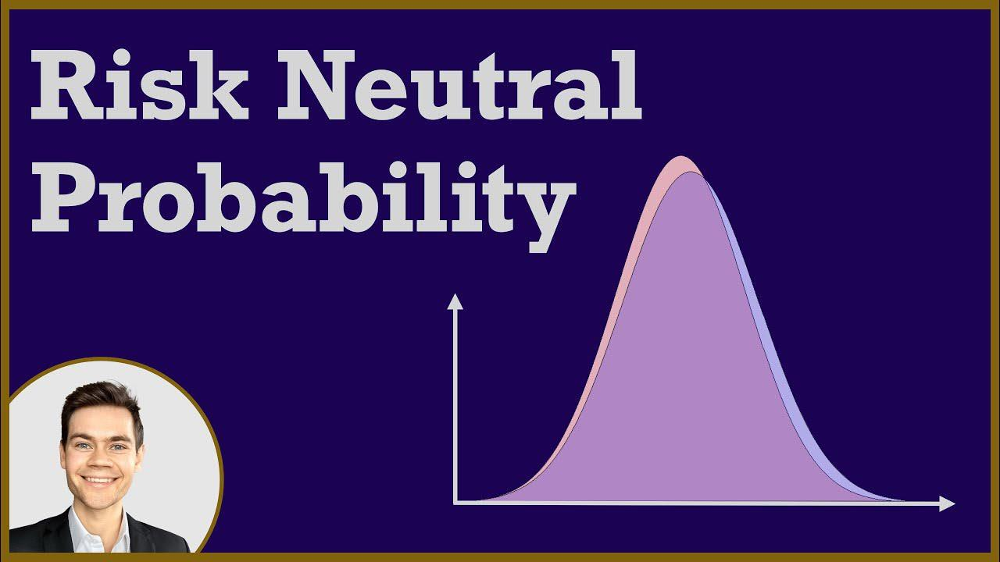

Risk-neutral measures are a fundamental concept in finance, particularly significant in the domains of algorithmic trading and derivative pricing. These probabilistic tools simplify the complexity of pricing models by shifting the focus to a framework where asset returns are expected to align with risk-free rates. This approach ensures that the assessment of asset prices is conducted under a hypothetical scenario where all investors share a neutral stance toward risk. As a result, risk-neutral measures are invaluable for developing trading strategies that maintain their effectiveness across various market conditions, thereby enhancing the robustness of algorithmic trading systems.

The use of risk-neutral measures allows financial analysts to transform real-world probabilities into a framework that assumes all market participants are indifferent to risk. This transformation simplifies the evaluation of financial instruments such as options, futures, and other derivatives, making it possible to price these assets as if their expected returns were equivalent to the risk-free interest rate.



This article examines the significance of risk-neutral measures in financial modeling, with a particular emphasis on their role in algorithmic trading. The discussion will cover their mathematical underpinnings, including concepts from martingale theory and measure theory, which provide the necessary structure for these measures. Additionally, the application of risk-neutral measures in asset pricing will be explored, highlighting their critical role in ensuring consistency and preventing arbitrage opportunities.

In the context of algorithmic trading, adopting risk-neutral measures enables the development of sophisticated strategies that optimize trading efficiency and precision. This is particularly crucial in high-frequency trading environments, where the ability to rapidly process data and make informed decisions can markedly improve competitiveness. The interplay between risk-neutral measures and algorithmic trading underscores an essential relationship in modern quantitative finance.

In summary, understanding risk-neutral measures and their limitations is crucial for traders and analysts seeking to enhance their trading strategies while navigating the complexities of real market scenarios. Their continued relevance and application in algorithmic trading and derivative pricing underscore their foundational role in advancing accuracy, efficiency, and competitiveness in the financial industry.

## Table of Contents

## Understanding Risk-Neutral Measures

Risk-neutral measures are fundamental in the realm of derivative pricing, transforming real-world probabilities into risk-neutral probabilities. This transformation is critical as it allows financial analysts to value assets under the assumption that all investors are indifferent to risk, which equates the expected return of an asset to the risk-free rate. By doing so, risk-neutral measures simplify the complex task of pricing various financial derivatives such as options and futures.

In a risk-neutral world, the adjustments made to the probabilities of asset returns ensure consistent valuation models. For instance, in options pricing, the use of these measures enables models to assume that all investors are risk-neutral, which significantly simplifies calculations. The risk-neutral probability measure, therefore, is not a reflection of actual probabilities but a mathematical construct designed to facilitate more straightforward pricing.

These measures enforce a critical financial principle: the present value of expected future payoffs, when discounted at the risk-free rate, should equal the current price of the asset. Mathematically, this is expressed as:

$$

V_0 = \mathbb{E}^Q \left[ \frac{V_T}{(1 + r)^T} \right] 
$$

where $V_0$ is the current asset price, $V_T$ is the future payoff, $r$ is the risk-free rate, and $\mathbb{E}^Q$ denotes the expectation under the risk-neutral measure $Q$.

The concept of risk-neutral measures is crucial for maintaining consistency across financial models, which is essential for ensuring that no [arbitrage](/wiki/arbitrage) opportunities exist within the markets. Arbitrage, the practice of profiting from price differences in different markets or forms, is minimized when assets are priced consistently across various scenarios. By using risk-neutral measures, financial derivatives are priced in a manner that aligns expected returns with risk-free rates, fostering stable and efficient markets.

## Mathematical Foundations of Risk-Neutral Measures

Risk-neutral measures are deeply rooted in the mathematical frameworks of martingale and measure theory, which form the basis for connecting market dynamics with financial pricing models. Martingale theory plays a crucial role in ensuring that the expected price of an asset, when adjusted for the time value of money, remains constant up to its maturity under the risk-neutral measure. This attribute is fundamental in creating consistent valuation models, as it maintains the expected future value of an asset's price to be equal to its current price when discounted at the risk-free rate. 

In mathematical terms, an asset price $S_t$ under a risk-neutral measure $\mathbb{Q}$ is a martingale if:

$$
\mathbb{E}^{\mathbb{Q}}[S_T \mid \mathcal{F}_t] = S_t
$$

where $\mathcal{F}_t$ is the information available up to time $t$, and $S_T$ is the asset price at time $T$.

Measure theory provides a robust framework for formalizing probabilities and is an essential tool in defining and working with different probability measures. This is particularly important in pricing models like Black-Scholes, where transforming real-world probability measures to risk-neutral ones is crucial. The Radon-Nikodym derivative is employed in this transformation, facilitating the conversion from a real-world probability measure $\mathbb{P}$ to a risk-neutral probability measure $\mathbb{Q}$. 

Mathematically, this transformation can be expressed as:

$$
\frac{d\mathbb{Q}}{d\mathbb{P}} = \frac{e^{-\int_0^T r_s \, ds}}{E^{\mathbb{P}}[e^{-\int_0^T r_s \, ds}]}
$$

where the Radon-Nikodym derivative $\frac{d\mathbb{Q}}{d\mathbb{P}}$ ensures fair pricing by aligning the discounted expected returns with current market prices.

These mathematical constructs provide traders and analysts with the ability to evaluate future prices and model financial instruments with precision. Using these frameworks, analysts can create robust models that take into account various factors affecting asset prices, allowing for fair and consistent pricing across different types of derivatives.

## Applications in Asset Pricing

Risk-neutral measures are integral to the pricing of derivatives, including options, futures, and swaps, within financial markets. This framework allows for the transformation of real-world probabilities into risk-neutral probabilities, anchoring derivative pricing models to a standard where expected returns align with risk-free rates. This adjustment facilitates a simplified and consistent approach to valuing financial instruments, eliminating the complexities associated with individual risk preferences.

In the pricing of options, risk-neutral measures are particularly effective. Models like Black-Scholes rely on this concept to operate under a risk-neutral world where returns are projected at risk-free rates. The Black-Scholes formula, which assumes continuous trading and the Brownian motion of stock prices, derives the option price by discounting the expected payoff at the risk-free rate. The formula is expressed as:

$$
C = S_0 N(d_1) - X e^{-rT} N(d_2)
$$

where:
- $C$ is the call option price,
- $S_0$ is the current stock price,
- $X$ is the strike price,
- $r$ is the risk-free interest rate,
- $T$ is the time to maturity,
- $N(d)$ is the cumulative distribution function of the standard normal distribution,
- $d_1 = \frac{\ln(S_0/X) + (r + \sigma^2/2)T}{\sigma \sqrt{T}}$,
- $d_2 = d_1 - \sigma \sqrt{T}$,
- $\sigma$ is the volatility of the stock.

Furthermore, in futures pricing, the cost-of-[carry](/wiki/carry-trading) model applies risk-neutral measures by ensuring that the futures price reflects the cost of holding the underlying asset, adjusted for risk-free rates. This ensures the alignment of futures prices with the present value of the spot price, discounted by carrying costs and the risk-free rate:

$$
F = S_0 e^{(r - y)T}
$$

where:
- $F$ is the futures price,
- $y$ is the dividend yield or cost of carry.

These methodologies illustrate a structured approach to derivative pricing, adhering to the principle of no-arbitrage. By enforcing conditions where no risk-free arbitrage opportunities exist, markets exhibit consistency, thereby enabling accurate asset pricing even under volatile and uncertain conditions.

Adopting risk-neutral measures allows traders to evaluate derivatives with precision, accounting for current market circumstances without the bias introduced by varying investor risk appetites. This approach is invaluable in ensuring the robustness of pricing models and methodologies across diverse hedging and speculative strategies.

## Implications for Algorithmic Trading

Algorithmic traders incorporate risk-neutral measures to strengthen the robustness and efficiency of high-frequency trading strategies. These measures align trading algorithms with theoretical models, optimizing precision and minimizing arbitrage opportunities. In a risk-neutral world, traders can model asset prices effectively, enabling algorithms to predict price movements with greater accuracy by prioritizing current market factors over historical data trends.

One of the key benefits is that risk-neutral measures transform the complexities of asset pricing into a standardized set of expectations, facilitating a uniform approach in [algorithmic trading](/wiki/algorithmic-trading). By modeling scenarios where expected returns equate to a risk-free rate, algorithms can transcend historical price biases, honing in on immediate market conditions and thereby enhancing predictability.

In practice, traders frequently employ programming languages like Python due to its robust libraries and community support. Python’s extensive suite of libraries, such as NumPy and SciPy, is instrumental in crafting [quantitative trading](/wiki/quantitative-trading) models that apply risk-neutral measures. These libraries support complex numerical computations and statistical operations essential for developing effective trading strategies. For example, traders might utilize the following Python code snippet to simulate a Black-Scholes model to price an option:

```python
import numpy as np
from scipy.stats import norm

# Black-Scholes formula for call option
def black_scholes_call(S, K, T, r, sigma):
    d1 = (np.log(S / K) + (r + 0.5 * sigma**2) * T) / (sigma * np.sqrt(T))
    d2 = d1 - sigma * np.sqrt(T)
    call_price = S * norm.cdf(d1) - K * np.exp(-r * T) * norm.cdf(d2)
    return call_price

# Example variables
S = 100    # Current stock price
K = 110    # Option strike price
T = 1      # Time to expiration (in years)
r = 0.05   # Risk-free interest rate
sigma = 0.2 # Volatility

# Calculate call option price
call_price = black_scholes_call(S, K, T, r, sigma)
print(f"Option Price: {call_price:.2f}")
```

Through the integration of risk-neutral frameworks, trading bots can process large volumes of information swiftly, granting them the capability to make informed decisions even amidst high market [volatility](/wiki/volatility-trading-strategies). This rapid processing ensures that algorithms can execute trades efficiently, leveraging their superior speed and computational power to capitalize on fleeting opportunities in real-time markets. The application of risk-neutral measures in algorithmic trading not only enhances profitability but also sustains accuracy in predicting market shifts, ultimately empowering traders to maintain competitiveness in ever-evolving financial environments.

## Limitations and Criticisms

Risk-neutral measures, while offering a valuable theoretical framework for derivative pricing, hinge on the assumption of investor indifference to risk. This assumption diverges from actual market behavior, where investors commonly exhibit varying levels of risk aversion. Consequently, the models that rely on risk-neutral measures might not reflect real-world risk preferences accurately, leading to potential discrepancies in asset pricing and decision-making processes.

Moreover, the theoretical underpinning of no-arbitrage and complete markets often fails to align with the complexities and imperfections observed in real markets. Market inefficiencies, driven by frictions such as transaction costs and information asymmetries, challenge the validity of these assumptions. As a result, the expected harmonization between model predictions and actual market outcomes may falter, causing inconsistencies in pricing and strategy deployment.

Arbitrage opportunities, integral to the theoretical groundwork, present further inconsistencies. These opportunities, theoretically absent in efficient markets, do emerge in practice due to these inefficiencies. Consequently, models based on risk-neutral measures may overlook or misestimate these opportunities, potentially leading to suboptimal strategies.

Despite providing a consistent method for derivative pricing, the application of risk-neutral measures demands careful consideration of their limitations. Practitioners must account for deviations from theoretical assumptions when employing these models. This consideration is crucial for maintaining the relevance and accuracy of financial strategies in dynamic market environments.

Integrating risk-neutral measures with empirical market data and pragmatic analysis enhances their relevance. This combination incorporates the theoretical rigor of risk-neutral frameworks with the practical insights derived from current market conditions. This integration ensures that financial analysts and traders can better navigate the nuanced landscape of financial markets, executing informed and effective trading strategies while acknowledging the limitations inherent in risk-neutral assumptions.

## Conclusion

Risk-neutral measures are indispensable tools for derivative pricing and form the bedrock of quantitative finance and algorithmic trading. By aligning expected returns with risk-free rates, these measures introduce a standardized approach to valuing financial products, ensuring consistency and robustness across various pricing models. Understanding the role and limitations of risk-neutral measures allows traders to enhance their strategies while effectively navigating the complexities of real-world markets. They provide a framework that discards the need to account for risk preferences among investors, simplifying the valuation process while maintaining theoretical soundness.

As algorithmic trading progresses, the application of risk-neutral measures is imperative for enhancing the accuracy and efficiency of trading algorithms. They allow these systems to anticipate asset price movements more precisely, reducing arbitrage opportunities and optimizing decision-making processes. The evolution of algorithmic trading hinges on leveraging such measures, paving the path for increased competitiveness in rapidly changing financial environments.

Future innovations in finance will undoubtedly continue to capitalize on the robust applications of risk-neutral measures. Their integration within strategic frameworks will support the development of advanced models and tools necessary for assessing complex financial instruments. As financial markets evolve, the reliance on risk-neutral measures will remain crucial for strategic success, enabling practitioners to address challenges effectively and capitalize on emerging opportunities.

## References & Further Reading

- Björk, T. (2009). *Arbitrage Theory in Continuous Time*. Oxford University Press. This book provides a comprehensive exploration of continuous-time financial models focusing on arbitrage principles, a valuable resource for understanding the mathematical underpinnings of risk-neutral measures in financial markets.

- Hull, J. C. (2018). *Options, Futures, and Other Derivatives*. Pearson. A widely used textbook in financial education that covers the concepts and practical aspects of derivatives pricing, including the utilization of risk-neutral measures in popular models like Black-Scholes.

- Shreve, S. E. (2004). *Stochastic Calculus for Finance I: The Binomial Asset Pricing Model*. Springer. This book offers an introduction to stochastic calculus for finance, with a focus on the mathematical techniques necessary for deriving and understanding risk-neutral pricing models.

- Duffie, D. (2001). *Dynamic Asset Pricing Theory*. Princeton University Press. It discusses sophisticated concepts in asset pricing, including a detailed analysis of dynamic pricing models that often employ risk-neutral measures for valuation purposes.

- Black, F., & Scholes, M. (1973). *The Pricing of Options and Corporate Liabilities*. Journal of Political Economy. This seminal paper introduces the Black-Scholes option pricing model, which uses risk-neutral valuation to derive equations for the pricing of European options, laying foundational ground for modern financial derivatives markets.

