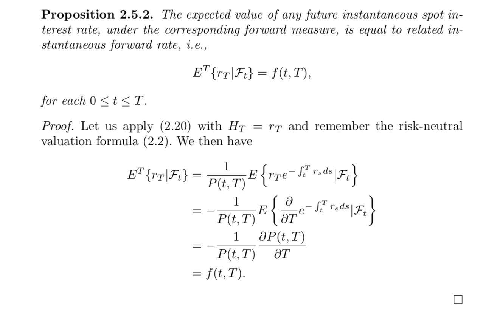

## Table of Contents

## What is a risk-neutral measure?

A risk-neutral measure is a way to think about the future value of investments without worrying about how much risk you're taking. It's like pretending that everyone is okay with any level of risk, so you can focus on the expected returns. In finance, this helps people calculate the price of things like stocks or options by using the average of all possible future outcomes, but without adding extra for the risk.

To understand this better, imagine you're playing a game where you can win or lose money. Normally, you might want more money if the game is risky. But with a risk-neutral measure, you act as if the risk doesn't matter. You just look at the average outcome and use that to decide what the game is worth now. This makes it easier to compare different investments and figure out their prices today.

## How does the risk-neutral measure differ from the real-world measure?

The risk-neutral measure and the real-world measure are two different ways to think about the future. The real-world measure looks at what might really happen, taking into account how likely different outcomes are and how much risk is involved. For example, if you're thinking about buying a stock, the real-world measure would consider the actual chances of the stock going up or down and how much you care about the risk.

On the other hand, the risk-neutral measure pretends that risk doesn't matter to you. It changes the probabilities of different outcomes so that you can focus only on the average return, without adding extra for the risk. This makes it easier to calculate the price of things like options or futures today. So, while the real-world measure helps you understand the actual risks and rewards, the risk-neutral measure simplifies things by ignoring risk, which is useful for pricing financial instruments.

## Why is the concept of risk-neutral measure important in financial mathematics?

The concept of risk-neutral measure is important in financial mathematics because it makes it easier to figure out the price of things like options and futures. In the real world, people care a lot about risk. They want more money if an investment is risky. But with a risk-neutral measure, we pretend that risk doesn't matter. This lets us focus on the average return without worrying about the risk. It's like playing a game where you only care about the average outcome, not how risky it is.

This simplification is really helpful for pricing financial instruments. When you use a risk-neutral measure, you can use math formulas and models to find out what an option or future should be worth today. This is much easier than trying to guess how much people will want for taking on risk. By using the risk-neutral measure, financial mathematicians can create tools and models that help traders and investors make better decisions.

## How is the risk-neutral measure used in pricing derivatives?

When pricing derivatives like options or futures, the risk-neutral measure is really helpful. It lets us pretend that everyone is okay with any level of risk, so we can focus just on the average return. This makes the math easier because we don't have to guess how much people want for taking on risk. Instead, we use the risk-neutral measure to adjust the probabilities of different outcomes, so we can calculate the price of a derivative today based on the average of all possible future outcomes.

For example, if you want to price a call option on a stock, you'd use the risk-neutral measure to figure out what the stock might be worth in the future. You'd look at all the possible prices the stock could reach, adjust their probabilities to ignore risk, and then find the average outcome. This average outcome helps you calculate what the call option should be worth today. By using the risk-neutral measure, you make the pricing process simpler and more accurate, which is really important for traders and investors.

## What is the relationship between the risk-neutral measure and the martingale property?

The risk-neutral measure and the martingale property are closely related in finance. A martingale is a special kind of process where the best guess for the future value of something, given what you know now, is just its current value. When we use a risk-neutral measure, we adjust the probabilities of future outcomes so that the price of an asset, like a stock or a derivative, behaves like a martingale. This means that under the risk-neutral measure, the expected future price of the asset, without considering any extra money for risk, is equal to its current price.

This relationship is very important for pricing derivatives. When we use the risk-neutral measure, we can apply the martingale property to calculate the price of a derivative today. For example, if we're pricing an option, we can use the risk-neutral measure to find the expected value of the option at expiration and then discount it back to today's price. This makes the math easier and more straightforward because we don't have to worry about how much people want for taking on risk. The martingale property, under the risk-neutral measure, helps us create models and formulas that are useful for traders and investors.

## Can you explain the Girsanov theorem and its role in changing from the real-world measure to the risk-neutral measure?

The Girsanov theorem is a math tool that helps us change how we think about the future. It's like a translator that lets us move from the real-world measure, where we care about risk, to the risk-neutral measure, where we pretend risk doesn't matter. Imagine you're looking at a stock's price. In the real world, you'd think about how likely it is to go up or down and how much risk you're taking. But with the Girsanov theorem, you can adjust these probabilities so that the stock's price looks like it's moving without any extra money for risk.

This change is really important for pricing things like options. When we use the Girsanov theorem to switch to the risk-neutral measure, we can pretend that the stock's price follows a special kind of path called a martingale. This makes it easier to calculate what an option should be worth today. By using the Girsanov theorem, we can focus on the average of all possible future outcomes without worrying about risk, which helps us create better models and formulas for traders and investors.

## How do you derive the risk-neutral pricing formula?

To derive the risk-neutral pricing formula, we start by thinking about the future value of an investment, like a stock or an option. In the real world, we care about how risky it is. But with the risk-neutral measure, we pretend that risk doesn't matter. This means we can change the probabilities of different future outcomes so that the expected value of the investment, without adding extra for risk, is just its current price. This special way of thinking about the future is called a martingale, and it helps us calculate what an option should be worth today.

The risk-neutral pricing formula comes from using this martingale property. We look at all the possible future prices of the underlying asset, like a stock, and adjust their probabilities so that the expected future price, under the risk-neutral measure, is equal to the current price. Then, we find the average value of the option at expiration and discount it back to today's price. This gives us the risk-neutral price of the option, which is really helpful for traders and investors because it simplifies the math and makes it easier to figure out what options and other derivatives should be worth.

## What are the assumptions made when using the risk-neutral measure for option pricing?

When using the risk-neutral measure for option pricing, we make some important assumptions. The first assumption is that everyone is okay with any level of risk. This means that we pretend people don't want extra money for taking on risk. Instead, we focus on the average return of the investment, like a stock or an option, without worrying about how risky it might be. This makes the math easier because we don't have to guess how much people will want for risk.

The second assumption is that the price of the underlying asset, like a stock, follows a special kind of path called a martingale under the risk-neutral measure. This means that the best guess for the future price of the stock, given what we know now, is just its current price. By using this martingale property, we can adjust the probabilities of different future outcomes so that the expected future price, without considering risk, is equal to the current price. This helps us calculate what an option should be worth today by finding the average value of the option at expiration and then discounting it back to today's price.

## How does the risk-neutral measure handle different types of risks such as market risk, credit risk, and liquidity risk?

The risk-neutral measure helps us price financial products like options by pretending that no one cares about risk. This means it doesn't directly handle different types of risks like market risk, credit risk, or [liquidity](/wiki/liquidity-risk-premium) risk. Instead, it changes the way we think about future outcomes so that we can focus on the average return without adding extra for risk. For example, with market risk, which is the risk of losing money because of changes in the market, the risk-neutral measure adjusts the probabilities so that we can calculate the price of an option based on the average of all possible future prices of the underlying asset, like a stock, without considering how risky the market might be.

When it comes to credit risk, which is the risk that someone won't pay back what they owe, the risk-neutral measure still doesn't directly account for it. But it can be used in models that do consider credit risk. For instance, in pricing credit derivatives, we might use the risk-neutral measure to find the expected value of the derivative at expiration, but we'd need to include extra adjustments for credit risk in the model. Liquidity risk, which is the risk of not being able to buy or sell an asset quickly enough, is also not directly handled by the risk-neutral measure. However, when pricing options, we might need to adjust the model to account for how easy or hard it is to trade the underlying asset. In all these cases, the risk-neutral measure simplifies the math by focusing on average returns, but other parts of the model need to deal with the specific risks involved.

## What are the challenges and limitations of applying the risk-neutral measure in practice?

Using the risk-neutral measure in real life can be tricky because it pretends that no one cares about risk. But in the real world, people do care about risk. They want more money if an investment is risky. So, when we use the risk-neutral measure, we have to make sure our models and formulas are good enough to guess what people will want for taking on risk. If our guesses are wrong, the prices we calculate for things like options might not be right. This can be a big problem for traders and investors who need accurate prices to make good decisions.

Another challenge is that the risk-neutral measure doesn't handle different types of risks, like market risk, credit risk, or liquidity risk, directly. We have to add extra parts to our models to account for these risks. For example, if we're pricing a credit derivative, we need to include adjustments for the chance that someone won't pay back what they owe. If we're pricing an option, we might need to consider how easy or hard it is to buy or sell the underlying asset. These extra adjustments can make the math more complicated and harder to get right. So, while the risk-neutral measure helps simplify things, it also means we have to be careful and smart about how we use it in practice.

## How do changes in interest rates and volatility affect the risk-neutral measure?

Changes in interest rates and [volatility](/wiki/volatility-trading-strategies) can really shake things up when we use the risk-neutral measure to price options and other financial products. Interest rates are like the cost of borrowing money. When interest rates go up, the price of an option usually goes down because the money we use to buy the option could be [earning](/wiki/earning-announcement) more interest elsewhere. On the other hand, when interest rates go down, the price of an option might go up because the money we use to buy it isn't earning as much interest. So, we need to adjust our calculations to account for these changes in interest rates when we use the risk-neutral measure.

Volatility is about how much the price of something, like a stock, can jump around. When volatility goes up, it means the stock price might change a lot, which makes options more valuable because there's a bigger chance the option will end up being worth something. When volatility goes down, options become less valuable because the stock price is less likely to move a lot. The risk-neutral measure helps us figure out the price of options by pretending everyone is okay with any level of risk, but we still need to update our models to reflect how much the stock price might change. So, both interest rates and volatility are important pieces of the puzzle when we use the risk-neutral measure to price options.

## Can you discuss advanced applications of the risk-neutral measure in exotic options and structured products?

The risk-neutral measure is super helpful when we're trying to figure out the price of fancy financial products like exotic options and structured products. Exotic options are different from regular options because they have special rules. For example, a barrier option might only pay out if the stock price hits a certain level. When we use the risk-neutral measure, we can pretend that no one cares about risk and focus on the average return of these options. This makes it easier to calculate what these exotic options should be worth today. We look at all the possible future prices of the stock, adjust their probabilities to ignore risk, and then find the average value of the option at expiration. This helps us come up with a price that traders and investors can use.

Structured products are another cool place where the risk-neutral measure comes in handy. These are investments that mix different financial products, like stocks and options, to create something new. For example, a structured note might give you a return based on how a stock index performs, but with some protection against losses. When we price these products, we use the risk-neutral measure to focus on the average return without worrying about risk. This way, we can figure out what the structured product should be worth today by looking at all the possible future outcomes and finding their average value. It's like putting together a puzzle where the risk-neutral measure helps us see the big picture without getting distracted by the risk pieces.

## What are Risk-Neutral Measures and How Do We Understand Them?

Risk-neutral measures are fundamental in the realm of derivative pricing, transforming real-world probabilities into risk-neutral probabilities. This transformation is critical as it allows financial analysts to value assets under the assumption that all investors are indifferent to risk, which equates the expected return of an asset to the risk-free rate. By doing so, risk-neutral measures simplify the complex task of pricing various financial derivatives such as options and futures.

In a risk-neutral world, the adjustments made to the probabilities of asset returns ensure consistent valuation models. For instance, in options pricing, the use of these measures enables models to assume that all investors are risk-neutral, which significantly simplifies calculations. The risk-neutral probability measure, therefore, is not a reflection of actual probabilities but a mathematical construct designed to facilitate more straightforward pricing.

These measures enforce a critical financial principle: the present value of expected future payoffs, when discounted at the risk-free rate, should equal the current price of the asset. Mathematically, this is expressed as:

$$

V_0 = \mathbb{E}^Q \left[ \frac{V_T}{(1 + r)^T} \right] 
$$

where $V_0$ is the current asset price, $V_T$ is the future payoff, $r$ is the risk-free rate, and $\mathbb{E}^Q$ denotes the expectation under the risk-neutral measure $Q$.

The concept of risk-neutral measures is crucial for maintaining consistency across financial models, which is essential for ensuring that no [arbitrage](/wiki/arbitrage) opportunities exist within the markets. Arbitrage, the practice of profiting from price differences in different markets or forms, is minimized when assets are priced consistently across various scenarios. By using risk-neutral measures, financial derivatives are priced in a manner that aligns expected returns with risk-free rates, fostering stable and efficient markets.

## What are the Mathematical Foundations of Risk-Neutral Measures?

Risk-neutral measures are deeply rooted in the mathematical frameworks of martingale and measure theory, which form the basis for connecting market dynamics with financial pricing models. Martingale theory plays a crucial role in ensuring that the expected price of an asset, when adjusted for the time value of money, remains constant up to its maturity under the risk-neutral measure. This attribute is fundamental in creating consistent valuation models, as it maintains the expected future value of an asset's price to be equal to its current price when discounted at the risk-free rate. 

In mathematical terms, an asset price $S_t$ under a risk-neutral measure $\mathbb{Q}$ is a martingale if:

$$
\mathbb{E}^{\mathbb{Q}}[S_T \mid \mathcal{F}_t] = S_t
$$

where $\mathcal{F}_t$ is the information available up to time $t$, and $S_T$ is the asset price at time $T$.

Measure theory provides a robust framework for formalizing probabilities and is an essential tool in defining and working with different probability measures. This is particularly important in pricing models like Black-Scholes, where transforming real-world probability measures to risk-neutral ones is crucial. The Radon-Nikodym derivative is employed in this transformation, facilitating the conversion from a real-world probability measure $\mathbb{P}$ to a risk-neutral probability measure $\mathbb{Q}$. 

Mathematically, this transformation can be expressed as:

$$
\frac{d\mathbb{Q}}{d\mathbb{P}} = \frac{e^{-\int_0^T r_s \, ds}}{E^{\mathbb{P}}[e^{-\int_0^T r_s \, ds}]}
$$

where the Radon-Nikodym derivative $\frac{d\mathbb{Q}}{d\mathbb{P}}$ ensures fair pricing by aligning the discounted expected returns with current market prices.

These mathematical constructs provide traders and analysts with the ability to evaluate future prices and model financial instruments with precision. Using these frameworks, analysts can create robust models that take into account various factors affecting asset prices, allowing for fair and consistent pricing across different types of derivatives.

## What are the applications in asset pricing?

Risk-neutral measures are integral to the pricing of derivatives, including options, futures, and swaps, within financial markets. This framework allows for the transformation of real-world probabilities into risk-neutral probabilities, anchoring derivative pricing models to a standard where expected returns align with risk-free rates. This adjustment facilitates a simplified and consistent approach to valuing financial instruments, eliminating the complexities associated with individual risk preferences.

In the pricing of options, risk-neutral measures are particularly effective. Models like Black-Scholes rely on this concept to operate under a risk-neutral world where returns are projected at risk-free rates. The Black-Scholes formula, which assumes continuous trading and the Brownian motion of stock prices, derives the option price by discounting the expected payoff at the risk-free rate. The formula is expressed as:

$$
C = S_0 N(d_1) - X e^{-rT} N(d_2)
$$

where:
- $C$ is the call option price,
- $S_0$ is the current stock price,
- $X$ is the strike price,
- $r$ is the risk-free interest rate,
- $T$ is the time to maturity,
- $N(d)$ is the cumulative distribution function of the standard normal distribution,
- $d_1 = \frac{\ln(S_0/X) + (r + \sigma^2/2)T}{\sigma \sqrt{T}}$,
- $d_2 = d_1 - \sigma \sqrt{T}$,
- $\sigma$ is the volatility of the stock.

Furthermore, in futures pricing, the cost-of-[carry](/wiki/carry-trading) model applies risk-neutral measures by ensuring that the futures price reflects the cost of holding the underlying asset, adjusted for risk-free rates. This ensures the alignment of futures prices with the present value of the spot price, discounted by carrying costs and the risk-free rate:

$$
F = S_0 e^{(r - y)T}
$$

where:
- $F$ is the futures price,
- $y$ is the dividend yield or cost of carry.

These methodologies illustrate a structured approach to derivative pricing, adhering to the principle of no-arbitrage. By enforcing conditions where no risk-free arbitrage opportunities exist, markets exhibit consistency, thereby enabling accurate asset pricing even under volatile and uncertain conditions.

Adopting risk-neutral measures allows traders to evaluate derivatives with precision, accounting for current market circumstances without the bias introduced by varying investor risk appetites. This approach is invaluable in ensuring the robustness of pricing models and methodologies across diverse hedging and speculative strategies.

## References & Further Reading

- Björk, T. (2009). *Arbitrage Theory in Continuous Time*. Oxford University Press. This book provides a comprehensive exploration of continuous-time financial models focusing on arbitrage principles, a valuable resource for understanding the mathematical underpinnings of risk-neutral measures in financial markets.

- Hull, J. C. (2018). *Options, Futures, and Other Derivatives*. Pearson. A widely used textbook in financial education that covers the concepts and practical aspects of derivatives pricing, including the utilization of risk-neutral measures in popular models like Black-Scholes.

- Shreve, S. E. (2004). *Stochastic Calculus for Finance I: The Binomial Asset Pricing Model*. Springer. This book offers an introduction to stochastic calculus for finance, with a focus on the mathematical techniques necessary for deriving and understanding risk-neutral pricing models.

- Duffie, D. (2001). *Dynamic Asset Pricing Theory*. Princeton University Press. It discusses sophisticated concepts in asset pricing, including a detailed analysis of dynamic pricing models that often employ risk-neutral measures for valuation purposes.

- Black, F., & Scholes, M. (1973). *The Pricing of Options and Corporate Liabilities*. Journal of Political Economy. This seminal paper introduces the Black-Scholes option pricing model, which uses risk-neutral valuation to derive equations for the pricing of European options, laying foundational ground for modern financial derivatives markets.

