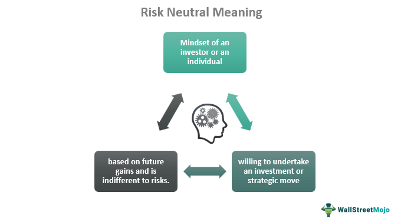

Risk-neutral measures are foundational in finance, particularly in the pricing of derivatives and asset valuation. These measures are employed in scenarios where risk preferences do not affect asset pricing, thereby simplifying complex financial models. By transforming the expected return assumptions, risk-neutral measures facilitate a standardized approach to evaluating future asset prices. This transformation allows financial products to be priced as though they will yield returns equivalent to risk-free rates, thereby eliminating the influence of risk appetites on pricing.

The relevance of risk-neutral measures extends significantly to algorithmic trading and quantitative finance. Traders frequently utilize these measures to develop algorithms that automate trading strategies, ensuring these algorithms maintain robustness in various market conditions. By adopting a risk-neutral perspective, traders and analysts can more accurately simulate and predict asset price movements and returns, enhancing their decision-making processes.



In the landscape of mathematical finance, risk-neutral measures provide a structured framework for assessing financial instruments like options, futures, and swaps. These measures enable the transformation of real-world probabilities into risk-neutral probabilities, allowing for the derivation of fair prices for derivatives under the fundamental theorem of asset pricing. Understanding how risk-neutral measures integrate with asset pricing models is vital for practitioners involved in financial modeling and derivative pricing. As algorithmic trading evolves, the application of risk-neutral measures is anticipated to become increasingly crucial, cementing their place as vital components in financial analysis and strategy development.

## Table of Contents

## Understanding Risk-Neutral Measures

Risk-neutral measures are central to the framework of derivative pricing in financial mathematics. These measures effectively transform probability assessments of asset returns, allowing them to be evaluated as if investors were completely indifferent to risk. This transformation hinges on the fundamental principle that, under a risk-neutral measure, the expected return on a risky asset is equal to the risk-free rate of return. 

In practice, when applying risk-neutral measures, we adjust the real-world probability distributions of asset returns to create a hypothetical scenario of risk neutrality. This involves recalibrating expected payouts such that these align with the risk-free rate, which is often represented by government bond yields. Therefore, the future value of an asset, when discounted at the risk-free rate, should equal its present value. 

Mathematically, if $S_t$ represents the price of an asset at time $t$, the risk-neutral measure $\mathbb{Q}$ transforms the expected value such that:

$$
E^{\mathbb{Q}}[S_T \mid \mathcal{F}_t] = S_t \cdot e^{r(T-t)}
$$

Here:
- $E^{\mathbb{Q}}$ denotes the expectation under the risk-neutral measure.
- $\mathcal{F}_t$ represents the information set available at time $t$.
- $T$ is the time of maturity.
- $r$ is the risk-free interest rate.

This equation underscores the principle that, under the risk-neutral measure, the expected growth of an asset is dictated by the risk-free rate rather than the asset's actual historical returns or associated risk factors.

By transitioning into a risk-neutral framework, financial analysts and traders can consistently price complex derivatives like options and structured products. These measures facilitate a consistent methodology for appraising asset pricing by ensuring that the fundamental law of one price is maintained across different markets and financial instruments, thereby preventing [arbitrage](/wiki/arbitrage) opportunities.

In practical applications, especially in [algorithmic trading](/wiki/algorithmic-trading), risk-neutral measures provide a coherent structure by which programs and high-frequency trading strategies can remain aligned with theoretical models, thereby optimizing pricing accuracy and reducing potential discrepancies between expected and actual returns.

## Mathematical Foundations of Risk-Neutral Measures

Risk-neutral measures are fundamental in connecting the real-world dynamics of financial markets with their theoretically determined pricing. The mathematical underpinnings of risk-neutral measures are largely built upon concepts from martingale theory and measure theory, providing a framework where future asset prices, when adjusted for risk, align with their current prices. This is achieved through a transformed probability that renders expected returns as equating to the return of a risk-free asset.

Measure theory plays a pivotal role in this transformation. It provides the formalized language and structure necessary to define probabilities within a rigorous mathematical framework, integral for deriving derivative pricing models. In measure theory, a "measure" is a systematic way to assign a number to subsets of a given set, which in this context is used to create a probability space that captures the behavior of financial instruments under risk-neutral scenarios.

Martingale theory complements this by describing a sequence of random variables where the expectation of the next value, given all prior ones, is equal to the present value. This is particularly relevant in modeling fair games, encapsulating the idea that in a risk-neutral world, the price of an asset should be expected to remain constant when adjusted for time until maturity. Mathematically, if $X_t$ is a martingale with respect to a probability measure $P$, then:

$$
E[X_{t+1} \mid X_t, X_{t-1}, \ldots] = X_t
$$

For financial derivatives, this translates into ensuring that, under the risk-neutral measure $Q$, the discounted price process becomes a martingale. This can be represented as:

$$
E^Q\left[\frac{S_T}{B_T} \mid \mathcal{F}_t\right] = \frac{S_t}{B_t}
$$

where $S_t$ and $S_T$ are asset prices at present and future times $t$ and $T$, respectively, and $B_t$ and $B_T$ are the corresponding risk-free bond prices.

By transforming the real-world probability measure $P$ into a risk-neutral measure $Q$, one enables the use of mathematical tools to evaluate potential future prices, providing a consistent and sensible pricing structure for derivatives. This transformation is often facilitated by the Radon-Nikodym derivative, enabling the calculation of expectations under the new measure.

Together, measure theory and martingale theory establish the foundational grounds allowing risk-neutral measures to simplify the complexities of financial markets into models that ensure fair pricing and risk assessments. This convergence ensures that despite real-world market imperfections, consistent and theoretically sound pricing mechanisms can still be developed.

## Applications in Asset Pricing

Risk-neutral measures are integral to asset pricing, particularly in the valuation of options, futures, and other derivatives. By employing these measures, the cost of an asset can be determined as the risk-free discounted expected payoff, thereby simplifying the complexity inherent in financial markets.

For options pricing, risk-neutral measures facilitate the application of models such as the Black-Scholes-Merton model for European-style options. The model takes into account the risk-neutral measure, which assumes that all investors are indifferent to risk. This assumption allows the expected returns on the underlying asset to be calculated at the risk-free rate, simplifying the pricing equation. The Black-Scholes formula is given by:

$$
C = S_0 N(d_1) - X e^{-rT} N(d_2)
$$

where

$$
d_1 = \frac{\ln(S_0/X) + (r + \sigma^2/2)T}{\sigma \sqrt{T}}
$$

$$
d_2 = d_1 - \sigma \sqrt{T}
$$

Here, $C$ represents the call option price, $S_0$ denotes the current stock price, $X$ is the strike price, $r$ is the risk-free [interest rate](/wiki/interest-rate-trading-strategies), $T$ stands for the time to expiration, $\sigma$ is the [volatility](/wiki/volatility-trading-strategies) of the stock, and $N$ is the cumulative distribution function of the standard normal distribution.

Beyond options, risk-neutral measures are also significant in pricing futures. The cost-of-[carry](/wiki/carry-trading) model, which is used extensively in futures pricing, benefits from these measures by providing a clear framework to adjust asset prices over time. The futures price ($F$) can be represented as:

$$
F = S_0 e^{(r-c)T}
$$

where $c$ represents the convenience yield, or the cost attributed to holding the physical asset. This equation implies that the futures price is shaped by the current asset price adjusted by the cost of carry, which includes storage costs, interest rates, and dividends.

Through these applications, risk-neutral measures offer a coherent methodology for deriving prices in uncertain financial markets. They underpin pricing models by assuming that returns are aligned with the risk-free rate, thus enabling financial analysts and traders to evaluate derivatives consistently across various market conditions.

## Implications for Algorithmic Trading

Algorithmic trading significantly benefits from the implementation of risk-neutral measures due to their contribution to reliable high-frequency trading strategies and effective asset allocation. These measures form a vital part of core algorithmic trading processes by providing a mathematically sound framework for valuing and predicting asset prices. They help traders ensure that their pricing algorithms are consistently aligned with prevailing market expectations, which is critical in minimizing arbitrage opportunities and maintaining market efficiency.

In essence, risk-neutral measures transform the actual probability distribution of an asset's future price into a risk-neutral one, where expected returns equate to risk-free rates. This transformation allows algorithmic traders to make assumptions about asset prices in a hypothetical world where all investors are indifferent to risk. By modeling expected asset prices through this lens, algorithms can more accurately predict movements and potential price changes based on market factors rather than historical volatilities influenced by varying risk appetites.

From a practical perspective, these measures facilitate the coding of trading algorithms centered on maximizing efficiency and accuracy. Python, widely used in data science and finance, can be utilized to implement risk-neutral valuation methods. By applying libraries such as NumPy and SciPy, traders can develop complex quantitative models and simulations that optimize trading strategies.

```python
import numpy as np
import scipy.stats as stats

def risk_neutral_price(S, K, T, r, sigma):
    # S: current stock price, K: strike price, T: time to maturity
    # r: risk-free rate, sigma: volatility

    d1 = (np.log(S / K) + (r + 0.5 * sigma**2) * T) / (sigma * np.sqrt(T))
    d2 = d1 - sigma * np.sqrt(T)

    # Calculate call option price using Black-Scholes-Merton model
    call_price = (S * stats.norm.cdf(d1)) - (K * np.exp(-r * T) * stats.norm.cdf(d2))

    return call_price

# Example: Calculate the call option price
print(risk_neutral_price(100, 100, 1, 0.05, 0.2))  # Output: Call option price
```

By integrating such models, where risk-neutral measures play a crucial role, into algorithmic trading routines, trading bots can make informed decisions at high speeds, processing vast amounts of financial data to exploit market inefficiencies rapidly. Furthermore, these measures provide the theoretical underpinning that enhances not only the precision but also the robustness of algorithms tasked with trading in complex and volatile market conditions.

While ensuring that trading strategies are aligned with risk-neutral principles, traders can achieve significant gains in terms of reduced transaction costs and improved execution speeds. In a competitive trading environment where milliseconds can determine the profitability of a trade, the ability to leverage risk-neutral measures becomes an invaluable asset for any sophisticated trading operation.

## Limitations and Criticisms

One major criticism of risk-neutral measures is the underlying assumption that investors behave as if they are risk-neutral. This simplification contrasts with reality, where investors' risk preferences vary widely. Real-world investors often demand risk premiums, expecting higher returns for taking on additional risk. This discrepancy between theoretical models and actual investor behavior can lead to mispricing when risk-neutral measures are applied naively.

Another point of contention is the assumption of no-arbitrage and complete markets, which are central to the application of risk-neutral measures. The no-arbitrage condition assumes that there are no opportunities to make riskless profit, a situation that is rarely true in real financial markets. Arbitrage opportunities may exist due to market inefficiencies, transaction costs, or other frictions. Additionally, the assumption of complete markets—where all risks can be perfectly hedged or traded—is an oversimplification, as many financial markets are incomplete due to constraints like regulatory limits, [liquidity](/wiki/liquidity-risk-premium) issues, or lack of available instruments.

Despite these limitations, risk-neutral measures remain a valuable theoretical tool. They provide a consistent framework for pricing derivatives and constructing quantitative models, which are integral to modern finance. While the assumptions may not fully align with real-world complexities, they enable analysts and traders to derive useful insights and strategies. These measures should be used with an understanding of their inherent limitations, acknowledging the gap between theory and practice. Consequently, they are most effective when combined with other models and approaches that account for the complexities of actual market conditions.

## Conclusion

Risk-neutral measures are indispensable in financial mathematics, especially in the domain of pricing derivatives. By facilitating a framework where the expected returns of assets align with risk-free rates, they enable a consistent and objective method for valuing complex financial instruments. This theoretical construct helps traders generate models that are calibrated to avoid arbitrage while fostering informed decision-making processes.

Understanding the role and limitations of risk-neutral measures is paramount for traders and financial analysts. The hypothetical assumption of risk neutrality and no-arbitrage provides a simplified but powerful model that forms the backbone of derivative pricing. However, the acknowledgment of real-world market complexities, such as varying risk preferences among investors and the occasional occurrence of arbitrage opportunities, is essential. This awareness prompts analysts to adjust their strategies accordingly, ensuring that their financial models remain realistic and applicable.

As algorithmic trading continues to evolve, mastery of these concepts remains crucial. Algorithmic trading systems rely heavily on quantitative models that incorporate risk-neutral measures to execute trades efficiently and accurately. With the rapid advancement of technology and quantitative techniques, the ability to adapt and refine trading strategies in alignment with risk-neutral principles becomes increasingly significant. This capability not only enhances trading accuracy and performance but also ensures that traders remain competitive in a fast-paced financial environment.

In conclusion, risk-neutral measures are a cornerstone of financial mathematics, providing a robust foundation for derivative pricing and trading strategies. Mastery of these concepts, along with an understanding of their limitations, equips financial professionals to harness their full potential, thereby driving strategic financial innovations forward.

## References & Further Reading

[1]: Björk, T. (2009). ["Arbitrage Theory in Continuous Time"](http://www.nigerianwomeninmaths.org/cs/books/Tomas%20Bjork-Arbitrage%20Theory%20in%20Continuous%20Time%20(Oxford%20Finance)%20(2009)%20(1).pdf). Oxford University Press.

[2]: Hull, J. C. (2018). ["Options, Futures, and Other Derivatives"](https://www.semanticscholar.org/paper/Options%2C-Futures%2C-and-Other-Derivatives-Hull/89bdee500c8623864fc9eb7a471546aa713acc44). Pearson.

[3]: Shreve, S. E. (2004). ["Stochastic Calculus for Finance I: The Binomial Asset Pricing Model"](https://www.amazon.com/Stochastic-Calculus-Finance-Binomial-Springer/dp/0387249680). Springer.

[4]: Duffie, D. (2001). ["Dynamic Asset Pricing Theory"](https://www.semanticscholar.org/paper/Dynamic-Asset-Pricing-Theory-Duffie/baa776c75062e0506a8e739fda10dc409e340aad). Princeton University Press.

[5]: Luenberger, D. G. (1997). ["Investment Science"](https://www.amazon.com/Investment-Science-David-G-Luenberger/dp/0199740089). Oxford University Press.

[6]: Black, F., & Scholes, M. (1973). ["The Pricing of Options and Corporate Liabilities"](https://www.cs.princeton.edu/courses/archive/fall09/cos323/papers/black_scholes73.pdf). Journal of Political Economy, 81(3), 637-654.