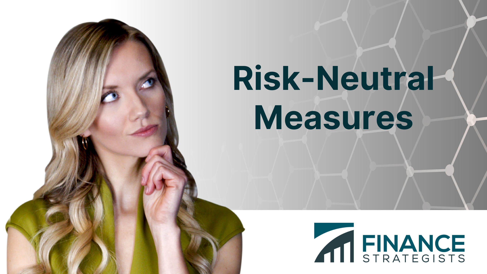

## Table of Contents

## What is a risk-neutral measure?

A risk-neutral measure is a way to look at future events in finance as if everyone involved doesn't care about risk. Normally, people want to be paid more for taking on riskier investments. But with a risk-neutral measure, we pretend that people are okay with risk and only care about the expected return. This helps us price things like options and other financial products more easily because we can use the expected value of future cash flows without worrying about risk adjustments.

In practice, using a risk-neutral measure means we adjust the probabilities of future events so that the expected return on all investments is the same as the risk-free rate. For example, if you're trying to figure out the price of a stock option, you would calculate the expected payoff of the option using these adjusted probabilities. This method simplifies complex calculations because it removes the need to estimate how much extra return investors want for taking on risk.

## How does a risk-neutral measure differ from the real-world probability measure?

A risk-neutral measure and a real-world probability measure are two different ways to look at the chances of things happening in the future. The real-world probability measure uses the actual chances of events happening based on what we know about the world. For example, if there's a 60% chance it will rain tomorrow, that's the real-world probability. This measure takes into account all the risks and uncertainties that people face in real life.

On the other hand, a risk-neutral measure changes these probabilities so that all investments look like they have the same expected return as a completely safe investment, like a government bond. This means we pretend that people don't care about risk at all and only care about the average return they might get. By using a risk-neutral measure, we can simplify the math used to price financial products like options, because we don't need to guess how much extra return people want for taking risks.

## Why is the concept of risk-neutral measure important in financial mathematics?

The concept of risk-neutral measure is important in financial mathematics because it makes pricing financial products like options much easier. In the real world, people want to be paid more for taking risks. But with a risk-neutral measure, we pretend that everyone is okay with risk and only cares about the average return they might get. This allows us to use simpler math to figure out the value of financial products. We don't have to guess how much extra return people want for taking risks, which can be hard to do accurately.

By using a risk-neutral measure, we can change the probabilities of future events so that all investments seem to have the same expected return as a safe investment, like a government bond. This helps us calculate the expected value of future cash flows without worrying about adjusting for risk. This method is especially useful in the world of derivatives, where complex financial products are priced based on the expected future value of the underlying assets. In short, the risk-neutral measure simplifies the complex calculations needed in financial mathematics, making it a powerful tool for pricing and risk management.

## How is a risk-neutral measure used in pricing derivatives?

When pricing derivatives like options, a risk-neutral measure helps us figure out what they're worth by pretending that everyone doesn't care about risk. Normally, people want more money if an investment is riskier. But with a risk-neutral measure, we change the chances of things happening so that every investment looks like it has the same expected return as a safe investment, like a government bond. This makes it easier to calculate the expected value of the derivative because we don't have to guess how much extra return people want for taking risks.

For example, if you're trying to price a stock option, you would use the risk-neutral measure to calculate the expected payoff of the option. You adjust the probabilities so that the expected return on the stock matches the risk-free rate. Then, you can use these adjusted probabilities to find the average payoff of the option over different possible future scenarios. This method simplifies the math and makes it easier to come up with a fair price for the option that everyone can agree on.

## What is the relationship between risk-neutral valuation and the absence of arbitrage?

Risk-neutral valuation and the absence of arbitrage are closely linked in financial mathematics. Arbitrage means making money without any risk, which shouldn't be possible in a fair market. When we use risk-neutral valuation, we pretend that everyone is okay with risk and only cares about the average return they might get. This helps us price things like options in a way that makes sure there's no arbitrage. If we can price everything correctly using risk-neutral valuation, it means there's no way to make risk-free profits because all investments are valued fairly.

The absence of arbitrage is important because it keeps markets fair and efficient. If there were ways to make risk-free profits, people would rush to do it, and prices would change until those opportunities disappeared. Risk-neutral valuation helps us find prices that make sure this doesn't happen. By using risk-neutral probabilities, we can calculate the expected value of future cash flows without worrying about risk adjustments. This way, we can be sure that the prices we come up with for derivatives and other financial products are fair and don't allow for arbitrage.

## Can you explain the process of changing from the real-world measure to a risk-neutral measure?

Changing from the real-world measure to a risk-neutral measure involves adjusting the probabilities of future events so that all investments look like they have the same expected return as a safe investment, like a government bond. In the real world, people want more money for riskier investments. But with a risk-neutral measure, we pretend that everyone is okay with risk and only cares about the average return. To do this, we use a special math tool called the "Girsanov theorem." This theorem helps us change the probabilities so that the expected return on all investments matches the risk-free rate.

The process starts by looking at how risky different investments are in the real world. Then, we figure out what we need to change to make these investments seem less risky. We do this by tweaking the probabilities of future events. For example, if a stock has a 50% chance of going up and a 50% chance of going down in the real world, we might change these chances in the risk-neutral world so that the expected return on the stock matches the risk-free rate. This way, we can calculate the expected value of financial products like options using these new probabilities, making the math easier and ensuring that the prices we come up with are fair and don't allow for arbitrage.

## What are some common techniques used to find a risk-neutral measure?

One common way to find a risk-neutral measure is by using the Girsanov theorem. This is a math tool that helps us change the chances of things happening so that all investments look like they have the same expected return as a safe investment, like a government bond. Imagine you have a stock that might go up or down. In the real world, people want more money if the stock is riskier. But with the Girsanov theorem, we can adjust the chances of the stock going up or down so that it seems less risky. This way, we can pretend that everyone is okay with risk and only cares about the average return.

Another technique is called the martingale approach. This method uses the idea that if we price things right, there should be no way to make risk-free profits. In the real world, people want to be paid more for taking risks. But with the martingale approach, we change the chances of future events so that the expected return on all investments matches the risk-free rate. This helps us calculate the expected value of financial products like options without worrying about risk adjustments. By using these adjusted chances, we can make sure that the prices we come up with are fair and don't allow for arbitrage.

## How do risk-neutral probabilities affect option pricing models like the Black-Scholes model?

Risk-neutral probabilities are really important in option pricing models like the Black-Scholes model. They help us figure out what an option is worth by pretending that everyone doesn't care about risk. In the real world, people want more money if an investment is riskier. But with risk-neutral probabilities, we change the chances of things happening so that all investments seem to have the same expected return as a safe investment, like a government bond. This makes the math easier because we don't have to guess how much extra return people want for taking risks.

In the Black-Scholes model, we use these risk-neutral probabilities to calculate the expected payoff of an option. We adjust the probabilities so that the expected return on the stock matches the risk-free rate. Then, we can use these adjusted probabilities to find the average payoff of the option over different possible future scenarios. This way, we can come up with a fair price for the option that everyone can agree on. The Black-Scholes model uses this method to make sure that the prices it comes up with are fair and don't allow for arbitrage, which means making money without any risk.

## What challenges might arise when applying risk-neutral measures in practice?

When using risk-neutral measures in real life, one big challenge is figuring out what the right risk-free rate should be. This rate is super important because it helps us change the chances of things happening so that all investments seem to have the same expected return. But the risk-free rate can change over time and can be different depending on where you are in the world. If we pick the wrong rate, our calculations might be off, and the prices we come up with for options and other financial products might not be fair.

Another challenge is that risk-neutral measures assume that people don't care about risk, which isn't true in the real world. In reality, people want more money for taking bigger risks. This means that the risk-neutral probabilities we use might not match up well with what people actually do. If the real-world behavior of investors is very different from what we assume in our models, the prices we calculate could be way off, and we might miss out on important information about how risky an investment really is.

## How do risk-neutral measures handle market incompleteness?

When markets are incomplete, it means there are some risks that can't be fully taken away by trading. In a perfect world, we could use risk-neutral measures to change the chances of things happening so that all investments seem to have the same expected return as a safe investment. But in real life, with incomplete markets, there might be more than one way to change these chances, which makes it harder to figure out the right risk-neutral measure. This can lead to different prices for the same financial product, depending on which risk-neutral measure we choose.

To deal with this, we might use a few different risk-neutral measures and see how the prices change. This helps us understand how sensitive the prices are to the choices we make. Even though it's not perfect, using risk-neutral measures in incomplete markets still helps us come up with prices that are close enough to be useful. It's all about finding a balance between the ideal world of our models and the messy reality of the markets.

## Can you discuss the implications of risk-neutral measures on portfolio management?

Using risk-neutral measures can help portfolio managers figure out the value of tricky investments like options. Normally, people want more money for riskier investments. But with risk-neutral measures, we pretend everyone is okay with risk and only cares about the average return. This makes it easier to calculate the expected value of different investments without worrying about how much extra return people want for taking risks. Portfolio managers can use these measures to come up with fair prices for options and other financial products, which helps them decide how to mix their investments to get the best returns.

However, there are some challenges when using risk-neutral measures in real life. For example, picking the right risk-free rate is tough because it can change and be different in different places. If the rate is wrong, the prices we calculate might not be accurate. Also, risk-neutral measures assume people don't care about risk, which isn't true. In reality, people do want more money for riskier investments. This means the prices we come up with might not match up well with what people actually do in the market. So, while risk-neutral measures can be helpful, portfolio managers need to be careful and think about these issues when managing their investments.

## What are the advanced mathematical theories supporting risk-neutral measures, such as Girsanov's theorem?

Girsanov's theorem is a big deal in the world of risk-neutral measures. It's a math tool that helps us change the chances of things happening so that all investments look like they have the same expected return as a safe investment, like a government bond. Imagine you have a stock that might go up or down. In the real world, people want more money if the stock is riskier. But with Girsanov's theorem, we can adjust the chances of the stock going up or down so that it seems less risky. This way, we can pretend that everyone is okay with risk and only cares about the average return. This makes it easier to calculate the expected value of financial products like options without worrying about how much extra return people want for taking risks.

Another important theory is the martingale approach. This method uses the idea that if we price things right, there should be no way to make risk-free profits. In the real world, people want to be paid more for taking risks. But with the martingale approach, we change the chances of future events so that the expected return on all investments matches the risk-free rate. This helps us calculate the expected value of financial products like options without worrying about risk adjustments. By using these adjusted chances, we can make sure that the prices we come up with are fair and don't allow for arbitrage. Both Girsanov's theorem and the martingale approach help us find risk-neutral measures that make pricing and risk management in finance easier and more accurate.

## What are Risk-Neutral Measures and How Do We Understand Them?

Risk-neutral measures are critical in financial mathematics, particularly for derivative pricing. These measures facilitate the valuation of assets by transforming probability assessments in such a way that the pricing process becomes independent of individual investor risk preferences. Essentially, risk-neutral measures allow the expected return on a risky asset to be equated with the risk-free rate. This concept simplifies valuation processes and is instrumental in ensuring that derivative pricing aligns with theoretical models and market conditions.

In more technical terms, a risk-neutral measure, often denoted as Q, is a probability measure under which the discounted price process of an asset becomes a martingale. Mathematically, if $S_t$ represents the asset price at time t, and $r$ is the constant risk-free interest rate, a risk-neutral measure ensures that future asset prices are discounted at the risk-free rate. This is expressed by the equality:

$$
E^Q \left[ \frac{S_T}{B_T} \mid \mathcal{F}_t \right] = \frac{S_t}{B_t}
$$

where $E^Q$ is the expectation under the risk-neutral measure Q, $\mathcal{F}_t$ is the filtration representing the information available up until time t, $S_T$ and $S_t$ are the asset prices at future time T and present time t, respectively, and $B_t$ and $B_T$ are the bond prices at times t and T.

The implication of using a risk-neutral measure is profound as it frames asset prices in an [arbitrage](/wiki/arbitrage)-free world. Within this framework, every asset's expected price is effectively discounted at the risk-free rate, negating the necessity to include a risk premium for potential variability in returns. This outcome is achieved without investor-specific utility functions influencing the valuation, making it possible to employ a standardized approach across different financial models.

It's important to note that within this framework, the probability distribution of asset prices in a risk-neutral world does not correspond to the "real-world" distribution, often denoted P. Nevertheless, the transformation to a risk-neutral measure is a fundamental step in derivative pricing models, as it allows these models to operate under the assumption of no-arbitrage and consistent pricing.

## What are the applications in asset pricing?

Risk-neutral measures are integral in financial mathematics for pricing derivatives, such as options and futures contracts. These measures facilitate the evaluation of an asset's expected payoff using risk-free rates, allowing for a standardized and simpler approach to asset valuation. This is particularly significant in the context of European-style options, where the payoff depends solely on the price of the underlying asset at expiration.

Key financial models, notably the Black-Scholes-Merton model, rely on risk-neutral frameworks to determine fair prices for options. The Black-Scholes formula, a pivotal element of this model, calculates the price of European call and put options based on factors such as the current underlying asset price, the option's strike price, time to expiration, risk-free [interest rate](/wiki/interest-rate-trading-strategies), and the asset's [volatility](/wiki/volatility-trading-strategies). The equation for a European call option (C) is given by:

$$
C = S_0 N(d_1) - X e^{-rT} N(d_2)
$$

where:
- $S_0$ is the current price of the underlying asset,
- $X$ is the strike price of the option,
- $r$ is the risk-free interest rate,
- $T$ is the time to expiration,
- $N(\cdot)$ is the cumulative distribution function of the standard normal distribution,
- $d_1$ and $d_2$ are calculated as:

$$
d_1 = \frac{\ln(S_0 / X) + (r + \sigma^2 / 2)T}{\sigma \sqrt{T}}
$$

$$
d_2 = d_1 - \sigma \sqrt{T}
$$

where $\sigma$ represents the volatility of the underlying asset.

Utilizing risk-neutral measures, the expected return on the underlying asset is adjusted to match the risk-free rate. This assumption simplifies the pricing process, eliminating the need to [factor](/wiki/factor-investing) in individual risk preferences. Derivative pricing models can thus leverage these measures to obtain valuations that reflect a theoretical equilibrium, where no arbitrage opportunities persist.

Risk-neutral measures are employed not only in options but also in a wide range of derivative instruments. They facilitate the construction of pricing models for futures contracts, interest rate swaps, and credit derivatives, maintaining consistency and efficiency in financial markets. By assuming a risk-neutral world, these measures ensure that derivative pricing reflects a universal standard, regardless of market volatility and individual investor sentiments.

## References & Further Reading

Björk, T. (2009). *Arbitrage Theory in Continuous Time*. Oxford University Press. This book provides a comprehensive examination of continuous-time finance, focusing on the stochastic integration techniques used in the development of arbitrage theory.

Hull, J.C. (2018). *Options, Futures, and Other Derivatives*. Pearson. This widely-respected textbook offers detailed insights into derivative products and their pricing strategies using risk-neutral valuation, essential reading for both students and practitioners in the financial domain.

Shreve, S.E. (2004). *Stochastic Calculus for Finance I: The Binomial Asset Pricing Model*. Springer. A key resource for understanding the binomial model, this book lays the groundwork for more advanced topics in stochastic processes and risk-neutral pricing methods.

Duffie, D. (2001). *Dynamic Asset Pricing Theory*. Princeton University Press. Duffie's book delves into the theoretical aspects of asset pricing, including the use of risk-neutral measures within the broader framework of dynamic financial models.

Black, F., & Scholes, M. (1973). "The Pricing of Options and Corporate Liabilities." *Journal of Political Economy*. This seminal paper introduces the Black-Scholes model, a cornerstone of modern financial theory, employing risk-neutral measures to derive option pricing formulas pivotal in financial engineering.

