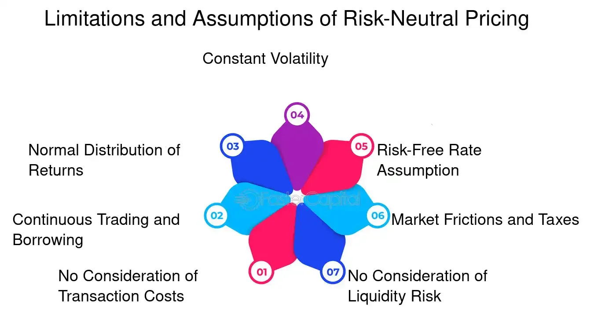

## Table of Contents

## What is risk-neutral pricing?

Risk-neutral pricing is a way to figure out the price of financial things like stocks or options. It pretends that everyone is okay with taking risks, so we don't have to worry about how much people like or dislike risk when we calculate prices. Instead, we use the expected future value of the financial thing and adjust it with the risk-free interest rate, which is the rate you get from super safe investments like government bonds.

This method is really useful because it makes pricing simpler. By using risk-neutral pricing, we can use math models to predict what the price of a stock or option might be in the future. These models help traders and investors make better decisions by giving them a clear idea of what to expect, without getting confused by everyone's different feelings about risk.

## How does risk-neutral pricing differ from real-world pricing?

Risk-neutral pricing and real-world pricing are two different ways to figure out how much financial things like stocks or options should cost. Risk-neutral pricing pretends that everyone is okay with taking risks. It uses the expected future value of the financial thing and adjusts it with the risk-free interest rate, which is what you get from super safe investments. This method doesn't care about how people feel about risk; it just focuses on the numbers. On the other hand, real-world pricing takes into account how much people like or dislike risk. This means it considers things like how scared or brave investors feel, which can change the price a lot.

The main difference between the two is that risk-neutral pricing simplifies things by ignoring people's feelings about risk. This makes it easier to use math models to predict prices. These models are really helpful for traders and investors because they give a clear idea of what might happen in the future. Real-world pricing, however, is more complicated because it has to guess how people will feel about risk, which can be hard to predict. This method might give a more accurate picture of what's really going on in the market, but it's trickier to use because people's feelings can change a lot.

## What is the fundamental theorem of asset pricing?

The fundamental theorem of asset pricing is a big idea in finance that helps us understand how to price things like stocks or options. It says that if we can find a special way to look at the world where everyone is okay with taking risks, then we can use that to figure out the prices of financial things. This special way of looking at the world is called a "risk-neutral measure." By using this measure, we can make our pricing calculations simpler because we don't have to worry about how much people like or dislike risk.

This theorem also tells us something important about markets: if we can find this risk-neutral measure, then the market is working well, and there's no easy way to make money without taking any risk. This is called "absence of arbitrage." In other words, if you can find a risk-neutral measure, it means the prices in the market are set in a way that makes it hard to find deals where you can make money for free. This helps keep the market fair and efficient.

## How is the risk-neutral measure used in option pricing?

The risk-neutral measure is a key part of figuring out how much an option should cost. An option is like a bet on what a stock or other financial thing will do in the future. When we use the risk-neutral measure, we pretend that everyone is okay with taking risks. This makes it easier to calculate the option's price because we don't have to worry about how much people like or dislike risk. Instead, we use the expected future value of the stock and adjust it with the risk-free interest rate, which is the rate you get from super safe investments like government bonds.

To price an option using the risk-neutral measure, we use a math model like the Black-Scholes model. This model takes the current price of the stock, the option's expiration date, the stock's expected ups and downs (volatility), and the risk-free interest rate. By plugging these numbers into the model, we can figure out what the option should cost today. This method helps traders and investors make better decisions because it gives them a clear idea of what to expect, without getting confused by everyone's different feelings about risk.

## What are the key assumptions behind the Black-Scholes model?

The Black-Scholes model is a way to figure out how much an option should cost. It's based on some important ideas that make the math work. One big idea is that the price of the stock moves in a random way but follows a normal pattern, kind of like rolling a dice. This is called a log-normal distribution. Another idea is that you can buy or sell the stock whenever you want, without any delays or extra costs. This is called continuous trading. The model also assumes that you can borrow or lend money at a rate that stays the same over time, and this rate is the risk-free interest rate, which is what you get from super safe investments like government bonds.

Another key assumption is that the stock's ups and downs, or volatility, stay the same over time. This means the stock's price might go up or down a lot, but the amount it moves stays steady. The model also assumes that there are no big events that can suddenly change the stock's price a lot, like a company going bankrupt or a new law coming out. This is called no jumps. Finally, the model assumes that you can't make money for free without taking any risk, which is called no arbitrage. These assumptions help make the math simpler, but they don't always match the real world perfectly.

## How do you derive the Black-Scholes formula using risk-neutral pricing?

To derive the Black-Scholes formula using risk-neutral pricing, we start by pretending that everyone is okay with taking risks. This means we use a special way of looking at the world called the risk-neutral measure. In this world, we use the expected future value of the stock and adjust it with the risk-free interest rate, which is what you get from super safe investments like government bonds. We then use a math model to figure out what the option should cost today. The Black-Scholes model uses things like the current price of the stock, the option's expiration date, the stock's expected ups and downs (volatility), and the risk-free interest rate. By plugging these numbers into the model, we can calculate the option's price.

The Black-Scholes formula itself comes from solving a math problem called a partial differential equation. This equation looks at how the option's price changes over time and with the stock's price. By using the risk-neutral measure, we can simplify this equation and solve it to get the Black-Scholes formula. The formula gives us a way to figure out the option's price based on the stock's current price, the option's strike price, the time until the option expires, the risk-free interest rate, and the stock's volatility. This method helps traders and investors make better decisions because it gives them a clear idea of what to expect, without getting confused by everyone's different feelings about risk.

## What is the role of the martingale property in risk-neutral pricing?

The martingale property is a big idea in risk-neutral pricing. It says that if you use the risk-neutral measure, the expected future value of a stock or other financial thing, when you adjust it for the risk-free interest rate, should be the same as its current value. This means that in the risk-neutral world, you can't predict if the stock will go up or down just by looking at past prices. It's like flipping a coin; you can't tell if it will be heads or tails next time just because it was heads last time.

This property is really important because it helps us use math models to figure out the price of options and other financial things. By using the martingale property, we can make our calculations simpler and more accurate. It helps us see that in the risk-neutral world, the only thing that matters for pricing is the expected future value of the stock, not how much people like or dislike risk. This makes it easier for traders and investors to make good decisions because they can focus on the numbers instead of guessing how people feel about risk.

## How can risk-neutral pricing be applied to more complex derivatives?

Risk-neutral pricing can be used for more complex derivatives, like exotic options, by using the same basic idea but with fancier math models. These derivatives might have rules that make them different from regular options, like having multiple expiration dates or depending on more than one stock. To price them, we still pretend that everyone is okay with taking risks, so we use the risk-neutral measure. This means we look at the expected future value of the derivative and adjust it with the risk-free interest rate. But because these derivatives are more complicated, we need to use more advanced math tools, like Monte Carlo simulations or finite difference methods, to figure out their prices.

These advanced methods help us handle the extra rules and conditions that come with complex derivatives. For example, a Monte Carlo simulation can be used to guess many different ways the stock might move in the future and then figure out what the derivative's value would be in each case. By averaging these values, we can get a good idea of what the derivative should cost today. Even though the math is harder, the basic idea stays the same: by using the risk-neutral measure, we can make our pricing calculations simpler and more accurate, without worrying about how much people like or dislike risk.

## What are the limitations of risk-neutral pricing in practice?

Risk-neutral pricing is a great tool for figuring out how much financial things should cost, but it has some limits in the real world. One big limit is that it pretends everyone is okay with taking risks, which isn't true. In real life, people's feelings about risk can change a lot and affect prices. If people suddenly get scared or brave, the prices can go up or down a lot more than the model predicts. Also, risk-neutral pricing uses a risk-free interest rate, but this rate can change over time, which makes it hard to use the same number for the whole time until the option expires.

Another limit is that risk-neutral pricing depends on math models like the Black-Scholes model, which have their own assumptions that don't always match the real world. For example, these models assume that the stock's ups and downs stay the same over time, but in real life, they can change a lot. They also don't account for big events that can suddenly change the stock's price a lot, like a company going bankrupt or a new law coming out. These models are great for simple options, but they can struggle with more complex derivatives that have extra rules or depend on more than one stock. So, while risk-neutral pricing is a helpful tool, it's important to remember its limits and use it carefully.

## How do market imperfections affect risk-neutral pricing?

Market imperfections can mess up risk-neutral pricing because they make the real world different from what the models assume. Risk-neutral pricing pretends everyone is okay with taking risks, but in real life, people can get scared or brave, which changes how much they're willing to pay for things. Also, there can be extra costs or delays when buying or selling stocks, which the models don't account for. These imperfections mean the prices we calculate using risk-neutral pricing might not match what we see in the market.

Another way market imperfections affect risk-neutral pricing is through things like taxes, transaction costs, and limits on how much you can borrow or lend. These factors can make it hard to use the risk-free interest rate that the models need. Also, if the market isn't working well, like if some people have secret information or if it's hard to buy or sell certain stocks, then the idea of no easy ways to make money without risk (no arbitrage) might not be true. All these imperfections mean that while risk-neutral pricing is a good tool, it's important to think about these real-world problems when using it.

## What advanced techniques can be used to estimate risk-neutral densities?

To estimate risk-neutral densities, which tell us how likely different future prices are in a risk-neutral world, we can use a method called implied volatility. This method looks at the prices of options to figure out how much the stock might go up or down in the future. By using a math model like the Black-Scholes model, we can turn these option prices into a guess about the stock's future movements. This guess is called the implied volatility. Once we have the implied volatility, we can use it to draw a picture of what the stock's future prices might look like. This picture is the risk-neutral density.

Another way to estimate risk-neutral densities is by using a method called kernel density estimation. This method takes a bunch of data points, like the prices of options at different times, and uses them to create a smooth curve that shows how likely different future prices are. It's like connecting the dots to make a line that shows the overall shape of the data. By using kernel density estimation, we can get a detailed view of the risk-neutral density without relying too much on any one math model. This can be really helpful because it gives us a more flexible way to understand how the market might move in the future.

## How does risk-neutral pricing integrate with stochastic volatility models?

Risk-neutral pricing can be used with stochastic volatility models to figure out the price of options when the stock's ups and downs change over time. Stochastic volatility models say that the amount a stock moves around isn't always the same; it can go up or down. This makes them more realistic than models like Black-Scholes, which assume the stock's volatility stays constant. When we use risk-neutral pricing with these models, we still pretend everyone is okay with taking risks. We use the expected future value of the stock and adjust it with the risk-free interest rate, but now we also take into account how the stock's volatility might change.

To do this, we use math tools like Monte Carlo simulations or finite difference methods. These tools help us guess many different ways the stock and its volatility might move in the future and then figure out what the option's value would be in each case. By averaging these values, we can get a good idea of what the option should cost today. Even though the math is harder, the basic idea stays the same: by using the risk-neutral measure, we can make our pricing calculations simpler and more accurate, without worrying about how much people like or dislike risk.

## What are the applications in asset pricing?

Risk-neutral measures serve as essential tools in the pricing of derivatives, such as options and futures, fundamentally transforming the approach to asset valuation. These measures rest upon the foundational premise that, under a risk-neutral scenario, expected returns on risky financial assets align with the risk-free [interest rate](/wiki/interest-rate-trading-strategies). This pivotal assumption effectively translates to the standardized lens through which derivatives are priced, safeguarding consistency and accuracy across diverse financial products.

In the domain of options pricing, the Black-Scholes-Merton model is a classic illustration of the application of risk-neutral measures. The model, grounded in the principles of arbitrage-free markets, employs the assumption that options should be valued such that expected returns correspond to risk-free rates. Mathematically, the expected payoff of an option under a risk-neutral measure, $\mathbb{E}^{\mathbb{Q}}[X]$, is discounted at the risk-free rate, $r$, giving the present value:

$$
V_0 = e^{-rT} \cdot \mathbb{E}^{\mathbb{Q}}[X]
$$

where $V_0$ is the present value of the option, $T$ is the time to expiration, and $X$ represents the option's payoff.

Regarding futures pricing, the cost-of-[carry](/wiki/carry-trading) model is another significant application benefiting from risk-neutral measures. Futures are priced by considering not only the spot price of the asset but also the cost associated with holding or carrying the asset until the futures contract matures. Under risk-neutral valuation, the futures price $F_0$ can be expressed as:

$$
F_0 = S_0 \cdot e^{(r + u - q)T}
$$

where $S_0$ is the current spot price, $u$ represents the storage cost, $q$ is the income from holding the asset (e.g., dividends), and $r$ is the risk-free rate. This representation ensures that futures prices internalize market expectations and maintenance costs while remaining arbitrage-free.

The broader implication of employing risk-neutral measures in asset pricing is the simplification of complex financial markets. By standardizing the evaluation process through expected payouts discounted at risk-free rates, market participants gain a homogeneous framework for comparing derivative prices and assessing market opportunities. This standardization is paramount in algorithmic trading, where rapid, precise decision-making is crucial. Algorithmic traders leverage these risk-neutral frameworks to design algorithms that ensure consistent execution aligned with theoretical pricing models.

As a result, the consistent application of risk-neutral measures not only refines the pricing mechanisms of individual securities but also fortifies the infrastructure that supports high-frequency and algorithmic trading. The integration of these measures enhances the precision and reliability of trading decisions, fostering an ecosystem where asset prices reflect their theoretical valuations, free from the distortions of subjective risk preferences.

## References & Further Reading

[1]: Hull, J. C. (2018). ["Options, Futures, and Other Derivatives."](https://www.pearson.com/nl/en_NL/higher-education/subject-catalogue/finance/Options-Futures-and-Other-Derivatives-Hull.html) Pearson.

[2]: Björk, T. (2009). ["Arbitrage Theory in Continuous Time."](https://www.academia.edu/38191641/Tomas_Bjork_Arbitrage_Theory_in_Continuous_Time_Oxford_Finance_2009_) Oxford University Press.

[3]: Shreve, S. E. (2004). ["Stochastic Calculus for Finance I: The Binomial Asset Pricing Model"](https://link.springer.com/book/10.1007/978-0-387-22527-2) and ["Stochastic Calculus for Finance II: Continuous-Time Models"](https://link.springer.com/book/10.1007/978-0-387-22527-2). Springer.

[4]: Glasserman, P. (2003). ["Monte Carlo Methods in Financial Engineering."](https://link.springer.com/book/10.1007/978-0-387-21617-1) Springer.

[5]: Wilmott, P. (2007). ["Paul Wilmott Introduces Quantitative Finance."](https://www.amazon.com/Paul-Wilmott-Introduces-Quantitative-Finance/dp/0470319585) Wiley.

[6]: Merton, R.C. (1973). ["Theory of Rational Option Pricing."](https://dspace.mit.edu/bitstream/handle/1721.1/49331/theoryofrational00mert.pdf?sequence=1) Journal of Economics and Management Science.

[7]: Black, F., & Scholes, M. (1973). ["The Pricing of Options and Corporate Liabilities."](https://www.cs.princeton.edu/courses/archive/fall09/cos323/papers/black_scholes73.pdf) Journal of Political Economy.

[8]: Chan, E. P. (2009). ["Quantitative Trading: How to Build Your Own Algorithmic Trading Business."](https://github.com/ftvision/quant_trading_echan_book) Wiley.

[9]: Lopez de Prado, M. (2018). ["Advances in Financial Machine Learning."](https://www.amazon.com/Advances-Financial-Machine-Learning-Marcos/dp/1119482089) Wiley.