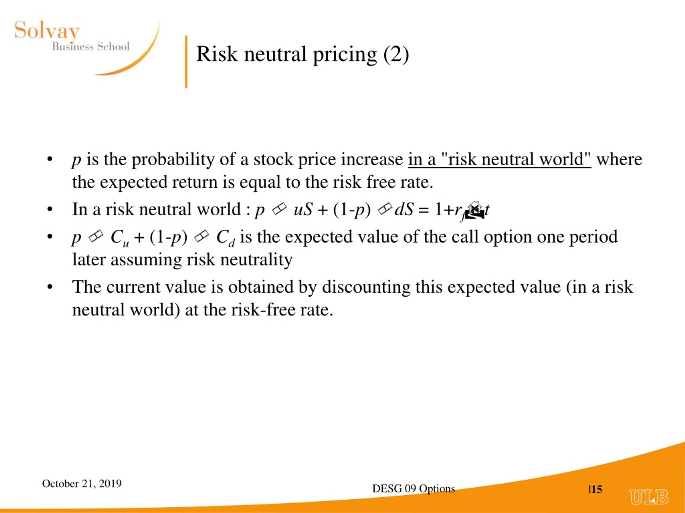

Risk-neutral pricing is a fundamental concept in financial mathematics, particularly pivotal in algorithmic trading. It offers a mechanism for assessing and pricing financial instruments, chiefly derivatives, under the premise that investors are indifferent to risk. This paradigm shift allows for the valuation of assets as if investors demanded no risk premiums, simplifying complex market behaviors into more predictable models.

In algorithmic trading, risk-neutral pricing is vital for the development of sophisticated trading algorithms capable of simulating asset price dynamics. By integrating risk-neutral evaluations, algorithms can improve decision-making processes, predict future price movements more accurately, and ultimately enhance trading performance.



This article addresses how risk-neutral pricing is implemented within algorithmic trading, its practical applications, and its limitations. The discussion will include the mathematical foundations underpinning the concept, its implementation through programming techniques, and its impact on trading strategies. By understanding how risk-neutral measures transform the investor's perspective, one can appreciate their significance in aligning trading strategies with theoretical models, thus negotiating the complexities of financial markets with greater precision and reliability.

## Table of Contents

## Understanding Risk-Neutral Measures

Risk-neutral measures are key tools in financial mathematics, enabling the transformation of real-world probabilities into a risk-neutral framework for asset valuation. In this framework, the expected return on a risky asset equals the risk-free rate, a fundamental concept that simplifies the pricing of financial instruments, especially derivatives. By assuming risk neutrality, investors can evaluate asset returns without considering individual risk preferences, streamlining the comparison of investment opportunities.

Under a risk-neutral measure, assets are priced based on their expected future payouts discounted at the risk-free rate. This hypothetical pricing scenario helps maintain consistency and fairness across asset valuations, ensuring that arbitrage opportunities are minimized. The alignment of asset prices with theoretical models prevents the exploitation of price discrepancies, thus fostering market efficiency.

In algorithmic trading, the use of risk-neutral measures is critical. These measures allow the creation of trading strategies that reflect theoretical models more accurately, resulting in asset prices that adhere to risk-neutral evaluations. For example, in options pricing, the transformation of real-world probability distributions into risk-neutral ones ensures that the calculated option prices are theoretically sound and market-consistent.

Practically, risk-neutral measures are applied in [algorithmic trading](/wiki/algorithmic-trading) platforms using mathematical models and programming techniques. In Python, libraries like NumPy and SciPy facilitate the implementation of risk-neutral valuation methods, enabling traders to simulate future asset prices and derive fair values. By transforming real-world probabilities into risk-neutral ones, algorithms predict asset prices more accurately, enhancing the precision and effectiveness of trading strategies.

The application of risk-neutral measures in asset pricing provides a robust framework that aligns trading strategies with the underlying mathematical models. This alignment ensures that the strategies are theoretically sound and executed in a way that reflects balanced market dynamics.

## Mathematical Foundations of Risk-Neutral Measures

The mathematical foundations of risk-neutral measures are deeply embedded in the principles of martingale theory and measure theory, both of which provide a formal structure for understanding and modeling financial markets. 

Martingale theory is a fundamental concept in probability theory used in finance to describe a sequence of fair game conditions. In this framework, a martingale is a stochastic process where the expected value of the process at a future time, given all prior information, is equal to its current value. In the context of financial modeling, this implies that the future expected price of an asset is equal to its present price, with adjustments for dividends or interest payments. This principle maintains fairness in pricing as it eliminates the possibility of a predictable profit without assuming risk, thereby ensuring that no [arbitrage](/wiki/arbitrage) opportunities can exist under the risk-neutral measure.

Under the risk-neutral measure, financial models assume that the expected returns on all risky assets are equivalent to the risk-free rate. This assumption transforms the probability space in such a way that the present value of an asset's expected payoff becomes a martingale. More formally, if $S_t$ represents the price of an asset at time $t$, and $r$ is the risk-free rate, then under the risk-neutral measure, the discounted price process $e^{-rt}S_t$ is a martingale. This ensures that all assets are priced fairly, with any deviation from the martingale property signaling a potential arbitrage opportunity.

Measure theory provides the rigorous mathematical framework necessary for pricing derivatives and examining asset price dynamics under this risk-neutral perspective. It deals with the assignment of probabilities to different events in a structured way and allows us to construct a probability space where the lifecycle of financial instruments can be simulated accurately. Using measure-theoretic concepts, financial engineers can define a probability measure $Q$ (the risk-neutral measure) which ensures that the expected value of future payoffs, discounted at the risk-free rate, matches the current market price. This setup is essential for deriving analytical solutions to pricing problems, such as the Black-Scholes equation for options pricing.

In essence, the transformation of the actual probability measure $P$ to the risk-neutral measure $Q$ allows asset prices to be analyzed in a manner consistent with theoretical models used in algorithmic trading. This transformation is paramount for deriving future asset prices, as it allows traders and financial modelers to reframe real-world probability distributions into a risk-neutral worldview, enhancing the robustness and reliability of algorithmic trading strategies. The consistent application of martingale and measure theory principles thus facilitates improved predictive accuracy in algorithmic models, aiding significantly in the execution and evaluation of trading decisions.

## Applications in Asset Pricing

Risk-neutral measures serve as essential tools in the pricing of derivatives, such as options and futures, fundamentally transforming the approach to asset valuation. These measures rest upon the foundational premise that, under a risk-neutral scenario, expected returns on risky financial assets align with the risk-free [interest rate](/wiki/interest-rate-trading-strategies). This pivotal assumption effectively translates to the standardized lens through which derivatives are priced, safeguarding consistency and accuracy across diverse financial products.

In the domain of options pricing, the Black-Scholes-Merton model is a classic illustration of the application of risk-neutral measures. The model, grounded in the principles of arbitrage-free markets, employs the assumption that options should be valued such that expected returns correspond to risk-free rates. Mathematically, the expected payoff of an option under a risk-neutral measure, $\mathbb{E}^{\mathbb{Q}}[X]$, is discounted at the risk-free rate, $r$, giving the present value:

$$
V_0 = e^{-rT} \cdot \mathbb{E}^{\mathbb{Q}}[X]
$$

where $V_0$ is the present value of the option, $T$ is the time to expiration, and $X$ represents the option's payoff.

Regarding futures pricing, the cost-of-[carry](/wiki/carry-trading) model is another significant application benefiting from risk-neutral measures. Futures are priced by considering not only the spot price of the asset but also the cost associated with holding or carrying the asset until the futures contract matures. Under risk-neutral valuation, the futures price $F_0$ can be expressed as:

$$
F_0 = S_0 \cdot e^{(r + u - q)T}
$$

where $S_0$ is the current spot price, $u$ represents the storage cost, $q$ is the income from holding the asset (e.g., dividends), and $r$ is the risk-free rate. This representation ensures that futures prices internalize market expectations and maintenance costs while remaining arbitrage-free.

The broader implication of employing risk-neutral measures in asset pricing is the simplification of complex financial markets. By standardizing the evaluation process through expected payouts discounted at risk-free rates, market participants gain a homogeneous framework for comparing derivative prices and assessing market opportunities. This standardization is paramount in algorithmic trading, where rapid, precise decision-making is crucial. Algorithmic traders leverage these risk-neutral frameworks to design algorithms that ensure consistent execution aligned with theoretical pricing models.

As a result, the consistent application of risk-neutral measures not only refines the pricing mechanisms of individual securities but also fortifies the infrastructure that supports high-frequency and algorithmic trading. The integration of these measures enhances the precision and reliability of trading decisions, fostering an ecosystem where asset prices reflect their theoretical valuations, free from the distortions of subjective risk preferences.

## Implications for Algorithmic Trading

Risk-neutral pricing plays a crucial role in algorithmic trading by ensuring that algorithms are calibrated to reflect market expectations, thereby minimizing arbitrage opportunities. By converting real-world probabilities into risk-neutral ones, trading algorithms can enhance their accuracy in predicting asset prices. This transformation allows for a more consistent evaluation of price dynamics, leading to fair pricing and reducing the chances for arbitrage.

The integration of risk-neutral valuation methods into algorithmic trading is greatly facilitated by the use of Python programming, specifically leveraging powerful libraries such as NumPy and SciPy. These libraries provide a comprehensive suite of tools for performing complex mathematical computations, enabling traders to model and implement risk-neutral pricing frameworks efficiently.

For instance, the following Python code snippet demonstrates how NumPy can be utilized to model a simple risk-neutral valuation:

```python
import numpy as np

# Define parameters
risk_free_rate = 0.05
time_to_maturity = 1
expected_return = 0.08
dividend_yield = 0.02
initial_price = 100

# Risk-neutral price calculation
def risk_neutral_price(expected_return, dividend_yield, risk_free_rate, initial_price, time_to_maturity):
    return initial_price * np.exp((risk_free_rate - dividend_yield) * time_to_maturity)

price = risk_neutral_price(expected_return, dividend_yield, risk_free_rate, initial_price, time_to_maturity)
print(f"Risk-neutral price: {price:.2f}")
```

Incorporating such methodologies supports high-frequency trading strategies by providing a robust framework for executing trades. High-frequency trading, characterized by rapid order execution and turnover, benefits significantly from the precision and speed offered by risk-neutral measures. These measures ensure that trading strategies are tightly aligned with theoretical pricing models, improving asset price predictions and optimizing trade execution.

Furthermore, the use of risk-neutral measures enhances the precision with which algo trading strategies predict market movements. The conversion to risk-neutral probabilities allows for more reliable asset valuation and risk assessment, which are crucial for the development of sophisticated trading algorithms. By aligning algorithmic outputs with theoretical models, traders achieve a higher degree of precision and execution speed, thereby gaining a competitive advantage in fast-paced markets.

## Limitations and Criticisms

Risk-neutral measures frequently assume that all investors exhibit a uniform indifference to risk, an assumption that does not always reflect real-world investor behavior. In reality, investors often demand risk premiums to compensate for the uncertainty of returns, challenging the principle of universal risk neutrality. This divergence leads to practical discrepancies when applying risk-neutral pricing in financial modeling.

Furthermore, risk-neutral measures heavily rely on the no-arbitrage conditions and the assumption of complete markets. However, in actual market conditions, these assumptions are frequently violated due to various market inefficiencies. Transaction costs, bid-ask spreads, and other frictions contribute to these inefficiencies, challenging the theoretical underpinnings of risk-neutral measures.

Despite their theoretical robustness, risk-neutral measures can lead to mispricing when they are used without adequately accounting for real-world complexities. Factors such as [liquidity](/wiki/liquidity-risk-premium) constraints, market sentiment, and economic variables can impact market dynamics, which purely risk-neutral models might overlook. Therefore, it's crucial to acknowledge these limitations when employing risk-neutral measures in practical applications.

To enhance accuracy in asset pricing and formulation of trading strategies, it is advantageous to combine risk-neutral measures with other financial models. By integrating elements that capture market nuances, such as behavioral finance models or stochastic [volatility](/wiki/volatility-trading-strategies) models, practitioners can better address the shortcomings of risk-neutral assumptions. This integrated approach helps to align risk assessments and pricing models more closely with observed market behavior, thereby improving the robustness and precision of financial analyses.

Ultimately, while risk-neutral measures serve as a foundational aspect of financial mathematics, understanding their constraints and complementing them with other analytical tools ensures more reliable and realistic financial modeling.

## Conclusion

Risk-neutral pricing serves as a foundational element in financial mathematics and is essential for the pricing of derivatives and the development of robust trading algorithms. This concept allows traders and financial engineers to evaluate the price of financial instruments without the need to account for investor-specific risk preferences, thereby streamlining the process of derivative pricing.

To harness the full potential of risk-neutral pricing in algorithmic trading, it is crucial to understand both its strengths and its limitations. While it simplifies the complexities inherent in market behaviors by assuming uniform risk neutrality, such assumptions must be evaluated with caution. The real-world market often presents imperfections and deviations from theoretical models, such as market inefficiencies and transaction costs, which can challenge the applicability of risk-neutral measures.

As algorithmic trading continues to evolve, maintaining a solid grasp of risk-neutral pricing concepts is vital for traders aiming to secure competitive advantages. Mastery of these principles enables the formulation of trading strategies that are not only theoretically sound but also adaptable to the dynamic conditions of financial markets.

Ultimately, risk-neutral measures play a pivotal role in developing informed, strategy-driven trading systems. These systems aim to align trading decisions closely with financial market dynamics, thereby enhancing their efficacy and reliability. Traders who effectively integrate risk-neutral pricing into their methodologies can better position themselves to capitalize on market opportunities and mitigate potential risks.

## References & Further Reading

[1]: Hull, J. C. (2018). ["Options, Futures, and Other Derivatives."](https://www.pearson.com/nl/en_NL/higher-education/subject-catalogue/finance/Options-Futures-and-Other-Derivatives-Hull.html) Pearson.

[2]: Björk, T. (2009). ["Arbitrage Theory in Continuous Time."](https://www.academia.edu/38191641/Tomas_Bjork_Arbitrage_Theory_in_Continuous_Time_Oxford_Finance_2009_) Oxford University Press.

[3]: Shreve, S. E. (2004). ["Stochastic Calculus for Finance I: The Binomial Asset Pricing Model"](https://link.springer.com/book/10.1007/978-0-387-22527-2) and ["Stochastic Calculus for Finance II: Continuous-Time Models"](https://link.springer.com/book/10.1007/978-0-387-22527-2). Springer.

[4]: Glasserman, P. (2003). ["Monte Carlo Methods in Financial Engineering."](https://link.springer.com/book/10.1007/978-0-387-21617-1) Springer.

[5]: Wilmott, P. (2007). ["Paul Wilmott Introduces Quantitative Finance."](https://www.amazon.com/Paul-Wilmott-Introduces-Quantitative-Finance/dp/0470319585) Wiley.

[6]: Merton, R.C. (1973). ["Theory of Rational Option Pricing."](https://dspace.mit.edu/bitstream/handle/1721.1/49331/theoryofrational00mert.pdf?sequence=1) Journal of Economics and Management Science.

[7]: Black, F., & Scholes, M. (1973). ["The Pricing of Options and Corporate Liabilities."](https://www.cs.princeton.edu/courses/archive/fall09/cos323/papers/black_scholes73.pdf) Journal of Political Economy.

[8]: Chan, E. P. (2009). ["Quantitative Trading: How to Build Your Own Algorithmic Trading Business."](https://github.com/ftvision/quant_trading_echan_book) Wiley.

[9]: Lopez de Prado, M. (2018). ["Advances in Financial Machine Learning."](https://www.amazon.com/Advances-Financial-Machine-Learning-Marcos/dp/1119482089) Wiley.