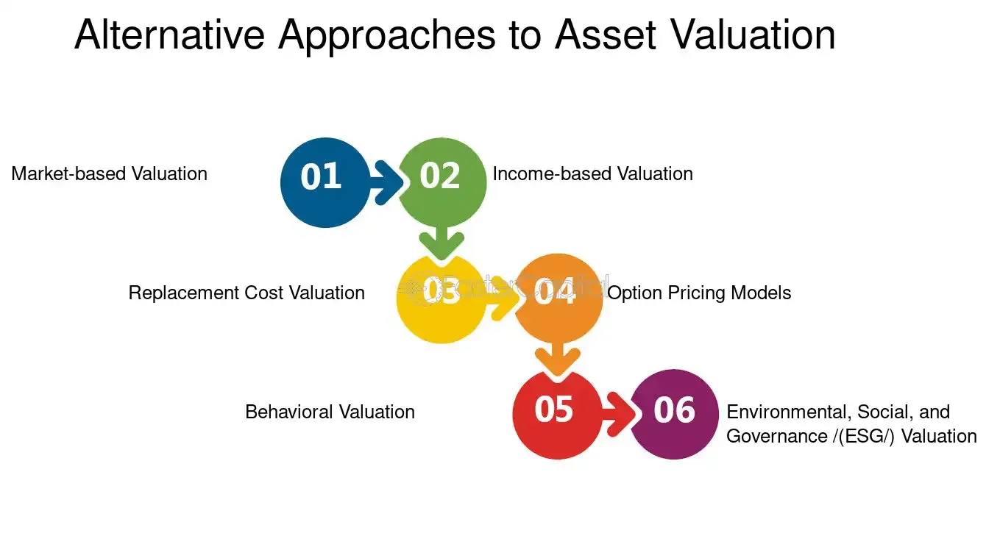

## Table of Contents

## What are risk-neutral probabilities?

Risk-neutral probabilities are a way to think about the chances of something happening, but without worrying about how much risk people are willing to take. Imagine you're betting on a coin flip. Normally, you might think about how much you're willing to risk on the bet. But with risk-neutral probabilities, you just focus on the actual chances of the coin landing on heads or tails, without considering your personal feelings about risk.

These probabilities are really useful in finance, especially when pricing things like options. In a risk-neutral world, everyone acts as if they don't care about risk at all. So, when you're figuring out the price of an option, you use these special probabilities to calculate what the expected payoff would be, as if everyone was okay with any level of risk. This makes it easier to come up with a fair price for financial products.

## How do risk-neutral probabilities differ from real-world probabilities?

Risk-neutral probabilities and real-world probabilities are two different ways of looking at the chances of something happening. Real-world probabilities are what we usually think of when we talk about the likelihood of an event. For example, if you flip a coin, the real-world probability of it landing on heads is 50%. These probabilities reflect what we actually expect to happen based on our understanding of the world.

Risk-neutral probabilities, on the other hand, are used in finance and don't reflect what we think will actually happen. Instead, they are a special kind of probability that helps us price financial products like options. In a risk-neutral world, everyone acts as if they don't care about risk at all. So, when calculating the price of an option, we use these risk-neutral probabilities to figure out the expected payoff, as if no one was worried about taking risks. This makes it easier to come up with a fair price for these financial products.

## Why are risk-neutral probabilities important in asset valuation?

Risk-neutral probabilities are important in asset valuation because they help us figure out the fair price of financial products like options. In the real world, people care about risk and might want more money to take bigger risks. But when we use risk-neutral probabilities, we pretend that no one cares about risk at all. This makes it simpler to calculate the expected payoff of an option, because we just focus on the chances of different outcomes happening, not on how risky those outcomes are.

By using risk-neutral probabilities, we can find a price that everyone would agree is fair, even if they have different feelings about risk. This is really useful in finance because it helps create a common ground for pricing. So, whether you're a buyer or a seller, you can use these probabilities to understand what an option should cost, making it easier to trade and invest.

## How are risk-neutral probabilities used in option pricing?

Risk-neutral probabilities are key in figuring out how much an option should cost. Imagine you want to know the price of a call option, which gives you the right to buy a stock at a certain price. To find this price, you use risk-neutral probabilities to guess the future value of the stock. You look at all the possible prices the stock could be at when the option expires, and then use these special probabilities to work out how much you might get from the option. This way, you don't have to worry about how risky the stock is; you just focus on the chances of it reaching different prices.

Once you have the expected payoff using risk-neutral probabilities, you can then figure out the option's price today. You do this by discounting the expected payoff back to the present using a risk-free interest rate, like the rate on a government bond. This gives you a fair price for the option that everyone can agree on, no matter how they feel about risk. So, risk-neutral probabilities make it easier to price options because they help create a common ground for everyone in the market.

## What is the relationship between risk-neutral probabilities and the no-arbitrage principle?

The no-arbitrage principle says that you shouldn't be able to make money for free without taking any risk. In other words, there shouldn't be any easy ways to make a profit by just buying and selling things without any chance of losing money. Risk-neutral probabilities are a big part of making sure this principle works when we're pricing options and other financial products. When we use these probabilities, we pretend that everyone is okay with any level of risk. This helps us find prices that are fair and don't let anyone make easy, risk-free profits.

So, risk-neutral probabilities help keep the market fair by making sure that option prices are set in a way that follows the no-arbitrage principle. If option prices were based on real-world probabilities, people might find ways to make money without risk because different people would have different ideas about how likely things are to happen. But with risk-neutral probabilities, everyone uses the same set of chances, which means the prices are more likely to be fair and prevent anyone from making easy money. This is why these probabilities are so important in finance.

## Can you explain the concept of a risk-neutral measure?

A risk-neutral measure is a way of thinking about the future that helps us price financial products like options. In the real world, people care about risk and might want more money to take bigger risks. But with a risk-neutral measure, we pretend that no one cares about risk at all. This makes it easier to figure out what an option should cost because we only focus on the chances of different things happening, not on how risky they are.

When we use a risk-neutral measure, we look at all the possible future prices of a stock and use special probabilities to work out the expected payoff of an option. Then, we use a risk-free interest rate, like the rate on a government bond, to figure out what that expected payoff is worth today. This way, everyone can agree on a fair price for the option, no matter how they feel about risk. So, a risk-neutral measure helps create a common ground in the market, making it easier to buy and sell options without worrying about different ideas about risk.

## How do you derive risk-neutral probabilities from market prices?

To derive risk-neutral probabilities from market prices, we start by looking at how options are priced in the market. Options are contracts that give you the right to buy or sell a stock at a certain price. When we see the prices of these options, we can use a math model, like the Black-Scholes model, to figure out the risk-neutral probabilities. This model helps us see what the market thinks the chances are of the stock going up or down, without worrying about how risky it is.

Once we have the option prices, we use the model to solve for the probabilities that make the expected payoff of the option equal to its market price. This means we're finding the chances of the stock hitting different prices in the future that match up with what people are paying for the option today. By doing this, we get the risk-neutral probabilities, which help us understand how the market sees the future without caring about risk.

## What role do risk-neutral probabilities play in the Black-Scholes model?

In the Black-Scholes model, risk-neutral probabilities help us figure out how much an option should cost. The model uses these special probabilities to guess the future price of a stock without worrying about how risky it is. Instead of thinking about how likely the stock is to go up or down in the real world, we pretend everyone is okay with any level of risk. This makes it easier to calculate the expected payoff of the option, because we only focus on the chances of the stock reaching different prices.

Once we have the expected payoff using risk-neutral probabilities, we can find out what the option should be worth today. We do this by using a risk-free interest rate, like the rate on a government bond, to bring the future payoff back to the present. This way, the Black-Scholes model gives us a fair price for the option that everyone can agree on, no matter how they feel about risk. So, risk-neutral probabilities are a big part of why the Black-Scholes model works so well for pricing options.

## How do changes in risk-neutral probabilities affect asset prices?

Changes in risk-neutral probabilities can have a big impact on how much assets like options are worth. Imagine you have an option to buy a stock at a certain price. If the risk-neutral probability of the stock going up goes up, it means there's a higher chance the option will be worth something when it expires. This makes the option more valuable today, so its price goes up. On the other hand, if the risk-neutral probability of the stock going up goes down, the option becomes less likely to be worth something, so its price goes down.

These changes in risk-neutral probabilities are important because they help everyone in the market agree on what an asset should cost. Even though people might have different ideas about how risky a stock is, they can all use the same risk-neutral probabilities to figure out the option's price. This helps keep the market fair and makes it easier for people to buy and sell options without worrying about different views on risk.

## What are the limitations of using risk-neutral probabilities in financial modeling?

Using risk-neutral probabilities in financial modeling has some limits. They don't show what people really think will happen in the future. Risk-neutral probabilities are made up to help price options, so they don't tell us about the real chances of a stock going up or down. This can be a problem if we want to know what's likely to happen in the real world, because these probabilities are just a tool for finding fair prices, not for guessing the future.

Another limit is that risk-neutral probabilities depend a lot on the models we use, like the Black-Scholes model. If the model is wrong or doesn't fit the market well, then the risk-neutral probabilities we get from it might not be right either. This means we have to be careful and make sure our models are good enough before we trust the prices they give us. So, while risk-neutral probabilities are great for pricing options, they have to be used carefully because they come with these limits.

## How do risk-neutral probabilities apply to more complex financial instruments like exotic options?

Risk-neutral probabilities are useful for pricing exotic options too, which are more complicated than regular options. Exotic options can have special rules, like being able to use them at different times or depending on how the stock does over time, not just at the end. Even though these options are trickier, we can still use risk-neutral probabilities to figure out what they should cost. We look at all the different ways the stock price could go and use these special probabilities to see what the option might be worth in the future. Then, we use a risk-free interest rate to bring that future value back to today, just like with regular options.

The main thing to remember is that risk-neutral probabilities help us find a fair price for exotic options by pretending everyone is okay with any level of risk. This makes it easier to deal with the complicated rules of exotic options because we don't have to worry about how risky they are. Instead, we just focus on the chances of different outcomes happening. So, even though exotic options are more complex, risk-neutral probabilities give us a way to price them that everyone can agree on, making it easier to buy and sell these options in the market.

## What advanced techniques are used to estimate risk-neutral probabilities in practice?

To estimate risk-neutral probabilities in practice, people often use advanced techniques like the binomial model and Monte Carlo simulation. The binomial model breaks down the future into many small steps, like a ladder, and uses risk-neutral probabilities to figure out how the price of an option changes at each step. This helps us see how the option's value might change over time and gives us a good idea of what it should cost today. Monte Carlo simulation, on the other hand, uses random numbers to guess many different ways the stock price could go in the future. By running these guesses many times, we can use risk-neutral probabilities to find out what the option might be worth on average, which helps us set a fair price.

Another technique is called the finite difference method, which solves math problems to find risk-neutral probabilities. This method breaks down the problem into small parts and solves them step by step, giving us a detailed picture of how the option's price changes over time. All these techniques help us deal with the real-world challenges of pricing options, like changes in the stock market or different rules for exotic options. By using risk-neutral probabilities, we can make sure the prices we come up with are fair and useful for everyone in the market.

## What are Risk-Neutral Probabilities: A Key Concept?

Risk-neutral probabilities are a fundamental concept in financial markets employed in the valuation and pricing of derivatives and other financial assets. In a risk-neutral world, investors are indifferent to risk, and the expected return of an asset is the risk-free rate. This simplifies the evaluation of financial instruments by focusing solely on their expected returns, discounted at the risk-free rate, rather than requiring adjustments for risk preferences.

Risk-neutral probabilities are crucial in asset valuation and pricing models, particularly within the framework of derivative pricing. They are utilized in models such as the Black-Scholes model, which relies on these probabilities to ascertain fair prices for options. By evaluating future payoffs using risk-neutral measures, investors and institutions can determine the present value of these payoffs without accounting for varying risk appetites. This approach ensures methodological consistency across diverse asset classes and market conditions, contributing to efficient market pricing by eliminating opportunities for [arbitrage](/wiki/arbitrage)—cases where discrepancies could be exploited for assured profits.

Mathematically, the concept of risk-neutral probabilities can be understood through the transformation of real-world probabilities into a risk-neutral measure, often denoted by $Q$. Under this measure, the discounted expected future payoff of a financial asset is equal to its current market price. This relationship is represented in the fundamental pricing equation:

$$
P_0 = \mathbb{E}^Q\left[\frac{P_T}{(1 + r)^T}\right]
$$

where $P_0$ is the current price of the asset, $P_T$ is the price at time $T$, $r$ is the risk-free interest rate, and $\mathbb{E}^Q$ denotes the expectation under the risk-neutral measure.

The mathematical transformation to a risk-neutral measure involves changing the probability measure using the Radon-Nikodym derivative, leading to the Girsanov theorem application in continuous time models. An essential assumption in this context is the complete and frictionless market, meaning assets can be traded without restrictions and transaction costs are negligible. This assumption allows for the replication of the payoff of any derivative by trading in the underlying asset and risk-free bond, a fundamental premise in the derivation of models like Black-Scholes.

In summary, risk-neutral probabilities serve as a vital tool for pricing financial derivatives by simplifying assumptions about investor risk preferences, enabling coherent and consistent asset valuation. This approach, based on rigorous mathematical foundations and assumptions, underpins the sophisticated models that drive today's financial markets, ensuring effective and efficient pricing mechanisms.

## How can assets be valued using risk-neutral probabilities?

Risk-neutral probabilities are a foundational concept in the valuation of assets, particularly within the context of derivative pricing. They provide a method to evaluate expected payoffs of financial instruments by adjusting the probability measure under which these future payoffs are calculated. Essentially, risk-neutral probabilities assume that investors are indifferent to risk, thus allowing future cash flows to be discounted at the risk-free rate, simplifying the pricing process.

One of the most prominent applications of risk-neutral probabilities is observed in the Black-Scholes model, a pivotal framework in the pricing of European options. The Black-Scholes model operates on the principle that the future movements of stock prices can be modeled using a geometric Brownian motion with constant drift and [volatility](/wiki/volatility-trading-strategies). In this model, the expected rate of return for the underlying asset is replaced with the risk-free [interest rate](/wiki/interest-rate-trading-strategies), thanks to the risk-neutral probability measure. The model's celebrated Black-Scholes formula for a call option is given by:

$$
C(t) = S_0 N(d_1) - K e^{-r(T-t)} N(d_2)
$$

where:
- $C(t)$ is the price of the call option at time $t$,
- $S_0$ is the current price of the underlying asset,
- $K$ is the strike price,
- $r$ is the risk-free interest rate,
- $T$ is the time to maturity,
- $N(\cdot)$ is the cumulative distribution function of the standard normal distribution,
- $d_1 = \frac{\ln(S_0/K) + (r + 0.5\sigma^2)(T-t)}{\sigma\sqrt{T-t}}$,
- $d_2 = d_1 - \sigma \sqrt{T-t}$.

The utilization of risk-neutral probabilities in this context ensures that the pricing is free from arbitrage opportunities. Arbitrage, which refers to the possibility of risk-free profit, would disrupt market equilibrium, emphasizing the importance of models that provide arbitrage-free prices.

By leveraging risk-neutral probabilities, the Black-Scholes model offers a theoretical framework consistent with market observations, thus promoting fair and efficient pricing. This approach ensures that prices reflect a balanced view of future uncertainties, adjusted by the baseline risk-free rate, rather than subjective risk preferences or expected returns. In real-world markets, enforcing this principle aids in maintaining consistent pricing methodologies across different instruments and reduces potential asymmetries in information.

Overall, risk-neutral probabilities offer a vital methodological shift that bridges subjective risk assessments with objective pricing mechanisms, ensuring that asset valuation remains aligned with market dynamics and free from exploitative opportunities.

## References & Further Reading

[1]: Björk, T. (2009). ["Arbitrage Theory in Continuous Time"](http://www.nigerianwomeninmaths.org/cs/books/Tomas%20Bjork-Arbitrage%20Theory%20in%20Continuous%20Time%20(Oxford%20Finance)%20(2009)%20(1).pdf) (3rd ed.). Oxford University Press.

[2]: Black, F., & Scholes, M. (1973). ["The Pricing of Options and Corporate Liabilities."](https://www.cs.princeton.edu/courses/archive/fall09/cos323/papers/black_scholes73.pdf) Journal of Political Economy, 81(3), 637-654.

[3]: Hull, J. C. (2017). ["Options, Futures, and Other Derivatives"](https://www.semanticscholar.org/paper/Options%2C-Futures%2C-and-Other-Derivatives-Hull/89bdee500c8623864fc9eb7a471546aa713acc44) (9th ed.). Pearson.

[4]: Shreve, S. E. (2004). ["Stochastic Calculus for Finance I: The Binomial Asset Pricing Model."](https://www.amazon.com/Stochastic-Calculus-Finance-Binomial-Springer/dp/0387249680) Springer Finance.

[5]: Shreve, S. E. (2004). ["Stochastic Calculus for Finance II: Continuous-Time Models."](https://link.springer.com/book/9780387401010) Springer Finance.

[6]: Wilmott, P. (2007). ["Paul Wilmott Introduces Quantitative Finance"](https://www.amazon.com/Paul-Wilmott-Introduces-Quantitative-Finance/dp/0470319585) (2nd ed.). Wiley.

[7]: Jarrow, R. A., & Turnbull, S. M. (1996). ["Derivative Securities"](https://archive.org/details/derivativesecuri0000jarr) (2nd ed.). South-Western College Pub.

[8]: Derman, E., & Kani, I. (1994). ["Riding on a Smile."](https://www.researchgate.net/publication/239059413_Riding_on_a_Smile) Risk, January.