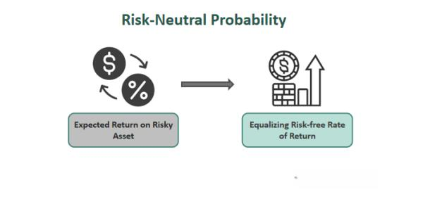

Financial modeling is a crucial discipline in modern finance, involving the construction of mathematical models to represent and analyze the financial performance of various assets, investments, or business projects. It is widely used to assist in decision making by simulating the impact of different variables on an organization's financial health. Financial modeling encompasses various tools and techniques, including spreadsheet analysis, statistical methods, and software applications that help forecast financial outcomes and evaluate investment options.

Risk-neutral probabilities are an essential concept in financial mathematics, employed primarily in the valuation of derivative securities. Under the risk-neutral measure, expected future payoffs are discounted at the risk-free rate, simplifying the mathematical treatment of risky assets. This is particularly useful in pricing models like the Black-Scholes model, which relies on these probabilities to determine the fair value of options and other derivatives. The assumption here is that investors are indifferent to risk, focusing solely on expected returns, which allows for a consistent pricing framework.



Asset valuation is a process of determining the fair value of assets, which is critical for investment decisions, mergers and acquisitions, and financial reporting. It involves understanding and applying various valuation models, such as discounted cash flow analysis and comparatives. The integration of risk-neutral probabilities into asset valuation ensures that the pricing is consistent with the market's expectations and risk profiles, helping prevent arbitrage opportunities.

Algorithmic trading, or algo trading, is the use of computer programs to conduct trading activities at speeds and frequencies impossible for humans. These algorithms leverage mathematical models and statistical analyses to make trading decisions, execute orders, and manage portfolios. Risk-neutral probabilities are often embedded in these algorithms to assess market conditions and execute trades that align with the calculated risk-return profile.

The interconnectedness of financial modeling, risk-neutral probabilities, asset valuation, and algorithmic trading is pivotal for enhancing market efficiency and transparency. These concepts collectively enable financial analysts and traders to assess risk, optimize investment strategies, and ensure fair pricing across markets. This article explores the significance of these themes, examining their roles, challenges, and potential future developments within the landscape of modern finance.

## Table of Contents

## Understanding Financial Modeling

Financial modeling is a crucial analytical process that involves constructing a mathematical representation of a real-world financial situation. This process is instrumental in assisting businesses, investors, and financial analysts in making informed decisions by anticipating future financial performance based on historical data, market trends, and economic variables. Financial models are extensively employed in assessing investment opportunities, executing corporate financial planning, evaluating strategic initiatives such as mergers or acquisitions, and valuing assets or entire companies.

The essence of financial modeling lies in its ability to synthesize diverse financial information into a coherent framework that projections and decision-making can be based upon. This involves the use of quantitative techniques to construct financial statements, forecast revenues, evaluate project feasibility, and analyze business risk. A wide array of models exists, from simple spreadsheet-based structures to complex simulations requiring specialized software and programming skills.

Several tools and techniques are pivotal in financial modeling. Spreadsheet applications like Microsoft Excel or Google Sheets are foundational tools, allowing modelers to manually create templates that can process and visualize data. Features such as pivot tables, scenario analysis, and sensitivity analysis are commonly used to evaluate how changes in assumptions impact projections.

In advanced applications, programming languages like Python or R have become increasingly significant due to their capability to handle large datasets and complex computations. Python, in particular, provides a plethora of libraries such as NumPy, pandas, SciPy, and QuantLib which offer robust support for statistical analysis and financial computations. For example, a simple discounted cash flow (DCF) calculation can be scripted in Python to automate the valuation process:

```python
import numpy as np

def discounted_cash_flow(cash_flows, rate):
    """Calculates the present value of a series of cash flows given a discount rate."""
    return sum(cf / (1 + rate) ** t for t, cf in enumerate(cash_flows, start=1))

# Example usage
future_cash_flows = [1000, 1500, 2000]  # projected cash flows for a 3-year period
discount_rate = 0.08  # 8% discount rate
present_value = discounted_cash_flow(future_cash_flows, discount_rate)
```

Accurate financial modeling profoundly affects investment strategies. By providing a structured framework to evaluate future financial potential, it empowers investors and business leaders to allocate resources efficiently and mitigate risks. For instance, financial models enable the assessment of a company's performance during various economic conditions, facilitating strategic adjustments and portfolio diversification to achieve desired returns while controlling risk exposure.

Moreover, financial models are instrumental in optimizing capital structure, determining appropriate pricing for financial derivatives, and conducting stress testing under hypothetical scenarios. The precision of these models greatly influences their effectiveness. A well-built financial model allows for better risk assessment and decision-making agility, enhancing market efficiency and investor confidence.

In essence, financial modeling serves as a critical tool for interpreting complex financial data into actionable insights, driving prudent decision-making in corporate finance and investment management.

## Risk-Neutral Probabilities: A Key Concept

Risk-neutral probabilities are a fundamental concept in financial markets employed in the valuation and pricing of derivatives and other financial assets. In a risk-neutral world, investors are indifferent to risk, and the expected return of an asset is the risk-free rate. This simplifies the evaluation of financial instruments by focusing solely on their expected returns, discounted at the risk-free rate, rather than requiring adjustments for risk preferences.

Risk-neutral probabilities are crucial in asset valuation and pricing models, particularly within the framework of derivative pricing. They are utilized in models such as the Black-Scholes model, which relies on these probabilities to ascertain fair prices for options. By evaluating future payoffs using risk-neutral measures, investors and institutions can determine the present value of these payoffs without accounting for varying risk appetites. This approach ensures methodological consistency across diverse asset classes and market conditions, contributing to efficient market pricing by eliminating opportunities for [arbitrage](/wiki/arbitrage)—cases where discrepancies could be exploited for assured profits.

Mathematically, the concept of risk-neutral probabilities can be understood through the transformation of real-world probabilities into a risk-neutral measure, often denoted by $Q$. Under this measure, the discounted expected future payoff of a financial asset is equal to its current market price. This relationship is represented in the fundamental pricing equation:

$$
P_0 = \mathbb{E}^Q\left[\frac{P_T}{(1 + r)^T}\right]
$$

where $P_0$ is the current price of the asset, $P_T$ is the price at time $T$, $r$ is the risk-free interest rate, and $\mathbb{E}^Q$ denotes the expectation under the risk-neutral measure.

The mathematical transformation to a risk-neutral measure involves changing the probability measure using the Radon-Nikodym derivative, leading to the Girsanov theorem application in continuous time models. An essential assumption in this context is the complete and frictionless market, meaning assets can be traded without restrictions and transaction costs are negligible. This assumption allows for the replication of the payoff of any derivative by trading in the underlying asset and risk-free bond, a fundamental premise in the derivation of models like Black-Scholes.

In summary, risk-neutral probabilities serve as a vital tool for pricing financial derivatives by simplifying assumptions about investor risk preferences, enabling coherent and consistent asset valuation. This approach, based on rigorous mathematical foundations and assumptions, underpins the sophisticated models that drive today's financial markets, ensuring effective and efficient pricing mechanisms.

## Asset Valuation Using Risk-Neutral Probabilities

Risk-neutral probabilities are a foundational concept in the valuation of assets, particularly within the context of derivative pricing. They provide a method to evaluate expected payoffs of financial instruments by adjusting the probability measure under which these future payoffs are calculated. Essentially, risk-neutral probabilities assume that investors are indifferent to risk, thus allowing future cash flows to be discounted at the risk-free rate, simplifying the pricing process.

One of the most prominent applications of risk-neutral probabilities is observed in the Black-Scholes model, a pivotal framework in the pricing of European options. The Black-Scholes model operates on the principle that the future movements of stock prices can be modeled using a geometric Brownian motion with constant drift and [volatility](/wiki/volatility-trading-strategies). In this model, the expected rate of return for the underlying asset is replaced with the risk-free [interest rate](/wiki/interest-rate-trading-strategies), thanks to the risk-neutral probability measure. The model's celebrated Black-Scholes formula for a call option is given by:

$$
C(t) = S_0 N(d_1) - K e^{-r(T-t)} N(d_2)
$$

where:
- $C(t)$ is the price of the call option at time $t$,
- $S_0$ is the current price of the underlying asset,
- $K$ is the strike price,
- $r$ is the risk-free interest rate,
- $T$ is the time to maturity,
- $N(\cdot)$ is the cumulative distribution function of the standard normal distribution,
- $d_1 = \frac{\ln(S_0/K) + (r + 0.5\sigma^2)(T-t)}{\sigma\sqrt{T-t}}$,
- $d_2 = d_1 - \sigma \sqrt{T-t}$.

The utilization of risk-neutral probabilities in this context ensures that the pricing is free from arbitrage opportunities. Arbitrage, which refers to the possibility of risk-free profit, would disrupt market equilibrium, emphasizing the importance of models that provide arbitrage-free prices.

By leveraging risk-neutral probabilities, the Black-Scholes model offers a theoretical framework consistent with market observations, thus promoting fair and efficient pricing. This approach ensures that prices reflect a balanced view of future uncertainties, adjusted by the baseline risk-free rate, rather than subjective risk preferences or expected returns. In real-world markets, enforcing this principle aids in maintaining consistent pricing methodologies across different instruments and reduces potential asymmetries in information.

Overall, risk-neutral probabilities offer a vital methodological shift that bridges subjective risk assessments with objective pricing mechanisms, ensuring that asset valuation remains aligned with market dynamics and free from exploitative opportunities.

## Algorithmic Trading and Risk-Neutral Probabilities

Algorithmic trading refers to the use of computer algorithms to automate trading decisions and manage orders in financial markets. This approach has become increasingly significant as it can process large volumes of data at speeds unattainable by human traders, allowing for more efficient and timely trades. The automation of trading strategies enables constant market monitoring and execution of trades under pre-set criteria, leading to optimized returns and minimized risks.

Risk-neutral probabilities play a crucial role within the framework of these trading algorithms. In finance, risk-neutral probabilities are used to price derivatives and other financial assets. These probabilities assume that all investors are indifferent to risk, which allows for simplifying the valuation of assets by discounting their expected payoffs at the risk-free rate. This concept is integral to trading algorithms as it helps in assessing fair value and pricing strategies within markets characterized by uncertainty and volatility.

Trading algorithms often incorporate risk-neutral probabilities to estimate expected returns and volatility under various scenarios, facilitating the identification of mispriced assets or arbitrage opportunities. These probabilities aid in generating a risk-adjusted pricing model, which enables algorithms to strategize orders and execute trades effectively. By relying on risk-neutral probabilities, algorithms can function effectively across diverse market conditions, adapting to changes with precision and speed.

The impact of [algorithmic trading](/wiki/algorithmic-trading) on market dynamics and efficiency is profound. Firstly, algorithmic trading has significantly increased market [liquidity](/wiki/liquidity-risk-premium) by enabling rapid transactions and reducing bid-ask spreads. Secondly, it enhances price discovery processes by aligning asset prices more closely with their intrinsic values. This alignment helps in ensuring market stability by reducing the potential for extreme price deviations.

Moreover, algorithmic trading contributes to market efficiency by reducing transaction costs and mitigating human errors that can occur during manual trading. As these systems evolve, they are increasingly utilizing [machine learning](/wiki/machine-learning) techniques to enhance prediction accuracy and robustness of trading strategies. The interplay of algorithmic trading with risk-neutral probabilities represents a critical advancement in achieving systematic, data-driven trading methodologies, ultimately driving market innovation and efficiency.

## Challenges and Considerations

Applying risk-neutral probabilities in real-world scenarios presents several practical challenges. One of the foremost issues is the set of assumptions that underlie risk-neutral valuation models. These models typically assume that markets are frictionless and that trading assets do not incur transaction costs or taxes. Additionally, they presuppose the continuous trading of assets and the existence of perfect hedging instruments. Such assumptions often do not hold in real-world markets, where factors like liquidity constraints, market imperfections, and regulatory constraints can significantly impact trading strategies and asset valuations.

The classical Black-Scholes model, for instance, assumes constant volatility and risk-free interest rates. However, in practice, both parameters are known to be stochastic, subject to fluctuation based on economic conditions and market sentiment. As a result, the applicability of risk-neutral probabilities can be limited, especially in volatile or emerging markets where such assumptions are less likely to be valid.

Another challenge lies in calibrating models to reflect real-world data accurately. Despite advancements in technology, accurately estimating the inputs for these models—such as volatility, interest rates, or dividend yields—remains a complex task fraught with potential for error. Inaccuracies in any of these inputs can lead to significant mispricing of assets and potentially detrimental investment decisions.

Furthermore, there is the challenge of model risk. Over-reliance on mathematical models can lead to systemic risks, as evidenced in various financial crises. These models, while based on sound theoretical underpinnings, are simplifications of complex market dynamics. As John Hull aptly notes in "Options, Futures, and Other Derivatives," the assumptions and limitations of these models necessitate a cautious approach in their application (Hull, J., Options, Futures, and Other Derivatives).

Technology and data play a crucial role in overcoming these challenges. Advanced computational algorithms and machine learning techniques offer new ways to process vast datasets, allowing for more accurate input estimation and model calibration. For instance, large-scale simulations and [backtesting](/wiki/backtesting) can help refine risk-neutral models and tailor them to specific market conditions.

The use of big data analytics can also help in identifying patterns that would be impractical to discern through traditional methods. High-frequency trading platforms leverage these insights to adapt to market changes swiftly, using real-time data to continuously update model parameters. Machine learning models can learn from historical data to improve the estimation of volatility and other inputs, offering a more dynamic approach to risk-neutral modeling.

Despite these advancements, it's critical that financial professionals maintain an awareness of the limitations inherent in any model. While technology can enhance the application of risk-neutral probabilities, it cannot eliminate the fundamental uncertainties and assumptions upon which these models are built. Thus, a balanced approach, combining advanced technological tools with human judgment and expertise, remains the most effective strategy in navigating the complexities of modern financial markets.

## Future Trends and Innovations

Emerging trends in financial modeling and algorithmic trading are shaping the future of finance, leveraging technological innovations to enhance the efficiency and accuracy of various processes. One of the prominent trends is the increasing use of machine learning and [artificial intelligence](/wiki/ai-artificial-intelligence) (AI) to improve predictive models. These technologies allow for the processing and analysis of vast datasets, enabling more precise forecasting and risk assessment. Machine learning algorithms can identify patterns and correlations that traditional models might miss, providing a competitive edge in trading strategies.

Another advancement is the integration of quantum computing, which promises to revolutionize complex financial calculations. Quantum computing could significantly speed up processes such as portfolio optimization, risk management, and derivative pricing by performing computations much faster than classical computers. This potential to handle complex computations at unprecedented speeds might give institutions the ability to implement risk-neutral probabilities in more sophisticated models efficiently.

Blockchain technology is also gaining traction as a tool to improve transparency and reduce transaction costs in financial markets. With its decentralized ledger, blockchain can facilitate more secure and efficient data sharing among market participants, thereby enhancing the reliability of algorithmic trading systems and financial modeling. Smart contracts, a feature of blockchain, can further automate trading processes, reducing the need for intermediaries and lowering operational risks.

The application of big data analytics is another trend transforming financial modeling and algorithmic trading. Access to extensive market data allows traders to develop models that can respond dynamically to changing market conditions. This capability is crucial for incorporating risk-neutral probabilities more effectively, as it provides a richer dataset for analyzing market behavior and estimating fair asset prices.

Looking ahead, the future of finance will likely be marked by the continued integration of these technologies, making financial markets more efficient and resilient. The adoption of AI and machine learning will continue to drive innovation in trading algorithms, improving their ability to adapt and optimize. As quantum computing becomes more accessible, its impact on financial modeling could reshape how institutions approach risk assessment and pricing models.

Furthermore, the ongoing development of regulatory frameworks around emerging technologies will play a critical role in determining how these innovations are harnessed in the financial sector. Sound regulations can facilitate the widespread adoption of new technologies, ensuring that advancements are aligned with market stability and integrity.

In conclusion, the continued evolution of financial modeling and algorithmic trading, powered by technological innovations, promises to enhance the accuracy and efficiency of financial markets. These trends will not only improve current financial practices but also pave the way for novel approaches to asset valuation and market dynamics. As technological advancements continue to unfold, the finance industry stands on the cusp of a transformative era, characterized by increased precision, speed, and transparency.

## Conclusion

The interconnected roles of financial modeling, risk-neutral probabilities, and algorithmic trading are pivotal in modern finance. Financial modeling acts as the backbone for evaluating and predicting financial performance, providing decision-makers with tools to forecast outcomes and assess the viability of investments. Risk-neutral probabilities, a critical component of most financial models, offer a standardized framework to value assets without the biases of risk aversion, thereby ensuring fair pricing and mitigating the potential for arbitrage opportunities.

Algorithmic trading, powered by sophisticated algorithms and vast computational capabilities, utilizes these models and probabilities to execute trades with precision and speed. By integrating risk-neutral valuation models, algorithmic trading systems can simulate various market scenarios, evaluate potential outcomes, and execute optimal trading strategies efficiently.

The confluence of these concepts significantly enhances market efficiency. Efficient markets are characterized by asset prices that fully reflect available information, minimizing the scope for arbitrage and facilitating better allocation of resources. Financial modeling and risk-neutral probabilities ensure that market actors have accurate and meaningful data to work with, while algorithmic trading provides the mechanism to act quickly on this information.

Looking forward, the future of financial markets and investment strategies appears to be inextricably linked with technology-driven innovations. Advancements in machine learning, artificial intelligence, and big data analytics are poised to refine financial modeling further, improve the accuracy of risk-neutral valuation, and revolutionize algorithmic trading systems. These technologies will likely lead to more adaptive and predictive models, optimizing not only the execution of trades but also the identification of emerging investment opportunities.

In conclusion, the continued evolution of these concepts holds great promise for enhancing the efficiency and sophistication of financial markets. As models and algorithms become ever more advanced, investors and market participants can expect to navigate increasingly complex financial landscapes with greater confidence and precision.

## References & Further Reading

[1]: Björk, T. (2009). ["Arbitrage Theory in Continuous Time"](http://www.nigerianwomeninmaths.org/cs/books/Tomas%20Bjork-Arbitrage%20Theory%20in%20Continuous%20Time%20(Oxford%20Finance)%20(2009)%20(1).pdf) (3rd ed.). Oxford University Press.

[2]: Black, F., & Scholes, M. (1973). ["The Pricing of Options and Corporate Liabilities."](https://www.cs.princeton.edu/courses/archive/fall09/cos323/papers/black_scholes73.pdf) Journal of Political Economy, 81(3), 637-654.

[3]: Hull, J. C. (2017). ["Options, Futures, and Other Derivatives"](https://www.semanticscholar.org/paper/Options%2C-Futures%2C-and-Other-Derivatives-Hull/89bdee500c8623864fc9eb7a471546aa713acc44) (9th ed.). Pearson.

[4]: Shreve, S. E. (2004). ["Stochastic Calculus for Finance I: The Binomial Asset Pricing Model."](https://www.amazon.com/Stochastic-Calculus-Finance-Binomial-Springer/dp/0387249680) Springer Finance.

[5]: Shreve, S. E. (2004). ["Stochastic Calculus for Finance II: Continuous-Time Models."](https://link.springer.com/book/9780387401010) Springer Finance.

[6]: Wilmott, P. (2007). ["Paul Wilmott Introduces Quantitative Finance"](https://www.amazon.com/Paul-Wilmott-Introduces-Quantitative-Finance/dp/0470319585) (2nd ed.). Wiley.

[7]: Jarrow, R. A., & Turnbull, S. M. (1996). ["Derivative Securities"](https://archive.org/details/derivativesecuri0000jarr) (2nd ed.). South-Western College Pub.

[8]: Derman, E., & Kani, I. (1994). ["Riding on a Smile."](https://www.researchgate.net/publication/239059413_Riding_on_a_Smile) Risk, January.