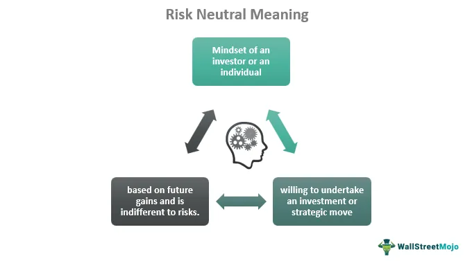

In recent years, financial markets have seen a surge in interest in algorithmic trading, largely driven by technological advancements and enhanced data analytics capabilities. Algorithmic trading, which involves the use of computer algorithms to automate trading decisions, allows for faster and more efficient execution of trades. This approach leverages quantitative models and high-frequency data to make real-time trading decisions, reducing human error and emotional biases.

Central to the development of algorithmic trading is a deep understanding of financial behavior, particularly the concepts of risk neutrality and risk aversion. These two attitudes towards risk play a pivotal role in how traders and investors make decisions. Risk neutrality refers to a mindset where an individual evaluates investment opportunities solely based on expected outcomes, without regard for the potential risks. This approach is particularly useful in the pricing of derivatives and when assessing market equilibrium, allowing traders to exploit opportunities that may be less attractive to risk-averse investors.



In contrast, risk aversion is characterized by a preference for certainty, where investors are primarily concerned with minimizing potential losses rather than maximizing potential gains. This attitude typically leads to more conservative investment strategies, focused on preserving capital and securing reliable returns. Understanding risk aversion is crucial in algorithmic trading, as it influences the design of trading algorithms and the implementation of risk management strategies aimed at reducing drawdowns and volatility.

This article explores the influence of these financial behaviors on algorithmic trading strategies and outcomes. By examining the concepts of risk neutrality and risk aversion, we aim to shed light on their implications for trading behavior, as well as the design of algorithms that accommodate these risk attitudes. Mastery of these elements is essential for investors and financial professionals seeking to optimize their trading strategies in sophisticated modern markets.

## Table of Contents

## Understanding Risk Neutrality

Risk neutrality is a critical concept in the field of finance, particularly when it comes to investment strategies and decision-making processes. An individual with a risk-neutral mindset is indifferent to risk, prioritizing potential gains without concern for the uncertainty of outcomes. This contrasts sharply with risk-averse individuals, who are predominantly concerned with minimizing potential losses.

In the context of algorithmic trading, risk-neutral models play a significant role, especially in the pricing of derivatives and in determining market equilibria. These models assume that investors are interested solely in the expected outcomes, disregarding the variance of returns. Thus, a risk-neutral valuation focuses purely on expected values without accounting for the probability distribution's volatility.

Mathematically, the risk neutral valuation can be expressed via expected values under the risk-neutral probability measure, often denoted as $\mathbb{Q}$. For example, the price of a derivative can be calculated using the formula:

$$
P = e^{-rT} \mathbb{E}^{\mathbb{Q}}[X]
$$

where:
- $P$ is the present value of the derivative,
- $r$ is the risk-free interest rate,
- $T$ is the time to maturity,
- $X$ is the payoff of the derivative,
- $\mathbb{E}^{\mathbb{Q}}$ denotes the expectation under the risk-neutral measure.

By adopting a risk-neutral approach, traders can identify and exploit market inefficiencies that might be overlooked by risk-averse investors. For instance, opportunities deemed uneconomical due to their apparent risk may, in fact, present significant potential for profit when assessed without bias toward risk.

In practical terms, a risk-neutral stance allows [algorithmic trading](/wiki/algorithmic-trading) systems to implement strategies that leverage mispricings in the market. This is achieved without the influence of emotional or psychological factors inherent in human trading, thereby enabling a focus on statistically-driven predictions and market simulations.

With algorithmic trading, risk-neutral models facilitate enhanced decision-making processes, allowing traders to adapt promptly to market changes and capitalize on potential [arbitrage](/wiki/arbitrage) opportunities. The systematic nature of algorithms ensures that investment strategies are executed based on quantitative metrics and risk-neutral valuations, culminating in optimized trading outcomes.

## Exploring Risk Aversion in Trading

Risk aversion refers to the tendency of investors and traders to prefer certainty over uncertainty, often leading to conservative investment choices. This financial behavior plays a significant role in shaping trading strategies, particularly in algorithmic trading, where precision and risk management are crucial.

Risk-averse investors focus primarily on capital preservation, choosing assets with lower risk and more predictable returns. Common investment vehicles among these investors include government bonds, savings accounts, and blue-chip stocks. The main objective is to minimize the potential for loss, even at the cost of achieving lower returns compared to riskier investments. The degree of risk aversion can be quantified using utility functions, where the utility of wealth $U(W)$ diminishes with increasing risk. A commonly used utility function for risk-averse individuals is the concave function, $U(W) = \ln(W)$ or $U(W) = W^\alpha$, where $0 < \alpha < 1$.

In algorithmic trading, understanding risk aversion is vital as it influences how algorithms are structured and executed. Algorithms that cater to risk-averse traders integrate parameters that focus on minimizing drawdowns and reducing exposure to market [volatility](/wiki/volatility-trading-strategies). This can be achieved through various strategies such as:

1. **Portfolio Diversification**: By spreading investments across uncorrelated assets, algorithms can reduce the impact of any single asset's poor performance, thus lowering overall portfolio risk. This is akin to the principle of not putting all eggs in one basket.

2. **Stop-Loss Orders**: These orders automatically sell off assets when they reach a predetermined price, thus preventing further losses. In a volatile market, this can be essential to protect the capital of risk-averse traders.

3. **Volatility Filters**: Algorithms might include filters to avoid trades during high-volatility periods. This prevents engagement in market conditions that are uncertain and potentially harmful to risk-averse investment strategies.

A simple Python example of implementing a stop-loss mechanism in an algorithmic trading strategy could look like this:

```python
def trade_with_stop_loss(current_price, purchase_price, stop_loss_threshold):
    # Calculate potential loss percentage
    loss_percentage = ((purchase_price - current_price) / purchase_price) * 100

    # Check if current loss exceeds the stop-loss threshold
    if loss_percentage >= stop_loss_threshold:
        return "Sell", current_price  # Trigger stop-loss

    return "Hold", None  # Continue holding

# Example usage
current_price = 95
purchase_price = 100
stop_loss_threshold = 5  # 5% loss threshold
action, sell_price = trade_with_stop_loss(current_price, purchase_price, stop_loss_threshold)
```

In this illustration, the function evaluates whether the current loss exceeds a specified threshold, triggering a sell decision if it does. Such a function is beneficial for risk-averse investors who want to automate loss prevention measures.

Moreover, algorithms designed for risk aversion might utilize historical data and predictive analytics to forecast potential market downturns, adjusting portfolios proactively to minimize risks. Machine learning models can enhance these algorithms by learning and adapting to market patterns over time, further aligning them with the investor's risk profile.

In conclusion, risk aversion is a fundamental consideration in algorithmic trading, dictating the necessity for robust risk management strategies. By leveraging algorithmic systems specifically tailored to risk-averse behaviors, investors can better protect their capital while navigating the complexities of financial markets.

## The Role of Algorithms in Risk Management

Algorithmic trading systems play a pivotal role in managing and optimizing investment strategies through the quantification of risk and data-driven decision-making. These systems are equipped with the flexibility to mirror the risk tolerance of traders, accommodating both risk-averse and risk-neutral attitudes. This adaptability is crucial in maintaining the integrity of trading strategies while aligning with individual or institutional risk profiles.

Central to algorithmic risk management is the ability to automate trading decisions, allowing algorithms to swiftly respond to fluctuating market conditions. This automation mitigates potential losses and captures gains, free from emotional biases that might cloud human judgment. By doing so, algorithms ensure that trading decisions are consistent, timely, and aligned with pre-defined risk parameters.

A key component of algorithmic risk management is the incorporation of risk management strategies such as stop-loss settings. Stop-loss is a predefined point at which a trade is automatically closed to prevent further losses if the market moves against the trader. This strategy is crucial for protecting capital and preventing excessive drawdowns. For instance, consider a stop-loss mechanism in a Python-based trading algorithm:

```python
def apply_stop_loss(trade_price, current_price, stop_loss_threshold):
    loss_percentage = (trade_price - current_price) / trade_price
    if loss_percentage >= stop_loss_threshold:
        # Execute stop-loss
        print("Stop-loss triggered. Closing position.")
        return True
    return False
```

Another fundamental strategy is diversification, which involves spreading investments across various assets to reduce risk exposure. Diversification minimizes the impact of any single asset's poor performance on the overall portfolio. By coding diversification strategies into algorithms, systems can adjust the asset allocation dynamically, maintaining optimal risk-reward balances.

The ability of algorithms to accommodate varying market conditions and investor behaviors through these mechanisms exemplifies their essential role in contemporary financial markets. By leveraging technology to tailor risk management to individual preferences, algorithmic trading systems enhance strategic outcomes and aid investors and institutions in navigating the complexities of modern finance with greater precision and confidence.

## Case Studies in Algorithmic Trading

Examining real-world examples provides insights into how different risk profiles are managed through algorithmic trading systems, highlighting their flexibility and adaptability in addressing the diverse preferences of investors.

One illustrative case involves an algorithmic mutual fund designed specifically for risk-averse investors. Such a fund may implement a dynamic asset allocation strategy, adjusting its portfolio based on market volatility indicators like the VIX (Volatility Index). For example, when market volatility increases beyond a predetermined threshold, the algorithm reallocates assets into more stable securities such as government bonds. This approach aims to protect against downside risk while maintaining the potential for steady growth. The algorithmic strategy is executed using quantitative models that incorporate volatility forecasts and covariance matrices to optimize the asset mix in real-time, ensuring alignment with a conservative risk profile.

On the other end of the spectrum, a high-frequency trading ([HFT](/wiki/high-frequency-trading-strategies)) firm may adopt a risk-neutral strategy to capitalize on short-term arbitrage opportunities across different markets. Such firms rely on complex algorithms that execute trades at microsecond speeds to exploit inefficiencies and price discrepancies. The key objective here is to maximize returns rather than minimize risk, which suits those with a risk-neutral stance on investing. By employing strategies like [statistical arbitrage](/wiki/statistical-arbitrage), HFT algorithms can quickly identify and leverage fleeting opportunities, often holding positions for mere seconds or minutes.

These case studies underscore the significance of tailoring algorithmic trading systems to accommodate varied risk appetites. They embody the ability of these systems to adapt strategies, whether emphasizing risk mitigation or profit maximization. Algorithmic trading technologies enable traders and investors to implement strategies that are coherent with their individual risk preferences, thereby enhancing the potential for achieving desired financial outcomes.

## Conclusion

Financial behavior, particularly the contrasting attitudes of risk neutrality and risk aversion, plays a crucial role in determining trading outcomes and the formulation of trading strategies. These behavioral inclinations affect how markets are perceived and engaged with, ultimately shaping the dynamics of algorithmic trading. As algorithmic trading grows more sophisticated, it provides tools to cater to the diverse risk preferences of traders and investors.

The evolving landscape of algorithmic trading offers increasingly advanced systems capable of accommodating risk preferences through refined strategic implementations. By incorporating various risk management techniques—such as stop-loss mechanisms and diversification—traders can design algorithms that align with their risk profiles. This alignment ensures that trading operations are conducted in a manner consistent with the investor's tolerance for uncertainty and potential volatility.

Investors and traders benefit immensely from aligning their risk tolerance with their chosen trading strategy through algorithmic systems. Algorithms optimized for specific risk profiles enhance the ability to achieve consistent and favorable outcomes. For instance, risk-averse traders might prefer algorithms that prioritize capital preservation and stability, while risk-neutral traders might seek algorithms designed to exploit potential gains vigorously, even under uncertain market conditions.

Understanding financial behaviors like risk neutrality and risk aversion, along with the associated strategic implications, enables individuals and firms to navigate modern financial markets more effectively. Leveraging sophisticated algorithmic systems, traders can respond swiftly to changing market conditions, making decisions that are less prone to emotional biases and more grounded in data-driven insights. This technological synergy between behavioral finance and algorithmic solutions not only helps in achieving desired financial goals but also provides a competitive edge in the increasingly complex global financial landscape.

## References & Further Reading

[1]: ["Advances in Financial Machine Learning"](https://www.amazon.com/Advances-Financial-Machine-Learning-Marcos/dp/1119482089) by Marcos Lopez de Prado

[2]: ["Evidence-Based Technical Analysis: Applying the Scientific Method and Statistical Inference to Trading Signals"](https://www.amazon.com/Evidence-Based-Technical-Analysis-Scientific-Statistical/dp/0470008741) by David Aronson

[3]: ["Machine Learning for Algorithmic Trading"](https://github.com/stefan-jansen/machine-learning-for-trading) by Stefan Jansen

[4]: ["Quantitative Trading: How to Build Your Own Algorithmic Trading Business"](https://www.amazon.com/Quantitative-Trading-Build-Algorithmic-Business/dp/1119800064) by Ernest P. Chan

[5]: Black, F., & Scholes, M. (1973). ["The Pricing of Options and Corporate Liabilities."](https://www.cs.princeton.edu/courses/archive/fall09/cos323/papers/black_scholes73.pdf) The Journal of Political Economy, 81(3), 637-654.

[6]: Markowitz, H. (1952). ["Portfolio Selection."](https://onlinelibrary.wiley.com/doi/abs/10.1111/j.1540-6261.1952.tb01525.x) The Journal of Finance, 7(1), 77-91.