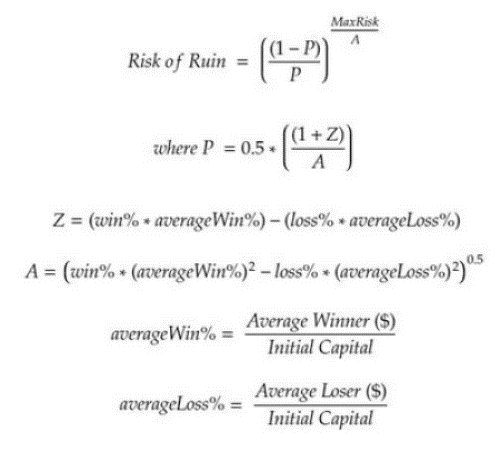

Investment strategies play a crucial role in driving financial growth, yet they inherently come with various risks that must be acknowledged and managed. As technology continues to evolve, algorithmic trading, commonly referred to as algo trading, has greatly influenced how these strategies are executed. It leverages computer algorithms to perform trading at speeds and frequencies that are impossible for human traders, thereby enhancing the efficiency and precision of executing investment strategies.

The landscape of algo trading is continually changing, driven by advances in computational technology and data analysis methodologies. These developments enable automated systems to manage voluminous and complex datasets, identify profitable trading opportunities, and execute trades rapidly, thereby maximizing potential returns while minimizing human error. However, with these benefits come certain risks that must be navigated carefully.



This article focuses on financial risk management within the context of algo trading, with particular attention on understanding and mitigating the "risk of ruin". The risk of ruin refers to the probability that a trader will lose sufficient capital to the extent that continuing trading is not viable. This concept is of paramount importance for traders employing algorithmic strategies, as it directly impacts the sustainability and long-term viability of trading operations. Understanding the factors that contribute to the risk of ruin and implementing effective risk management strategies are vital for ensuring both continued participation in the market and the potential for steady financial growth through investment strategies.

## Table of Contents

## Understanding Risk of Ruin

Risk of ruin is defined as the probability that a trader's capital depletes to a point where continuing trading is infeasible. This concept is crucial in financial risk management, as it helps traders and investors understand the potential for catastrophic losses that can end their trading activities. The risk of ruin is influenced by various factors, primarily strategy design, market volatility, and trade execution.

1. **Strategy Design**: The effectiveness of an investment strategy is a major determinant of the risk of ruin. Strategies that lack robustness are more susceptible to changes in market conditions, leading to poor performance and increased chances of depletion. Over-optimized strategies, which perform exceptionally well during backtests but are not adaptable to live market environments, can also increase this risk. Properly designed strategies should accommodate market fluctuations and maintain performance stability under different scenarios.

2. **Market Volatility**: The inherent uncertainty and rapid price changes in financial markets contribute significantly to the risk of ruin. Volatile markets can lead to larger-than-expected losses if not managed appropriately. Traders must account for market variability by employing strategies that can weather such fluctuations without compromising their capital significantly.

3. **Trade Execution**: Efficient trade execution is vital to managing risk. Poor execution, due to delays or partial fills, can lead to unfavorable trade outcomes. Additionally, high transaction costs or slippage can erode the capital base, increasing the risk of ruin. Ensuring high-quality execution through reliable platforms and understanding market microstructures is vital for minimizing these risks.

Various methodologies are employed to calculate risk of ruin in financial scenarios:

- **Gambler's Ruin Formula**: Originating from probability theory, the Gambler's Ruin formula assesses the likelihood of losing a finite bankroll given a series of bets. In trading, this can be adapted to model the likelihood of capital depletion based on factors such as win probability and risk per trade.

- **Monte Carlo Simulations**: These simulations model a wide spectrum of potential market scenarios to estimate the probability of ruin. By simulating numerous trading paths and outcomes, traders can visualize the impact of different variables on their strategy and assess risk more effectively. Python, with its robust libraries such as NumPy and Pandas, is commonly used for implementing Monte Carlo simulations. 

  ```python
  import numpy as np

  def simulate_trading_path(initial_capital, win_prob, risk_per_trade, n_trades):
      capital = initial_capital
      for _ in range(n_trades):
          if np.random.rand() < win_prob:
              capital += risk_per_trade * capital
          else:
              capital -= risk_per_trade * capital
          if capital <= 0:
              return 0
      return capital

  # Example: Simulating 1000 trading paths with initial capital of $1000, win probability of 0.55, and risk per trade of 1%
  simulations = [simulate_trading_path(1000, 0.55, 0.01, 1000) for _ in range(1000)]
  risk_of_ruin = sum([1 for result in simulations if result == 0]) / len(simulations)
  ```

- **Ralph Vince's Optimal F**: This approach uses the concept of Optimal F, which determines the ideal fraction of capital to risk per trade for maximizing growth without exceeding acceptable risk levels. This method incorporates mathematical models to adjust position sizing dynamically, aiming to optimize returns while minimizing the likelihood of ruin.

Understanding these factors and methodologies is essential for traders and investors to develop robust strategies that minimize the risk of ruin, ensuring sustainable and profitable trading operations.

## Factors Contributing to Risk of Ruin in Algo Trading

In [algorithmic trading](/wiki/algorithmic-trading), understanding and managing factors that contribute to the risk of ruin is crucial for sustainable trading operations. Incorrect position sizing is a primary contributor to risk of ruin. When traders allocate too much capital to a single trade, they expose themselves to significant losses in the event of adverse market movements. This can deplete trading capital rapidly and lead to catastrophic financial failure. The key to managing position sizing involves setting a maximum risk per trade, often expressed as a percentage of total capital. For instance, limiting exposure to 1-2% of total capital per trade can reduce the likelihood of large losses.

Furthermore, strategy failures present a significant challenge in algorithmic trading. Strategies that demonstrate excellent performance in [backtesting](/wiki/backtesting) can fail to replicate such success in live markets. This discrepancy often arises from over-optimization, where strategies are excessively tailored to historical data, leading to poor adaptability in dynamic market conditions. Overfitting in model design is a common pitfall, where algorithms are trained to exploit patterns that may not be present in future data.

Market [liquidity](/wiki/liquidity-risk-premium) also has a profound impact on the risk of ruin. Low liquidity can result in higher execution risks, manifesting as slippage or the inability to enter or [exit](/wiki/exit-strategy) positions at desired prices. This not only affects returns but can exacerbate losses if trades cannot be executed promptly. During periods of low liquidity, spreads may widen, and the market may react unpredictably to larger orders, further increasing the risk of ruin.

In conclusion, strategic risk management in algorithmic trading requires a comprehensive approach that addresses position sizing, enhances algorithmic adaptability, and accounts for market liquidity conditions to mitigate the overarching risk of ruin.

## Methods to Calculate Risk of Ruin

Calculating the risk of ruin is an essential aspect of determining the sustainability of an investment strategy, especially in the context of algorithmic trading. This involves using different methodologies to predict the probability of losing a significant portion of the trading capital, thereby ceasing profitable trading activities. 

One classical approach is inspired by the Gambler's Ruin Problem, a well-known scenario in probability theory. This model evaluates the likelihood of a gambler depleting their bankroll when playing a fair game of chance. In trading terms, it quantifies the chance of reaching a state where the capital is insufficient to continue trading. The basic principle involves calculating the probabilities of successive wins and losses, and the model considers factors like starting capital, bet size, and the probability of winning individual trades.

Besides the classical probability models, Monte Carlo simulations are extensively used to estimate the risk of ruin in trading. This method involves running a large number of simulations to understand the range of possible outcomes in a market scenario. By modeling the random behavior of markets and applying these simulations, traders can identify how frequently their capital might be depleted under various conditions. The simulation accounts for different risk factors, such as price changes and economic events, which could affect the performance of the trading strategy.

For a more formula-based approach, Ralph Vince's concept of Optimal F offers a useful technique. Optimal F is designed to determine the fraction of capital to risk on a trade to maximize the geometric growth rate of the capital while taking into account the risk of capital ruin. Mathematically, this involves calculating the F value that maximizes the expected logarithmic return of the trading strategy:

$$

E(\log(W_{end}/W_{start})) = \sum_{i} p_i \log(1 + F \times ROI_i) 
$$

Where $E$ is the expected value, $W_{end}$ and $W_{start}$ represent the ending and starting wealth, $p_i$ is the probability of outcome $i$, and $ROI_i$ is the return on investment for outcome $i$.

The approach combines mathematical rigor with practical applicability, providing a dynamic tool for managing risk and strategically allocating capital in trading operations. By leveraging these methods, traders can develop robust frameworks to navigate the complexities of market [volatility](/wiki/volatility-trading-strategies) and enhance their chances of sustained profitability.

## Risk of Ruin Calculator: Tools and Techniques

A risk of ruin calculator is a critical tool in financial risk management, particularly for algorithmic traders aiming to gauge the probability of depleting their investment capital to a non-viable level. To effectively utilize such a calculator, it’s essential to consider several key input variables: win rate, initial capital, and risk per trade.

The **win rate** refers to the percentage of trades that are successful. A higher win rate naturally contributes to a lower risk of ruin, as successful trades help preserve and grow capital. **Initial capital** is the amount of money available at the beginning of trading activities. Larger initial capital offers a buffer against losing streaks, reducing the probability of reaching a ruinous state. **Risk per trade** is a critical parameter that dictates the potential loss on any single trade, usually expressed as a percentage of the total capital. Managing risk per trade involves balancing potential rewards with the acceptable level of risk.

A common formula used to approximate the risk of ruin is influenced by these variables and follows the basic structure of classical probability theories related to gambling scenarios, such as the Gambler’s Ruin Problem. The formula is:

$$
\text{Risk of Ruin} = \left( \frac{\text{Loss Probability}}{\text{Win Probability}} \right)^{\frac{\text{Initial Capital}}{\text{Loss per Trade}}}
$$

Where:
- Loss Probability = 1 - Win Rate
- Win Probability = Win Rate
- Loss per Trade = Initial Capital $\times$ Risk per Trade

To automate the calculation of risk of ruin in Python, the following code snippet can be employed:

```python
def risk_of_ruin(win_rate, initial_capital, risk_per_trade):
    loss_probability = 1 - win_rate
    loss_per_trade = initial_capital * risk_per_trade
    if win_rate == 1 or loss_per_trade == 0:
        return 0  # No risk of ruin if no losses ever occur
    return (loss_probability / win_rate) ** (initial_capital / loss_per_trade)

# Example Usage
win_rate = 0.6  # 60% win rate
initial_capital = 10000  # Initial capital of $10,000
risk_per_trade = 0.02  # Risking 2% of capital per trade

risk = risk_of_ruin(win_rate, initial_capital, risk_per_trade)
print(f"Risk of Ruin: {risk:.4f}")
```

This code calculates the risk of ruin by first determining the probability of loss and then applying the formula. It provides traders with quantitative insights into how their trading strategy might perform over time.

Incorporating a risk of ruin calculator into risk management strategies allows traders to make informed decisions about position sizing and capital allocation. It serves as a proactive tool to safeguard against adverse market conditions and guides adjustments to trading models and strategies to maintain risk within acceptable bounds. By systematically evaluating risk, traders can enhance their resilience and sustain profitability in the dynamic landscape of financial markets.

## Strategies to Mitigate Risk of Ruin

Diversification is a fundamental strategy in mitigating the risk of ruin by spreading investments across different asset classes and trading strategies. By allocating capital across various markets such as equities, bonds, commodities, and [forex](/wiki/forex-system), investors can reduce the impact of adverse events on any single asset class. This approach minimizes the overall volatility of a portfolio and enhances the likelihood of achieving consistent returns. Diversification also extends to employing multiple trading strategies, which can exploit different market conditions and timeframes, further balancing risk.

Position sizing is another critical component in protecting against significant losses. It involves determining the appropriate amount of capital to allocate to each trade, considering the trader's risk tolerance and the specific characteristics of the investment. A common approach is the fixed-fractional position sizing strategy, where a predetermined percentage of the total capital is risked on each trade. For example, risking 1-2% of the trading capital per trade helps to limit potential losses, ensuring that no single trade can cause substantial damage to the overall portfolio.

The formula for fixed-fractional position sizing can be expressed as:

$$
\text{Position Size} = \frac{\text{Risk per Trade}}{\text{Stop-Loss Distance}}
$$

Where "Risk per Trade" is the maximum amount the trader is willing to lose, and "Stop-Loss Distance" is the difference between the entry price and the stop-loss price.

Robust algorithm development and rigorous backtesting are vital to improving win rates and adapting strategies to current market conditions. Algorithms should be designed to account for various market dynamics, and backtesting them against historical data ensures their effectiveness over different market periods. This process helps identify potential flaws and optimizes the parameters to increase the probability of success in live trading.

Backtesting involves simulating the trading strategy on historical data to evaluate its performance. Here is an example of a simple Python code snippet used for backtesting a trading strategy using historical price data:

```python
import pandas as pd

# Load historical data
data = pd.read_csv('historical_prices.csv')

# Implement a basic moving average crossover strategy
data['Short_MA'] = data['Close'].rolling(window=50).mean()
data['Long_MA'] = data['Close'].rolling(window=200).mean()

# Generate trading signals
data['Signal'] = 0
data['Signal'][50:] = np.where(data['Short_MA'][50:] > data['Long_MA'][50:], 1, 0)

# Calculate returns
data['Strategy_Return'] = data['Signal'].shift(1) * data['Close'].pct_change()

# Evaluate strategy performance
cumulative_returns = (1 + data['Strategy_Return']).cumprod()
print(cumulative_returns.iloc[-1])
```

This code demonstrates a simple moving average crossover strategy, calculating signals and returns based on historical closing prices. Such thorough testing helps in refining strategies and increasing their adaptability, thereby mitigating the risk of ruin.

## Conclusion

Understanding and managing the risk of ruin is an essential component for ensuring sustainable trading operations, particularly within algorithmic trading. The concept of risk of ruin underscores the potential for a trader's capital to deplete to a level where continued trading becomes untenable, making it a critical consideration in financial risk management. As algorithmic trading increasingly becomes the mainstay for executing investment strategies efficiently, an acute awareness and control over risk of ruin can significantly enhance both the longevity and profitability of trading programs.

Comprehensive risk management techniques are paramount in reinforcing stability and ensuring the optimal performance of algos over time. By thoroughly integrating these practices, traders can navigate the dynamic financial markets more effectively, mitigating potential losses and capitalizing on opportunities. Among these techniques, the intelligent design of algorithms that incorporate robust backtesting and adaptability to current market conditions stands out. These efforts, combined with appropriate position sizing and diversified strategies across various asset classes, contribute to reducing exposure and safeguarding trading capital.

Risk of ruin calculators prove to be invaluable tools in this context, facilitating a pragmatic approach to understanding and managing financial risks. By utilizing these calculators, traders can input key variables—such as win rate, initial capital, and risk per trade—to gain insights into the likelihood of risking ruin. This empirical understanding aids in devising sound, informed strategies that prioritize the protection of trading capital while optimizing the potential for growth. Consequently, leveraging these calculators as part of a strategic toolkit allows traders to strengthen their investment approaches, ultimately fortifying their operations against unforeseen market volatilities and enhancing decision-making processes. Encouraging the integration of risk of ruin calculators and emphasizing the need for comprehensive risk management are fundamental to developing robust and sustainable investment strategies within the framework of algorithmic trading.

## References & Further Reading

1. **Academic Papers and Books on Financial Risk Management**:
   - "The Theory of Investment Value" by John Burr Williams provides a foundation for understanding investment intrinsic value and risk assessment.
   - Hull, J.C.'s "Options, Futures, and Other Derivatives" is widely recognized for its comprehensive treatment of derivative securities, addressing risk management strategies using derivatives.
   - "Value at Risk: The New Benchmark for Managing Financial Risk" by Philippe Jorion offers a detailed examination of the VaR methodology used extensively in financial risk management.
   - "Financial Risk Manager Handbook" by Philippe Jorion is another key resource for understanding various aspects of financial risk management practices and regulations.

2. **Algo Trading and Strategy Evaluation**:
   - "Algorithmic Trading: Winning Strategies and Their Rationale" by Ernest P. Chan gives practical insights into designing and evaluating algorithmic trading strategies.
   - "Quantitative Trading: How to Build Your Own Algorithmic Trading Business" by E.P. Chan provides a comprehensive guide on starting and managing an algorithmic trading business, highlighting risk management techniques.
   - "The Science of Algorithmic Trading andPortfolio Management" by Robert Kissell covers advanced topics in trading algorithms and portfolio management, focusing on risk metrics.

3. **Position Sizing and Market Volatility**:
   - "The Definitive Guide to Position Sizing" by Van K. Tharp explores the intricacies of determining the optimal trade size, a critical factor in risk management.
   - "The Black Swan: The Impact of the Highly Improbable" by Nassim Nicholas Taleb discusses unexpected events' effects on markets, underscoring the necessity of strategies for dealing with volatility.
   - "Dynamic Hedging: Managing Vanilla and Exotic Options" by Nassim Nicholas Taleb covers managing financial instruments' exposure to market risks, focusing on volatility and position sizing.

4. **Industry-Recognized Resources and Tools**:
   - The Chartered Financial Analyst (CFA) Institute offers substantial resources on financial analysis and risk management, including articles and research papers.
   - Quantitative Finance and Risk Management forums, such as QuantConnect and QuantInsti, provide extensive tools and community support for algo trading and risk analysis.
   - The Wilmott Forums and Quantitative Finance book series are also valuable resources for continuous learning and staying updated on modern financial risk management practices.

