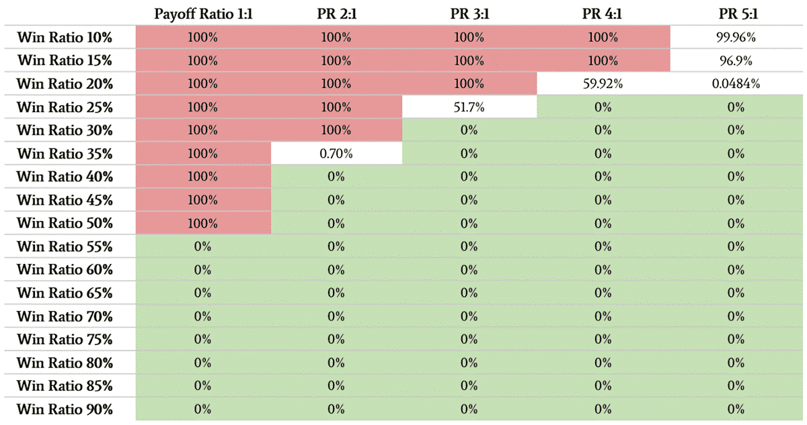

## Table of Contents

## What is the Risk of Ruin in trading?

The Risk of Ruin in trading is the chance that a trader will lose all their money. It's like a warning sign that shows how likely it is for a trader to go broke. This risk depends on things like how much money the trader starts with, how much they bet on each trade, and how often they win or lose.

To figure out the Risk of Ruin, traders use math and special formulas. They look at their past trades to see how they did and then use that information to guess how likely it is they'll lose everything. Traders can lower this risk by not betting too much money on one trade, by having a good plan, and by sticking to that plan. It's important for traders to understand and manage this risk so they can keep trading without losing all their money.

## How is the Risk of Ruin calculated?

The Risk of Ruin is calculated using a formula that takes into account the trader's win rate, the average win size, and the average loss size. The win rate is the percentage of trades that end up making money. The average win size is how much money the trader makes on average when they win, and the average loss size is how much they lose on average when they lose. These numbers help figure out the probability that the trader will eventually lose all their money.

To use the formula, traders need to know their starting capital and how much they risk on each trade. The formula then calculates how many trades it would take to either reach a certain goal or lose everything. By changing the numbers, like increasing the win rate or reducing the amount risked per trade, traders can see how these changes affect their Risk of Ruin. This helps them make smarter choices about how much to bet and how to manage their money to keep trading safely.

## What factors contribute to the Risk of Ruin?

The Risk of Ruin in trading depends on a few key things. One big [factor](/wiki/factor-investing) is the trader's win rate, which is how often they make money on their trades. If a trader wins a lot, their Risk of Ruin goes down. Another important thing is how much money they risk on each trade. If they bet too much on one trade and lose, it can hurt their account a lot. The size of the wins and losses also matters. If a trader's wins are small but their losses are big, they are more likely to go broke.

Another factor is the trader's starting capital. If they start with a lot of money, they can handle more losses before going broke. The number of trades they make also affects the Risk of Ruin. The more trades a trader makes, the more chances they have to lose money, but it also gives them more chances to make money if they are good at [picking](/wiki/asset-class-picking) winning trades. By understanding these factors, traders can make better choices to lower their Risk of Ruin and keep trading without losing everything.

## Can the Risk of Ruin be completely eliminated?

No, the Risk of Ruin can't be completely eliminated in trading. It's always there because trading involves risks. No matter how good a trader is, there's always a chance they could lose all their money. Even if a trader has a high win rate and manages their money well, unexpected things can happen in the market that can lead to big losses.

Traders can lower the Risk of Ruin a lot by being careful and smart. They can do this by not betting too much on one trade, sticking to a good trading plan, and keeping their emotions in check. By understanding and managing the factors that affect the Risk of Ruin, like their win rate and how much they risk per trade, traders can make it very small. But they can never make it zero.

## How does the size of a trading account affect the Risk of Ruin?

The size of a trading account plays a big role in the Risk of Ruin. If a trader starts with a lot of money, they can handle more losses before they go broke. Think of it like having a bigger cushion to fall back on. If they lose some money, it's a smaller part of their total account, so it doesn't hurt as much. This means their Risk of Ruin goes down because they have more room to recover from losses.

On the other hand, if a trader starts with a small account, even small losses can be a big deal. If they lose a trade, it takes up a bigger part of their money, and they get closer to losing everything faster. That's why traders with smaller accounts need to be extra careful about how much they risk on each trade. By keeping the size of their bets small compared to their account, they can lower their Risk of Ruin, but it's always higher than for someone with a bigger account.

## What role does the win/loss ratio play in the Risk of Ruin?

The win/loss ratio is really important when it comes to the Risk of Ruin. It's all about how often a trader wins compared to how often they lose. If a trader wins more often than they lose, their Risk of Ruin goes down. This is because they are making money more often, which helps them keep their account safe. But if a trader loses more often than they win, their Risk of Ruin goes up because they are losing money more often, which can quickly eat away at their account.

The size of the wins and losses matters too. If a trader wins a lot but their losses are bigger than their wins, it can still be risky. For example, if a trader wins $100 but loses $200, even if they win more often, those bigger losses can add up and increase their Risk of Ruin. So, it's not just about winning more often, but also about making sure the wins are bigger than the losses to keep the Risk of Ruin low.

## How can traders use the Risk of Ruin to improve their trading strategy?

Traders can use the Risk of Ruin to make their trading strategy better by understanding how likely it is for them to lose all their money. They can play around with different numbers, like how much they bet on each trade and how often they win, to see how these changes affect their Risk of Ruin. By doing this, they can find a good balance that keeps their risk low while still giving them a chance to make money. For example, if a trader sees that betting too much on one trade makes their Risk of Ruin go up a lot, they can decide to bet less and spread their risk out over more trades.

Another way traders can use the Risk of Ruin is to set clear rules for themselves about how much they are willing to risk. If they know their Risk of Ruin is high, they might choose to trade less often or only take trades that have a good chance of winning. By keeping an eye on their Risk of Ruin, traders can make smart choices about when to trade and how much to bet, which helps them stay in the game longer and avoid losing everything. This way, they can keep improving their strategy to lower their risk and increase their chances of success.

## What is the relationship between Risk of Ruin and the Kelly Criterion?

The Kelly Criterion and the Risk of Ruin are connected because they both help traders figure out how much to bet on each trade. The Kelly Criterion is a formula that tells traders the best amount of their money to bet to make the most money over time. It uses the win rate and the size of the wins and losses to come up with this number. The Kelly Criterion helps traders find a balance so they can grow their account without risking too much on each trade. If traders follow the Kelly Criterion, they can lower their Risk of Ruin because they won't be betting too much on any one trade.

Using the Kelly Criterion can help traders manage their Risk of Ruin by showing them how to bet in a way that keeps their risk low while still giving them a chance to make money. However, the Kelly Criterion suggests betting an amount that some traders might find too risky, so many use a smaller fraction of what the Kelly Criterion suggests, called the fractional Kelly. By doing this, traders can further reduce their Risk of Ruin while still using the Kelly Criterion to guide their betting strategy. This way, they can keep trading without the fear of losing everything, and they can slowly grow their account over time.

## How does leverage impact the Risk of Ruin?

Leverage can make the Risk of Ruin a lot higher for traders. When traders use leverage, they borrow money to make bigger bets than they could with just their own money. This means they can make more money if things go well, but it also means they can lose a lot more if things go badly. If a trade goes against them, the losses can be much bigger because they are betting with borrowed money. So, even a small move in the wrong direction can wipe out a big part of their account, making the Risk of Ruin go up fast.

To manage the Risk of Ruin when using leverage, traders need to be really careful about how much they borrow. They should use less leverage and keep their bets small compared to their account size. This way, even if they lose a trade, the loss won't be so big that it puts their whole account at risk. By understanding how leverage works and using it wisely, traders can lower their Risk of Ruin and keep trading without losing everything.

## What are some common misconceptions about the Risk of Ruin?

One common misconception about the Risk of Ruin is that it's something only new traders need to worry about. Some people think that if you've been trading for a long time and you're good at it, you don't need to think about the Risk of Ruin. But that's not true. Even experienced traders can lose everything if they start taking too many risks or if the market changes in unexpected ways. The Risk of Ruin is always there, no matter how long you've been trading or how good you are.

Another misconception is that the Risk of Ruin can be completely eliminated. Some traders believe that if they follow a perfect strategy or use certain tools, they can get rid of the risk of losing all their money. But this isn't possible. The Risk of Ruin can be lowered by being careful and smart, but it can never be zero. Trading always involves some level of risk, and understanding and managing that risk is key to staying in the game.

## How can backtesting help in understanding the Risk of Ruin?

Backtesting is a way for traders to test their trading plan by looking at how it would have worked in the past. By using old market data, traders can see how their strategy would have done if they had used it before. This helps them understand the Risk of Ruin because they can see how often they would have won or lost and how big those wins and losses would have been. If a trader sees that their strategy would have led to a lot of big losses, they know their Risk of Ruin is high and they need to change their plan.

By backtesting, traders can play around with different ways of managing their money and see how these changes affect their Risk of Ruin. For example, they can try betting less on each trade or changing how often they trade. This helps them find a good balance that keeps their risk low while still giving them a chance to make money. Backtesting isn't perfect because the future might not be like the past, but it's a good way to get a better idea of the Risk of Ruin and make smarter choices about how to trade.

## What advanced statistical models are used to predict the Risk of Ruin?

Advanced statistical models like Monte Carlo simulations and Markov chains are often used to predict the Risk of Ruin. Monte Carlo simulations work by running lots of different scenarios to see how a trader's account might change over time. They use random numbers to guess what might happen in the future based on how things have happened in the past. This helps traders see all the different ways their account could go up or down, which gives them a good idea of how likely it is they'll lose all their money. By looking at all these different paths, traders can understand their Risk of Ruin better and make smarter choices about how much to bet and when to trade.

Markov chains are another tool that helps predict the Risk of Ruin. They work by looking at how one state, like having a certain amount of money, leads to another state, like having more or less money. Markov chains assume that what happens next only depends on what's happening right now, not on what happened before. This helps traders see how their account might change from one trade to the next. By using Markov chains, traders can figure out the chances of moving from having money to losing it all, which helps them understand and manage their Risk of Ruin. Both of these models help traders make better plans to keep their trading safe and successful.

## What is the Understanding of the Risk of Ruin?

The risk of ruin in [algorithmic trading](/wiki/algorithmic-trading) is a critical concept that traders must thoroughly understand to safeguard their capital and ensure their trading strategies can withstand adverse market conditions. Essentially, risk of ruin is the probability that a trader will lose all of their trading capital and become unable to continue trading. This outcome is not just a theoretical possibility but a real threat, particularly in the fast-paced and often unpredictable world of financial markets.

In the context of algo trading, the risk of ruin is shaped by numerous variables, including strategy design, market volatility, and trade execution. Each of these elements plays a significant role in determining the overall risk level a trader assumes when engaging in algorithmic trading.

#### Strategy Design
The design and construction of a trading strategy are foundational in influencing the risk of ruin. A robust strategy should not only focus on maximizing returns but also incorporate risk management techniques to limit potential losses. A poorly designed strategy that lacks diversification, applies excessive leverage, or fails to adapt to market changes can significantly heighten the risk of a complete capital loss.

#### Market Volatility
Volatility is a measure of how much the price of an asset fluctuates over a given period. High [volatility](/wiki/volatility-trading-strategies) can result in large price swings, which can either provide significant opportunities or pose substantial risks to traders. In algo trading, strategies must account for volatility not only to capitalize on profitable opportunities but also to protect against the chances of substantial capital drawdowns induced by unexpected market movements.

#### Trade Execution
The execution of trades also has a critical impact on risk of ruin. Poor execution, including delays and errors, can result in unfavorable prices and increased slippage. Strategies with tight margins of profit are particularly susceptible to execution risks, which can turn profitable trades into losing ones, thereby increasing overall risk.

To effectively calculate the risk of ruin, a trader must understand the interplay between win rate, loss rate, and capital allocation. The win rate is the percentage of trades that are profitable, while the loss rate represents the percentage of trades that incur losses. Capital allocation refers to how much of the trading capital is put at risk on each trade.

The formula often used to estimate the risk of ruin in trading involves these variables and provides a quantitative measure of the likelihood that a trader will lose their entire investment. For instance, the following formula is used under certain assumptions about bet sizes and probabilities:

$$
R = \left( \frac{1 - W}{1 + W} \right)^N
$$

Where:
- $R$ is the risk of ruin,
- $W$ is the win ratio (probability of a win),
- $N$ is the number of trades.

Understanding the nuances of risk of ruin calculations requires traders to consider more than just historical performance metrics. It demands a proactive approach in strategy management, risk assessment, and the implementation of robust risk management techniques to remain viable in an increasingly competitive trading environment.

## What are the methods to calculate the risk of ruin?

The risk of ruin is a critical metric for algorithmic traders, offering insights into the probability of losing all trading capital. Several methods exist to calculate this risk, each with varying degrees of complexity and applicability.

**Gambler's Ruin Approach:**
The Gambler's Ruin problem is a classical concept that involves computing the probability of a gambler losing all their stake against an opponent. In algo trading, this approach translates to calculating the likelihood that a trader's capital will be depleted to zero. The basic formula is often expressed using probabilities of winning (p) and losing (q = 1 - p) a trade. Suppose a trader has an initial capital (C) and targets to grow it (T). The probability of ruin (P_ruin) can be calculated as:

$$
P_{\text{ruin}} = \begin{cases} 
1 - \left(\frac{p}{q}\right)^{T-C}, & \text{if } p \neq q \\
\frac{C}{T}, & \text{if } p = q = 0.5
\end{cases}
$$

This method provides a clear mathematical framework but assumes constant probabilities of winning and losing, which may not always hold in complex markets.

**Monte Carlo Simulations:**
Monte Carlo simulations offer a more flexible approach by modeling potential trading outcomes based on historical data and statistical distributions. By simulating thousands of possible price paths and trade executions, traders can assess the probability of various scenarios leading to ruin. Traders set parameters such as win rate, loss rate, and initial capital, allowing the simulation to generate a range of outcomes. Python can be used to perform these simulations:

```python
import numpy as np

def monte_carlo_risk_of_ruin(initial_capital, win_rate, loss_rate, num_simulations, num_trades):
    ruin_count = 0
    for _ in range(num_simulations):
        capital = initial_capital
        for _ in range(num_trades):
            if np.random.rand() < win_rate:
                capital += win_rate * initial_capital
            else:
                capital -= loss_rate * initial_capital
            if capital <= 0:
                ruin_count += 1
                break
    return ruin_count / num_simulations

risk_of_ruin_probability = monte_carlo_risk_of_ruin(10000, 0.55, 0.45, 10000, 100)
```

This code estimates the probability of ruin by repeatedly simulating trade sequences, making it adaptable to various trading conditions.

**Ralph Vince's Algorithm:**
Ralph Vince's approach involves "Optimal F", a concept that focuses on the optimal fraction of capital to risk on each trade. This method extends beyond simple win/loss probabilities by incorporating the variability of returns in a portfolio. Vince's algorithm uses the Kelly Criterion-like principle for optimal capital allocation to minimize the risk of ruin and maximize growth:

$$
f^* = \frac{bp - q}{b}
$$

Where $f^*$ is the fraction of capital to risk, $b$ is the ratio of gain to loss, $p$ is the probability of winning, and $q$ is the probability of losing. Calculating and adjusting the fraction $f^*$ helps in dynamically managing risk and capital exposure, although it requires precise input data and assumptions about market behavior.

Each of these methods offers valuable insights but also carries assumptions and limitations. Traders often employ multiple risk assessment tools concurrently to safeguard against the complexities inherent in financial markets.

## What is a Risk of Ruin Calculator?

A risk of ruin calculator is a vital tool for traders to quantitatively assess the likelihood of depleting their trading capital. This assessment is crucial for understanding the potential adverse scenarios that may arise during trading activities, especially in algorithmic trading where automation may lead to rapid series of transactions. 

### Key Input Variables:

1. **Win Rate**:
   The win rate is a trader's probability of winning a single trade. It is expressed as a percentage and serves as a foundational component in calculating risk of ruin. A higher win rate generally decreases the risk of ruin, as it implies more consistent trading gains over time.

2. **Risk Percentage**:
   This is the fraction of your total capital that you are willing to risk on a single trade. Commonly, traders use a fixed percentage to manage their risk, such as 1% or 2% of their total capital. The risk percentage is critical because it dictates how much of your capital is exposed to potential loss in any single transaction.

3. **Initial Capital**:
   The amount of money available at the start of trading provides a baseline for all further calculations. The initial capital must be correctly assessed to ensure the accuracy of the risk of ruin computations. Larger initial capital generally provides a buffer against losing streaks.

4. **Target Capital**:
   This is the financial endpoint or goal that a trader aims to achieve. Setting a target capital can help in structuring the risk management strategy and measuring progress toward financial objectives. It also helps in understanding the capital growth required to reach desired outcomes.

### Formula for Risk of Ruin Calculation:

The basic formula used in calculating risk of ruin involves these variables. For a simple scenario where only win rate and loss probability are considered (with a fixed risk percentage per trade), the risk of ruin ($R$) might be approximated using:

$$
R = \left( \frac{Loss \, Probability}{Win \, Probability} \right)^{\frac{Initial \, Capital}{Risk \, per \, Trade}}
$$

This equation serves as a simplified model. In practice, more advanced models may integrate additional factors such as variable position sizing or dynamic stop-loss adjustments.

### Example Python Code:

To automate these calculations, traders might use a Python script like the following:

```python
def risk_of_ruin(win_rate, risk_per_trade, initial_capital):
    loss_prob = 1 - win_rate
    if loss_prob == 0 or risk_per_trade == 0:
        return 0
    if win_rate == 0:
        return 1
    return (loss_prob / (1 - loss_prob)) ** (initial_capital / risk_per_trade)

# Example usage
win_rate = 0.55  # 55% win rate
risk_per_trade = 0.01 * 10000  # 1% of $10,000 initial capital
initial_capital = 10000  # $10,000

risk_ruin = risk_of_ruin(win_rate, risk_per_trade, initial_capital)
print(f"Risk of Ruin: {risk_ruin:.4f}")
```

This Python example highlights how to compute the risk of ruin using key inputs. Incorporating variables like target capital and dynamic strategies in more complex models can provide even more refined risk assessments.

A risk of ruin calculator is an essential tool for strategic planning in trading, allowing for a comprehensive understanding of the potential outcomes of trading activities, and offering a foundation for robust risk management strategies.

## What are the strategies to mitigate the risk of ruin?

Diversification is a core principle in reducing the risk of ruin in algorithmic trading. By allocating capital across a wide range of asset classes and employing multiple trading strategies, traders can minimize the impact of any single loss. This approach benefits from the non-correlated returns of differing assets, which can stabilize overall portfolio performance. For instance, combining equities with bonds and commodities can hedge against market-specific downturns, as these assets typically respond differently to economic changes.

Position sizing is another critical strategy. By keeping the size of each trade small relative to the overall portfolio, traders can protect their capital against inevitable losing streaks. The concept of the Kelly Criterion illustrates this, as it mathematically defines the optimal size of a series of bets to maximize wealth over time while minimizing the risk of ruin. It is given by the formula:

$$
f^* = \frac{bp - q}{b}
$$

where $f^*$ is the fraction of the portfolio to bet, $b$ is the odds received on the wager (net fractional odds), $p$ is the probability of winning, and $q$ is the probability of losing, where $q = 1 - p$. Traders can adjust trade sizes dynamically based on evolving market conditions and predictive accuracy of their models, making position sizing a flexible tool for managing risk.

Improving the win rate of trades is equally important. This involves developing robust trading algorithms through meticulous [backtesting](/wiki/backtesting) and validation processes. Rigorous backtesting allows traders to evaluate the algorithm's performance on historical data, identifying potential weaknesses and ensuring the strategy is robust across varied market conditions. However, traders must be cautious of overfitting, where the model is too tailored to historical data but fails in live conditions. Imperative is the implementation of out-of-sample testing and cross-validation techniques to safeguard against this pitfall.

In conclusion, through diversification, strategic position sizing, and enhancing the quality of trading algorithms, traders can effectively mitigate the risk of ruin. These strategies function in synergy, offering a comprehensive risk management framework that not only preserves capital but also facilitates consistent trading longevity.

## What is the conclusion?

Understanding and managing the risk of ruin is a crucial aspect of achieving lasting success in algorithmic trading. This concept involves assessing the probability of depleting trading capital to a point where continuation becomes impossible. Successful traders recognize the importance of implementing robust risk management techniques to safeguard against unpredictable market movements and protect their portfolios.

By employing tools such as risk calculators, traders can assess various trading scenarios and potential outcomes. These calculators typically require inputs like win rate, risk percentage, and initial capital to provide insights into the probability of ruin. For example, a simple risk of ruin formula can be expressed as:

$$
\text{Risk of Ruin} = \left( \frac{1 - \text{P}}{1 + \text{P}} \right)^{\text{K}}
$$

where $\text{P}$ is the probability of a winning trade, and $\text{K}$ is the capital as a multiple of the risk amount per trade.

Coupling these tools with sound risk management strategies allows traders to effectively navigate market complexities. Strategies such as diversification across different assets and trading systems, careful position sizing, and enhancing the quality of trades through rigorous testing help mitigate the risk of capital depletion. A well-diversified portfolio reduces exposure to any single asset's adverse movements, while conservative position sizing minimizes losses during unfavorable streaks.

Ultimately, the preservation of trading capital is paramount. Protecting funds through deliberate and well-executed strategies is essential for maintaining a presence in the market long enough to realize consistent returns, ensuring that traders can capitalize on favorable conditions when they arise.

## What are the frequently asked questions?

### FAQ

**What is the primary goal of calculating risk of ruin in trading?**

The primary goal of calculating risk of ruin in trading is to assess the probability that a trader will lose all their capital, thereby halting their ability to continue trading. By understanding this risk, traders can implement strategies to minimize the likelihood of experiencing a total loss. Calculating risk of ruin involves considering factors such as the win rate, loss rate, and capital allocation. For instance, if a trader's strategy has a 50% win rate, and they risk 5% of their capital per trade, they can use a formula to estimate the chance of ruin, allowing them to adjust their approach accordingly. The formula may take the form:

$$
\text{Risk of Ruin} = \left(\frac{\text{Loss Percentage}}{\text{Win Percentage}}\right)^{\text{Capital / Amount Risked per Trade}}
$$

**How does diversification help in reducing risk of ruin?**

Diversification reduces risk of ruin by spreading risk across various assets or trading strategies. By doing so, traders reduce the impact of an adverse event affecting their entire portfolio. When investments are diversified, poor performance in one area can potentially be offset by gains in another, stabilizing returns over time. This approach decreases the probability that a single loss or series of losses depletes trading capital. Practically, diversification could involve investing across different asset classes, such as equities, commodities, and currencies, or employing varied algorithmic trading strategies, each responding differently to market stimuli.

**Can a profitable backtest guarantee success in live trading?**

No, a profitable backtest does not guarantee success in live trading. Backtesting involves testing a trading strategy using historical data to gauge how it might perform in the real market. However, strategies that perform well during backtests may not replicate those results in live trading due to several factors: data-snooping bias, changes in market conditions, and real-world frictions such as slippage and transaction costs. Additionally, curve-fitting, or designing a strategy too closely to past data, can lead to misleading results. Therefore, while backtests are a valuable tool in strategy development, they should be complemented with forward testing and robust risk management practices in live trading.

**What role does market volatility play in the risk of ruin?**

Market volatility significantly influences the risk of ruin as it affects the variability in asset prices, leading to unpredictable gains and losses. High volatility can enhance the likelihood of experiencing large drawdowns, potentially exhausting a trader's capital more quickly. Conversely, low volatility might result in smaller price movements, posing less risk to capital but possibly reducing profit opportunities. Traders should account for market volatility when calculating their risk of ruin, as it affects the variance of returns. Adapting position sizes and risk management strategies in response to changing volatility levels helps mitigate the risk of ruin. For example, using measures like Value at Risk (VaR) can provide estimates of potential losses under different volatility scenarios.

## References & Further Reading

[1]: Thorp, E. O. (1962). ["Beat the Dealer: A Winning Strategy for the Game of Twenty-One."](https://www.amazon.com/Beat-Dealer-Winning-Strategy-Twenty-One/dp/0394703103) Vintage.

[2]: Vince, R. (1992). ["The Mathematics of Money Management: Risk Analysis Techniques for Traders"](https://books.google.com/books/about/The_Mathematics_of_Money_Management.html?id=iUSzmtLJ3AgC) Wiley.

[3]: Ralph Vince's work on optimal f and money management strategies. ["Portfolio Management Formulas: Mathematical Trading Methods for the Futures, Options, and Stock Markets"](https://www.dummies.com/article/business-careers-money/personal-finance/investing/general-investing/the-optimal-f-money-management-style-193493/) Wiley.

[4]: Niederhoffer, V. (1997). ["The Education of a Speculator"](https://www.amazon.com/Education-Speculator-Victor-Niederhoffer/dp/0471249483) Wiley.

[5]: Taleb, N. N. (2007). ["The Black Swan: The Impact of the Highly Improbable"](https://en.wikipedia.org/wiki/The_Black_Swan:_The_Impact_of_the_Highly_Improbable) Random House.

[6]: Loeb, G. M. (2010). ["The Battle for Investment Survival"](https://www.amazon.com/Battle-Investment-Survival-Revised-Expanded/dp/1648370721) Wiley.

[7]: Aldridge, I. (2013). ["High-Frequency Trading: A Practical Guide to Algorithmic Strategies and Trading Systems"](https://books.google.com/books/about/High_Frequency_Trading.html?id=8QpIsVUMhmEC) Wiley.

[8]: Ehlers, J. F. (2001). ["Rocket Science for Traders: Digital Signal Processing Applications"](https://www.amazon.com/Rocket-Science-Traders-Processing-Applications/dp/0471405671) Wiley.