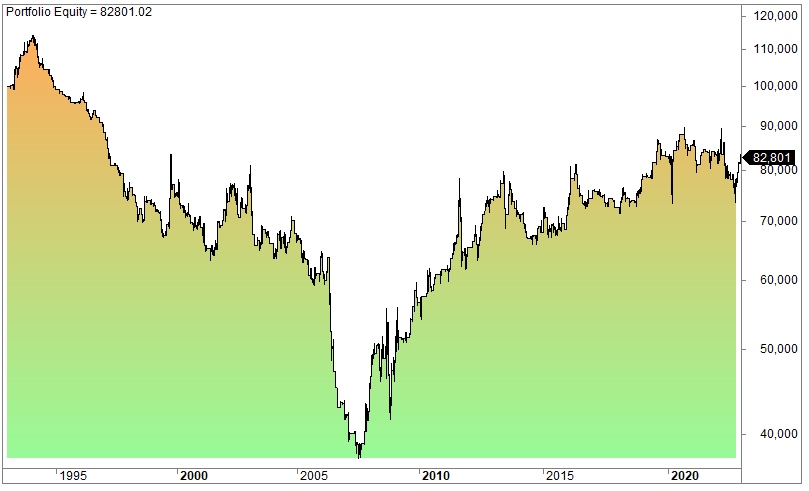

## Table of Contents

## What is the basic concept of risk-on and risk-off investing?

Risk-on and risk-off are terms used to describe the general sentiment of investors towards the market. Risk-on investing happens when investors feel confident and are willing to take more risks. They do this by investing in assets that can give higher returns but are also more likely to lose value quickly, like stocks or commodities. This usually happens when the economy is doing well, and people feel optimistic about the future.

On the other hand, risk-off investing occurs when investors are worried and want to protect their money. They move their money into safer investments, like government bonds or cash, which offer lower returns but are less likely to lose value. This shift often happens during times of economic uncertainty or when there are big events that make people nervous, like political instability or a financial crisis.

Understanding these concepts can help investors make better decisions based on the current mood of the market. By recognizing whether the market is in a risk-on or risk-off phase, investors can adjust their portfolios to either seek higher returns or protect their investments from potential losses.

## How do economic indicators influence risk-on and risk-off strategies?

Economic indicators play a big role in deciding whether investors should go for risk-on or risk-off strategies. These indicators, like the unemployment rate, inflation, and GDP growth, give clues about how the economy is doing. When these indicators show that the economy is strong and growing, investors feel more confident. They believe that companies will make more money, so they are more willing to invest in risky assets like stocks. This is what we call a risk-on environment. For example, if the unemployment rate goes down, it means more people have jobs and are likely to spend more money, which can boost the economy and make investors feel safer about taking risks.

On the flip side, when economic indicators suggest that the economy might be heading into trouble, investors get nervous and switch to risk-off strategies. If inflation is rising too fast or if GDP growth is slowing down, it can signal that tough times might be ahead. In these situations, investors pull their money out of risky investments and put it into safer ones like government bonds or cash. They do this to protect their money from losing value if the economy takes a downturn. So, keeping an eye on economic indicators helps investors decide when to take risks and when to play it safe.

## What are the typical assets associated with risk-on and risk-off periods?

During risk-on periods, investors feel good about the economy and are willing to take more chances. They often put their money into stocks, especially those of smaller companies or in new industries that could grow a lot. They also invest in commodities like gold or oil, and sometimes in currencies from countries with strong economies. These assets can go up and down a lot, but if things go well, they can make a lot of money.

In risk-off periods, investors are worried and want to keep their money safe. They move their money into things like government bonds, which are seen as very safe because they are backed by the government. They also put money into cash or cash-like investments, like money market funds. These don't grow as much, but they are less likely to lose value if the economy gets worse.

## How can an investor identify a shift from risk-on to risk-off or vice versa?

An investor can spot a shift from risk-on to risk-off by watching the news and economic reports. If they see bad news like a big drop in jobs or a slowdown in how fast the economy is growing, it might mean people are getting worried. They can also look at how the stock market is doing. If stock prices start falling a lot, it's a sign that investors are moving their money out of risky investments and into safer ones. This kind of shift often happens quickly, so staying up to date with the news and market trends is important.

On the other hand, a move from risk-off to risk-on can be seen when good news comes out. If the economy is doing better, like if more people are getting jobs or if companies are making more money, investors start feeling more confident. They might see stock prices going up and hear about people talking about new opportunities in the market. This is a sign that investors are ready to take more risks again. Keeping an eye on these signs helps investors decide when to change their investment strategies.

## What are the psychological factors that drive risk-on and risk-off behaviors?

Psychological factors play a big role in whether investors choose risk-on or risk-off behaviors. When people feel good about the economy and the future, they are more likely to take risks. This feeling of optimism can come from good news, like a strong job market or rising company profits. When investors are optimistic, they believe that their investments will grow, so they put their money into things like stocks and commodities, hoping to make a lot of money. This is what drives risk-on behavior.

On the other hand, fear and uncertainty can push investors towards risk-off behavior. If there's bad news, like a financial crisis or high inflation, people start to worry about losing their money. This fear makes them want to protect what they have, so they move their money into safer investments like government bonds or cash. These investments might not grow as much, but they are less likely to lose value during tough times. So, the shift between risk-on and risk-off is often driven by how investors feel about the world around them.

## How do global events impact risk-on and risk-off investing strategies?

Global events can really shake up the way investors think about risk. When something big happens, like a war or a big election, it can make people feel unsure about what's going to happen next. If the news is bad, like a country going into a recession or a big natural disaster, investors get scared. They start to worry about losing their money, so they move it into safe places like government bonds or cash. This is what we call a risk-off strategy. They do this to protect their money from losing value if things get worse.

On the other hand, good global news can make investors feel more confident. If a big trade deal is signed or if a country's economy starts to grow really fast, people start to feel hopeful. They think that companies will do well and make more money, so they're more willing to take risks. They put their money into things like stocks or commodities, hoping to make a lot of money. This is a risk-on strategy. So, what's happening around the world can push investors to either play it safe or go for bigger rewards.

## What are the common pitfalls to avoid when employing risk-on and risk-off strategies?

One common pitfall when using risk-on and risk-off strategies is getting too emotional. When investors feel really scared or really excited, they might make quick decisions without thinking them through. For example, if the stock market starts to drop, they might panic and sell all their stocks, even if it's just a short-term dip. On the other hand, if they hear about a new hot investment, they might jump in without doing enough research. It's important to stay calm and make decisions based on facts, not just feelings.

Another mistake is not having a clear plan. Investors should decide ahead of time what they will do when the market shifts. Without a plan, they might end up making choices that don't fit with their long-term goals. For instance, they might move all their money into safe investments during a risk-off period, but then forget to move it back when things get better. Having a strategy helps them stay on track and make smarter choices, no matter what's happening in the market.

## How can risk-on and risk-off strategies be integrated into a diversified investment portfolio?

Risk-on and risk-off strategies can be part of a diversified investment portfolio by balancing different types of investments. When investors feel good about the economy, they might put more money into stocks, commodities, and other assets that could grow a lot. But they should also keep some money in safer investments like bonds or cash. This way, if the market suddenly changes and goes into a risk-off period, they won't lose all their money. By having a mix of risky and safe investments, investors can take advantage of good times while still being protected during bad times.

It's important for investors to keep an eye on the market and adjust their portfolio as things change. If they see signs that the market is moving from risk-on to risk-off, they can slowly move more money into safer investments. And when the market starts to look more risk-on again, they can shift some money back into riskier assets. This kind of flexibility helps them stay balanced and ready for whatever the market does next. By regularly checking and adjusting their investments, they can make sure their portfolio stays diversified and strong.

## What advanced tools and indicators can be used to predict risk-on and risk-off market movements?

To predict risk-on and risk-off market movements, investors can use advanced tools like technical analysis software. This software looks at past market data to find patterns that might show when the market is about to change. For example, it can use moving averages to see if stock prices are going up or down over time. Another tool is the Relative Strength Index (RSI), which helps investors know if a stock is being bought too much or sold too much. If the RSI is high, it might mean the market is too excited and could soon switch to a risk-off mood.

Economic indicators are also important for predicting market shifts. The Volatility Index (VIX), often called the "fear gauge," measures how much people expect the market to move around. A high VIX can mean investors are worried and might be moving to risk-off investments. Another useful indicator is the yield curve, which compares short-term and long-term interest rates. If the yield curve starts to flatten or even invert, it might signal that investors are getting nervous about the future, pushing them towards risk-off strategies. By keeping an eye on these tools and indicators, investors can get a better idea of when to switch between risk-on and risk-off approaches.

## How do different asset classes react differently during risk-on and risk-off periods?

During risk-on periods, when investors feel good about the economy, they put more money into stocks, especially those of smaller companies or new industries that could grow a lot. They also invest in commodities like gold or oil, and sometimes in currencies from countries with strong economies. These assets can go up and down a lot, but if things go well, they can make a lot of money. For example, tech stocks might see big gains because investors believe in the future growth of technology companies. Real estate investment trusts (REITs) might also do well as people feel confident about investing in property.

In contrast, during risk-off periods, when investors are worried and want to keep their money safe, they move their money into safer investments. Government bonds are a popular choice because they are seen as very safe, backed by the government. Investors also put money into cash or cash-like investments, like money market funds. These don't grow as much, but they are less likely to lose value if the economy gets worse. For instance, if there's a financial crisis, you might see a big drop in stock prices, but government bonds might stay steady or even go up as people look for safety.

## What are the long-term implications of consistently following a risk-on or risk-off strategy?

Consistently following a risk-on strategy can lead to big gains when the market is doing well, but it can also be risky over the long term. If an investor always puts their money into stocks, commodities, or other high-risk investments, they might make a lot of money when the economy is strong. But if the market suddenly turns bad, like during a financial crisis, they could lose a lot of money quickly. Over time, this kind of strategy can be very stressful and might not be the best way to build wealth steadily. It's important for investors to think about balancing their risk-on investments with some safer ones to protect their money over the long haul.

On the other hand, sticking to a risk-off strategy all the time can keep an investor's money safe, but it might also mean missing out on big opportunities. If someone always puts their money into government bonds or cash, their investments won't lose value as easily during tough times. But these safe investments usually don't grow as much as riskier ones, so over many years, the investor might not see their money grow as much as it could. A balanced approach, where an investor shifts between risk-on and risk-off depending on what's happening in the market, can help them take advantage of good times while still being protected during bad times.

## How can algorithmic trading be utilized to capitalize on risk-on and risk-off market dynamics?

Algorithmic trading can help investors make money from risk-on and risk-off market changes by using computer programs to buy and sell investments quickly. These programs can watch the market all the time and spot when it's switching from feeling good to feeling worried, or the other way around. When the market seems to be moving into a risk-on phase, the algorithm can buy stocks or other risky investments that might go up in value. And when it looks like things are turning risk-off, the algorithm can sell those risky investments and buy safer ones like government bonds. This way, the investor can try to make money no matter which way the market is going.

Using algorithms can also help take the emotion out of investing. People often make bad choices when they're scared or excited, but a computer program doesn't feel those things. It just follows the rules it's been given. So, if an investor sets up their algorithm to look for certain signs that the market is changing, like big drops or rises in stock prices, the program can act fast without getting nervous. This can be a big advantage in a market that's always moving between risk-on and risk-off moods.

## References & Further Reading

[1]: Dacorogna, M. M., Gençay, R., Müller, U. A., Olsen, R. B., & Pictet, O. V. (2001). ["An Introduction to High-Frequency Finance."](https://www.sciencedirect.com/book/9780122796715/an-introduction-to-high-frequency-finance) Academic Press.

[2]: Kissell, R. (2013). ["The Science of Algorithmic Trading and Portfolio Management."](https://www.sciencedirect.com/book/9780124016897/the-science-of-algorithmic-trading-and-portfolio-management) Academic Press.

[3]: Poitras, G. (2016). ["Financial Risk Modelling and Portfolio Optimization with R."](https://onlinelibrary.wiley.com/doi/book/10.1002/9781119119692) Wiley.

[4]: Narang, R. K. (2013). ["Inside the Black Box: A Simple Guide to Quantitative and High-Frequency Trading."](https://onlinelibrary.wiley.com/doi/book/10.1002/9781118662717) Wiley.

[5]: Aldridge, I. (2013). ["High-Frequency Trading: A Practical Guide to Algorithmic Strategies and Trading Systems."](https://www.ahmetbeyefendi.com/wp-content/uploads/2020/07/High-Frequency-Trading-Irene-Aldridge.pdf) Wiley.