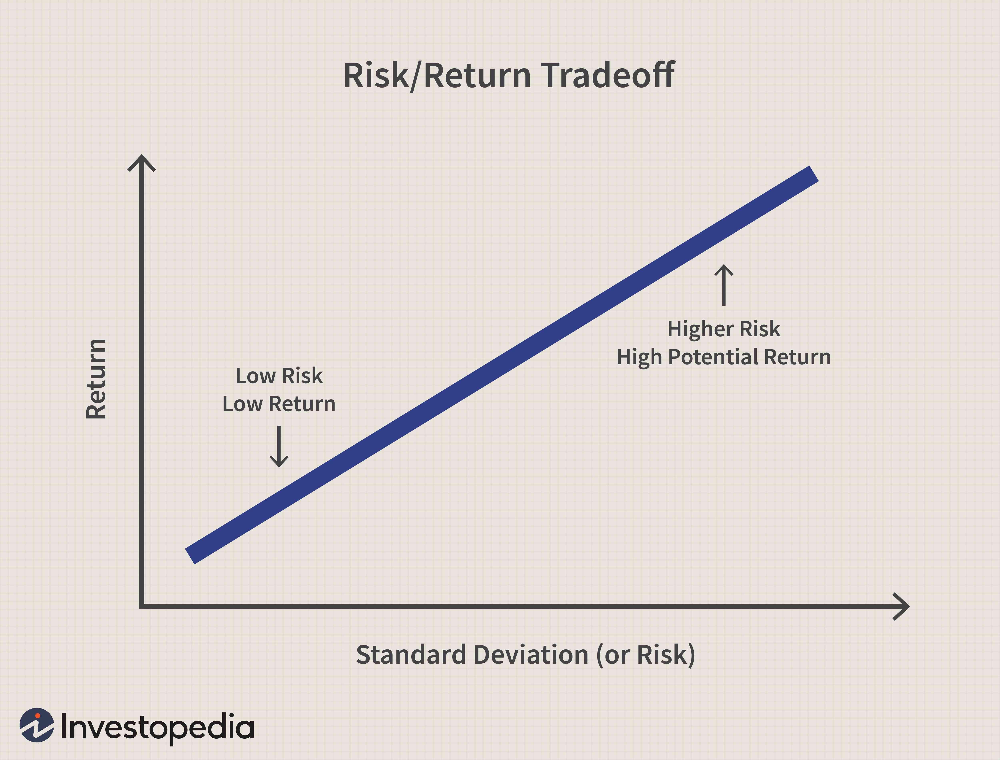

In today's dynamic financial environment, analyzing market sentiments through the 'risk on risk off' (RORO) indicator has become a critical strategy for traders. The RORO indicator is used to determine the market's current risk appetite, distinguishing between 'risk on' periods when investors seek higher-yielding, riskier assets, and 'risk off' times when they prefer safer havens such as bonds or cash. This binary approach helps traders make informed decisions based on prevailing investor sentiment, facilitating more agile asset allocation and capital deployment.

Algorithmic trading, characterized by the use of computer algorithms to execute trades at high speeds and volumes, stands to gain significantly from RORO indicators. By incorporating these indicators, algorithms can dynamically adjust trading positions in response to shifting market sentiments. This adaptability enables traders to better manage risks and optimize trading performance by aligning their strategies with the risk-taking or risk-averse inclinations of broader markets.



This article aims to explore the concept of risk on risk off indicators and their application in algorithmic trading. By understanding and leveraging these indicators, traders can enhance their ability to respond to market movements, thereby potentially increasing the profitability and robustness of their trading systems in a continuously evolving financial landscape.

## Table of Contents

## Understanding Risk On Risk Off Indicators

A risk on risk off (RORO) indicator is a financial tool that measures the inclination of investors towards risk exposure in different market conditions. In a "risk on" scenario, the market displays a higher risk appetite, prompting investors to allocate capital to higher-yielding assets such as equities, commodities, or high-yield bonds. These assets generally offer the potential for greater returns, albeit with increased risk. Conversely, in a "risk off" environment, there is a shift towards risk aversion, with a preference for safer investments, including government bonds, gold, or cash. This transition reflects investors' desire to preserve capital amid uncertainty or perceived threats in the market.

Understanding the dynamics behind these shifts is essential for the development of adaptable trading strategies. A key aspect of RORO indicators is their ability to provide insights into market sentiment, allowing traders to adjust their portfolios in response to changes. Factors influencing these market shifts can include economic data releases, geopolitical events, or central bank policies, all of which may alter investor perception and, consequently, asset allocation.

To effectively utilize RORO indicators, traders must recognize the distinct characteristics of assets typically associated with each market condition. For example, in a "risk on" environment, equities and commodities like oil or industrial metals may experience upward price movements. Conversely, during "risk off" periods, currencies like the Japanese yen or Swiss franc tend to strengthen as investors seek safe-havens.

Incorporating RORO indicators into a trading strategy can enhance its adaptability, enabling traders to optimize their positions based on prevailing market sentiment. The successful application of these indicators depends on a comprehensive understanding of the market forces at play and the ability to act swiftly in response to sentiment shifts.

## Algorithmic Trading and RORO Indicators

Algorithmic trading leverages predefined rules and high-speed computing to execute trades with precision, making it an ideal framework for incorporating 'risk on risk off' (RORO) indicators. These indicators assist algorithms in dynamically adjusting asset allocations based on shifts in market sentiment. The primary advantage of integrating RORO indicators into [algorithmic trading](/wiki/algorithmic-trading) lies in their capacity to enhance risk management and optimize returns.

RORO indicators capture investor sentiment by assessing whether the market is in a 'risk on' or 'risk off' state. In a 'risk on' environment, investors exhibit an appetite for higher-risk assets, such as equities and emerging market currencies. Conversely, in a 'risk off' environment, there is a shift towards safer investments like government bonds and stable currencies. By leveraging real-time data feeds and market signals, algorithms using RORO indicators can adjust positions, aligning with these sentiment trends.

For instance, algorithms can be designed to increase equity exposure during 'risk on' phases by buying into indices or specific stocks that show strong [momentum](/wiki/momentum). Conversely, in a 'risk off' scenario, the algorithm might allocate more capital to bonds or gold, safeguarding against potential downturns. A Python example to illustrate how an algorithm might use RORO signals to adjust positions could involve basic logic for reallocating funds:

```python
def adjust_portfolio(roro_signal, portfolio):
    if roro_signal == 'risk_on':
        portfolio['equities'] += 0.1 * portfolio['cash']
        portfolio['bonds'] -= 0.1 * portfolio['bonds']
    elif roro_signal == 'risk_off':
        portfolio['bonds'] += 0.1 * portfolio['cash']
        portfolio['equities'] -= 0.1 * portfolio['equities']
    return portfolio
```

An efficient use of RORO indicators in algorithms also mitigates risks by preemptively adjusting portfolios before broad market movements lead to potential losses. This dynamic reallocation is crucial in volatile markets, where sentiment can shift rapidly.

Furthermore, incorporating RORO indicators can bolster algorithmic trading performance by facilitating enhanced returns. When algorithms correctly interpret and act on market sentiment changes, they can capture opportunities for profit while avoiding periods of heightened risk. Consequently, traders deploying such strategies might witness not only better capital preservation but also amplified gains during favorable market conditions.

The integration of RORO indicators into algorithmic trading systems represents a sophisticated approach to modern trading. It combines the computational efficiency of algorithms with insights drawn from market sentiment, offering traders a powerful tool to navigate complex financial landscapes.

## Assets Influenced by RORO Indicators

Risk on risk off (RORO) indicators play a crucial role in guiding traders by influencing the asset allocation decisions based on the prevailing market sentiment. Understanding which assets are typically considered 'risk on' or 'risk off' is essential for traders to refine their strategies and optimize their portfolios. 

In 'risk on' environments, where investors exhibit a greater appetite for risk due to positive market sentiments, assets such as equities, high-yield bonds, and certain commodities like oil tend to be favored. Equities, representing ownership in companies, are often pursued for their potential higher returns during periods of economic optimism. High-yield bonds, though associated with a higher risk relative to investment-grade securities, offer attractive yields that become appealing in conditions where risk-taking is rewarded. Similarly, commodities tied to economic expansion, such as oil and industrial metals, see increased demand as indicators of global growth prospects.

Conversely, in 'risk off' scenarios, typically triggered by geopolitical tensions, economic downturns, or market [volatility](/wiki/volatility-trading-strategies), investors lean towards safer assets. Government bonds and high-quality corporate bonds become pivotal in such circumstances due to their reputation for stability and reliability. Additionally, assets such as the U.S. dollar and the Swiss franc often gain in value as they are perceived as safe-haven currencies, preserving capital during tumultuous times. Precious metals like gold are also popular in risk off phases due to their historic role as a store of value.

Cryptocurrencies, particularly Bitcoin, present a unique case in the risk on risk off paradigm. Often viewed as a 'risk on' asset, Bitcoin exhibits significant price movements consistent with shifts in investor sentiment. Its decentralized nature and high volatility make it attractive during risk on periods when investors seek speculative opportunities, albeit with the understanding of its inherent risk.

Emerging market currencies and stocks generally fall into the 'risk on' category. During optimistic market conditions, the potential for rapid economic growth and higher returns in emerging markets draws investor interest. However, such investments can be highly susceptible to global risk appetite shifts, leading to increased volatility during risk off phases.

Thus, recognizing whether an asset is typically 'risk on' or 'risk off' involves understanding the broader economic indicators and investor behavior, providing traders critical insights in strategizing their trades effectively.

## Building a RORO Indicator-Based Trading Strategy

Integrating Risk On Risk Off (RORO) indicators into a trading strategy requires defining algorithms that identify and respond to changes in market sentiment. The core of any RORO-based strategy is the algorithm's ability to dynamically adjust asset positions based on real-time sentiment analysis, thereby optimizing portfolio allocation between risk assets and safe-haven assets.

One effective way to integrate RORO indicators is by combining them with moving averages and other technical indicators. For instance, traders often utilize the moving average convergence divergence (MACD) or relative strength index (RSI) in conjunction with RORO indicators to validate trends and increase predictive accuracy. These technical indicators provide additional insight into momentum and trend strength, supporting more informed decision-making.

Here's a simple example in Python showcasing how a basic RORO strategy might be structured using moving averages:

```python
import pandas as pd
import numpy as np

# Load your market sentiment and asset price data
data = pd.read_csv('market_data.csv')
prices = data['price']
sentiment_score = data['sentiment']

# Calculate short-term and long-term moving averages
short_window = 40
long_window = 100
signals = pd.DataFrame(index=data.index)
signals['price'] = prices
signals['short_ma'] = prices.rolling(window=short_window, min_periods=1).mean()
signals['long_ma'] = prices.rolling(window=long_window, min_periods=1).mean()

# Generate trading signals: 1 for 'risk on' (buy), 0 for no action, -1 for 'risk off' (sell)
signals['signal'] = 0.0
signals['signal'][short_window:] = np.where(signals['short_ma'][short_window:] > signals['long_ma'][short_window:], 1.0, -1.0)

# Incorporate RORO sentiment score
threshold = 0.5
signals['signal'] = np.where(sentiment_score > threshold, signals['signal'], -signals['signal'])

# Backtest by calculating returns
signals['positions'] = signals['signal'].diff()
portfolio_returns = signals['positions'] * prices.pct_change().shift(-1)

# Evaluate the strategy
cumulative_returns = (portfolio_returns + 1).cumprod()
print("Cumulative Returns:", cumulative_returns.iloc[-1])
```

Backtesting is a crucial step in refining a RORO-based strategy. It involves running the algorithm on historical data to simulate its performance under different market conditions. This process helps identify potential weaknesses and allows for optimization before deploying the strategy in real-time markets. Metrics such as Sharpe ratio, maximum drawdown, and return on investment (ROI) are often analyzed to ascertain the strategy's effectiveness.

Ultimately, integrating RORO indicators requires a robust framework capable of processing vast amounts of real-time data, ensuring timely and efficient reallocations of assets based on current market sentiment.

## Backtesting RORO Strategies

Backtesting RORO strategies involves the critical process of applying historical data to simulate how a risk on risk off (RORO) trading strategy would have performed in various market conditions. This evaluation methodology is vital for traders seeking to validate their strategies before deployment in live markets.

To begin with, the [backtesting](/wiki/backtesting) framework must encompass several key components:

1. **Data Sourcing and Preparation**: Historical price data of assets influenced by RORO indicators, such as equities, bonds, or commodities, must be collected and preprocessed. This step often involves adjusting data for corporate actions, handling missing data, and normalizing datasets to ensure consistency.

2. **Trade Simulation**: Using these datasets, a trading algorithm informed by RORO indicators can be developed. Typically, this algorithm would be programmed to recognize the risk on or risk off signals and adjust asset positions accordingly. Python is a common language for such simulations due to its robust libraries:

   ```python
   import pandas as pd
   import numpy as np

   # Example: Simple Moving Average as a sentiment indicator
   def moving_average_strategy(data, short_window=50, long_window=200):
       data['Short_MA'] = data['Close'].rolling(window=short_window).mean()
       data['Long_MA'] = data['Close'].rolling(window=long_window).mean()
       data['Signal'] = 0
       data['Signal'][short_window:] = np.where(data['Short_MA'][short_window:] > data['Long_MA'][short_window:], 1, 0)
       data['Position'] = data['Signal'].diff()
       return data

   historical_data = pd.read_csv('historical_data.csv')
   strategy_data = moving_average_strategy(historical_data)
   ```

3. **Performance Metrics**: Evaluating the success of the strategy involves calculating metrics such as cumulative returns, maximum drawdown, volatility, and the Sharpe ratio. These metrics provide insights into the risk and return profile of the strategy.

   Cumulative returns, for instance, can be calculated as follows:
$$
   \text{Cumulative Returns} = \left( \prod_{t=1}^{T} (1 + \text{Daily Return}_t) \right) - 1

$$

   Where $T$ is the total number of trading days.

4. **Optimization and Validation**: Following the initial backtest, strategies should undergo optimization to fine-tune parameters and validation using out-of-sample data to avoid overfitting. A common practice is to use a walk-forward optimization approach, which allows the model to adapt to changing market conditions.

The efficacy of a RORO-based strategy can be greatly influenced by how accurately the backtest reflects realistic conditions, including transaction costs, slippage, and changing [liquidity](/wiki/liquidity-risk-premium) conditions. Thus, while backtesting offers invaluable insights, its limitations must be recognized, and it should be complemented with forward testing in a controlled environment before full-scale implementation.

## Case Study: Bitcoin and RORO Indicators

Bitcoin is frequently categorized as a 'risk on' asset within the financial markets, making it an integral component of Risk On Risk Off (RORO) strategies. During periods of heightened market optimism, investors are inclined to pursue riskier assets in anticipation of higher returns, positioning Bitcoin as an attractive option due to its historical volatility and potential for substantial appreciation.

The correlation between Bitcoin's price movements and market sentiment changes makes it a suitable candidate for RORO indicator-based trading. In this context, RORO indicators serve to capture shifts in market sentiment, prompting algorithmic trading systems to adjust their exposure to Bitcoin accordingly. When market conditions indicate a 'risk on' environment, these systems increase their holdings in Bitcoin, anticipating upward price movements, while transitioning to safer assets during 'risk off' phases to mitigate potential losses.

Algorithmic integration of RORO indicators for Bitcoin trading necessitates the development of models capable of capturing sentiment changes efficiently. These can include a combination of technical indicators, such as moving averages, and sentiment analysis tools, which together form a comprehensive market outlook. For example, a Python-based algorithm might implement the following pseudocode to adjust Bitcoin positions:

```python
# Simplified Algorithm Example
def calculate_moving_average(data, window_size):
    return data.rolling(window=window_size).mean()

def roro_trading_strategy(bitcoin_data, sentiment_data):
    short_ma = calculate_moving_average(bitcoin_data, window_size=30)
    long_ma = calculate_moving_average(bitcoin_data, window_size=90)

    for idx in range(len(bitcoin_data)):
        if sentiment_data[idx] > 0.5 and short_ma[idx] > long_ma[idx]:
            execute_trade('buy', bitcoin_data[idx])
        elif sentiment_data[idx] < 0.5 or short_ma[idx] < long_ma[idx]:
            execute_trade('sell', bitcoin_data[idx])

def execute_trade(action, price):
    print(f"Executing {action} trade at price {price}")

# Usage
# bitcoin_data and sentiment_data would be populated with historical and
# sentiment data respectively. Their indices should correspond accurately.
roro_trading_strategy(bitcoin_data, sentiment_data)
```

Testing such algorithms on historical data provides valuable insights into their performance under various market conditions. Backtesting helps verify the effectiveness of RORO indicators by simulating trades that would have occurred during different timeframes. For Bitcoin, these tests often affirm its responsiveness to sentiment shifts, thereby validating its reputation as a 'risk on' asset.

Conducting comprehensive backtesting further refines the strategy, identifying potential flaws and optimizing parameters to enhance returns. This systematic approach not only aids in understanding the dynamics of Bitcoin trading influenced by market sentiment but also underscores the broader applicability of RORO indicators in diversified trading portfolios. As such, Bitcoin remains a critical asset in modeling and implementing 'risk on' strategies in algorithmic trading.

## Implementing Risk Management in RORO Trading

Effective risk management is crucial when utilizing risk on risk off (RORO) indicators in trading, particularly due to the necessity of swiftly adjusting asset allocations in reaction to market volatility. This rapid shift between asset classes aims to maintain the portfolio's value during fluctuating market conditions. Two primary tools can aid traders in implementing robust risk management strategies: stop-loss orders and volatility analysis.

Stop-loss orders automatically sell an asset when its price falls to a specified level, thus limiting potential losses. In a RORO strategy, where market sentiment can change rapidly, utilizing stop-loss orders ensures that a trader's exposure to high-risk assets is minimized during adverse market conditions. For example, a trader holding a high-yield bond labeled as a "risk on" asset might set a stop-loss order at a 5% decline from its purchase price. This order would execute automatically, safeguarding the portfolio from further losses as sentiment shifts to a "risk off" preference for safer assets like government bonds.

Volatility analysis, another critical component of risk management, involves assessing the price fluctuations of assets to predict future movements. By analyzing historical volatility data, traders can estimate the potential risk associated with holding a specific asset. For instance, Python's `numpy` and `pandas` libraries can be used to calculate historical volatility. The following Python snippet demonstrates how to compute the rolling standard deviation, a measure of volatility, for a given asset's price data:

```python
import pandas as pd
import numpy as np

# Sample data: daily closing prices of an asset
data = pd.DataFrame({
    'Close': [100, 102, 101, 105, 107, 110, 108, 109, 111, 115]
})

# Calculate daily returns as percentage change
data['Returns'] = data['Close'].pct_change()

# Calculate rolling 5-day standard deviation (volatility)
data['Volatility'] = data['Returns'].rolling(window=5).std()

print(data)
```

By integrating such volatility measures into a trading algorithm, traders can identify when an asset's price volatility exceeds predefined thresholds. High volatility might signal heightened risk, prompting a reallocation to lower-volatility assets within the RORO framework.

Incorporating these tools into a comprehensive RORO trading strategy empowers traders to better manage risks associated with sentiment-driven market fluctuations. Rapid asset reallocation coupled with stringent stop-loss orders and rigorous volatility analysis can protect the portfolio's integrity during uncertain and rapidly changing markets.

## Conclusion

Risk on risk off (RORO) indicators serve as a powerful tool for algorithmic traders aiming to navigate the complexities of market sentiments. These indicators can help systematically identify shifts in investor risk appetite, allowing traders to programmatically adjust their strategies to capitalize on changing market conditions. By leveraging RORO indicators, traders can finely tune their algorithms to transition between "risk on" assets, which typically offer higher returns but with increased volatility, and "risk off" assets, which are generally more stable but offer lower returns during times of market uncertainty.

Proper implementation and continuous optimization of RORO indicators can significantly enhance trading strategies and overall returns. Traders must integrate these indicators with robust algorithms capable of swift execution to exploit short-lived opportunities and minimize exposure to risk during adverse market conditions. Continuous monitoring and refinement of these algorithms ensure they remain effective amidst evolving market dynamics. This includes backtesting strategies against historical data to validate their robustness and responsiveness to actual market scenarios.

As market dynamics continue to evolve, staying updated with RORO indicators and their applications in algorithmic trading is invaluable. With the increasing complexity and interconnectedness of global markets, traders who effectively incorporate RORO indicators into their strategies are better equipped to anticipate and react to shifts in market sentiment. This agility helps preserve capital during downturns and optimize gains during periods of favorable market conditions. By maintaining a focus on these indicators, algorithmic traders can enhance their competitive edge and improve their portfolio performance in the ever-changing financial landscape.

## FAQ

### FAQ

**What is 'risk on risk off' in the financial markets?**

'Risk on risk off' (RORO) is a market sentiment paradigm used to describe investor behavior in response to changes in market risk. During a 'risk on' environment, investors are more inclined to invest in higher-yielding, riskier assets such as stocks, high-yield bonds, and commodities. Conversely, in a 'risk off' scenario, market participants shift towards safer assets like government bonds and gold, reflecting a preference for stability and minimal risk exposure. This dynamic is crucial for traders aiming to align their strategies with prevailing investor sentiment and market conditions.

**How do RORO indicators function in algorithmic trading?**

In algorithmic trading, RORO indicators operate as signals that guide algorithms to adjust asset allocations based on shifts in investor sentiment. These indicators analyze various market factors, such as volatility indices (like the VIX), currency movements, and [interest rate](/wiki/interest-rate-trading-strategies) spreads, to determine the prevailing risk appetite. For example, an upward trend in the VIX might indicate a transition to a 'risk off' environment, prompting algorithms to pivot towards safer assets automatically. The integration of RORO indicators allows for dynamic portfolio adjustments, optimizing trading strategies in response to real-time market sentiment changes.

**What are the key benefits of using RORO indicators?**

The use of RORO indicators offers several advantages for traders and investors:

1. **Enhanced Risk Management**: By identifying shifts in market sentiment, traders can better manage risk by adjusting exposure to volatile assets accordingly.

2. **Profit Optimization**: Aligning trading positions with market sentiment helps in capitalizing on market trends, potentially increasing returns during favorable conditions.

3. **Strategic Flexibility**: The automatic adjustment of trading algorithms based on RORO indicators allows for strategic flexibility, enabling traders to swiftly respond to market dynamics.

4. **Market Sentiment Coordination**: RORO indicators help synchronize trading activities with global market ebbs and flows, offering insights into broad investor behavior.

**How can traders backtest RORO-based strategies?**

Backtesting RORO-based strategies involves simulating algorithmic trading using historical market data to assess how these strategies would have performed. This process typically includes:

1. **Data Collection**: Gather historical data including prices, interest rates, and volatility indices.

2. **Algorithm Development**: Implement trading algorithms that incorporate RORO indicators, defining entry and exit rules based on historical sentiment shifts.

3. **Simulation**: Run the strategies over historical data to simulate past market conditions and assess performance metrics such as returns, volatility, and drawdowns.

4. **Evaluation**: Analyze the results to determine the potential profitability and robustness of the strategies. Adjust algorithms based on insights gained to improve performance.

5. **Optimization**: Fine-tune the parameters within the algorithms for better accuracy and returns in various market conditions.

Backtesting ensures the reliability and effectiveness of RORO-based strategies before their deployment in live trading environments. This thorough evaluation helps in refining algorithms, thereby enhancing future trading outcomes.

## References & Further Reading

[1]: Bergstra, J., Bardenet, R., Bengio, Y., & Kégl, B. (2011). ["Algorithms for Hyper-Parameter Optimization."](https://papers.nips.cc/paper/4443-algorithms-for-hyper-parameter-optimization) Advances in Neural Information Processing Systems 24.

[2]: ["Advances in Financial Machine Learning"](https://www.amazon.com/Advances-Financial-Machine-Learning-Marcos/dp/1119482089) by Marcos Lopez de Prado

[3]: ["Evidence-Based Technical Analysis: Applying the Scientific Method and Statistical Inference to Trading Signals"](https://www.amazon.com/Evidence-Based-Technical-Analysis-Scientific-Statistical/dp/0470008741) by David Aronson

[4]: ["Machine Learning for Algorithmic Trading"](https://github.com/stefan-jansen/machine-learning-for-trading) by Stefan Jansen

[5]: ["Quantitative Trading: How to Build Your Own Algorithmic Trading Business"](https://books.google.com/books/about/Quantitative_Trading.html?id=j70yEAAAQBAJ) by Ernest P. Chan