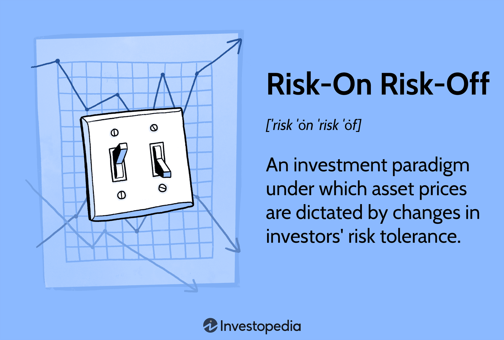

## Table of Contents

## What is the Risk-On Risk-Off trading strategy?

The Risk-On Risk-Off trading strategy is a way investors and traders decide where to put their money based on how they feel about the economy. When people feel good about the economy, they use a "Risk-On" approach. This means they are willing to take more risks and invest in things like stocks, commodities, and currencies from countries that are growing quickly. These investments can go up a lot, but they can also go down a lot.

On the other hand, when people are worried about the economy, they switch to a "Risk-Off" approach. They move their money into safer investments like government bonds, gold, and currencies from stable countries. These investments might not grow as much, but they are less likely to lose value quickly. The Risk-On Risk-Off strategy helps investors adjust their portfolios based on their current view of economic conditions.

## How does the Risk-On Risk-Off strategy work in financial markets?

The Risk-On Risk-Off strategy in financial markets is all about how investors feel about the economy. When investors are feeling good and think the economy is doing well, they go into "Risk-On" mode. This means they start buying things that could make them a lot of money but are also risky. They might buy stocks, especially from companies that are growing fast, or commodities like oil and gold. They might also invest in currencies from countries that are doing well, like the Australian dollar or the Brazilian real. The idea is to make big gains when the economy is strong.

On the other hand, when investors are worried and think the economy might be in trouble, they switch to "Risk-Off" mode. In this mode, they move their money into safer investments. They might buy government bonds, which are seen as very safe, or gold, which people often turn to when they're scared about the economy. They might also put their money into currencies from stable countries, like the US dollar or the Swiss franc. The goal here is to protect their money and avoid big losses when things are uncertain. By moving between Risk-On and Risk-Off, investors try to balance making money with keeping their investments safe.

## What are the key indicators that signal a shift from Risk-On to Risk-Off?

Investors watch several things to decide if it's time to switch from Risk-On to Risk-Off. One big thing they look at is economic data. If reports show that the economy is slowing down, like if fewer jobs are being created or if people are spending less money, investors might start to worry. They also pay attention to what's happening around the world. If there's a lot of political trouble or if other countries are having economic problems, that can make investors nervous too. Another important sign is what central banks are doing. If central banks start lowering interest rates or doing other things to help the economy, it might mean they're worried about a slowdown.

Another thing investors look at is the stock market itself. If stock prices start to drop a lot, it can be a sign that people are getting scared and moving away from risky investments. They also watch the bond market. If the prices of government bonds go up (which means their yields go down), it often means investors are looking for safe places to put their money. Finally, investors keep an eye on how much people are borrowing and lending. If it gets harder to borrow money or if banks start to be more careful about who they lend to, it can be a sign that a Risk-Off period is coming. By watching all these things, investors try to figure out when it's time to play it safe.

## Can you explain the psychological factors influencing Risk-On Risk-Off trading?

The way people feel plays a big part in the Risk-On Risk-Off trading strategy. When people are feeling good and confident about the future, they are more likely to take risks. This is because they think the economy is doing well and will keep getting better. They might hear good news about jobs or see that the stock market is going up, and this makes them feel like it's a safe time to invest in things that could make them a lot of money, like stocks or commodities. This feeling of optimism drives them to go into Risk-On mode, where they are willing to put their money into riskier investments.

On the flip side, when people start to feel worried or scared, they switch to Risk-Off mode. This often happens when there's bad news about the economy, like reports of fewer jobs or falling stock prices. People might also get nervous if there's a lot of uncertainty, like political problems or global economic issues. When they're scared, they want to protect their money, so they move it into safer investments like government bonds or gold. This shift from feeling good to feeling worried can happen quickly and can lead to big changes in how people invest their money.

## What types of assets are typically considered 'Risk-On' and 'Risk-Off'?

When people feel good about the economy, they go into Risk-On mode. This means they invest in things that could make them a lot of money but are also risky. They might buy stocks, especially from companies that are growing fast. They also might invest in commodities like oil and gold, which can go up and down a lot. Another thing they might put their money into is currencies from countries that are doing well, like the Australian dollar or the Brazilian real. These investments can be exciting because they have the chance to grow a lot, but they can also lose value quickly.

On the other hand, when people are worried about the economy, they switch to Risk-Off mode. They want to keep their money safe, so they invest in things that are less likely to lose value quickly. They might buy government bonds, which are seen as very safe because they are backed by the government. Another safe investment is gold, which people often turn to when they're scared about the economy. They might also put their money into currencies from stable countries, like the US dollar or the Swiss franc. These investments might not grow as much, but they are more likely to keep their value when things are uncertain.

## How can an investor identify the best times to switch between Risk-On and Risk-Off?

To find the best times to switch between Risk-On and Risk-Off, an investor needs to pay attention to what's happening in the economy and the world. They should look at economic reports, like how many jobs are being created or how much people are spending. If these reports show the economy is doing well, it might be a good time to go into Risk-On mode and invest in things like stocks and commodities. But if the reports show the economy is slowing down, it could be a sign to switch to Risk-Off mode and move money into safer investments like government bonds or gold. Investors also need to keep an eye on what central banks are doing. If central banks start lowering interest rates, it might mean they're worried about the economy, and it could be a good time to play it safe.

Another thing to watch is how the stock and bond markets are behaving. If stock prices are going up and people are feeling good about the market, it might be a good time to take on more risk. But if stock prices start to drop a lot, it could be a sign that people are getting scared and it's time to move into safer investments. The bond market can also give clues. If the prices of government bonds go up (which means their yields go down), it often means investors are looking for safe places to put their money. By keeping an eye on all these things, an investor can try to figure out when it's a good time to switch between Risk-On and Risk-Off.

## What are the common pitfalls to avoid when using the Risk-On Risk-Off strategy?

One common pitfall to avoid when using the Risk-On Risk-Off strategy is trying to time the market perfectly. It's hard to guess exactly when the economy will go from good to bad or vice versa. If an investor switches too early or too late, they might miss out on gains or lose money. Another mistake is not diversifying enough. Even when feeling good about the economy, putting all money into risky investments can be dangerous. It's important to spread investments across different types of assets to reduce risk.

Another pitfall is getting too emotional. When the economy looks good, it's easy to get excited and take on too much risk. But when things start to look bad, fear can make an investor sell everything too quickly. It's important to stay calm and make decisions based on facts, not feelings. Finally, not paying attention to the bigger picture can be a problem. Investors need to look at global events and long-term trends, not just what's happening right now. Ignoring these can lead to bad investment choices.

## How does global economic news impact the Risk-On Risk-Off strategy?

Global economic news plays a big role in the Risk-On Risk-Off strategy. When good news comes out from around the world, like a country's economy growing fast or a new trade deal being signed, investors feel more confident. They think the world economy is doing well, so they go into Risk-On mode. They start buying stocks, commodities, and currencies from countries that are doing well, hoping to make a lot of money. But if the news is bad, like a country facing a financial crisis or a big company going bankrupt, investors get worried. They think the economy might be in trouble, so they switch to Risk-Off mode and move their money into safer investments like government bonds and gold.

The way global economic news affects the Risk-On Risk-Off strategy can change quickly. For example, if there's a sudden problem like a war or a natural disaster in a major country, investors might get scared and go into Risk-Off mode right away. They want to protect their money from big losses. On the other hand, if there's good news, like a new technology making things better or a big country doing well economically, investors might feel more hopeful and go back into Risk-On mode. By keeping an eye on what's happening around the world, investors try to figure out the best time to switch between these two modes and make smart choices about where to put their money.

## What role do central bank policies play in influencing Risk-On Risk-Off dynamics?

Central bank policies have a big impact on whether investors feel like taking risks or playing it safe. When a central bank decides to lower interest rates or start buying bonds, it's often because they think the economy needs a boost. This kind of news can make investors feel more confident about the future. They might think the economy will get better, so they go into Risk-On mode and start buying stocks, commodities, and other things that could make them a lot of money. On the other hand, if a central bank raises interest rates or stops supporting the economy, it might mean they think things are getting too hot and need to cool down. This can make investors worried that the economy might slow down, so they switch to Risk-Off mode and move their money into safer investments like government bonds and gold.

The way central banks talk about the economy also matters a lot. If they say things are going well and they're not worried, investors might feel good and stay in Risk-On mode. But if central banks start sounding worried or unsure, it can make investors nervous. They might think something bad is going to happen, so they'll want to protect their money by going into Risk-Off mode. By watching what central banks do and say, investors try to guess what's going to happen next and decide if it's time to take risks or play it safe.

## How can the Risk-On Risk-Off strategy be integrated into a diversified investment portfolio?

The Risk-On Risk-Off strategy can be a useful part of a diversified investment portfolio by helping investors adjust their investments based on how they feel about the economy. When people feel good about the economy, they can put more money into Risk-On investments like stocks and commodities. These can grow a lot but are also risky. But they should not put all their money into these risky investments. Instead, they should spread their money around. This means having some money in Risk-On investments and some in safer, Risk-Off investments like government bonds and gold. This way, if the economy suddenly turns bad, they won't lose all their money.

Switching between Risk-On and Risk-Off investments can help keep a portfolio balanced. When the economy looks strong, an investor might move more money into Risk-On investments to try to make bigger gains. But they should always keep some money in Risk-Off investments to stay safe. When the economy starts to look shaky, they can move more money into Risk-Off investments to protect their money. By paying attention to economic news and central bank policies, an investor can decide when to make these switches. This helps them take advantage of good times while also being ready for bad times.

## What advanced tools or analytics can enhance the effectiveness of a Risk-On Risk-Off trading approach?

Using advanced tools and analytics can help make the Risk-On Risk-Off strategy work better. One helpful tool is economic indicators. These are numbers that show how the economy is doing, like how many people have jobs or how much people are spending. By looking at these numbers, an investor can guess if the economy is getting better or worse. Another tool is technical analysis, which looks at past prices of stocks and other investments to find patterns. This can help an investor decide when to switch from Risk-On to Risk-Off or the other way around. Sentiment analysis is also useful. It looks at what people are saying on social media and in the news to see if people feel good or bad about the economy.

Another way to improve the Risk-On Risk-Off strategy is by using computer programs called algorithms. These programs can look at a lot of information very quickly and make decisions based on what they find. They can help an investor switch between Risk-On and Risk-Off faster and more accurately. Risk management tools are also important. These tools help an investor keep track of how much risk they are taking and make sure they don't lose too much money if things go wrong. By using all these tools together, an investor can make smarter choices about when to take risks and when to play it safe.

## How have historical market events demonstrated the effectiveness or failure of the Risk-On Risk-Off strategy?

The Risk-On Risk-Off strategy has been shown to work well during big events like the 2008 financial crisis. When the crisis hit, investors got very scared and switched to Risk-Off mode. They moved their money out of risky things like stocks and into safer investments like government bonds and gold. This helped them avoid losing a lot of money when the stock market crashed. Later, when the economy started to get better, investors felt more confident and went back into Risk-On mode. They started buying stocks again, which helped them make money as the market went up. This shows how the strategy can help investors protect their money during bad times and make money during good times.

However, the Risk-On Risk-Off strategy doesn't always work perfectly. During the dot-com bubble in the early 2000s, many investors stayed in Risk-On mode too long. They kept buying tech stocks even though the prices were getting too high. When the bubble burst, they lost a lot of money because they didn't switch to Risk-Off in time. Another example is the flash crash of 2010, where the market dropped suddenly and then recovered quickly. Investors who switched to Risk-Off during the crash might have missed out on the quick recovery. These examples show that it can be hard to know exactly when to switch between Risk-On and Risk-Off, and sometimes the strategy can lead to mistakes.

## What are the results of backtesting RORO strategies?

Backtesting RORO strategies involves the critical process of applying historical data to simulate how a risk on risk off (RORO) trading strategy would have performed in various market conditions. This evaluation methodology is vital for traders seeking to validate their strategies before deployment in live markets.

To begin with, the [backtesting](/wiki/backtesting) framework must encompass several key components:

1. **Data Sourcing and Preparation**: Historical price data of assets influenced by RORO indicators, such as equities, bonds, or commodities, must be collected and preprocessed. This step often involves adjusting data for corporate actions, handling missing data, and normalizing datasets to ensure consistency.

2. **Trade Simulation**: Using these datasets, a trading algorithm informed by RORO indicators can be developed. Typically, this algorithm would be programmed to recognize the risk on or risk off signals and adjust asset positions accordingly. Python is a common language for such simulations due to its robust libraries:

   ```python
   import pandas as pd
   import numpy as np

   # Example: Simple Moving Average as a sentiment indicator
   def moving_average_strategy(data, short_window=50, long_window=200):
       data['Short_MA'] = data['Close'].rolling(window=short_window).mean()
       data['Long_MA'] = data['Close'].rolling(window=long_window).mean()
       data['Signal'] = 0
       data['Signal'][short_window:] = np.where(data['Short_MA'][short_window:] > data['Long_MA'][short_window:], 1, 0)
       data['Position'] = data['Signal'].diff()
       return data

   historical_data = pd.read_csv('historical_data.csv')
   strategy_data = moving_average_strategy(historical_data)
   ```

3. **Performance Metrics**: Evaluating the success of the strategy involves calculating metrics such as cumulative returns, maximum drawdown, volatility, and the Sharpe ratio. These metrics provide insights into the risk and return profile of the strategy.

   Cumulative returns, for instance, can be calculated as follows:
$$
   \text{Cumulative Returns} = \left( \prod_{t=1}^{T} (1 + \text{Daily Return}_t) \right) - 1

$$

   Where $T$ is the total number of trading days.

4. **Optimization and Validation**: Following the initial backtest, strategies should undergo optimization to fine-tune parameters and validation using out-of-sample data to avoid overfitting. A common practice is to use a walk-forward optimization approach, which allows the model to adapt to changing market conditions.

The efficacy of a RORO-based strategy can be greatly influenced by how accurately the backtest reflects realistic conditions, including transaction costs, slippage, and changing [liquidity](/wiki/liquidity-risk-premium) conditions. Thus, while backtesting offers invaluable insights, its limitations must be recognized, and it should be complemented with forward testing in a controlled environment before full-scale implementation.

## References & Further Reading

[1]: Bergstra, J., Bardenet, R., Bengio, Y., & Kégl, B. (2011). ["Algorithms for Hyper-Parameter Optimization."](https://papers.nips.cc/paper/4443-algorithms-for-hyper-parameter-optimization) Advances in Neural Information Processing Systems 24.

[2]: ["Advances in Financial Machine Learning"](https://www.amazon.com/Advances-Financial-Machine-Learning-Marcos/dp/1119482089) by Marcos Lopez de Prado

[3]: ["Evidence-Based Technical Analysis: Applying the Scientific Method and Statistical Inference to Trading Signals"](https://www.amazon.com/Evidence-Based-Technical-Analysis-Scientific-Statistical/dp/0470008741) by David Aronson

[4]: ["Machine Learning for Algorithmic Trading"](https://github.com/stefan-jansen/machine-learning-for-trading) by Stefan Jansen

[5]: ["Quantitative Trading: How to Build Your Own Algorithmic Trading Business"](https://books.google.com/books/about/Quantitative_Trading.html?id=j70yEAAAQBAJ) by Ernest P. Chan