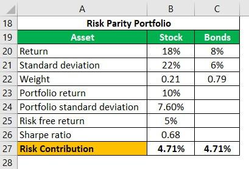

## Table of Contents

## What is risk parity asset allocation?

Risk parity asset allocation is a way of organizing investments so that each part of your portfolio contributes equally to the overall risk. Instead of putting more money into stocks because they might grow more, risk parity focuses on balancing the risk from each type of investment. This means you might put less money into stocks and more into bonds or other assets, depending on how risky they are.

The main idea behind risk parity is to spread out risk evenly, which can help protect your investments during tough times in the market. By not relying too much on any single type of investment, you can avoid big losses if one part of the market does poorly. This approach can lead to steadier returns over time, making it a popular choice for investors who want to manage their risk carefully.

## How does risk parity differ from traditional asset allocation methods?

Risk parity and traditional asset allocation methods differ mainly in how they handle risk. Traditional asset allocation often focuses on dividing your money based on how much you expect each investment to grow. For example, you might put more money into stocks because they usually have higher returns over time. This means your portfolio's risk is mostly tied to how stocks perform, which can be risky if the stock market goes down.

On the other hand, risk parity aims to spread risk evenly across all parts of your portfolio. Instead of focusing on expected returns, risk parity looks at how risky each investment is and tries to balance that risk. This means you might put less money into stocks and more into bonds or other less risky assets. The goal is to have a smoother ride in your investments, avoiding big losses if one part of the market crashes.

In simple terms, traditional asset allocation might make your portfolio grow faster but also riskier, while risk parity tries to keep things steady by balancing risk. This can be a safer choice for investors who want to avoid big ups and downs in their investments.

## What are the key principles behind risk parity?

Risk parity is all about spreading risk evenly across your investments. Instead of putting more money into things that might grow a lot, like stocks, risk parity looks at how risky each part of your portfolio is. If stocks are riskier, you might put less money into them and more into safer things like bonds. The main idea is to make sure that no single part of your portfolio can cause big problems if it does badly.

This approach can help your investments stay more stable over time. By balancing risk instead of focusing on how much each investment might grow, you avoid putting all your eggs in one basket. This can protect you from big losses if the stock market or another part of the market goes down. Risk parity aims for steady, reliable returns rather than big wins and big losses.

## Can you explain the concept of risk contribution in risk parity?

Risk contribution in risk parity is about understanding how much risk each part of your investment portfolio adds to the whole. Imagine you have a pie, and each slice represents a different investment like stocks, bonds, or real estate. In risk parity, you want each slice to contribute the same amount of risk to the whole pie. So, if stocks are riskier, you might have a smaller slice of stocks but a bigger slice of bonds, which are usually less risky.

By balancing the risk contribution from each investment, risk parity helps make your portfolio more stable. If one part of the market, like stocks, goes down, it won't hurt your whole portfolio as much because the risk is spread out evenly. This way, you can avoid big losses and enjoy smoother returns over time. It's like making sure every team member carries an equal load, so if one person stumbles, the whole team doesn't fall.

## What types of assets are typically included in a risk parity portfolio?

A risk parity portfolio usually includes a mix of different types of assets to balance out the risk. Common assets you might find in such a portfolio are stocks, which can grow a lot but are also risky, and bonds, which are usually safer but don't grow as much. Another type of asset often included is commodities, like gold or oil, which can act differently from stocks and bonds and help spread out the risk even more.

Sometimes, risk parity portfolios also include other types of investments like real estate or even cash. Real estate can offer steady income and might not move in the same way as stocks or bonds, adding another layer of risk balance. Cash or cash equivalents, like money market funds, provide safety and liquidity, helping to keep the portfolio stable during tough times. By mixing these different assets, a risk parity portfolio aims to spread out risk evenly, making it less likely for the whole portfolio to suffer big losses if one part of the market goes down.

## How is leverage used in risk parity strategies?

Leverage in risk parity strategies is like borrowing money to invest more than you actually have. The idea is to use this borrowed money to increase the size of your investments, especially in safer assets like bonds. This way, you can balance out the risk from stocks, making sure each part of your portfolio contributes equally to the overall risk. By using leverage, you can have a bigger slice of bonds compared to stocks, which helps in spreading the risk evenly across your investments.

However, using leverage also means you're taking on more risk. If your investments go down, you still have to pay back the money you borrowed, which can lead to bigger losses. That's why it's important to use leverage carefully in risk parity strategies. The goal is to make your portfolio more stable by balancing risk, but you need to keep an eye on how much you're borrowing to make sure it doesn't backfire.

## What are the steps to construct a risk parity portfolio?

To build a risk parity portfolio, you start by figuring out how much risk each type of investment brings to your portfolio. You look at things like stocks, bonds, and maybe commodities or real estate. Each of these investments has its own level of risk. You want to make sure that the risk from each part is balanced, so no single investment can cause big problems if it does badly. This means you might put less money into stocks, which can be risky, and more into bonds, which are usually safer.

Once you know the risk levels, you can decide how much to invest in each asset. You might use math or special tools to figure out the right amounts. Sometimes, you might borrow money, called leverage, to invest more in safer assets like bonds. This helps balance out the risk from stocks. After setting up your portfolio, you need to keep an eye on it and make changes if the risk levels change over time. This way, you keep your investments stable and avoid big losses if one part of the market goes down.

## How do you measure and adjust the risk of each asset in a risk parity portfolio?

To measure the risk of each asset in a risk parity portfolio, you need to look at something called "volatility." Volatility is how much the price of an asset goes up and down over time. You can use numbers like standard deviation to figure this out. Once you know the volatility of each asset, you can see how much risk it adds to your whole portfolio. This helps you understand if your investments are balanced in terms of risk.

After measuring the risk, you might need to adjust your portfolio to keep the risk balanced. If one asset, like stocks, is getting riskier, you might put less money into it and more into safer assets like bonds. Sometimes, you might use leverage, which is borrowing money to invest more in safer assets, to help balance things out. It's important to keep checking and adjusting your portfolio because the risk levels can change over time. This way, you make sure that no single part of your investments can cause big problems if it does badly.

## What are the advantages of using risk parity in asset allocation?

Using risk parity in asset allocation helps spread out risk evenly across your investments. Instead of putting most of your money into stocks, which can be risky, you balance it with safer things like bonds. This way, if the stock market goes down, your whole portfolio won't be hit as hard because the risk is shared among different types of investments. It's like making sure every team member carries an equal load, so if one person stumbles, the whole team doesn't fall. This can lead to steadier returns over time, making your investments more stable.

Another advantage of risk parity is that it can help you avoid big losses during tough times in the market. By not relying too much on any single type of investment, you protect your portfolio from big swings. This approach can be especially helpful if you don't like a lot of ups and downs in your investments. Risk parity focuses on balancing risk, which means you might not see the highest returns, but you also won't see the lowest ones. It's a way to keep things smooth and steady, which can be a good choice for many investors.

## What are the potential drawbacks or criticisms of risk parity strategies?

One big criticism of risk parity strategies is that they can be hard to set up and keep balanced. You need to know a lot about how risky each investment is, and this can change over time. Sometimes, you might need to use borrowed money, called leverage, to make your portfolio work right. But using leverage can be risky because if your investments go down, you still have to pay back the money you borrowed. This can lead to bigger losses if things go wrong.

Another drawback is that risk parity might not give you the highest returns. Because it focuses on balancing risk instead of trying to make the most money, you might miss out on big wins in the stock market. Some people say that risk parity can be too focused on safety, which means you might not grow your money as fast as you could with other investing methods. But for people who want to avoid big ups and downs, this might be okay. It's all about what you're looking for in your investments.

## How has risk parity performed historically compared to other investment strategies?

Risk parity has had its ups and downs, just like any other investment strategy. During times when the stock market was doing really well, risk parity might not have grown as fast as a portfolio that was mostly stocks. This is because risk parity spreads out the risk, so it doesn't put all its money into stocks. But when the stock market crashed, like during the 2008 financial crisis, risk parity portfolios often did better because they weren't as tied to stocks. They had more in safer things like bonds, which helped cushion the fall.

Over the long run, risk parity has often given steady returns, which can be good for people who don't like big ups and downs in their investments. It's not about making the most money in the shortest time, but about keeping things smooth and stable. Some studies have shown that risk parity can beat traditional 60/40 stock-bond portfolios in terms of risk-adjusted returns, meaning you get a better return for the amount of risk you're taking. But it's important to remember that past performance doesn't guarantee future results, so it's always good to keep an eye on how your investments are doing.

## What advanced techniques can be used to optimize a risk parity portfolio?

To make a risk parity portfolio even better, you can use something called "risk budgeting." This means you look at how much risk each part of your portfolio is adding and try to spread it out evenly. You can use math and computers to figure out the best way to do this. Sometimes, you might use a technique called "factor investing," which means you focus on certain things that affect how investments do, like how big a company is or how fast it's growing. By paying attention to these factors, you can pick investments that help balance out the risk in your portfolio.

Another advanced technique is using "dynamic asset allocation." This means you keep changing your investments based on what's happening in the market. If stocks start getting riskier, you might put less money into them and more into safer things like bonds. You can use special tools and math to figure out when to make these changes. Also, you might use "leverage optimization," which is about borrowing money smartly to invest more in safer assets. This can help balance out the risk from stocks, but you need to be careful because borrowing money always adds more risk. By using these advanced techniques, you can keep your risk parity portfolio working well over time.

## What is an Equally-Weighted Portfolio?

An equally-weighted portfolio is a simple investment strategy that assigns an identical weight to each asset in the portfolio. This method is straightforward, ensuring that no asset is prioritized over another in terms of dollar allocation. However, while this approach appears balanced in terms of allocation, it often falls short in effectively managing risk, primarily due to the varying degrees of asset [volatility](/wiki/volatility-trading-strategies). Essentially, assets with higher volatility introduce greater risk, which is not adequately accounted for in an equally weighted strategy.

To illustrate, consider a portfolio constructed using Exchange Traded Funds (ETFs) such as SPY (which tracks the S&P 500), EFA (an [ETF](/wiki/etf-trading-strategies) that tracks the MSCI EAFE Index), GLD (which tracks the gold market), and IEF (which tracks U.S. Treasury bonds). Each of these assets possesses different volatility characteristics. For instance, during periods of economic stress, equities such as SPY could exhibit heightened volatility compared to bonds like IEF. An equally-weighted portfolio would allocate 25% to each ETF, regardless of these volatility differences.

The primary limitation of this method is the disproportionate risk contribution that more volatile assets, such as SPY or GLD, might have on the portfolio. Although each asset holds the same weight in the portfolio, the risk is not equally distributed. Assets with higher market volatility tend to dominate the risk profile of the portfolio, which could lead to suboptimal outcomes during adverse market conditions.

To measure how risk is distributed among assets in a portfolio, metrics such as marginal risk contribution (MRC) and diversification ratio become instrumental. Marginal risk contribution refers to the additional risk an asset brings to the portfolio, typically calculated as the derivative of the portfolio's risk function with respect to the weight of the asset in question:

$$
MRC_i = \frac{\partial \sigma_p}{\partial w_i}
$$

where $\sigma_p$ denotes the portfolio's total risk, and $w_i$ is the weight of asset $i$.

The diversification ratio is another metric used to understand risk distribution. It is defined as the ratio of the weighted average volatility of the individual assets to the portfolio's overall volatility. A higher diversification ratio indicates better risk distribution across assets:

$$
DR = \frac{\sum_{i=1}^{n} w_i \sigma_i}{\sigma_p}
$$

where $w_i$ and $\sigma_i$ represent the weight and volatility of asset $i$, and $\sigma_p$ is the overall portfolio volatility.

Real-world scenarios commonly show that such simplistic strategies lead investors to unintentionally assume greater risk in volatile assets, undermining potential risk-adjusted returns. To enhance risk management, investors often look beyond equally-weighted portfolios to more sophisticated allocation strategies that better align risk with each asset's volatility.

## What is Naïve Risk Parity?

Naïve Risk Parity is an investment strategy that seeks to equalize the risk contribution of each asset within a portfolio. This is achieved by assigning weights to assets inversely proportional to their volatility. By emphasizing less volatile assets, such as bonds, this approach generally attributes greater weight to these assets compared to more volatile ones, such as equities. The strategy aims to create a balanced risk distribution without the complexity of detailed risk modeling.

The fundamental premise of Naïve Risk Parity is the assumption that all assets exhibit identical Sharpe Ratios, which implies equivalent risk-adjusted returns. This simplification allows the model to focus primarily on volatility as the sole measure of risk, leaving other factors such as correlation unaccounted for. Despite this simplification, it offers a relatively straightforward means for risk distribution, making it a popular choice among investors seeking simplicity.

Mathematically, the weight $w_i$ of an asset $i$ in a Naïve Risk Parity portfolio can be expressed as:

$$
w_i = \frac{\frac{1}{\sigma_i}}{\sum_{j=1}^{n} \frac{1}{\sigma_j}}
$$

where $\sigma_i$ denotes the volatility of asset $i$, and $n$ is the total number of assets in the portfolio.

Apart from volatility, a variety of other risk measures can be utilized to fine-tune a portfolio in scenarios where the assumption of normality in asset return distributions is questioned. Value at Risk (VAR) and Conditional Value at Risk (CVaR) are alternatives that provide insights into potential losses under adverse market conditions. These measures consider the tail risk, which is particularly relevant for assets with return distributions that deviate from normality.

While Naïve Risk Parity serves as a practical starting point for risk distribution, its limitations should be acknowledged. By ignoring asset correlations, it may lead to suboptimal diversification, particularly in portfolios where correlations play a significant role. Thus, investors may need to complement this approach with more sophisticated models or adjustments to account for the complexities of real-world financial markets.

## What is Equal Risk Contribution?

Equal Risk Contribution (ERC) is an advanced portfolio construction methodology that seeks to balance risk contributions from each asset, while considering the correlations among them. Unlike Naïve Risk Parity, which only considers individual asset volatilities, ERC also accounts for how assets interact with each other within the portfolio. This consideration is crucial because correlations can significantly influence the overall risk each asset contributes.

The primary objective of ERC is to ensure that each asset contributes equally to the total risk of the portfolio. This is achieved by assigning weights to assets in such a way that the risk contribution from each asset aligns with those of others, despite differences in volatility and correlation. Mathematically, this involves optimizing weights $w = (w_1, w_2, ..., w_n)$ such that the marginal risk contributions of each asset are equal. The risk contribution $RC_i$ for an asset $i$ can be expressed as:

$$
RC_i = w_i \times \left( \frac{\partial \sigma_p}{\partial w_i} \right),
$$

where $\sigma_p$ is the portfolio volatility, and $\frac{\partial \sigma_p}{\partial w_i}$ is the marginal increase in portfolio volatility with respect to the weight of asset $i$.

ERC uses convex optimization to find the appropriate weights, balancing those assets with lower volatility and correlation higher. This optimization problem can be formalized as:

$$
\text{minimize } \sum_{i} \left( RC_i - \frac{\sigma_p}{n} \right)^2
$$

subject to:

$$
\sum_{i} w_i = 1,
$$
$$
w_i \geq 0 \text{ for all } i,
$$

where $n$ is the number of assets in the portfolio.

Illustrative cases where ERC is applied typically show that it leads to a more stable risk contribution profile compared to naïve methods like equal weighting or naïve risk parity. For instance, assets with low volatility but low correlation to the rest of the portfolio may receive larger weightings, which might be counterintuitive but results in a balanced risk contribution. On the other hand, volatile assets or those with high correlation might receive lesser weight due to their increased risk contribution.

This methodology, by ensuring risk is equitably distributed across the portfolio, helps in achieving effective diversification. Investors utilizing ERC benefit from this approach as it reduces the likelihood of unforeseen risk concentrations and enhances portfolio stability across varying market conditions.

## What is Maximum Diversification?

Maximum Diversification portfolios represent an innovative approach to portfolio construction by emphasizing the diversification ratio rather than the classical return-to-risk ratio derived from the Capital Asset Pricing Model (CAPM). This strategy seeks to optimize portfolio volatility concerning the weighted average of the individual asset volatilities, thus maximizing diversification across the portfolio. The diversification ratio is defined as:

$$

DR = \frac{\sum_{i} w_i \sigma_i}{\sigma_p} 
$$

where $w_i$ is the weight of asset $i$, $\sigma_i$ is the volatility of asset $i$, and $\sigma_p$ is the portfolio volatility. The core objective here is to construct a portfolio with the highest possible diversification ratio, which inherently assumes that volatility can serve as a proxy for potential return.

By focusing on this metric, Maximum Diversification portfolios aim to reduce concentration risk, leading to a more stable risk profile. This strategy aligns assets in such a way that their combined volatility is minimized relative to their individual volatilities.

Practically, simulations using Exchange-Traded Funds (ETFs) illustrate the efficacy of the Maximum Diversification approach in achieving lower portfolio volatility and enhanced diversification. For instance, consider a portfolio composed of a mix of equity, bond, and commodity ETFs, such as SPY (representing U.S. equities), TLT (representing U.S. long-term bonds), and GLD (representing gold). By applying the Maximum Diversification criterion, the portfolio allocates more weight to assets that contribute less to total volatility, thereby obtaining superior diversification benefits compared to other weighting strategies.

The primary advantage of this methodology is its potential to produce portfolios that are less sensitive to market shocks. By not relying on expected returns, which can be notoriously difficult to estimate accurately, this strategy reduces the impact of forecasting errors and market uncertainty.

In summary, Maximum Diversification offers a compelling alternative to traditional portfolio allocation methods. Through its focus on the [dispersion](/wiki/dispersion-trading) of risk rather than expected returns, investors can achieve a more balanced and potentially more robust investment portfolio.

## References & Further Reading

[1]: Roncalli, T. (2013). ["Introduction to Risk Parity and Budgeting."](https://papers.ssrn.com/sol3/papers.cfm?abstract_id=2272973) Chapman and Hall/CRC Financial Mathematics Series.

[2]: Maillard, D., Roncalli, T., & Teiletche, J. (2010). ["On the Properties of Equally-Weighted Risk Contributions Portfolios."](https://papers.ssrn.com/sol3/papers.cfm?abstract_id=1271972) The Journal of Portfolio Management.

[3]: Asness, C., Frazzini, A., & Pedersen, L. H. (2012). ["Leverage Aversion and Risk Parity."](https://pages.stern.nyu.edu/~lpederse/papers/LeverageAversionRP.pdf) Financial Analysts Journal, 68(1), 47-59.

[4]: Chaves, D. B., Hsu, J. C., Li, F., & Shakernia, O. (2011). ["Efficient Algorithms for Computing Risk Parity Portfolio Weights."](https://www.top1000funds.com/wp-content/uploads/2012/08/Efficient-algorithms-for-computing-risk-parity-portfolio-weights.pdf) The Journal of Investing, 20(1), 40-48.

[5]: Anderson, R. M., Bianchi, S. W., & Goldberg, L. R. (2012). ["Will My Risk Parity Strategy Outperform?"](https://eml.berkeley.edu/~anderson/risk%20parity111111.pdf) Financial Analysts Journal, 68(6), 75-93.