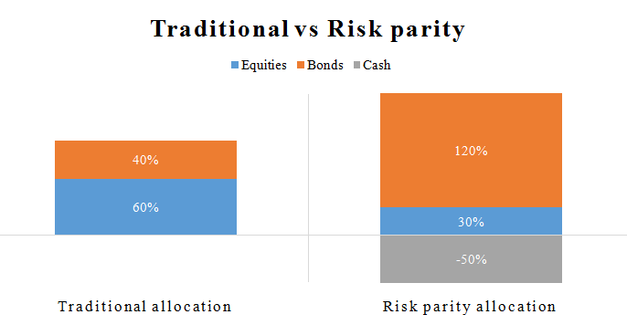

Risk parity has emerged as an innovative strategy in financial portfolio management, rethinking traditional approaches to asset allocation. Unlike conventional models that primarily focus on expected returns and historical volatility, risk parity emphasizes balancing the risk across asset classes. This approach strives to achieve a portfolio configuration where each asset class contributes equally to the overall risk, providing enhanced diversification and stability.

In traditional methods like the Capital Asset Pricing Model (CAPM) and Modern Portfolio Theory (MPT), portfolios are generally optimized based on expected returns relative to risk, measured by volatility. These models often result in a heavy weighting of assets with higher return expectations, inherently exposing the portfolio to the potential excess risk of these assets. Risk parity addresses this by redistributing focus from capital allocation to risk allocation.



Risk parity's foundational principle is that by balancing risk rather than simply apportioning capital, it is possible to create a more stable and diversified investment portfolio. This entails measuring the volatility of each asset class and ensuring that its contribution to the total portfolio risk is equalized. The effective implementation of this strategy often necessitates the use of leverage, particularly with asset classes traditionally considered lower risk, to elevate their risk contribution to parity with more volatile assets.

The implementation of risk parity strategies is increasingly achieved through algorithmic trading. Algorithmic trading algorithms support the precision and agility required to execute trades efficiently across diverse asset markets and adjust the portfolio in response to dynamic market conditions. This technological advance facilitates maintaining the risk parity's intricacies, enabling continuous optimization and rebalancing in fast-paced environments.

This article delves into the intricate processes of implementing risk parity through algorithmic trading, underscoring the transformative potential of combining strategic portfolio management with cutting-edge technology. Through this synthesis, investors can achieve a more balanced risk profile that adapts swiftly to the evolving landscape of global financial markets.

## Table of Contents

## Understanding Risk Parity

Risk parity is a financial strategy that allocates risk, rather than capital, equally across a portfolio's asset classes to achieve a balanced distribution. This methodology contrasts traditional asset allocation models like the Capital Asset Pricing Model (CAPM) and Modern Portfolio Theory (MPT), both of which prioritize expected returns and historical volatility. By focusing on equal risk distribution, risk parity offers improved diversification.

Volatility serves as the primary measure of risk within a risk parity framework. The strategy assesses each asset's [volatility](/wiki/volatility-trading-strategies) and its contribution to the portfolio's total risk. A key formula used in this approach is the calculation of the asset's risk contribution, $RC_i$, defined as:

$$
RC_i = w_i \cdot \sigma_i \cdot \rho_{i,P}
$$

where $w_i$ is the weight of asset $i$ in the portfolio, $\sigma_i$ represents the volatility of the asset, and $\rho_{i,P}$ is the correlation of the asset with the overall portfolio.

The roots of risk parity can be traced back to the early 1990s. During this period, traditional diversification techniques faltered, particularly under market stress conditions. Risk parity distinguished itself as a robust methodology capable of maintaining stability during such times, due to its emphasis on equalizing risk rather than merely spreading capital.

Overall, risk parity continues to attract attention as an innovative investment strategy, particularly for its resilience in addressing the limitations found in conventional models like the CAPM and MPT. By recalibrating focus from capital allocation to risk distribution, it provides a more comprehensive framework for achieving diversification and managing portfolio risk.

## Components of a Risk Parity Portfolio

A risk parity portfolio comprises four primary asset class categories: equities, fixed income, commodities, and alternative investments. Each class is carefully chosen to ensure that its contribution to the overall portfolio's risk is equal, rather than simply distributing financial capital equally. This unique allocation strategy ensures that no single asset class disproportionately influences the portfolio's risk profile.

The idea behind using multiple asset classes lies in diversification, which is intended to minimize the portfolio's overall risk through exposure to a variety of economic conditions. Equities typically generate higher returns but come with greater volatility. Fixed income assets, such as bonds, offer more stable returns and serve as a counterbalance to equities during market downturns. Commodities provide a hedge against inflation and add another layer of diversification, while alternative investments, which can include assets like real estate and hedge funds, introduce additional sources of return and risk diversification.

To achieve equal risk contribution across these diverse asset classes, leverage and short selling are sometimes employed. Leverage allows the investor to gain greater exposure to lower volatility assets, such as bonds, to bring their risk contribution in line with more volatile assets like equities. Conversely, short selling might be used to reduce exposure to certain assets that are expected to underperform, helping maintain the overall risk parity balance.

Real-world implementations of risk parity portfolios can be observed in the strategies employed by firms such as AQR Capital Management. These firms utilize sophisticated quantitative models to continuously adjust the weights of various asset classes. For example, a risk parity portfolio might leverage low-volatility bond positions to match the risk of high-volatility equity positions, thereby aligning with the principle of risk parity.

Mathematically, the risk contribution $RC_i$ of an asset class $i$ to the total portfolio risk can be represented by its marginal contribution to risk times its weight in the portfolio:

$$
RC_i = w_i \cdot \frac{\partial \sigma_p}{\partial w_i}
$$

where $w_i$ is the weight of asset class $i$ and $\frac{\partial \sigma_p}{\partial w_i}$ is the marginal contribution of asset class $i$ to the portfolio's standard deviation of returns $\sigma_p$. The objective in risk parity is to adjust weights $w_i$ such that:

$$
RC_1 = RC_2 = \ldots = RC_n
$$

By employing such mathematical models and occasionally leveraging financial instruments like derivatives, a risk parity portfolio can effectively balance risk exposure across diverse asset classes, ultimately contributing to a more robust investment strategy.

## Portfolio Management with Risk Parity

Managing a risk parity portfolio requires careful attention to asset selection, risk estimation, and consistent rebalancing to ensure that each asset class contributes equally to the overall risk. This strategy differentiates itself from traditional approaches by targeting equal risk distribution rather than equal capital allocation across asset classes.

A critical challenge in managing a risk parity portfolio is the estimation of risk, which heavily relies on accurate data. Data quality concerns can lead to incorrect estimates of volatility and correlations, impacting the balance of risk in the portfolio. Market volatility further complicates this process, as rapid changes can alter an asset's risk profile, necessitating frequent adjustments to maintain parity. Moreover, the costs associated with leveraging and rebalancing can affect the overall profitability of the portfolio. Leverage is often employed to align risk contributions without necessarily changing the capital allocation, which can introduce additional expenses and risk.

Algorithmic trading plays a pivotal role in mitigating some of these challenges by automating the rebalancing process, ensuring that adjustments are precise and timely. These systems are capable of rapidly executing trades, reacting swiftly to market changes, and maintaining desired risk levels across the portfolio with minimal manual intervention. This automation not only enhances operational efficiency but also aids in optimizing trade costs, reducing the friction associated with frequent rebalancing.

Using [algorithmic trading](/wiki/algorithmic-trading), precise rebalancing of a risk parity portfolio can be executed with greater frequency and efficiency. Algorithms can be programmed to continuously monitor and adjust the risk levels of different asset classes by dynamically recalculating and executing trades that maintain equality in risk contribution. For example, a simple algorithm might assess daily volatility and alter allocations proportionally to stabilize the portfolio's risk exposure. Python, with its libraries such as NumPy and pandas, offers powerful tools for implementing such algorithms. For example, a Python script might automatically calculate the standard deviation of each asset's returns to assess volatility and execute trades to realign the asset weights accordingly, ensuring each contributes equally to the portfolio's total risk.

As the financial landscape continues to evolve, the integration of algorithmic trading within risk parity strategies heralds an efficient and responsive approach to portfolio management. By addressing the inherent challenges of data quality, market volatility, and cost-effectiveness, algorithmic trading enhances the adaptability of risk parity portfolios, maintaining their balance in dynamic market environments.

## Algorithmic Trading and Risk Parity

Algorithmic trading plays a critical role in implementing risk parity strategies by facilitating rapid trade execution and seamless portfolio adjustments. With the high degree of precision and speed afforded by algorithmic processes, traders can maintain the delicate balance of risk that risk parity models require, even amidst fluctuating market conditions.

Computing power is harnessed to perpetually uphold desired risk levels. This is achieved through constant monitoring and rebalancing, ensuring each asset class within a portfolio contributes equally to the overall risk. Algorithmic trading systems are programmed to respond instantaneously to market changes, executing trades based on pre-defined risk parameters. This reduces human error and enhances efficiency in managing a risk parity portfolio.

Programming languages, particularly Python, serve as essential tools for implementing these trading algorithms. Python offers an extensive range of libraries and tools such as NumPy, pandas, and SciPy, which are instrumental in data analysis and complex calculations integral to risk parity strategies. Additionally, libraries like QuantLib and PyAlgoTrade provide comprehensive frameworks for developing automated trading systems tailored to risk parity requirements.

An example of Python code that can be used for rebalancing a risk parity portfolio might include:

```python
import numpy as np
import pandas as pd

# Example asset returns data
returns = pd.DataFrame({
    'Equities': [0.01, 0.02, -0.01, 0.03],
    'Bonds': [0.005, 0.01, 0.02, -0.002],
    'Commodities': [-0.01, 0.015, 0.005, 0.01]
})

# Calculating the covariance matrix
cov_matrix = returns.cov()

# Inverse of standard deviations (volatilities)
inv_vol = 1 / np.sqrt(np.diag(cov_matrix))

# Computing risk parity weights
risk_parity_weights = inv_vol / inv_vol.sum()

print("Risk Parity Weights:\n", risk_parity_weights)
```

This code snippet demonstrates calculating risk parity weights using inverse-volatility targeting. By ensuring that these weights are adjusted dynamically through algorithmic means, traders can ensure each asset maintains its proportional risk contribution, thus adhering to the risk parity framework even in volatile markets.

In conclusion, the integration of algorithmic trading with risk parity strategies not only enhances the precision and adaptability of investment portfolios but also marks a progression toward more sophisticated, technology-driven portfolio management paradigms in modern financial markets.

## Hierarchical Risk Parity (HRP) Algorithm

Hierarchical Risk Parity (HRP) represents an advancement over traditional risk parity approaches by effectively mitigating covariance estimation errors, which often plague financial models. The HRP algorithm enhances portfolio construction by employing a series of sophisticated techniques that lead to more reliable and diversified investment compositions.

The core strategies employed by HRP include clustering, quasi-diagonalization, and recursive bisection. Clustering is utilized to categorize assets based on similarities in their return series, thereby grouping them in such a manner that each cluster contains assets exhibiting similar risk profiles. This reduces the noise introduced by covariances calculated across diverse asset classes.

In the quasi-diagonalization step, the covariance matrix is transformed such that its non-diagonal elements (which represent cross-asset risk interactions) are minimized. This is achieved through the reordering of assets into a configuration that approximates a diagonal matrix structure. The goal is to simplify the complex interactions into more tractable, pairwise comparisons without significant loss of information related to total portfolio risk.

The recursive bisection process further refines the portfolio structure. By iteratively dividing the asset clusters, the algorithm constructs a hierarchical tree that prioritizes the strongest intra-cluster relationships. The approach ensures that diversification benefits are maximized, concentrating on reducing estimation errors and improving the stability of portfolio weights across various market conditions.

Mathematically, HRP circumvents the challenges of poor covariance estimations. In contrast to the Markowitz optimization framework that might solve for a weights vector $w$ using:

$$
w = \frac{\Sigma^{-1} \mu}{\mathbf{1}^T \Sigma^{-1} \mu}
$$

where $\Sigma$ is the covariance matrix and $\mu$ is the expected returns vector, HRP does not require the inversion of $\Sigma$. This quality makes HRP particularly useful for asset pools where the standard methods would become unstable or computationally infeasible due to the singularity or ill-conditioning of $\Sigma$.

The HRP algorithm's performance is particularly beneficial in complex and large portfolios, where the diverse asset base leads to considerable estimation challenges. By systematically reducing estimation error and enhancing diversification, HRP provides investors with a robust tool for risk management in dynamic market environments.

## Evaluating Risk Parity Strategies

Evaluating risk parity strategies involves using various techniques to ensure the strategy's effectiveness and adaptability in diverse market conditions. One primary method of evaluation is [backtesting](/wiki/backtesting), which involves applying the risk parity model to historical data to analyze how it would have performed. This process helps identify the strengths and potential weaknesses of the strategy by providing insights into its historical performance.

Another important evaluation technique is walk-forward analysis. Unlike backtesting, where the strategy is tested on a fixed set of historical data, walk-forward analysis continually updates the model with new data. It involves rolling windows over the dataset to simulate how the strategy performs over time, adapting to changing market dynamics. This method offers a more realistic assessment by incorporating out-of-sample testing, which is essential for understanding the strategy's long-term viability.

Monte Carlo simulations are also widely used in evaluating risk parity strategies. This technique involves generating a large number of random market scenarios based on statistical properties derived from historical data. By repeatedly sampling from these scenarios, Monte Carlo simulations estimate the probability distribution of potential outcomes, thus assessing the strategy's robustness and performance consistency. This approach helps quantify the uncertainty and predict the behavior of the risk parity strategy under various hypothetical market conditions.

Combining these evaluation methods, advanced statistical tools can further enhance the accuracy of the assessments. Techniques such as sensitivity analysis, stress testing, and bootstrapping offer additional layers of scrutiny, allowing for refined risk predictions and strategy adjustments. For example, sensitivity analysis examines how changes in risk factors or assumptions affect portfolio outcomes, while stress testing evaluates strategy performance under extreme market events.

Incorporating [machine learning](/wiki/machine-learning) algorithms can also improve evaluation processes. Techniques such as clustering and regression analysis can uncover hidden patterns within large datasets, providing valuable inputs for refining the strategy. Python, with its extensive libraries like pandas, NumPy, and scikit-learn, facilitates the implementation of these advanced statistical and machine learning techniques, making the evaluation process more efficient and informative.

The integration of these diverse evaluation approaches ensures that risk parity strategies are not only theoretically sound but also practically viable across varying market contexts. By accurately assessing past performance and simulating future scenarios, investors gain confidence in the strategy's potential to maintain balanced risk contributions and achieve consistent returns.

## Conclusion

Risk parity offers a balanced approach to managing investments by focusing on equalizing the risk contribution of each asset class within a portfolio. This innovative strategy moves away from traditional allocation methods, providing a more diversified and stable investment structure. Through the equal distribution of risk, investors can achieve a level of resilience that better withstands the volatility of financial markets.

Algorithmic trading plays a crucial role in enhancing the application of risk parity. The precision and speed of algorithmic systems allow portfolios to adapt swiftly to changing market dynamics. By continuously recalibrating asset positions based on up-to-date data, algorithms ensure that desired risk levels are consistently maintained. This operational efficiency is critical in executing trades that align with the strategic objectives of risk parity without incurring unnecessary costs. For instance, trading algorithms can be implemented in Python, leveraging libraries such as NumPy for numerical calculations and Pandas for data manipulation. These tools help automate the complex calculations necessary to maintain a risk parity portfolio, enabling real-time adjustments and reducing human error.

As financial markets evolve, the integration of risk parity and technological advancements in algorithmic trading heralds a transformative era in investment. This synergy not only enhances portfolio performance but also optimizes for risk management, providing a robust framework for navigating financial uncertainties. The continuing development of algorithmic strategies and computational power will likely refine and expand the potential applications of risk parity, cementing its status as a forward-looking investment strategy that aligns with the dynamic nature of contemporary markets.

## References & Further Reading

[1]: ["Quantitative Investment Portfolio Management"](https://factorpad.com/fin/quant-101/quant-portfolio-management.html) by Robert E. Whaley

[2]: Asness, C. S., Frazzini, A., & Pedersen, L. H. (2012). ["Leverage Aversion and Risk Parity."](https://pages.stern.nyu.edu/~lpederse/papers/LeverageAversionRP.pdf) Financial Analysts Journal, 68(1), 47-59.

[3]: ["Antifragile: Things That Gain from Disorder"](https://en.wikipedia.org/wiki/Antifragile_(book)) by Nassim Nicholas Taleb

[4]: Maillard, S., Roncalli, T., & Teiletche, J. (2010). ["The Properties of Equally Weighted Risk Contribution Portfolios."](https://www.semanticscholar.org/paper/The-properties-of-equally-weighted-risk-portfolios-Teiletche-Roncalli/14cdd2a70ca7889acc71ce4dd1609eaf010b8dbb) Journal of Portfolio Management, 36(4), 60-70.

[5]: ["Trading and Exchanges: Market Microstructure for Practitioners"](https://www.amazon.com/Trading-Exchanges-Market-Microstructure-Practitioners/dp/0195144708) by Larry Harris

[6]: ["Risk Parity Fundamentals"](https://static1.squarespace.com/static/5b96c6cfe749403412d84454/t/625438df73b4fb0a424bed73/1649686756493/Risk_Parity_Fundamentals.pdf) by Edward E. Qian, Ronald Hua, and Atta Kasongo

[7]: ["Python for Data Analysis"](https://wesmckinney.com/book/) by Wes McKinney

[8]: Lopez de Prado, M. (2018). ["Advances in Financial Machine Learning."](https://www.amazon.com/Advances-Financial-Machine-Learning-Marcos/dp/1119482089) Wiley. 

[9]: ["Algorithmic Trading and DMA: An Introduction to Direct Access Trading Strategies"](https://www.amazon.com/Algorithmic-Trading-DMA-introduction-strategies/dp/0956399207) by Barry Johnson