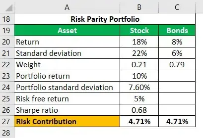

Investing in financial markets inherently involves risk, and finding efficient methods to balance this risk is crucial for investors seeking stable returns. Risk parity portfolios offer a compelling solution by focusing on equal risk contribution rather than equal capital allocation. Unlike traditional portfolio management strategies, which may allocate capital based on factors such as market capitalization or expected returns—often resulting in a concentration of risk in more volatile assets—risk parity seeks to distribute risk evenly across all assets in a portfolio. This approach helps counteract the impact of more volatile stocks that can disproportionately skew portfolio risk.

The concept of risk parity is particularly significant in the context of algorithmic trading, where sophisticated models and data analysis are employed to manage portfolios dynamically. By concentrating on risk distribution rather than capital allocation, algorithmic traders can potentially achieve more stable and consistent returns. This article explores the intricacies of risk parity portfolios, highlighting their benefits and challenges, especially within algo trading. Additionally, we will provide practical insights into constructing and managing risk parity portfolios using Python, offering step-by-step guidance and code implementations to facilitate the process for both novice and experienced investors.



## Table of Contents

## Understanding Risk Parity Portfolios

Risk parity is a portfolio management strategy that seeks to equalize the risk contribution of each asset within a portfolio. Unlike traditional methods that may prioritize asset allocation based on market capitalization or total dollar value invested, the risk parity approach focuses on the volatility and correlation of each asset class to achieve more effective diversification.

This methodology enhances diversification by considering the varying volatilities of different asset classes. The goal is to achieve equal risk contribution, where each asset's risk contribution is calibrated relative to the overall portfolio risk. It is crucial to recognize that assets do not inherently [carry](/wiki/carry-trading) the same level of risk; for example, equities tend to be more volatile than bonds. Therefore, rather than simply splitting investments equally, risk parity involves reallocating to balance these disparities.

In technical terms, let $\sigma_i$ represent the [volatility](/wiki/volatility-trading-strategies) of asset $i$, and $w_i$ be its weight in the portfolio. The risk contribution of asset $i$ to the total portfolio risk $\sigma_p$ can be mathematically defined as:

$$
RC_i = w_i \cdot \sigma_i \cdot \text{Correlation}(i, p)
$$

where $\text{Correlation}(i, p)$ is the correlation between the return of asset $i$ and the portfolio. The objective is to equalize $RC_i$ across all assets.

Risk parity also questions the conventional practice of market capitalization-weighted index investing, where larger companies may dominate the portfolio, potentially misaligning risk exposure. Instead, by reallocating assets according to their risk rather than their size, an investor can address the imbalance inherent in traditional allocation models and enhance overall portfolio robustness.

Ultimately, this strategy aims for a balanced approach, allowing investors to potentially achieve steadier returns by managing the risk each asset class contributes, contributing to a more dynamic and resilient investment strategy.

## Benefits of Risk Parity in Algo Trading

Risk parity portfolios in [algorithmic trading](/wiki/algorithmic-trading) provide several benefits predominantly through enhanced risk distribution and management. By ensuring that each asset contributes equally to the overall risk, this method facilitates greater risk diversification, which in turn can lead to more stable returns. Traditional portfolio management often concentrates on capital allocation, which may inadvertently result in over-exposure to volatile assets. Conversely, risk parity reallocates assets based on their risk factors, thereby promoting balance and potentially reducing volatility.

Moreover, this strategy enhances risk management by equipping portfolios to better handle market fluctuations. By focusing on equalizing risk rather than capital, risk parity portfolios can adapt swiftly to changing market conditions. They do this by dynamically adjusting asset allocations in response to volatility and expected performance shifts, which can be easily implemented through algorithmic trading systems.

Additionally, risk parity has the potential to yield competitive returns without subjecting the portfolio to excessive risk. By meticulously balancing the risk across assets, these portfolios aim to optimize the return-to-risk ratio, offering a robust alternative to traditional investment strategies. This approach helps in mitigating exposure to unexpected market downturns while still capturing growth opportunities.

The inclusion of inflation hedges such as commodities is another key benefit. These elements serve to protect the portfolio's purchasing power against inflationary pressures. By balancing assets with varying reactions to economic conditions, risk parity portfolios can maintain their real value, thus offering a safeguard in periods of economic instability.

In conclusion, risk parity in algorithmic trading offers a nuanced approach to portfolio management, emphasizing stability, adaptability, and resilience in the financial markets.

## Drawbacks and Challenges

Designing and managing risk parity portfolios presents several challenges, especially when compared to traditional portfolio construction methods. One primary complexity arises from the need for accurate data and sophisticated models to estimate risk and returns accurately. Unlike traditional methods that might rely on historical performance or simpler metrics, risk parity demands a more nuanced understanding of asset volatility and correlation.

Asset correlations, which measure the degree to which different investments move in relation to each other, are pivotal in risk parity portfolios. These correlations are often assumed to be stable over time; however, market dynamics can cause these relationships to shift. Inaccurate assumptions about these correlations can lead to inefficient diversification, reducing the intended benefits of risk parity.

The potential use of leverage and derivatives also introduces higher costs compared to traditional portfolios. These financial instruments can enhance returns but also increase the risks and costs associated with the portfolio, including transaction fees and interest expenses. Furthermore, the management of these tools requires sophisticated strategies and risk assessment to avoid unintended outcomes.

Additionally, there are no guarantees of success with risk parity strategies. The financial markets are subject to unpredictable shifts, and the assumptions underpinning risk parity might not hold in all scenarios. For instance, during periods of extreme market volatility, the historical correlations and volatilities may not provide an accurate forecast for future behavior.

In conclusion, while risk parity portfolios offer a balanced approach to risk management, they come with inherent drawbacks, including design complexity and reliance on robust data and assumptions. These strategies demand a comprehensive understanding of market dynamics and access to resources capable of handling the intricacies involved.

## Theoretical Foundation

Risk parity portfolios represent a unique approach to asset allocation, grounded in several theoretical concepts such as risk budgeting, asset correlations, and volatility. Each of these elements plays a critical role in the development and management of risk parity strategies.

**Risk Budgeting**

At the core of risk parity is the principle of risk budgeting, which involves the proportional assignment of risk across the portfolio's components. Unlike traditional methods that may allocate capital equally or based on expected returns, risk parity focuses on ensuring that each asset contributes equally to the portfolio's total risk. This is achieved through mathematical modeling that typically involves calculating the risk contribution of each asset and adjusting the weights accordingly. The risk contribution (RC) of an asset in a portfolio can be defined as:

$$

RC_i = w_i \cdot \sigma_i \cdot \text{Corr}(r_i, R) 
$$

where $w_i$ is the weight of asset $i$ in the portfolio, $\sigma_i$ is the standard deviation of asset $i$, and $\text{Corr}(r_i, R)$ is the correlation between the return of asset $i$ and the overall portfolio return $R$.

**Asset Correlations**

Another critical aspect of risk parity is understanding asset correlations, which measure how different investments move in relation to each other. These correlations significantly impact the diversification benefits available within a portfolio. A key objective of risk parity is to reduce the portfolio's overall volatility by combining assets with lower or negative correlations. If assets within a portfolio are highly correlated, the diversification effects are diminished, as the assets are more likely to move in the same direction during market changes.

**Volatility**

Volatility is a fundamental component in assessing the risk of assets within a risk parity framework. It is generally quantified as the standard deviation of asset returns and is crucial in the normalized assignment of risk across portfolio components. The aim is to construct a portfolio where the volatility-weighted contributions to total portfolio risk are equal. This method promotes a balanced risk profile, which theoretically leads to more stable returns over time. The challenge lies in accurately estimating future volatility since it directly influences asset weightings.

Through these concepts, risk parity offers a distinct methodology that seeks to produce a more balanced and efficient risk distribution across portfolio assets, ultimately enhancing the potential for stable, sustainable returns.

## Python Implementation of Risk Parity Portfolios

Risk parity portfolios can be constructed and managed effectively using Python, a popular programming language in financial analysis. This section provides a step-by-step guide to implement a risk parity portfolio, focusing on how to gather and process financial data, compute asset returns and risk, and allocate portfolios dynamically.

**Data Gathering and Management with `pandas` and `yfinance`**

To create a risk parity portfolio, the first step involves obtaining historical financial data. The `yfinance` library enables retrieving data from Yahoo Finance, while `pandas` facilitates data manipulation and analysis.

```python
import yfinance as yf
import pandas as pd

# Retrieve historical data for a list of tickers
tickers = ['AAPL', 'MSFT', 'GOOGL']
data = yf.download(tickers, start="2020-01-01", end="2023-10-01")

# Adjusted Close prices for further calculations
prices = data['Adj Close']
```

**Calculation of Asset Returns and Risk**

The next step is to calculate the daily returns and the risk, typically measured as the standard deviation of returns. 

```python
# Calculation of daily returns
returns = prices.pct_change().dropna()

# Calculation of the standard deviation (risk)
risk = returns.std()
```

Risk parity involves assigning weights inversely proportional to each asset's risk. If `σ_i` represents the risk of asset `i`, the weight `w_i` can be calculated as:

$$
w_i = \frac{\frac{1}{\sigma_i}}{\sum_{j=1}^{n} \frac{1}{\sigma_j}}
$$

```python
# Inverse of risk (1/standard deviation)
inverse_risk = 1 / risk

# Calculation of weights
weights = inverse_risk / inverse_risk.sum()
```

**Dynamic Portfolio Construction and Rebalancing**

Risk parity portfolios benefit from regular rebalancing to maintain the desired risk distribution. Python can automate this process to adapt to changing market conditions.

```python
def rebalance_portfolio(target_weights, returns):
    # Calculate current portfolio value
    portfolio_value = (returns + 1).cumprod()

    # Calculate current weights
    current_value = (weights * portfolio_value.iloc[-1]).sum()
    current_weights = (weights * portfolio_value.iloc[-1]) / current_value

    # Rebalance by setting weights back to target weights
    rebalanced_weights = target_weights / target_weights.sum()
    return rebalanced_weights

# Assuming monthly rebalancing
monthly_returns = returns.resample('M').apply(lambda x: (1 + x).prod() - 1)
rebalanced_weights = rebalance_portfolio(weights, monthly_returns)
```

**Basic and Advanced Portfolio Optimization**

The basic implementation can be enhanced with advanced techniques, such as using more complex optimization algorithms to consider correlations between assets.

```python
from scipy.optimize import minimize

def risk_parity_objective(weights, cov_matrix):
    portfolio_var = weights.T @ cov_matrix @ weights
    marginal_risk_contrib = cov_matrix @ weights
    total_risk_contrib = weights * marginal_risk_contrib
    risk_contribution = total_risk_contrib / portfolio_var
    risk_diff = risk_contribution - 1 / len(weights)
    return (risk_diff ** 2).sum()

cov_matrix = returns.cov()
init_guess = weights
result = minimize(risk_parity_objective, init_guess, args=(cov_matrix,),
                  bounds=[(0,1)] * len(tickers), constraints={'type': 'eq', 'fun': lambda x: np.sum(x) - 1})

optimal_weights = result.x
```

In essence, Python provides a powerful framework for constructing and managing risk parity portfolios, incorporating libraries such as `pandas`, `yfinance`, and optimization functions from `scipy`. By following these steps, traders can effectively balance risk across various assets, aiming for more stable portfolio performance.

## Conclusion

Risk parity portfolios provide a progressive approach to managing risk in algorithmic trading by prioritizing equal risk distribution over capital allocation. This method challenges traditional investment strategies which often overlook the impact of varying asset volatilities on overall risk. By balancing the portfolio's risk contributions, risk parity can lead to more stable and potentially competitive returns regardless of market fluctuations.

Despite the inherent challenges associated with designing and managing risk parity portfolios—such as reliance on accurate data and assumptions about asset correlations—their adaptability to market conditions makes them a worthwhile pursuit. Periodic reallocation based on expected performance can further enhance the portfolio's alignment with current market trends, providing a buffer against adverse market conditions.

The implementation of risk parity strategies is significantly facilitated by Python, a versatile programming language popular in financial markets for its data manipulation capabilities. Utilizing Python libraries such as `pandas` and `yfinance`, investors can construct dynamic, risk-aware portfolios and execute regular rebalancing. This computational approach allows for a more efficient allocation of resources and optimization of portfolio performance.

Continued research and application of risk parity in algorithmic trading can enhance understanding and refinement of investment strategies. By embracing these innovative techniques, investors can potentially improve risk-adjusted returns and safeguard their portfolios in volatile markets.

## References & Further Reading

[1]: Ilmanen, A., Maloney, T., & Ross, A. (2004). ["Risk Parity: The Safe Place in a Turbulent World?"](https://www.semanticscholar.org/paper/Exploring-Macroeconomic-Sensitivities%3A-How-Respond-Ilmanen-Maloney/f14bd97c133f9fb1171e3396b6c5115500485133) AQR Capital Management, LLC.

[2]: Chaves, A., Hsu, J., Li, F., & Shakernia, O. (2011). ["Risk Parity Portfolio vs. Other Asset Allocation Heuristic Portfolios."](https://www.semanticscholar.org/paper/Risk-Parity-Portfolio-vs.-Other-Asset-Allocation-Chaves-Hsu/094d24b924caa659442065401999d7a77e06953e) The Journal of Investing, 20(1), 108-118.

[3]: Maillard, S., Roncalli, T., & Teiletche, J. (2010). ["The Properties of Equally Weighted Risk Contributions Portfolios."](https://papers.ssrn.com/sol3/papers.cfm?abstract_id=1271972) The Journal of Portfolio Management, 36(4), 60-70.

[4]: ["Quantitative Risk Management: Concepts, Techniques and Tools"](http://assets.press.princeton.edu/chapters/c10496.pdf) by Alexander J. McNeil, Rüdiger Frey, and Paul Embrechts

[5]: Roncalli, T. (2013). ["Introduction to Risk Parity and Budgeting"](https://papers.ssrn.com/sol3/papers.cfm?abstract_id=2272973). CRC Press.