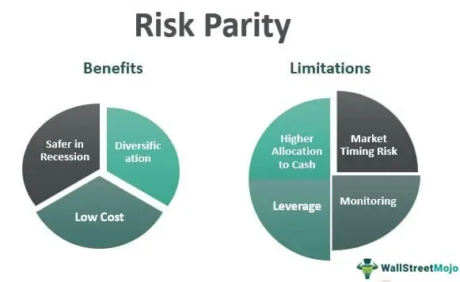

Investment strategies in modern financial markets have evolved considerably over recent decades, driven by advancements in technology, data availability, and a better understanding of risk management. Traditional models for asset allocation, such as the capital asset pricing model (CAPM) and the modern portfolio theory (MPT), have served as foundational approaches. These models typically emphasize balancing expected returns against risk, often measured using volatility as a proxy. However, the dynamic nature of market conditions calls for more sophisticated approaches to optimize investment portfolios.

Risk parity emerges as one such advanced strategy, focusing not just on the returns of individual assets but on the distribution and balance of risk across the entire portfolio. Unlike traditional strategies where assets might be allocated based on expected returns or historical volatility, risk parity aims to allocate risk more evenly across different asset classes. This is typically achieved by adjusting the allocation of each asset class so that it contributes equally to the portfolio's overall risk. The approach is rooted in the understanding that diversification is truly achieved when risk is spread equally, rather than simply allocating equal monetary amounts to different assets.



Mathematically, in a risk parity portfolio, the goal can be expressed by ensuring each asset class $i$ contributes an equal proportion of the portfolio's total risk. This is often represented by:

$$
w_i \cdot \sigma_i \cdot \text{corr}(r_i, r_p) = \frac{1}{N} \sum_{j=1}^{N} (w_j \cdot \sigma_j \cdot \text{corr}(r_j, r_p))
$$

where $w_i$ represents the weight of asset $i$, $\sigma_i$ its volatility, $\text{corr}(r_i, r_p)$ is the correlation between the asset return and the portfolio return, and $N$ is the number of assets in the portfolio.

Algorithmic trading plays a crucial role in achieving the precise requirements of risk parity strategies. As financial markets have become more complex and faster-paced, the relevance of algorithmic trading has grown significantly. Algorithmic systems enable the rapid analysis of market data, execution of trades, and rebalancing of portfolios to maintain desired risk exposures. Through automation, these systems can efficiently manage the constant adjustments necessary to preserve risk parity in response to fluctuations in market conditions.

Overall, the integration of risk parity principles in portfolio management and the utilization of algorithmic trading systems highlight the sophistication and adaptability required to navigate modern financial markets. These strategies and tools provide investors with the means to build resilient portfolios capable of achieving desired risk-return profiles even amidst market uncertainty. As such, risk parity, supported by algorithmic trading, represents a significant advancement in the ways investors can manage and optimize portfolios for long-term success.

## Table of Contents

## Understanding Risk Parity

Risk parity is an investment strategy that aims to allocate risk, rather than capital, equally across various asset classes in a portfolio. Unlike traditional strategies that typically distribute capital based on market value weights or rely on forecasts of expected returns, risk parity focuses on equalizing the risk contribution of each asset, often using [volatility](/wiki/volatility-trading-strategies) as a proxy for risk.

### Definition and Principles

At its core, risk parity aims to construct a portfolio where each asset class contributes equally to the total risk. This approach contrasts with the conventional portfolio construction methods, which often lead to an imbalance in risk contributions due to differences in asset volatility and correlation. The principle of risk parity maintains that a more balanced risk allocation can achieve better diversification and potentially improve risk-adjusted returns.

The risk for each asset can be measured as the standard deviation of its returns, and the contribution to portfolio risk is calculated based on both the individual asset's volatility and its correlation with other assets in the portfolio. The risk contribution of an asset $i$ in a portfolio can be written as:

$$
RC_i = w_i \cdot \sigma_i \cdot \text{Corr}(R_i, R_p)
$$

where:
- $w_i$ is the weight of asset $i$ in the portfolio
- $\sigma_i$ is the standard deviation of asset $i$'s returns
- $\text{Corr}(R_i, R_p)$ is the correlation between the asset $i$'s returns and the portfolio returns

### Modification of Traditional Modern Portfolio Theory

Risk parity modifies the traditional Modern Portfolio Theory (MPT) by focusing on risk allocations rather than relying on the expected returns and covariances to formulate the efficient frontier. MPT, developed by Harry Markowitz, emphasizes the optimization of a portfolio's expected return for a given level of risk by selecting proportions of different assets. In practice, this often results in portfolios heavily weighted toward assets with the highest expected returns or the lowest volatilities, thus not fully diversifying risks if the estimates prove incorrect.

In contrast, risk parity does not require forecasts of expected returns and seeks to spread risk more evenly across the portfolio's components. This paradigm shift stems from the understanding that predicting returns is fraught with uncertainty, and a strategy that diversifies risk tends to be more stable over time. By maintaining equal risk contributions, a risk parity portfolio aims to improve resilience against market volatility and changes in correlation structures.

### Benefits of Risk Parity

The risk parity approach offers several benefits in optimizing risk distribution:

1. **Improved Diversification**: By equalizing risk contributions, risk parity ensures that no single asset or asset class dominates the risk profile of the portfolio, enhancing diversification.

2. **Higher Risk-Adjusted Returns**: Historical analysis of risk parity portfolios often shows superior risk-adjusted returns compared to traditional portfolios, particularly during periods of market stress when correlations converge.

3. **Reduced Dependence on Forecast Accuracy**: Since risk parity does not rely on expected return estimates, it reduces the impact of erroneous predictions and enhances robustness under uncertain conditions.

4. **Simplicity and Transparency**: The methodology behind risk parity is straightforward, focusing on volatility and correlation, making it easier to comprehend and implement.

Overall, risk parity offers a strategic framework to distribute risk more effectively across different asset classes, aiming for a balanced and resilient investment portfolio. This strategy gains significance as investors seek alternatives to traditional approaches that may not adequately manage risk concentration and provide satisfactory returns under varying market conditions.

## Components of a Risk Parity Portfolio

A risk parity portfolio aims to allocate risk equally across various asset classes rather than allocating capital equally. This approach inherently seeks to balance the risk contribution of each asset within the portfolio, often necessitating the inclusion of diverse asset classes such as equities, fixed income, commodities, and sometimes alternatives like real estate or hedge funds. The underlying principle is to ensure that no single asset class overly dominates the portfolio's risk profile, providing a more stable and diversified performance across different market conditions.

### Typical Asset Classes in Risk Parity Portfolios

1. **Equities**: Equities are a crucial component, offering growth potential. However, equities typically come with higher volatility, which the risk parity approach aims to balance with other asset classes.

2. **Fixed Income**: Bonds, including government and corporate bonds, are commonly included to provide stability and income. The lower volatility of fixed income assets complements the higher volatility of equities.

3. **Commodities**: Commodities like gold, oil, and agricultural products can offer diversification benefits due to their lack of correlation with traditional assets like stocks and bonds.

4. **Alternatives**: Depending on the portfolio's design, alternatives such as real estate, hedge funds, and private equity might be included to capture unique risk factors and potential returns.

### Use of Leverage and Short Selling

To achieve the desired risk distribution, risk parity portfolios often employ leverage. By borrowing funds, investors can increase the allocation to lower-risk asset classes like bonds to match the risk contribution from higher-risk assets like stocks. This process is guided by risk measures such as the standard deviation or more complex metrics like Value-at-Risk (VaR).

Short selling can also be utilized occasionally, although it is less common in risk parity strategies that focus more on long allocations. The goal of incorporating leverage and short selling is to fine-tune the risk balance rather than to speculate on market directions.

### Real-World Examples of Risk Parity Portfolios

- **AQR Risk Parity Funds**: AQR Capital Management is renowned for its risk parity strategies, offering several funds that apply these principles. Their approach often includes a broad range of global asset classes, skillfully balancing risk through advanced quantitative methods.

- **Horizon Kinetics Risk Parity ETF**: This ETF aims to provide investors with access to risk parity principles through a publicly traded vehicle. It typically includes a diversified mix of global stocks, bonds, and commodities, managed with a focus on risk-balanced exposure.

In conclusion, risk parity portfolios are distinguished by their innovative use of asset allocation to balance risk rather than capital. By employing a diverse array of asset classes and techniques like leverage, they strive to optimize portfolio stability and performance. Real-world implementations such as those by AQR and Horizon demonstrate the practical application of these strategies, offering investors an alternative route to risk management in complex financial markets.

## Portfolio Management with Risk Parity

Constructing a risk parity portfolio involves several methodical steps designed to balance the allocation of risk across various asset classes rather than basing it solely on capital allocation. This nuanced approach seeks to equalize the risk contribution of each asset in the portfolio, thereby achieving optimal diversification.

1. **Asset Selection**: The process begins by selecting a diverse set of asset classes. These typically include equities, bonds, commodities, and sometimes alternative investments. Diversification across these classes aids in risk distribution, as each asset type often reacts differently to economic changes.

2. **Risk Estimation**: The next step involves estimating the risk associated with each asset. Common metrics include standard deviation and Value-at-Risk (VaR). These calculations require historical data analysis to predict future volatility.

3. **Risk Allocation**: Unlike traditional portfolios where capital is allocated based on expected returns, risk parity portfolios allocate risk equally among the assets. The formula used is:
$$
   \text{Weight}_i = \frac{1 / \sigma_i}{\sum_{j=1}^N (1 / \sigma_j)}

$$

   where $\sigma_i$ is the standard deviation of asset $i$, ensuring that the risk contribution of each asset to the portfolio's overall risk is uniform.

4. **Leverage Utilization**: Often, risk parity portfolios employ leverage to boost returns, particularly when low-risk assets dominate the allocation. This involves borrowing additional funds to purchase more assets, thus maintaining the desired risk level.

5. **Short Selling**: Sometimes, shorting is employed to hedge against potential losses, especially in volatile markets. This strategy requires sophisticated risk management to protect the portfolio from adverse movements.

Quantitative analysis plays a crucial role in these strategies, providing the mathematical backbone necessary for accurate risk estimation and rebalancing. Tools from [statistics](/wiki/bayesian-statistics), such as correlation matrices and principal component analysis, help in understanding the relationships between assets and rebalancing decisions.

### Challenges and Considerations

Implementing risk parity strategies involves several considerations:

- **Data Quality**: Reliable and extensive historical data are essential for accurate risk assessments. Any anomaly can lead to inaccurate risk evaluations and misallocation of resources.

- **Dynamic Market Conditions**: Markets are inherently volatile, necessitating frequent re-evaluation and rebalancing of risk parity portfolios to adapt to changing conditions. This dynamic environment requires constant monitoring.

- **Cost Management**: Leverage and short selling introduce additional costs, which can erode the profitability of a portfolio if not managed correctly. Efficient use of algorithmic trading can mitigate these costs, though it also brings complexity and requires robust technological infrastructure.

Risk parity strategies, with their focus on risk distribution rather than mere capital allocation, provide a sophisticated tool for portfolio management. However, they necessitate a solid foundation in quantitative analysis and risk management, with significant attention paid to external factors such as costs and market volatility.

## Algorithmic Trading and Risk Parity

Algorithmic trading integrates computational algorithms to automate the buying and selling of financial instruments, aiming to enhance the execution of sophisticated investment strategies like risk parity. This synergy allows for precise execution, continuous portfolio balancing, and scalability, essential qualities for implementing risk parity effectively.

Automation in maintaining risk parity across fluctuating market conditions is one significant advantage of [algorithmic trading](/wiki/algorithmic-trading). By continuously analyzing market data, algorithmic systems can adjust portfolio allocations in real-time to preserve target risk levels across asset classes. This is particularly crucial for risk parity strategies, which prioritize equalizing risk contributions rather than capital allocations. For instance, a sudden increase in volatility in one asset class could prompt automated rebalancing to maintain risk equilibrium, ensuring that each asset class continues to contribute equally to the portfolio's overall risk.

A variety of algorithms are employed in trading and maintaining risk parity portfolios. Mean-variance optimization algorithms, although traditional, form the basis for more advanced risk parity calculations by aiming to balance the trade-off between a portfolio's expected return and its risk. However, risk parity seeks to allocate weights inversely proportional to asset volatilities, moving beyond merely optimizing expected returns.

Python, known for its versatility and powerful libraries such as NumPy and Pandas, is often used to implement these algorithms. For instance, a simplified version of risk parity portfolio construction can be achieved using the following Python code:

```python
import numpy as np

def risk_parity_weights(cov_matrix):
    inv_vols = 1.0 / np.sqrt(np.diag(cov_matrix))
    return inv_vols / inv_vols.sum()

cov_matrix = np.array([[0.05, 0.02], [0.02, 0.04]])
weights = risk_parity_weights(cov_matrix)
print("Risk Parity Weights:", weights)
```

This code snippet illustrates a basic approach to calculate risk parity weights, which are inversely proportional to the square root of asset variances, highlighting the risk-focused nature of this strategy. 

Furthermore, [machine learning](/wiki/machine-learning) algorithms like [reinforcement learning](/wiki/reinforcement-learning) provide more dynamic and adaptive approaches to maintaining risk parity. These algorithms learn to adjust positions based on market environmental feedback, continuously optimizing for the desired risk parity conditions.

By integrating algorithmic trading, investors can automate the complex and frequent adjustments required by risk parity strategies, achieving an efficient balance between risk distribution and return, while minimizing human biases and errors.

## Hierarchical Risk Parity (HRP) Algorithm

The Hierarchical Risk Parity (HRP) algorithm represents a significant advancement within the domain of risk parity strategies, offering a robust solution to some of the limitations faced by traditional methods. Traditional mean-variance optimization, derived from Modern Portfolio Theory, aims to balance returns and risk through variance minimization. However, it often encounters difficulties such as estimation errors in covariance matrices and the tendency to allocate disproportionately high capital to low-volatility assets.

HRP overcomes these challenges by deploying a hierarchical approach to portfolio allocation that emphasizes diversification across various layers. This methodology avoids the pitfalls of covariance matrix inversion, which is particularly problematic when dealing with high-dimensional data sets. HRP employs three main steps to achieve its goals: Clustering, Quasi-Diagonalization, and Recursive Bisection. 

**1. Clustering:**
HRP begins with clustering, organizing assets into hierarchical structures based on similarities in their return time series. This is typically accomplished using distance metrics like the Euclidean distance or correlation coefficients, followed by a hierarchical clustering algorithm such as Ward's method. The clustering process groups similar assets, thus creating a tree-like structure known as a dendrogram, which forms the foundation of the hierarchical model.

**2. Quasi-Diagonalization:**
Once the asset hierarchy is established, HRP proceeds with quasi-diagonalization. This step involves reordering the covariance matrix to align with the hierarchical tree structure derived from clustering. By reorganizing it into a block-diagonal form, HRP effectively isolates the covariance interaction within each cluster, reducing the complexity involved in estimating interactions across the entire portfolio.

**3. Recursive Bisection:**
The final step of HRP is recursive bisection, which recursively splits the hierarchical tree to allocate capital. Starting from the root of the tree, the algorithm divides the cluster into two subclusters, proportionately distributing capital based on the inverse variance of each subcluster. This recursive process continues down each level of the hierarchy until reaching individual assets, ensuring that each level of the portfolio upholds the risk parity principle.

The HRP algorithm's innovative use of hierarchies mitigates issues related to overfitting and estimation errors, offering a more stable and interpretable framework than traditional mean-variance optimization. Its adaptability and resilience make it suitable for large and diverse asset pools, aligning it closely with contemporary investment paradigms that demand robust risk management under complex market conditions.

## Evaluating Risk Parity Strategies

Evaluating risk parity strategies is a critical task in portfolio management, given its goal to allocate risk evenly across various asset classes. This involves rigorous [backtesting](/wiki/backtesting) and performance evaluation techniques to ensure that the strategy is robust and effective under diverse market conditions.

Backtesting is the foundational process for assessing the viability of risk parity strategies. By applying historical market data, backtesting allows investors to observe how the risk parity strategy would have performed if employed in the past. This historical analysis helps to identify potential strengths and weaknesses of the strategy and provides insights into its risk-return profile.

Several techniques are commonly used for evaluating the performance of risk parity strategies:

1. **Walk-Forward Analysis**: This involves dividing the historical data into a training set and a testing set. The strategy is optimized using the training data and then tested on the subsequent testing data. This process is repeated across multiple periods, mimicking a rolling-time horizon model, which represents realistic strategy adaptability and performance in unseen future data.

2. **Resampling Methods**: Resampling helps in understanding the robustness of the risk parity strategy by using different subsets of data. By repeatedly drawing samples from the dataset, one can generate multiple simulated paths for portfolio returns. This process aids in producing a distribution of potential outcomes, offering insights into variability and expected performance.

3. **Monte Carlo Simulations**: This stochastic technique involves generating a large number of random asset return scenarios to predict the long-run behavior of a risk parity strategy. Monte Carlo simulations allow for the exploration of myriad market conditions and their impact on the strategy’s performance, promoting an understanding of fat tails and extreme events.

Time-series bootstrapping is another valuable tool in the assessment of a risk parity strategy's out-of-sample performance. This involves creating numerous copies of the time series data by sampling with replacement. Bootstrapping provides an alternative insight into the strategy's resilience by testing how it might perform when subject to varying sequences of asset returns, rather than relying on a single historical path.

In Python, implementation of some of these techniques could be achieved through libraries such as numpy, pandas, and PyMC3 for Monte Carlo simulations. A simple example of a Monte Carlo simulation for a portfolio might involve:

```python
import numpy as np

# Example asset returns
returns = np.random.normal(0.001, 0.02, (1000, 252))  # 1000 iterations, 252 trading days

# Calculating cumulative returns
cumulative_returns = np.cumsum(returns, axis=1)

# Analyzing the 95th percentile for returns
var_95 = np.percentile(cumulative_returns, 5, axis=0)
```

This Python snippet models hypothetical daily returns and aggregates them over a year (252 trading days), offering a visualization of potential loss at the 95% confidence level. Overall, these evaluation methods equip investors with empirical understanding and predictive power essential for effective risk parity strategy deployment.

## Conclusion

Risk parity has emerged as a pivotal strategy in modern investing, providing a balanced approach to portfolio management by optimizing the distribution of risk rather than capital allocation. By focusing on equalizing the risk contributions of various assets within a portfolio, risk parity aims to achieve more stable and diversified returns, reducing the reliance on market prediction and taking a methodological approach towards managing uncertainty. This strategy empowers investors to potentially enhance portfolio performance regardless of market conditions, making it a valuable tool in contemporary finance.

The future of algorithmic trading coupled with risk parity strategies holds promising potential, as advancements in technology continue to reshape financial markets. As machine learning and [artificial intelligence](/wiki/ai-artificial-intelligence) gain traction, the ability to process vast amounts of financial data in real time will revolutionize the application of risk parity. Algorithms can dynamically adjust portfolios to maintain targeted risk levels, react to changing market conditions with unprecedented speed, and constantly learn from market data to refine their strategies. Furthermore, the integration of blockchain technology may enhance transparency and streamline transactional efficiencies within risk parity frameworks, providing an additional layer of trust and security in financial operations.

In conclusion, the synergy between risk parity and technological advancements exemplifies a significant shift towards more sophisticated and resilient portfolio management practices. As technology continues to evolve, the capacity for managing complex investment strategies with precision and efficiency will only increase. The blend of risk parity strategies with algorithmic trading signifies a progressive step towards a future where investment decisions are data-driven and adaptable, offering substantial benefits to investors seeking to navigate the complexities of global financial markets. Embracing these trends not only provides a competitive edge but also aligns with a broader movement towards more systematic and informed investing in the 21st century.

## References & Further Reading

[1]: Clarke, R., de Silva, H., & Thorley, S. (2013). ["Risk Parity, Maximum Diversification, and Minimum Variance: An Analytical Perspective."](https://www.hillsdaleinv.com/uploads/Risk_Parity,_Maximum_Diversification,_and_Minimum_Variance-_An_Analytic_Perspective.pdf) Financial Analysts Journal, 69(3), 51-54.

[2]: Maillard, S., Roncalli, T., & Teiletche, J. (2010). ["The Properties of Equally Weighted Risk Contribution Portfolios."](https://www.semanticscholar.org/paper/The-properties-of-equally-weighted-risk-portfolios-Teiletche-Roncalli/14cdd2a70ca7889acc71ce4dd1609eaf010b8dbb) The Journal of Portfolio Management, 36(4), 60-70.

[3]: Marcos López de Prado. (2018). ["Advances in Financial Machine Learning."](https://www.amazon.com/Advances-Financial-Machine-Learning-Marcos/dp/1119482089) Wiley.

[4]: Chaves, D. B., Hsu, J. C., Li, F., & Shakernia, O. (2011). ["Efficient algorithms for computing the minimum variance portfolio."](https://www.top1000funds.com/wp-content/uploads/2012/08/Efficient-algorithms-for-computing-risk-parity-portfolio-weights.pdf) Available at SSRN.

[5]: Roncalli, T. (2013). ["Introduction to Risk Parity and Budgeting."](https://arxiv.org/abs/1403.1889) CRC Press.

[6]: Grinold, R. C., & Kahn, R. N. (1999). ["Active Portfolio Management: A Quantitative Approach for Producing Superior Returns and Controlling Risk."](https://www.amazon.com/Active-Portfolio-Management-Quantitative-Controlling/dp/0070248826) McGraw-Hill.

[7]: Corsi, F. (2009). ["A Simple Approximate Long-Memory Model of Realized Volatility."](https://statmath.wu.ac.at/~hauser/LVs/FinEtricsQF/References/Corsi2009JFinEtrics_LMmodelRealizedVola.pdf) Journal of Financial Econometrics, 7(2), 174-196. 

[8]: Andrew W. Lo. (2007). ["Efficient Market Hypothesis."](https://web.mit.edu/Alo/www/Papers/EMH_Final.pdf) In L. Blume & S. Durlauf (Eds.), The New Palgrave: A Dictionary of Economics.

[9]: Ang, A. (2014). ["Asset Management: A Systematic Approach to Factor Investing."](https://archive.org/details/assetmanagements0000anga) Oxford University Press.