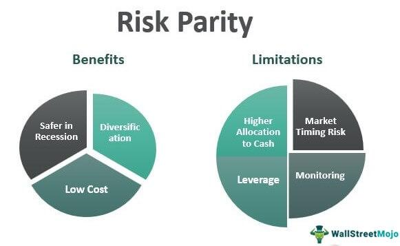

## Table of Contents

## What is a risk parity strategy?

A risk parity strategy is a way of investing money that tries to balance the risk across different types of investments. Instead of putting more money into stocks because they might grow faster, a risk parity strategy puts money into different things like stocks, bonds, and other investments based on how risky they are. The goal is to make sure that no single type of investment can cause big losses for the whole portfolio.

This approach is different from traditional investing, where people might put most of their money into stocks hoping for big returns. In a risk parity strategy, the focus is on spreading out the risk evenly. This means that even if stocks go down a lot, the other investments might not go down as much, helping to protect the overall value of the portfolio. It's like not putting all your eggs in one basket, but instead, making sure each basket carries a similar amount of risk.

## How does risk parity differ from traditional portfolio allocation methods?

Risk parity and traditional portfolio allocation methods have different ways of deciding where to put money. In traditional methods, people often put more money into stocks because they think stocks will grow faster and make more money. This is called a stock-heavy portfolio. The idea is to get bigger returns, but it also means that if stocks go down a lot, the whole portfolio can lose a lot of value. So, traditional methods focus more on where the money can grow the most, without always thinking about how risky each investment is.

On the other hand, risk parity tries to spread out the risk evenly across different types of investments, like stocks, bonds, and other things. Instead of putting more money into stocks just because they might grow faster, risk parity looks at how risky each investment is and tries to balance that risk. This means that even if stocks have a bad year, the other investments might not do as badly, so the whole portfolio doesn't lose as much value. The goal of risk parity is to make sure that no single investment can hurt the portfolio too much, by keeping the risk spread out evenly.

## What are the key components of a risk parity portfolio?

The key components of a risk parity portfolio are the different types of investments it includes and how the risk is spread out among them. A risk parity portfolio usually has a mix of stocks, bonds, and sometimes other things like commodities or real estate. The idea is to not put all the money into just one type of investment, but to spread it out across different kinds. This way, if one type of investment does badly, the others might do better and help balance things out.

The other important part is how the risk is managed. In a risk parity portfolio, the risk is spread evenly across all the investments. This means that the portfolio tries to make sure that no single type of investment can cause big losses. Instead of putting more money into stocks just because they might grow faster, a risk parity portfolio looks at how risky each investment is and tries to balance that risk. This helps to protect the overall value of the portfolio by making sure that the risk is spread out evenly.

## Can you explain the concept of risk budgeting in the context of risk parity?

Risk budgeting in the context of risk parity is about deciding how much risk to take with different investments in a portfolio. Instead of just looking at how much money to put into each investment, risk budgeting focuses on how much risk each part of the portfolio should have. The goal is to spread out the risk evenly, so that no single investment can cause big losses for the whole portfolio. This means looking at how risky stocks, bonds, and other investments are, and then figuring out how to balance that risk so that each part contributes the same amount of risk to the portfolio.

In a risk parity portfolio, risk budgeting is really important because it helps to make sure that the portfolio is not too dependent on any one type of investment. For example, if stocks are very risky, the portfolio might not put too much money into stocks, even if they could grow a lot. Instead, it might put more money into bonds or other less risky investments to balance things out. By doing this, the portfolio tries to protect its value by making sure that the risk is spread out evenly, so that if one type of investment does badly, the others might do better and help balance things out.

## What are the benefits of implementing a risk parity strategy?

One of the main benefits of using a risk parity strategy is that it helps to spread out the risk in your investments. Instead of putting most of your money into stocks, which can be very risky, a risk parity strategy looks at how risky each type of investment is and tries to balance that risk. This means that if stocks go down a lot, other investments like bonds might not go down as much, so your whole portfolio doesn't lose as much value. It's like not putting all your eggs in one basket, but making sure each basket carries a similar amount of risk.

Another benefit is that a risk parity strategy can help protect your money during tough times. When the stock market has a bad year, a traditional portfolio that's mostly stocks can lose a lot of value. But a risk parity portfolio, which has a mix of stocks, bonds, and other investments, might not lose as much because the risk is spread out. This can give you more peace of mind knowing that your investments are not too dependent on any one type of investment. By balancing the risk, a risk parity strategy tries to make sure your portfolio stays more stable over time.

## What are the potential drawbacks or criticisms of risk parity strategies?

One potential drawback of risk parity strategies is that they might not perform as well as traditional stock-heavy portfolios during strong bull markets. When stocks are doing really well, a portfolio that has a lot of money in stocks can make more money than a risk parity portfolio, which spreads its money across different types of investments. This means that if you're looking for the highest possible returns, a risk parity strategy might not be the best choice because it focuses more on balancing risk than on chasing big gains.

Another criticism is that risk parity strategies can be more complex to set up and manage. They require a good understanding of how to measure and balance risk across different investments, which can be tricky. This might mean you need to hire a financial advisor or use special tools to manage your portfolio, which can add to the costs. So, while risk parity can help spread out risk, it might also be more expensive and harder to manage than simpler investment strategies.

## How do you calculate risk contributions in a risk parity portfolio?

Calculating risk contributions in a risk parity portfolio involves figuring out how much each investment adds to the overall risk of the portfolio. You start by looking at the risk of each investment on its own. This is usually measured by something called volatility, which is how much the value of the investment goes up and down over time. Then, you need to think about how these investments move together, which is called correlation. If two investments tend to go up and down at the same time, they are highly correlated. If they move in opposite directions, they are negatively correlated. By understanding both the volatility and the correlation, you can work out how much each investment contributes to the total risk of the portfolio.

Once you have these pieces of information, you can use a math formula to calculate the risk contribution of each part of your portfolio. The goal is to adjust the amount of money you put into each investment so that each part contributes the same amount of risk. This might mean putting more money into bonds or other less risky investments, even if they don't grow as fast as stocks. By doing this, you make sure that no single investment can cause big losses for your whole portfolio. It's all about balancing the risk so that it's spread out evenly across everything you're investing in.

## What role do leverage and derivatives play in risk parity strategies?

In risk parity strategies, leverage and derivatives can be used to help balance the risk across different investments. Leverage means borrowing money to invest more than you actually have. This can be useful in risk parity because it allows you to put more money into less risky investments like bonds, making their risk contribution equal to that of riskier investments like stocks. By using leverage, you can make sure that each part of your portfolio carries the same amount of risk, even if the investments themselves are not equally risky.

Derivatives are another tool that can be used in risk parity strategies. They are financial contracts that get their value from something else, like a stock or a bond. In a risk parity portfolio, derivatives can be used to either increase or decrease the risk of certain investments. For example, if you want to lower the risk of your stock investments, you might use derivatives to protect against big drops in the stock market. This way, you can fine-tune the risk in your portfolio to make sure it's spread out evenly, helping to keep your investments more stable over time.

## How has the performance of risk parity strategies compared to traditional strategies during different market conditions?

Risk parity strategies have shown different performance compared to traditional strategies, depending on the market conditions. During strong bull markets, when stocks are doing really well, traditional stock-heavy portfolios often do better than risk parity portfolios. This is because risk parity spreads investments across different types of assets, like stocks and bonds, to balance risk. So, when stocks are soaring, a portfolio that's mostly in stocks can make more money than a risk parity portfolio, which might not have as much money in stocks.

On the other hand, risk parity strategies tend to perform better during tough times or when the market is very volatile. Because risk parity aims to spread risk evenly across different investments, it can help protect your money when stocks go down a lot. For example, during a market crash, a risk parity portfolio might lose less value than a traditional portfolio because it has a mix of stocks, bonds, and other investments. This can make risk parity a good choice if you want to keep your investments more stable over time, even if it means not getting the highest possible returns during good times.

## What are some practical considerations for implementing a risk parity strategy in a real-world portfolio?

Implementing a risk parity strategy in a real-world portfolio involves some practical steps and considerations. First, you need to understand how to measure the risk of different investments. This usually means looking at how much the value of stocks, bonds, and other investments goes up and down over time, which is called volatility. You also need to think about how these investments move together, or their correlation. By figuring out the risk and correlation, you can work out how much each investment adds to the total risk of your portfolio. This might be tricky, so it can help to use special tools or work with a financial advisor who knows about risk parity.

Once you have a good handle on the risk, you need to decide how to balance it. This might mean using leverage, which is borrowing money to invest more than you have, to put more money into less risky investments like bonds. It can also involve using derivatives, which are financial contracts that can help you fine-tune the risk in your portfolio. Setting up and managing a risk parity portfolio can be more complex and might cost more than simpler investment strategies. But if you're looking to spread out the risk and keep your investments more stable over time, it could be worth the effort.

## How can risk parity strategies be adapted for different asset classes or investment vehicles?

Risk parity strategies can be adapted to work with different types of investments, like stocks, bonds, commodities, and real estate. The main idea is to spread out the risk evenly across all these different things. For example, if you're including real estate in your portfolio, you need to figure out how risky it is compared to stocks and bonds. You might use special tools or work with a financial advisor to measure the risk and see how real estate moves with other investments. Once you know this, you can adjust how much money you put into real estate so that it contributes the same amount of risk as the other parts of your portfolio.

Another way to adapt risk parity for different asset classes is by using different investment vehicles, like mutual funds or exchange-traded funds (ETFs). These can help you get exposure to a wide range of investments without having to buy each one separately. For example, you might use a bond [ETF](/wiki/etf-trading-strategies) to balance the risk from stocks in your portfolio. By using these vehicles, you can easily adjust your investments to keep the risk spread out evenly. It's all about making sure that no single type of investment can cause big losses for your whole portfolio, no matter what types of assets you're working with.

## What advanced techniques or variations exist within risk parity strategies for expert investors?

For expert investors, there are some advanced techniques and variations they can use to make risk parity strategies even better. One technique is called "dynamic risk parity," where the investor keeps changing the balance of risk in the portfolio based on how the market is doing. If the market gets more risky, they might put more money into safer investments like bonds. This helps to keep the portfolio stable even when things are changing a lot. Another advanced technique is using something called "[factor](/wiki/factor-investing)-based risk parity." This means looking at different things that can affect how investments do, like how big a company is or how fast it's growing, and then balancing the risk based on these factors. This can help to make the portfolio even more balanced and less likely to lose a lot of value.

Another variation is using "volatility targeting" within a risk parity strategy. This means setting a certain level of risk for the whole portfolio and then adjusting the investments to keep the risk at that level. If the risk gets too high, the investor might use derivatives or other tools to lower it back down. This can help to keep the portfolio more stable over time. For expert investors, these advanced techniques and variations can make risk parity strategies even more powerful, helping them to manage risk and protect their investments in all kinds of market conditions.

## What is Understanding Risk Parity?

Risk parity is a concept in portfolio management aimed at achieving an equal contribution to overall risk from each asset class within a portfolio. This method primarily uses volatility as the key measure of risk, distinguishing it from traditional strategies that often focus on capital allocation based on market-value weights or anticipated returns. These conventional methods frequently result in imbalanced risk distribution, as they do not account for the varying risk profiles inherent in different asset classes.

In contrast, risk parity seeks to homogenize the risk contributions from each asset, thereby fostering superior diversification. By ensuring that each asset class contributes equally to the portfolio's overall risk, this approach has the potential to enhance risk-adjusted returns. This focus on risk contribution rather than capital allocation means that risk parity strategies can mitigate the impact of errors in predicting expected returns, as they do not rely heavily on such forecasts.

A fundamental component of risk parity is risk budgeting, where the portfolio is structured with specific risk targets for each asset class. This involves continually adjusting the allocations to maintain equal risk contributions, a process known as rebalancing. For example, in a risk parity portfolio composed of equities, bonds, and commodities, the high [volatility](/wiki/volatility-trading-strategies) of commodities might be balanced by a greater allocation to the relatively stable bond market.

Mathematically, consider a portfolio consisting of $n$ asset classes, each with risk contribution $RC_i$. Risk parity can be achieved by equalizing these contributions as follows:

$$
RC_i = w_i \times \sigma_i = \frac{1}{n} \sum_{j=1}^{n} w_j \times \sigma_j
$$

where $w_i$ is the weight of asset $i$ in the portfolio, and $\sigma_i$ is its volatility. Through this formulation, any disproportionate influence of a single asset on the portfolio's total risk can be minimized, ensuring a more balanced risk exposure.

Ultimately, risk parity's emphasis on equal risk distribution represents a sophisticated approach to managing portfolios. By focusing on volatility and avoiding reliance on expected returns, risk parity strategies address some of the limitations inherent in conventional portfolio management techniques, facilitating more robust performance in diverse market conditions.

## What are the components of a Risk Parity Portfolio?

A risk parity portfolio is designed to achieve balanced risk exposure across various asset classes. Unlike traditional portfolios that may allocate capital based on market capitalization or expected returns, risk parity portfolios prioritize equalizing the risk contribution of each asset class. This equalization is primarily measured through volatility, providing a more stable portfolio structure.

The composition of a risk parity portfolio typically includes a diverse array of asset classes such as equities, fixed income, commodities, and alternative investments. Equities provide growth potential but tend to [carry](/wiki/carry-trading) higher volatility, while fixed-income assets offer stability and income with generally lower volatility. Commodities can serve as a hedge against inflation and add diversification, while alternative investments like real estate or hedge funds introduce unique risks and potential returns.

To achieve the desired risk distribution across these varied asset classes, strategies may employ leverage and short selling. Leverage allows the portfolio to increase exposure to lower-risk assets, thus ensuring that each asset contributes equally to the overall risk. Short selling can help adjust exposures to over-represented risks, aligning with the portfolio's risk parity objectives. The use of leverage is typically expressed through the formula:

$$

\text{Portfolio Risk} = \sum_{i=1}^{n} \left( \text{Volatility}_i \times \text{Weights}_i \times \text{Leverage}_i \right)
$$

where $\text{Volatility}_i$ is the volatility of asset $i$, $\text{Weights}_i$ is the weight of asset $i$ in the portfolio, and $\text{Leverage}_i$ is the leverage applied to asset $i$.

Real-world implementations, such as those employed by AQR Capital Management, illustrate the practical application of these principles. AQR's approach to risk parity involves managing diverse asset classes to maintain balanced risk exposure. This is often achieved through sophisticated quantitative models and strategies that constantly monitor and adjust the portfolio's allocation.

In risk parity strategies, the continual assessment and dynamic adjustment of asset weights ensure that the portfolio remains aligned with its risk parity objectives despite market fluctuations. By leveraging technology and quantitative methods, these portfolios aim to provide better risk-adjusted returns and increased diversification compared to traditional capital allocation methods.

## References & Further Reading

[1]: Asness, C. S., Frazzini, A., & Pedersen, L. H. (2012). ["Leverage aversion and risk parity."](https://pages.stern.nyu.edu/~lpederse/papers/LeverageAversionRP.pdf) Financial Analysts Journal, 68(1), 47-59.

[2]: Maillard, S., Roncalli, T., & Teiletche, J. (2010). ["The Properties of Equally Weighted Risk Contribution Portfolios."](https://www.semanticscholar.org/paper/The-properties-of-equally-weighted-risk-portfolios-Teiletche-Roncalli/14cdd2a70ca7889acc71ce4dd1609eaf010b8dbb) Journal of Portfolio Management, 36(4), 60-70.

[3]: Chaves, D. B., Hsu, J. C., Li, F., & Shakernia, O. (2011). ["Risk parity portfolio vs. other asset allocation heuristic portfolios."](https://www.semanticscholar.org/paper/Risk-Parity-Portfolio-vs.-Other-Asset-Allocation-Chaves-Hsu/094d24b924caa659442065401999d7a77e06953e) Journal of Investing, 20(1), 108-118.

[4]: Roncalli, T. (2013). ["Introduction to Risk Parity and Budgeting."](https://arxiv.org/abs/1403.1889) Chapman and Hall/CRC Financial Mathematics Series.

[5]: Lopez de Prado, M. (2018). ["Advances in Financial Machine Learning."](https://www.amazon.com/Advances-Financial-Machine-Learning-Marcos/dp/1119482089) Wiley.

[6]: Chan, E. P. (2008). ["Quantitative Trading: How to Build Your Own Algorithmic Trading Business."](https://github.com/egorpe/EPChan-QuantitativeTrading/blob/master/example7_6.m) Wiley Trading.

[7]: Goltz, F., & Martellini, L. (2013). ["Dynamic risk parity: a new 'risk-based' investment approach for asset allocation."](https://onlinelibrary.wiley.com/doi/10.1002/9781118182635.efm0005) Journal of Portfolio Management, 39(2), 68-81.